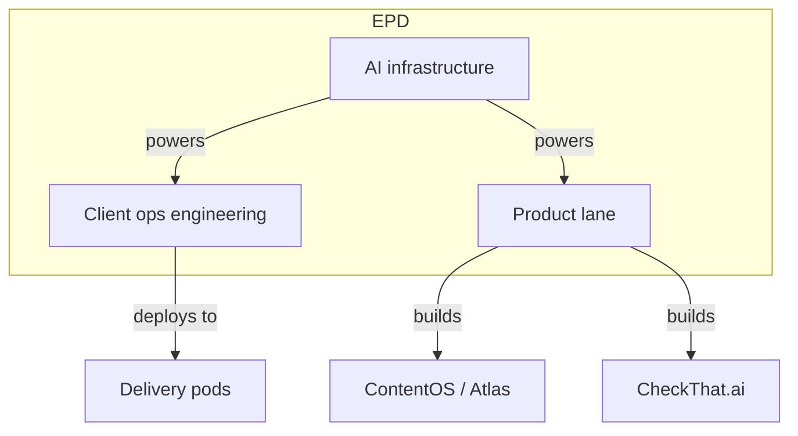

<metadata>
purpose: The EPD function at GrowthX — three lanes building the platform, AI workflows, and tools that power everything.
source: https://handbook.growthx.ai/company/epd-function
sync_type: auto
access: build-team
last_synced: 2026-03-02
</metadata>

# Engineering, Product & Design

## TL;DR

- EPD builds the technology that powers GrowthX — the platform, AI workflows, and internal tools.
- Three lanes: Product (ContentOS + CheckThat), Client Ops Engineering (forward-deployed), and AI Infrastructure (Output framework).
- Product lane uses Shape Up methodology — 4-week cycles with 2-week cooldowns.
- Client ops engineers embed with delivery pods as technical co-pilots.

## Purpose

EPD exists to build and maintain the technology that makes GrowthX's service-as-software model possible. Without EPD, we'd be a traditional agency. With EPD, every engagement gets faster, better, and more efficient over time.

Three things EPD builds:
1. **Products** customers and internal teams use (ContentOS, CheckThat)
2. **AI workflows** that power client delivery (the automation layer)
3. **Infrastructure** that makes building AI workflows faster (Output framework)

## The three lanes

### Product lane

Design engineers and full-stack engineers building the products: ContentOS (Atlas) and CheckThat.ai.

**How they work:** Shape Up methodology — 4-week build cycles followed by 2-week cooldowns. A shaping team defines the work, an execution team builds it. See the [product dev process](/epd/product-dev-process) for full detail.

**Team:** Design engineers (blend product design with engineering) and full-stack engineers (Rails + React platform).

<Card title="Product lane details" icon="rocket" href="/epd/product-lane">
  Team, scope, and key links for the product lane.
</Card>

### Client ops engineering lane

Forward-deployed marketing and AI engineers who embed with delivery pods. They build and customize AI workflows for specific client needs — workspace setup, pipeline configuration, custom integrations.

**How they work:** 2-week reprioritization cycles. One engineer per delivery pod, acting as technical co-pilot. They balance planned work with rapid response to urgent client needs.

**Team:** Growing from 5 to 20 engineers. A product lead coordinates priorities with delivery.

<Card title="Client ops engineering details" icon="users-gear" href="/epd/client-ops-engineering">
  Operating model, embedded partnership, and success metrics.
</Card>

### AI infrastructure lane

Responsible for the internal AI framework (Output) — the foundation that client ops engineers and product teams build on. This is also a strategic play: an open-source AI framework that builds technical credibility and serves as a recruiting pipeline.

## Roles in EPD

<CardGroup cols={2}>
  <Card title="Forward-deployed engineer" icon="code" href="/epd/roles/forward-deployed-engineer">
    AI engineers who build and customize workflows for specific client needs. Embedded with delivery pods.
  </Card>
  <Card title="Design engineer" icon="pen-ruler" href="/epd/roles/design-engineer">
    Blend product design with engineering. Build the UI and experience for ContentOS and CheckThat.
  </Card>
  <Card title="Full-stack engineer" icon="layer-group" href="/epd/roles/full-stack-engineer">
    Build the Rails + React platform. Ship features across the full stack.
  </Card>
  <Card title="Client ops team lead" icon="user-tie" href="/epd/roles/client-ops-team-lead">
    Combines hands-on engineering with team enablement and leadership.
  </Card>
</CardGroup>

## How EPD connects to other functions

**EPD → Delivery:** Forward-deployed engineers embed directly with delivery pods. Platform improvements increase delivery capacity. Better AI workflows mean less manual work and higher quality.

**EPD → Strategy Sprint:** Engineers set up technical infrastructure during sprints — AI workflows, workspace configuration, pipeline customization. Better tools make sprints faster.

**EPD → Sales:** Platform capabilities expand what we can sell. New features unlock new client segments and use cases.

## Key operational docs

<CardGroup cols={2}>
  <Card title="EPD overview" icon="cubes" href="/epd/index">
    Full EPD section with all lanes, processes, and team links.
  </Card>
  <Card title="Product dev process" icon="arrows-spin" href="/epd/product-dev-process">
    Shape Up methodology, cycles, and team structure.
  </Card>
  <Card title="AI-driven development" icon="microchip-ai" href="/epd/ai-driven-development">
    How we build with AI-native tools and practices.
  </Card>
  <Card title="Client ops team lead" icon="user-tie" href="/epd/client-ops-team-lead">
    Role definition and collaboration model for the team lead.
  </Card>
</CardGroup>
