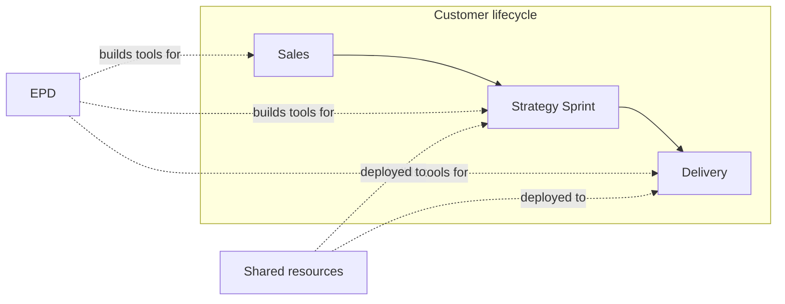
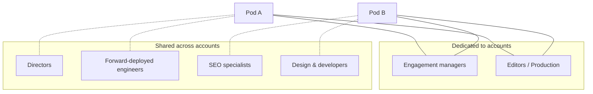

<metadata>
purpose: How GrowthX is structured — functions, teams, shared resources, and how work flows across the company.
source: https://handbook.growthx.ai/company/organization
sync_type: auto
access: build-team
last_synced: 2026-03-02
</metadata>

# Our organization

## TL;DR

- Four functions: Sales, Strategy Sprint, Delivery, and EPD (Engineering, Product & Design).
- Work flows left to right: Sales closes, Strategy Sprint proves value, Delivery scales outcomes, EPD builds the platform and tools.
- Specialists (directors, engineers, SEO, design) are shared resources deployed where needed — not embedded in every account.
- Small team, flat structure, high autonomy. No layers between you and the work.

## How GrowthX is organized

We're organized by function, not department. Each function maps to a phase in the customer lifecycle or a core capability.

| Function | Purpose | Phase |
|----------|---------|-------|
| [**Sales**](/company/sales) | Qualify and close new business | Pre-engagement |
| [**Strategy Sprint**](/company/strategy-sprint) | Run 8-week sprints, prove value, convert to ongoing | Engagement |
| [**Delivery**](/company/delivery-function) | Run Growth Execution in pods, drive outcomes at scale | Ongoing |
| [**EPD**](/company/epd-function) | Build the platform, AI workflows, and tools that power everything | Always |

## The two operating models

**Dedicated resources** are assigned to specific functions or clients. Engagement managers own their book of business. Editors produce content for their accounts. Product engineers build specific products.

**Shared resources** get deployed where they're needed most. Directors, forward-deployed engineers, SEO specialists, and design/dev support move across engagements based on demand. This gives every account access to senior expertise without the cost of full-time specialists.

## How work flows

**Sales → Strategy Sprint:** A new customer signs. They enter an 8-week Strategy Sprint where we prove the model works for their business.

**Strategy Sprint → Delivery:** If the sprint succeeds (most do), the customer converts to Growth Execution — our ongoing delivery model. They're assigned to a pod.

**EPD → Everyone:** Engineering, Product & Design builds and maintains the platform (ContentOS, CheckThat), the AI workflows, and the internal tools that make everything faster. EPD supports all three customer-facing functions.

## Key principles

**System mindset.** Every week serving the same client should get easier. Find failure modes and fix them upstream. Build leverage, not headcount.

**Forward-deployed model.** Specialists work directly with clients and delivery teams — not in back-office support functions. They're close to the problems.

**Flat structure.** We're a small, high-autonomy team. No middle management layers. Direct access to leadership. Everyone contributes directly to outcomes.

**Capacity planning.** Scaling requires building capacity ahead of demand. Every input has a ramp time. See [teams and operations](/delivery/teams-and-operations) for the full capacity model.

## Explore each function

<CardGroup cols={2}>
  <Card title="Sales" icon="chart-line" href="/company/sales">
    How we find and close new business.
  </Card>
  <Card title="Strategy Sprint" icon="stopwatch" href="/company/strategy-sprint">
    The 8-week engagement that proves the model works.
  </Card>
  <Card title="Delivery" icon="truck-fast" href="/company/delivery-function">
    Ongoing Growth Execution in pods — the core of what we do.
  </Card>
  <Card title="Engineering, Product & Design" icon="code" href="/company/epd-function">
    The team building the platform and AI workflows.
  </Card>
</CardGroup>
