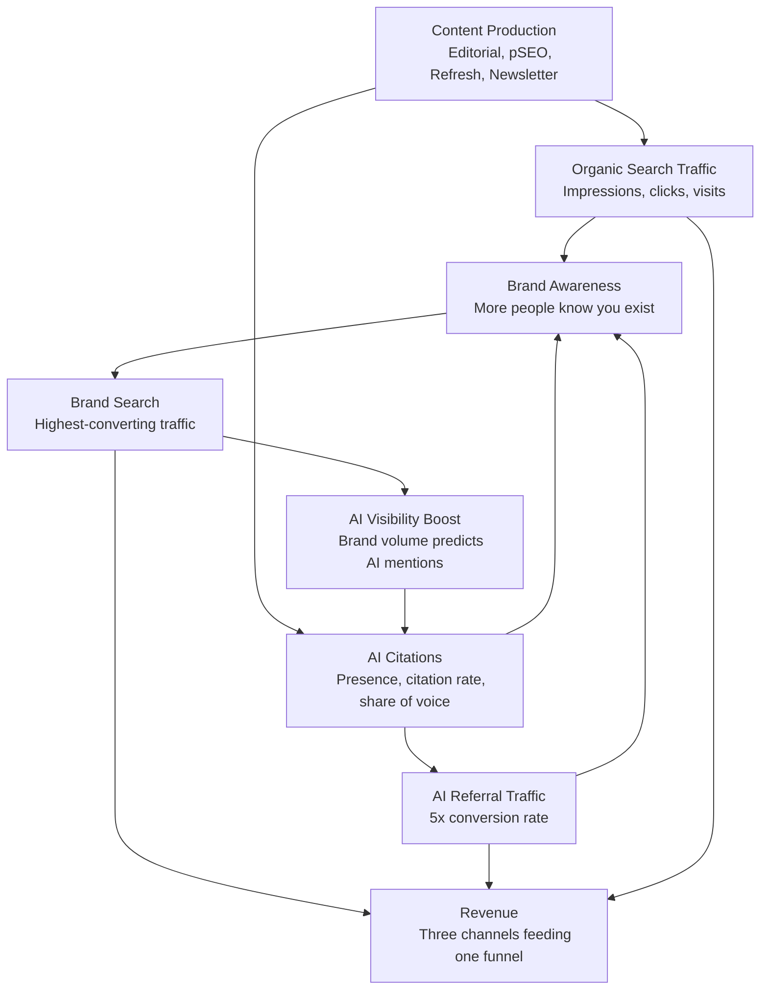
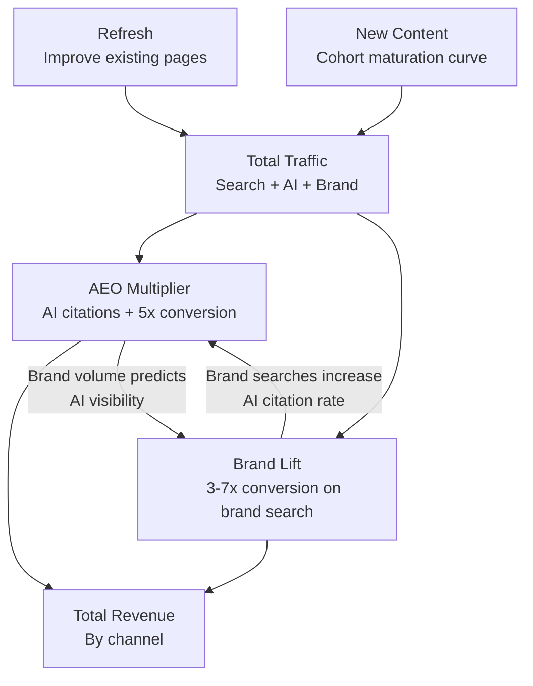
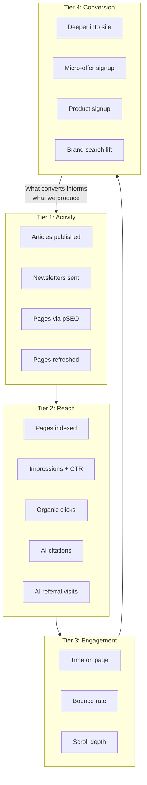

<metadata>
purpose: How to think about, calculate, and communicate the return on investment of what we do — for every stage of the client relationship.
source: https://handbook.growthx.ai/delivery/proving-roi
sync_type: auto
access: build-team
last_synced: 2026-03-02
</metadata>

# Proving ROI

Everyone at GrowthX should be able to answer the question: "Why is this worth the investment?" This guide gives you the mental model, the methodology, and the exact language.

## What we actually sell

We don't publish content. We build a compounding growth engine on our clients' websites.

That distinction matters. If clients think we're publishing content, there is diminishing value in that — any agency can do that, and AI is making it cheaper every month. If they think we're building a compounding growth engine on their website, one that they are struggling to manage and know will be incrementally more impossible to do without us, then they are there for the long journey.

The job to be done is: **drive compounding growth through their website.** Not SEO. Not AEO. Not content. The job is compounding growth.

### Three return channels from one investment

Every piece of content we create generates value across three channels simultaneously. This is what separates us from agencies that report on traffic.

One investment. Three return channels. Each one amplifies the others.

### Building vs. renting

Your website is the most strategic asset a company has. It's influential to everything — how information agents fetch data, how buyers evaluate you, where all the transactions happen. It compounds if you do it right. And it's measurable.

**Building a house (organic + AEO):** You buy land, build equity, and every improvement increases the value of everything you've already built. When you stop building, you still own the house.

**Renting (paid + outbound):** You get exactly what you need, right when you need it. But equity is zero. When you stop paying, everything goes to zero. And the longer you rent, the more the landlord charges.

The math:

- **Organic:** More content = more indexed pages = more ranking opportunities = more AI citations = more brand searches. Each monthly cohort compounds on every previous cohort. The more you invest, the cheaper each visit gets.
- **Paid:** More spend = saturating channels = higher CPCs = lower conversion rates = declining ROI. No residual value when turned off. The more you invest, the more expensive each click gets.

This is the single most important thing to communicate: organic is compounding, paid is diminishing. Over any 12+ month horizon, organic wins on total ROI. The model proves it.

---

## How the ROI model works

The model has four components. The first two generate traffic. The last two are multipliers — and AEO is the biggest one.

You don't need to know the spreadsheet variables. You need to be able to explain each component in a sentence.

### Refresh (existing content improved)

When a client has existing content, refreshing it is the fastest path to results. Think of it as renovating rooms in a house you already own — updating content, improving structure, adding schema, cross-linking to newer pages. Each refresh cycle lifts clicks per page with diminishing returns as pages approach their ceiling.

Refreshed content with answer-first structure and current information is also significantly more likely to be cited by AI models. A refresh program improves both search and AI visibility.

### New content (cohort maturation)

New pages follow a predictable ramp: zero traffic in month one (indexing), 25% of peak in month two, 50% in month three, peak by month four. Each month's batch is a "cohort" that matures over time.

The compounding effect: every month adds a new cohort on top of all previous cohorts. The cumulative traffic curve accelerates even though each individual cohort follows the same ramp. Month six isn't 6x month one — it's more, because all cohorts are stacking.

### AEO multiplier (the biggest lift)

The same content created for organic search is the same content AI models cite. You don't pay extra for it. But the AI channel converts at 5x the rate of organic search.

When ChatGPT, Perplexity, or Gemini recommends a client in response to a buyer's question, that visitor arrives with pre-qualified intent and a third-party endorsement. They already know what the company does before they click.

This is the model component that changes the story from "good investment" to "no-brainer."

### Brand lift (amplified by AEO)

Brand search traffic is the highest-converting traffic at every company. Full stop. At Deepgram, brand traffic converted at 7x the average. At ServiceSource, with $300-500K/month in ad spend, the highest-ROI campaigns were brand search. Every company, every time.

Every visitor who encounters the brand — whether from search or AI — has a probability of searching for the brand later. And brand search volume predicts AI visibility (0.334 correlation). More brand searches means higher AI visibility means more AI mentions means more brand searches. Self-reinforcing loop.

### Numbers everyone should know

| Metric | Data | Source |
|---|---|---|
| AI referral conversion rate | 14.2% vs. 2.8% organic (5x) | RankScience |
| AI customer acquisition cost | $75 vs. $180 traditional | RankScience |
| AI referral traffic growth | 527% YoY | GA4 aggregate |
| B2B buyers using AI for research | 89% | Forrester |
| Brand volume → AI visibility correlation | 0.334 | Evertune |
| JSON-LD schema citation lift | +22% | Industry studies |
| Brand mentions from third-party domains | 85% | AirOps |

---

## The four measurement tiers

Amazon built a trillion-dollar company by focusing on controllable inputs instead of outputs. They call it "working backwards." You can't will revenue into existence, but you can control the activities and leading indicators that drive it.

We apply the same principle across four program lanes (Editorial, Newsletter, Programmatic/pSEO, Refresh) and four measurement tiers:

The key insight: **we focus on controllable inputs (Tier 1-2) early, and shift to outcomes (Tier 3-4) as the engagement matures.** This is how you set expectations correctly.

### Tier 1: Activity — controllable inputs

How many did we do? Articles published, newsletters sent, pages created, pages refreshed. Track the weekly count and the cumulative total.

This sounds basic. It's the metric most engagements lose track of first. Six months in, someone asks "how many articles have we published?" and nobody knows.

Activity compounds because the first shot on goal is not the final shot. You publish, watch signals, act on those signals. Cross-link new pages to old ones. Refresh underperformers. Every new page creates interlinking opportunities with every previous page.

### Tier 2: Reach — search + AI

Reach is your chance to get in front of someone across two parallel channels:

- **Search:** Pages indexed → Impressions → CTR → Clicks
- **AI:** Content published → AI citations (CheckThat) → AI referral visits (GA4)

Analyze by cohort (month-one content on month three vs. month-two content), by cluster (which topics outperform), and by comparison (pages we touched vs. pages we didn't). That last one is the controlled comparison that proves impact.

### Tier 3: Engagement — quality signals

Your headline is your promise. If the promise is compelling enough and matches intent, people click. If you deliver on the promise, they stay. If you over-deliver, they go deeper. If you under-deliver, they bounce.

Time on page, bounce rate, and scroll depth together tell you whether the content is delivering on the promise. Engagement also feeds back into AI citation likelihood — pages where users spend time and go deeper send positive signals.

### Tier 4: Conversion — the next logical step

Conversion isn't just "did they sign up?" It's "did they take the next logical step given where they are in the journey?" Three paths: deeper into the site, micro-offer signup (lead magnet), or direct product signup.

**AI referral conversion should be tracked separately.** When a client sees that AI-referred visitors convert at 14% while their paid traffic converts at 2%, the ROI story tells itself.

---

## How to talk about ROI at every stage

This is the operational playbook. The framing shifts as the engagement matures, and the metrics you lead with change at each stage.

### During sales (before engagement)

**Frame it as the "next best dollar."** The question isn't "should we do content?" It's "where does the next dollar create the most value?"

Most clients are spending money on ads, outbound, events, and content simultaneously. Help them see that shifting even 20-30% of their paid budget into organic creates a compounding asset that reduces dependence on paid over time. Paid channels have diminishing returns. Organic has increasing returns. Over any 12+ month horizon, organic wins.

**Set expectations honestly.** The compounding curve is backloaded. First 3-6 months are planting seeds. Months 4-12+ are harvest. If you zoom into three months, it looks rough. If you zoom out to 18 months, it's incredible. Be upfront about this — it builds trust and prevents disappointment later.

**Use proof points with real numbers.** Abstract claims don't land. Specific results from specific companies do. See [proof points](#proof-points-and-case-studies) below.

### Strategy Sprint (weeks 1-6)

**Weeks 1-4: Lead with activity and early signals.**

"We've published X pages, Y are indexed, impressions are trending up Z%. Here are early AI citation signals. We're on track with the projection."

Don't over-promise early results. The compounding thesis means the best months are ahead. Focus on showing that the machine is being built correctly.

**Week 5-6: First performance data and the honest conversation.**

The [8-week plan](/delivery/8-week-plan) includes a week-6 decision point. By this point you should have enough data to validate key model assumptions:

- Are pages indexing on the expected timeline?
- Are early impressions consistent with projected reach?
- Is engagement in healthy ranges?
- Are there any AI citations appearing?
- Is the client seeing signals worth continuing for?

Week 6 is the honest conversation: "Are we both seeing enough to continue?" If yes, start talking about the long-term engagement. If no, be honest about why. We don't ask for blind faith. We prove it in 6 weeks or we address what's not working.

### Growth Execution (months 3-12+)

**Monthly: Lead with cohort data and the compounding curve.**

"Month-one content is now generating X visits per page. Month-two content is ramping faster. AI referral traffic appeared in month 3 and is growing at Y% month-over-month. Here's what the projection says about months 9-12."

Show the stacking effect — each new cohort layering on top of previous ones. Show AI referral traffic as a separate line. This is usually the most impressive growth curve and the most differentiated data point.

**Quarterly: Full funnel and cost equivalence.**

- Full funnel: Activity → Reach → Engagement → Conversion → Revenue attribution by channel
- Model projection vs. actuals — are we tracking ahead or behind?
- Cost equivalence: "This traffic would cost $X in ads." Take total organic + AI visits, multiply by average CPC in their industry. If you're generating 50,000 visits/month at $5 CPC, that's $250,000/month in equivalent ad spend.
- AI visibility trends: Presence Score, citation rate, Share of Voice over time

### Renewal and expansion conversations

**Lead with what would happen if they stopped.** Unlike ads, the content asset persists. But without fresh content, cross-linking, and refresh, it decays. Frame the engagement as maintaining and growing a valuable asset, not renting an output.

**Show the CPA curve.** "Month 1 this cost $X per visit. Month 12 it costs $Y. Month 24 it will cost $Z." The compounding effect means the cost per acquisition drops every month. Paid channels are going the opposite direction.

**Show the brand flywheel.** The reinforcing loop: content → search rankings + AI citations → brand awareness → brand search → highest-converting traffic → more AI visibility → more citations. This is the slide that turns a quarterly review into a multi-year renewal.

---

## Proof points and case studies

Specific numbers you can use in client conversations. Abstract claims don't land. These do.

### GrowthX proof points

| Company | Result | Context |
|---|---|---|
| IBM SecurityIntelligence | $17M in closed deals in year one. Average CPL: $26 vs. hundreds on other channels. | Highest ROI marketing program in the company. First content hub launched outside IBM.com. |
| Augment Code | Started at ~20K monthly organic. 6-7 months later, massive organic spike. Nearly shutting off paid ad spend. | Moved from paid-dependent to organic-dominant. |
| Deepgram | Brand traffic converted at 3.5-4% vs. 0.5% average — 7x lift. | Brand search is the highest-ROI traffic at every company. |
| TechBeacon | 100K subscribers in 3-4 months from category-matched conference guide CTAs. | Compiled existing articles into gated PDF guides, segmented by category. Every page got a matched CTA. |

### Industry evidence (from AEO research)

| Company | Result | Timeline |
|---|---|---|
| Convert (Omniscient Digital) | AI visibility 31% → 55% (+81%), citation share 15% → 35% (+140%) | 60 days |
| B2B SaaS (Discovered Labs) | AI-referred trials 575 → 3,500 (6x), 600% citation uplift | 7 weeks |
| Netpeak e-commerce client | 693% increase in AI-channel visits, 120% revenue growth | ~3 months |
| Hines (Conductor) | ChatGPT became 3rd-largest referral source, +136% organic new users | 6 months |
| ADP (Conductor) | 30% increase in AI referrals after AEO/GEO pivot with JSON-LD integration | ~6 months |

---

## Common questions and how to answer them

These come from real prospect and client conversations. The framing matters as much as the content.

### "When will I see ROI?"

The honest answer: the compounding curve is backloaded. If you zoom into the first three months, it looks like early signals — pages indexing, impressions building, initial rankings. If you zoom out to 18 months, the compounding effect is dramatic.

What you can expect: leading indicators (activity, indexation, impressions) within weeks. Early traffic signals by month 2-3. Measurable organic growth by month 4-6. The compounding effect where each month is noticeably better than the last by month 6-9. Cost equivalence that exceeds the engagement cost by month 12-18.

We don't ask for blind faith. The [8-week plan](/delivery/8-week-plan) has a Week 6 circuit breaker specifically so we can evaluate whether signals justify continuing.

### "We're spending $X on ads and know our numbers. This is a hypothesis."

Acknowledge it directly: "You're right. Organic is a hypothesis with a longer payback period than paid. The trade-off is that paid has diminishing returns and zero residual value, while organic compounds."

Then use the "next best dollar" framework. Show that their paid CPA is rising (it almost always is). Show the math: at their current organic efficiency, what would 12 months of compounding look like compared to 12 months of rising CPAs on paid? The crossover point is usually 6-12 months.

### "What if it doesn't work?"

Week 6 exists for this reason. We built a circuit breaker into every engagement because we believe in proving value, not promising it. Six weeks gives us enough data to validate whether the approach is driving toward results. If it isn't, we stop and address it.

### "How does this compare to our paid channels?"

Use the cost equivalence calculation. Take the total organic + AI visits for the month. Multiply by average CPC in their industry. That's what this traffic would cost in ads.

Then show the trajectory: organic gets cheaper per visit every month (compounding). Paid gets more expensive (diminishing returns). The lines cross, and after that, organic is generating returns that paid literally cannot match at any price.

### "We don't have any AI traffic."

Most companies don't — yet. Some are even blocking AI indexation without knowing it. That's the opportunity, not the objection.

AI referral traffic is growing 527% year-over-year. 89% of B2B buyers are using AI for research. Getting in now means building the asset before competitors. The content we create for organic search is the same content AI models cite — there's no separate "AEO program." It's one investment that earns in both channels.

---

## Cross-references

- [Weekly call playbook](/delivery/weekly-call-playbook) — How to present performance on client calls
- [8-week plan](/delivery/8-week-plan) — Strategy Sprint structure and the Week 6 circuit breaker
- [SEO operating guide](/guides/marketing/seo-operating-guide) — Site and content scoring frameworks
- [AEO buyer evaluation playbook](/guides/marketing/aeo-buyer-evaluation) — Tracking AI visibility during buyer evaluation
- [CheckThat metrics](/products/checkthat/metrics) — Presence, Reputation, Perception, Influence scores
