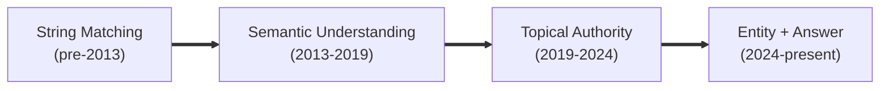
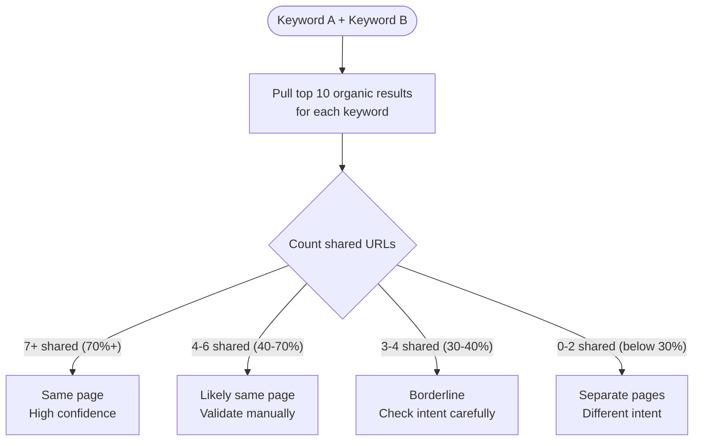
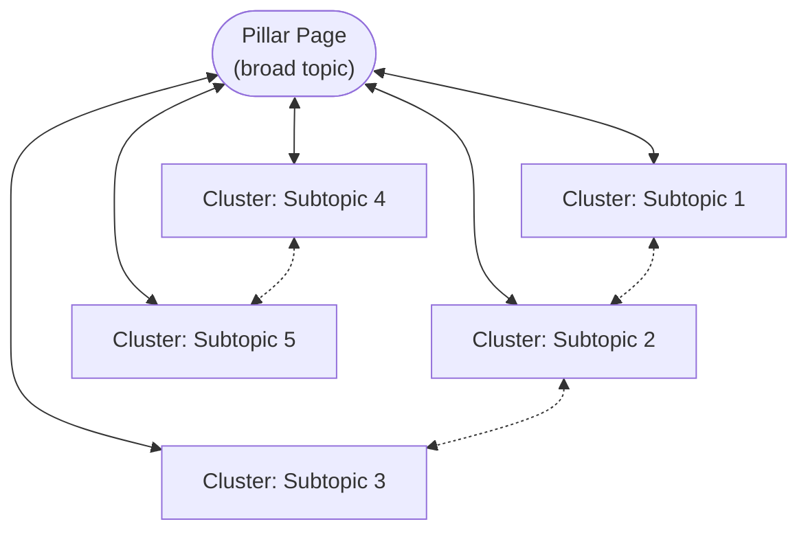
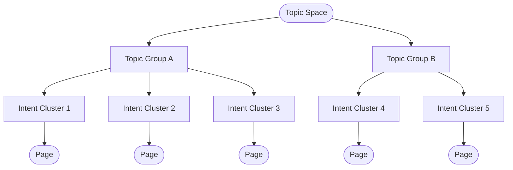
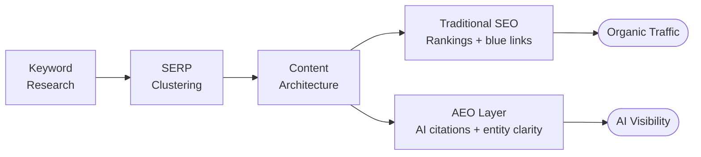

<metadata>
purpose: Evidence-based frameworks, tool methodologies, and mental models for keyword strategy in the age of AI search.
source: https://handbook.growthx.ai/guides/marketing/keyword-optimization-clustering
sync_type: auto
access: build-team
last_synced: 2026-03-02
</metadata>

# Keyword optimization & clustering

> **For:** Content marketing practitioners who already do keyword work and want to understand *why* things work, not just *how* to click buttons.
> **Goal:** Build a defensible methodology for keyword optimization and clustering grounded in evidence, tool logic, and practitioner wisdom.
> **Time Investment:** 5–8 hours.
> **Last Updated:** February 2026.

---

## How to use this guide

Part 1 is the mental models. Part 2 is frameworks you can use this week. Part 3 breaks down how the major tools actually think about clustering. Part 4 is the evidence. Part 5 is the emerging frontier: AEO and AI search.

This guide covers the *how* of keyword strategy. For the *why*, see the [SEO ranking factors guide](/guides/marketing/seo-ranking-factors). For the operational playbook (site scoring, content scoring, engagement workflow), see the [SEO operating guide for EMs](/guides/marketing/seo-operating-guide).

---

## Part 1: How to think about keywords in 2026

### The core mental shift: keywords to topics to intent to entities

The discipline has evolved through four eras. Know them or you'll use outdated tactics dressed in modern language.

**Era 1: String matching (pre-2013).** Google matched exact query strings to on-page text. Keyword density mattered. You could rank by repeating a phrase enough times. This is dead, but the instinct lives on in content briefs that obsess over exact-match counts.

**Era 2: Semantic understanding (2013–2019).** Hummingbird (2013) introduced semantic search. BERT (2019) deepened it by processing the context of every word in a query. Result: Google now understands that "best running shoes for flat feet" and "top sneakers for overpronation" serve the same intent, even though they share almost no words.

**Era 3: Topical authority (2019–2024).** Google started rewarding sites with comprehensive expertise on a topic, not just individual pages targeting individual keywords. Kevin Indig's "Topic Share" framework nails this. It's not about ranking for one keyword. It's about owning a meaningful share of all keywords in a topic space. Graphite (2024) found that pages with high topical authority gain traffic 57% faster. The leaked Google API documents [confirmed this with siteFocusScore and siteRadius metrics](/guides/marketing/seo-ranking-factors#the-google-content-warehouse-api-leak-may-2024).

**Era 4: Entity and answer optimization (2024–present).** Google's Knowledge Graph, AI Overviews, and LLM-based search now understand entities: people, products, concepts. Not just keywords. Dixon Jones puts it simply: Google is ranking entities, not pages. Your keyword strategy has to account for how you show up in AI-generated answers, not just blue links.

### Core concepts

**Search intent.** Why is someone typing this query? The four-type framework (informational, navigational, transactional, commercial investigation) comes from Andrei Broder's 2002 taxonomy. Over 80% of web queries are informational (Jansen, Booth, and Spink). But intent isn't always clean. A query like "best project management software pricing" carries both commercial investigation and transactional signals at once.

**Keyword clustering.** Group related keywords that should live on the same page. The logic is simple: if Google ranks the same pages for two different keywords, those keywords share intent and belong together. If Google shows different results, they need separate pages. Every serious clustering tool is built on this principle.

**Keyword cannibalization.** Multiple pages on your site competing for the same keyword. It's one of the most common and most damaging SEO mistakes at scale. Keyword Insights fixed cannibalization for a travel client: 110% traffic increase. A separate e-commerce case: 200% traffic increase in under a month.

**Topical authority.** How comprehensively a site covers a topic. Kevin Indig measures this as "Topic Share," the percentage of traffic you capture from all keywords in a topic space.

### Misconceptions to unlearn

**"Higher search volume = better keyword."** A keyword with 100 monthly searches and high purchase intent can outperform a 10,000-volume vanity term. Volume is where you start filtering, not where you decide.

**"Keyword difficulty scores are accurate."** They're directional at best. Ahrefs' KD is based primarily on referring domain counts (intentionally excluding on-page factors). Semrush uses a multi-factor approach including domain authority. A study comparing them found that Ahrefs frequently scores 0 for keywords that are genuinely competitive but have competitors with weak backlink profiles. Neither tool reliably predicts whether *you* can rank. [What actually drives rankings](/guides/marketing/seo-ranking-factors) is far more nuanced than any single score.

**"One keyword per page."** This is a relic of the string-matching era. Modern pages should target clusters of semantically related keywords. The clustering approach lets pages rank for significantly more keywords and signals topical depth to search engines.

**"Keyword research is a one-time task."** 31% of high-value keywords change significantly in intent or volume every six months. This isn't a project. It's an ongoing practice.

---

## Part 2: Frameworks & process

### Framework 1: The SERP overlap method

Compare the top 10 Google results for two keywords. The more URLs they share, the more likely they belong on the same page. Simple. And the most reliable method we have.

**How it works:**

**Threshold guidelines (practitioner consensus):**

| Overlap | Shared URLs | Recommendation |
|---------|-------------|----------------|
| **70%+** | 7+ of 10 | High confidence. Same page. |
| **40–70%** | 4–6 of 10 | Likely same page. Validate manually. |
| **30–40%** | 3–4 of 10 | Borderline. Check intent carefully. |
| **Below 30%** | 0–2 of 10 | Different intent. Separate pages. |

The industry sweet spot is 40–60% overlap. Most SERP-based tools default to around 30–40% and let you adjust upward for tighter clusters.

<Warning>
Google no longer consistently shows 10 traditional organic links due to AI Overviews, Featured Snippets, and other SERP features. Keyword Insights adjusted their maximum threshold from 10 to 7. Your thresholds may need similar recalibration.
</Warning>

---

### Framework 2: The topic cluster / pillar page model

One comprehensive "pillar page" covers a broad topic. Multiple "cluster pages" go deep on subtopics. Everything interlinks. The linking structure tells Google your site has depth on this subject.

**Evidence it works:**
- HubSpot's own study found a 43% increase in organic traffic after implementing topic clusters
- HireGrowth (2025) found content grouped into clusters drives ~30% more organic traffic and holds rankings 2.5x longer than standalone pieces
- One e-commerce implementation grew organic blog traffic from 500 to 190,000 visitors per month
- Agency-side implementations have shown 7–10x organic growth over 12 months

**How to build one:**
1. Identify your core topic (the pillar)
2. Research all subtopics and questions within that topic
3. Cluster the subtopics using SERP overlap analysis
4. Create the pillar page covering the full topic at a high level
5. Create cluster pages going deep on each subtopic
6. Interlink everything. Every cluster page links to the pillar. The pillar links to every cluster page.

<Tip>
The pillar page should be ungated, sit at a top-level URL, and cover the topic comprehensively enough to rank on its own. Leave room for cluster pages to go deeper on specifics.
</Tip>

---

### Framework 3: Kevin Indig's topic-first SEO

Invert the usual approach. Instead of starting with keyword lists and building pages, start with the topics your audience cares about. Map the full conceptual territory. Then use keywords as the tactical layer.

**Core principles:**
- **Topics are the atomic unit of SEO, not keywords.** Google understands concepts through the Knowledge Graph. Your strategy should map to concepts, not strings.
- **Topic Share is your KPI.** Measure the percentage of traffic you capture from all keywords in a topic space. Compare to competitors to identify where you're winning and where you have gaps.
- **ICP alignment over volume.** Prioritize keywords that match your Ideal Customer Profile's questions, even if volume is lower. Relevance beats volume for B2B.

**Practical application:** Score how well you currently cover each subtopic within your core topics. Focus resources on topics where Google already sees you as an authority. That's where you'll get the fastest ROI. Then expand into adjacent topics.

---

### Framework 4: Eli Schwartz's product-led SEO

Schwartz argues that SEO strategy should be built around your product's value proposition and user experience. Not keyword volume. The product itself becomes the SEO asset.

**Core argument:** Starting with keyword research tools, sorting by volume and difficulty, leads you to the same generic content everyone else publishes. Start with user problems instead. What non-obvious content would prospects on the outskirts of your current user base find valuable? That's where differentiation lives.

**Key principle for keyword work:** Don't ask "what keywords have volume?" Ask "what problems does our product solve that people are searching for?" The keywords emerge from the product-market fit, not from a spreadsheet sorted by search volume.

**Why it matters for agencies:** Gets clients past "we need to rank for [obvious keyword]" toward strategies that actually differentiate them and build engaged audiences. Not just traffic.

---

### Framework 5: The intent-clustering matrix

Organize keywords along two dimensions: topic similarity AND intent similarity. Two keywords might be topically identical but have completely different intents.

**The classic example (from Keyword Insights):** "Vaporizer parts" and "Vaporizer accessories" look semantically identical. NLP-based clustering would group them together. But SERP analysis shows only 11.8% overlap. Google treats them as fundamentally different intents, requiring separate pages.

**How to use it:**
1. Cluster keywords by SERP overlap first (this captures intent)
2. Then organize clusters into topic groups (this captures topical relationships)
3. The result: a two-level hierarchy. Topic groups containing intent-specific clusters.
4. Each cluster becomes a page; each topic group becomes a content hub

This prevents cannibalization (targeting the same intent on multiple pages) and content gaps (missing intents within a topic).

---

## Part 3: How the major tools think

```mermaid
flowchart TD
    subgraph Ahrefs["Ahrefs (fast, directional)"]
        A1["Keyword"] --> A2["Find #1 ranking page"] --> A3["Top traffic keyword
        for that page"] --> A4(["Parent Topic cluster"])
    end
    subgraph KWI["Keyword Insights (precise, configurable)"]
        B1["Keyword"] --> B2["Pull top 7 SERPs"] --> B3["Compare URL overlap
        across all keywords"] --> B4(["SERP-based clusters"])
    end
    subgraph SEM["Semrush (integrated, multi-signal)"]
        C1["Keyword"] --> C2["SERP overlap + semantics
        + volume + your domain"] --> C3(["Auto-clusters with
        pillar suggestions"])
    end
```

### Ahrefs: parent topic clustering

**Methodology:** Ahrefs clusters keywords using a proprietary metric called "Parent Topic." For any keyword, they look at the #1 ranking page and find which keyword sends the most traffic to that page. That keyword becomes the Parent Topic, and all keywords sharing the same Parent Topic get grouped together.

**Speed:** Can cluster up to 10,000 keywords in seconds. It leverages existing ranking and traffic data, not live SERP comparisons.

**Key limitation (acknowledged by Ahrefs):** Less accurate than full SERP-overlap tools because it only looks at the top-ranking result, not the entire SERP. Fast, but it misses nuances where the #2–10 results tell a different story.

Good for quick, directional clustering during early research. Not the final word for high-stakes content planning.

---

### Semrush: multi-signal clustering

**Methodology:** Semrush's Keyword Strategy Builder clusters based on SERP overlap plus additional signals: semantic similarity, search volume patterns, and SERP feature presence. It automatically identifies pillar page candidates and subpage opportunities.

**Unique feature:** Semrush factors in your specific domain's authority and topical relevance. Other tools don't. This gives you a personalized view of keyword difficulty.

**Key limitation:** Black-box approach with no user-adjustable SERP overlap threshold. Limited to 2,000 keywords per run. Sometimes merges keywords that arguably need separate pages.

Strong if you want an integrated workflow from research to content planning, especially if you're already in the Semrush ecosystem.

---

### Keyword Insights: configurable SERP clustering

**Methodology:** Pure SERP-based clustering with full user control. For each keyword, it examines the top 7 results (adjusted down from 10 due to SERP feature proliferation). Keywords sharing 40%+ of URLs in common get clustered together. You can adjust this threshold.

**Co-founder Andy Chadwick's philosophy:** "We don't use NLP to do the clustering. We use live SERP data." The reasoning: NLP clustering can be "intent blind," grouping keywords that look semantically similar but trigger completely different SERPs.

**Unique features:**
- Adjustable overlap threshold
- Supports up to 200,000 keywords per run
- Identifies cannibalization automatically
- Builds "hubs" (clusters of clusters) using NLP on top of the SERP clusters

The closest thing to a gold standard for SERP-based methodology if you want maximum control at scale.

---

### Surfer SEO: content-first clustering

**Methodology:** Combines SERP reverse-engineering, NLP entity analysis, and intent classification. Analyzes the top 5–20 ranking pages for a keyword across 500+ on-page signals.

**Content Score (0–100):** A live, dynamic indicator of how well your content is optimized compared to what's already ranking. Based on correlation analysis of top-ranking pages. Not a direct measure of quality.

<Warning>
The Content Score can encourage over-optimization. Chasing A+ grades can lead to unnatural keyword stuffing. A naturally-written B+ piece sometimes outperforms a forced A+.
</Warning>

Use it for on-page optimization once you've already decided what cluster to target. It's the optimization layer, not the clustering tool.

---

### Clearscope: comprehensiveness grading

**Methodology:** Analyzes the top 20 search results for a target keyword, then grades your content (A+ to F) on relevance and comprehensiveness. Uses NLP from Google Cloud, IBM Watson, and OpenAI GPT to identify semantically related concepts. Not just synonym matching.

**Key philosophy:** The grade reflects topic coverage, not keyword density. It identifies the concepts and entities that top-ranking pages discuss and measures whether your content addresses them.

Valuable for content editing and quality assurance, especially for teams where writers need measurable targets for topic coverage.

---

### DIY: Python + SERP API clustering

For teams that want full control or can't justify tool costs:

1. Compile your keyword list
2. Pull top 10 SERP results for each keyword via API (Serper.dev, SerpApi, etc.)
3. Build a graph: keywords are nodes, edges connect keywords that share ranking URLs
4. Apply a clustering algorithm (community detection via NetworkX, or simple overlap thresholds)
5. Output clustered keyword groups

**Cost consideration:** SERP-based clustering via APIs costs roughly $2,900 for 1 million keywords. For small-to-medium projects, Serper.dev's free tier (2,500 queries) is sufficient.

---

## Part 4: What the evidence says

### Academic research

**Meta-analysis of SEO effectiveness (2024, ResearchGate).** Analyzed 10 studies conducted between 2022–2024. Found SEO implementation consistently associated with significant increases in organic rankings and traffic, with an effect size (d) of 1.049 (high). Content quality, keyword optimization, and backlinks were the three variables with significant influence.

**Long-term keyword economics (Journal of Business Research, 2022).** Analyzed the long-run cost evolution of branded vs. unbranded organic keywords. Provided empirical evidence that long-term keyword strategy has measurable economic impact on estimated CPC savings.

**SEO evolution study (Cogent Business & Management, 2025).** Found content quality, technical SEO, backlink quality, and mobile friendliness all had significant positive impact on search rankings. Frames the evolution from keyword matching to user experience as the defining shift.

### Industry studies & data points

| Study | Finding |
|-------|---------|
| **HireGrowth (2025)** | Content grouped into clusters drives ~30% more organic traffic and holds rankings 2.5x longer |
| **HubSpot pillar page study** | 43% increase in organic traffic after implementing topic clusters |
| **Graphite (2024)** | Pages with high topical authority gain traffic 57% faster |
| **Keyword volatility data** | 31% of high-value keywords change significantly in intent or volume every 6 months |
| **Keyword Insights case studies** | 110% traffic increase after fixing cannibalization for a travel client |

### The evidence gap

Most "studies" in SEO are industry reports and case studies, not controlled experiments. There's relatively little rigorous academic research on keyword clustering specifically. The strongest evidence comes from correlation studies, before/after case studies, and industry data aggregations.

This means the directional signals are strong, but treat any specific number with appropriate skepticism. Your own testing and measurement matters more than any external benchmark.

---

## Part 5: The emerging frontier. AEO and AI search

### Why keyword strategy must evolve for AI

The ground is shifting:
- Zero-click searches grew from 56% in 2024 to 69% in 2025
- Google AI Overviews now appear in 16% of all US desktop searches
- Google's top organic CTR dropped 32% after AI Overviews rolled out (from 28% to 19%)
- Gartner predicts 25% of organic traffic will shift to AI chatbots by 2026

Keyword optimization still matters. But the goal is shifting. Ranking in blue links isn't enough. You need to be cited as a source in AI-generated answers.

### Answer engine optimization principles

**Citation-readiness matters more than keyword density.** AI systems surface the clearest, most contextually relevant answers regardless of traditional rankings. Structure content so AI can extract and cite you directly.

**Entity clarity matters more than keyword matching.** AI engines understand entities through knowledge graphs. Your content needs to establish what entity you are, what you're connected to, and what authority you have.

**Lead with the answer.** Concise, direct answers near the top. Depth and nuance below. This serves both AI extraction and how humans actually read.

**Use structured data and schema.** AI engines lean heavily on structured data. Schema markup, clear heading hierarchies, and FAQ formatting all increase your chances of being cited.

### Practical implications for keyword clustering

The clustering work itself doesn't change. You still need to understand which keywords share intent and which need separate pages. But you need to add a layer:

1. **For each cluster, identify the core question it answers.** This becomes your AEO target.
2. **Structure content to answer that question clearly in the first 100 words.** Then go deep.
3. **Include structured data** that makes the answer machine-extractable.
4. **Update content quarterly.** AI engines favor fresh, maintained content. Forrester reports 89% of B2B buyers use generative AI as a central source in their buying process. Your content needs to be what those AI systems cite.

<Note>
For more on AEO strategy, see our [buyer evaluation playbook](/guides/marketing/aeo-buyer-evaluation), [prompt writing methodology](/guides/marketing/aeo-prompt-writing), and [prompt prioritization guide](/guides/marketing/aeo-prompt-prioritization).
</Note>

---

## Part 6: Skills & practice

### What great keyword strategists do differently

**Architectures, not lists.** Average practitioners produce keyword lists. Great ones produce content architectures: topic maps with clear hierarchy, intent mapping, and internal linking strategies.

**SERP validation, not assumptions.** Before committing to a content plan, they manually check SERPs for the most important keywords. Tools give direction. SERP validation gives confidence.

**Intent quality over raw volume.** A 500-volume keyword with high commercial intent can be worth more than a 50,000-volume informational term. The best strategists know when.

**Continuous, not quarterly.** Monitoring rankings, spotting cannibalization, finding new opportunities, pruning outdated targets. This is an ongoing practice.

**Able to explain the "why."** Not just "we need to target this keyword." The intent, the competitive landscape, the content gap, the business case.

### Exercises

**Exercise 1: SERP dissection.** Pick any keyword relevant to a client. Manually analyze the top 10 results. What types of content rank? What intents are being served? What formats dominate? Do this for 10 keywords across different intents.

**Exercise 2: Clustering challenge.** Take 100 keywords in one topic area. Cluster them manually using SERP overlap. Then run them through a tool. Compare your manual clusters to the tool output. Where do they agree? Where do they diverge? Why?

**Exercise 3: Cannibalization audit.** Pick a client site with 50+ pages. Use Google Search Console to identify keywords where multiple URLs receive impressions. Determine which cases are true cannibalization vs. intentional multi-ranking. Build a remediation plan.

**Exercise 4: Topic authority map.** For one core topic, map every subtopic and question. Use keyword research to quantify the opportunity. Score your current coverage. Identify the gaps. Build a content plan to fill them.

---

## Appendix A: Tools

| Tool | Type | Best for |
|------|------|----------|
| **Keyword Insights** | SERP-based clustering | High-precision clustering with configurable thresholds; up to 200K keywords |
| **Ahrefs Keywords Explorer** | Parent Topic clustering | Fast directional research; SERP similarity scoring |
| **Semrush Keyword Strategy Builder** | Multi-signal clustering | Integrated content planning with domain-specific difficulty |
| **Surfer SEO** | Content optimization + clustering | On-page optimization after clustering decisions are made |
| **Clearscope** | Content grading | Comprehensiveness benchmarking during writing and editing |
| **Serper.dev / SerpApi** | SERP data APIs | DIY Python-based clustering |
| **ContentGecko** | Free SERP clustering | Budget-friendly SERP-based clustering |

## Appendix B: Key practitioners

| Name | Affiliation | Known for |
|------|------------|-----------|
| Kevin Indig | Growth Memo, former Shopify | Topic Share metric, topic-first SEO framework |
| Eli Schwartz | Independent consultant | Product-Led SEO philosophy |
| Andy Chadwick | Keyword Insights, Snippet Digital | SERP-based clustering methodology, cannibalization research |
| Cyrus Shepard | Zyppy, former Moz | SEO scientific studies, ranking factors research |
| Dixon Jones | InLinks | Entity SEO, Knowledge Graph optimization |

## Appendix C: Key decisions checklist

Use this when planning keyword strategy for a new client or topic.

**Architecture:**
- [ ] Have I mapped the full topic space (not just obvious keywords)?
- [ ] Does my architecture use topic clusters or standalone pages?
- [ ] Have I identified pillar page candidates?

**Clustering:**
- [ ] Am I using SERP overlap to validate clusters (not just semantic similarity)?
- [ ] What overlap threshold am I using, and why?
- [ ] Have I checked for cannibalization in existing content?

**Intent:**
- [ ] For each cluster, have I confirmed the dominant intent via SERP analysis?
- [ ] Am I separating informational, commercial investigation, and transactional keywords?
- [ ] Do my content formats match the intent?

**Prioritization:**
- [ ] Am I prioritizing by business impact, not just volume?
- [ ] Have I considered ICP alignment?
- [ ] Am I accounting for existing authority?

**AEO:**
- [ ] For key clusters, have I identified the core question to answer?
- [ ] Is content structured for AI extraction (answer-first, schema markup)?
- [ ] Am I planning for content freshness (quarterly updates)?

## Appendix D: Reading list

### Books

| Title | Author | Why it's essential |
|-------|--------|-------------------|
| Product-Led SEO | Eli Schwartz | Challenges keyword-first thinking; builds business-aligned SEO strategy |
| Entity SEO | Dixon Jones | Foundational for understanding how Google's Knowledge Graph changes keyword strategy |
| The Art of SEO (4th ed.) | Enge, Spencer, Stricchiola | Comprehensive reference covering keyword research, technical SEO, and link building |
| The SEO Blueprint | Ryan Stewart | Systems-focused; practical keyword research process for agencies |

### Newsletters & blogs

| Source | Why it's essential |
|--------|-------------------|
| Growth Memo (Kevin Indig) | Topic-first SEO, topical authority measurement, strategic frameworks |
| Ahrefs Blog | Data-driven keyword research, clustering tutorials, tool methodology transparency |
| Semrush Blog | Keyword clustering guides, KD methodology studies, content strategy |
| Keyword Insights Blog | Deep clustering methodology, cannibalization case studies, SERP analysis |
| Clearscope Blog | Topical authority measurement, content optimization benchmarks |

### Learning path

**Quick start (3 hours):**
1. Read Kevin Indig's "Topic-First SEO" article — 20 min
2. Read Keyword Insights' clustering guide — 30 min
3. Read Ahrefs' keyword clustering tutorial — 20 min
4. Do Exercise 1 (SERP dissection) for 10 keywords in your niche — 90 min
5. Read the AEO comprehensive guide on CXL — 30 min

**Full curriculum (5–8 hours over 2 weeks):**

*Week 1 — Foundations & frameworks:*
- Read this guide in full — 60 min
- Read Eli Schwartz's Product-Led SEO — 3 hours
- Study Kevin Indig's topical authority measurement framework — 30 min
- Do Exercise 2 (Clustering challenge) — 90 min

*Week 2 — Tools, practice & AEO:*
- Read Keyword Insights' full clustering methodology and case studies — 45 min
- Study the SERP overlap threshold research — 30 min
- Do Exercise 3 (Cannibalization audit) — 90 min
- Read HubSpot's AEO trends article — 20 min
- Do Exercise 4 (Topic authority map) for one client — 90 min
