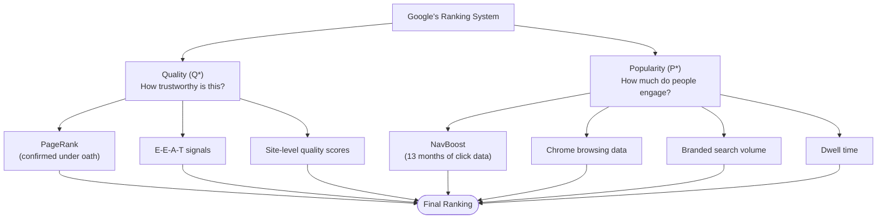
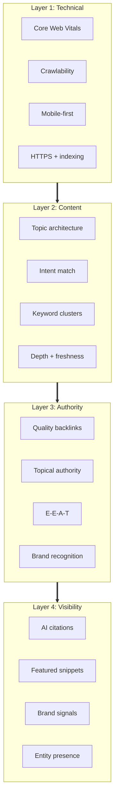
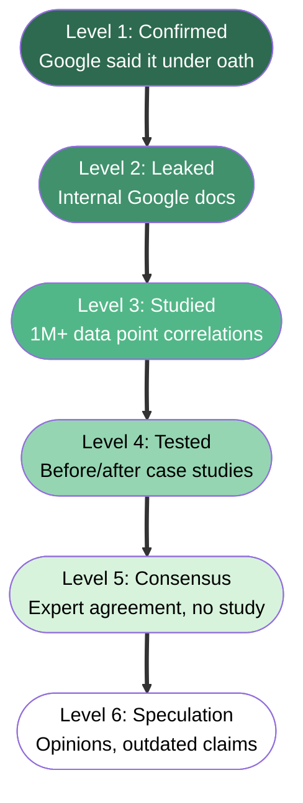
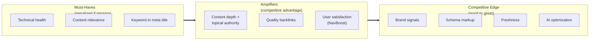
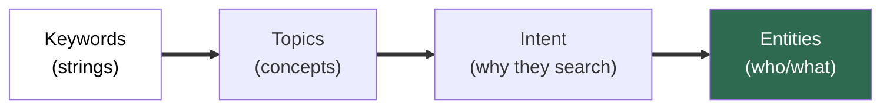
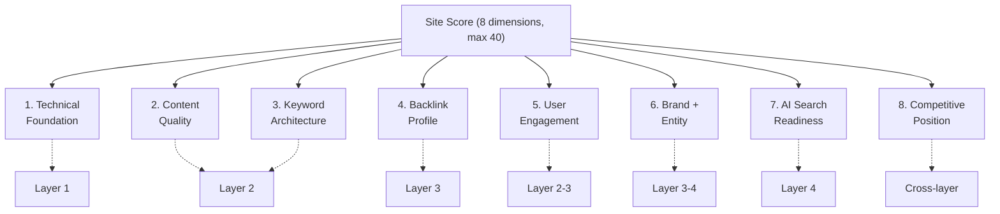
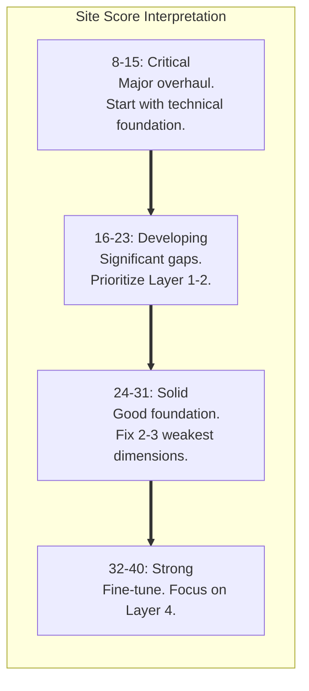
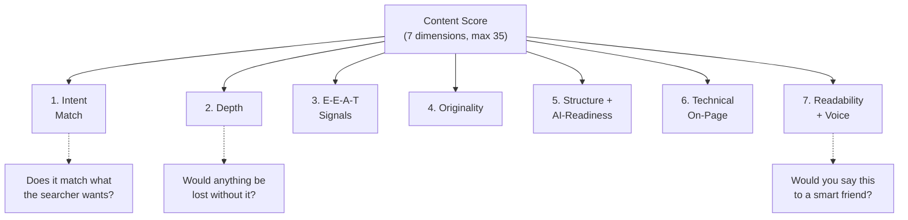
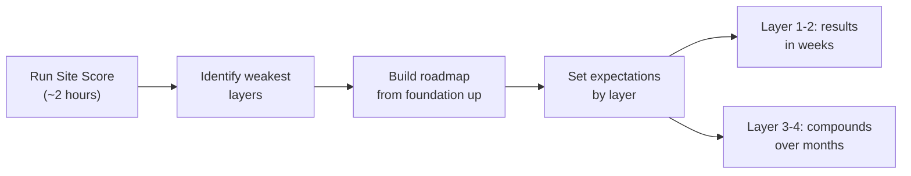
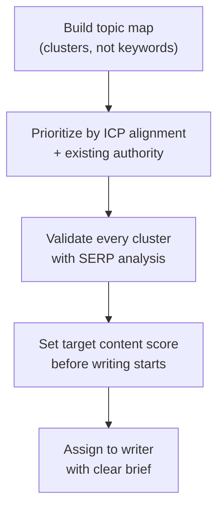

<metadata>
purpose: Mental models, scoring frameworks, and the practitioner playbook for running SEO engagements at GrowthX.
source: https://handbook.growthx.ai/guides/marketing/seo-operating-guide
sync_type: auto
access: build-team
last_synced: 2026-03-02
</metadata>

# SEO operating guide for EMs

> **For:** GrowthX Engagement Managers running client SEO work.
> **Goal:** Give you a complete operating system: how to think about SEO, how to score a site, how to score content, and how to run the engagement.
> **Time Investment:** 2–3 hours to read. A career to master.
> **Last Updated:** February 2026.

---

## The big picture

Everything in SEO comes back to two signals. Google confirmed this under oath during the DOJ antitrust trial, and the leaked API documents back it up.

That's it. Quality and Popularity. Everything else feeds into one of those two buckets.

For the full evidence behind these signals, see the [SEO ranking factors guide](/guides/marketing/seo-ranking-factors#part-1-what-google-actually-confirmed). For now, what matters is the mental model: every recommendation you make to a client should improve either their perceived quality or their real-world popularity. If it doesn't do either, question why you're doing it.

---

## The four-layer stack

SEO work at GrowthX follows a layered model. Each layer depends on the one below it. Skip a layer and the ones above collapse.

**Layer 1: Technical.** Prerequisites. You don't get bonus points for passing. You get penalized for failing. Fast loading (LCP under 2.5s), responsive on mobile, HTTPS, clean crawl paths. If a client's site fails here, nothing else matters until it's fixed.

**Layer 2: Content.** Where we spend most of our time. Topics organized into [clusters, not keyword lists](/guides/marketing/keyword-optimization-clustering). Each page targets a group of related keywords. Content matches the searcher's actual intent. Depth demonstrates expertise. Refreshed quarterly.

**Layer 3: Authority.** Content alone won't rank in competitive spaces. You need external validation. Backlinks from relevant sources. Topical authority through consistent deep coverage. Author credentials that show real experience. This layer [compounds over time](/guides/marketing/seo-ranking-factors#part-4-backlinks--authority).

**Layer 4: Visibility.** The new frontier. Being cited in AI Overviews, ChatGPT, Perplexity. Getting featured snippets. Brand recognition that drives people to search for your client by name. This is where the game is shifting fastest. See our [AEO playbooks](/guides/marketing/aeo-buyer-evaluation) for the tactical frameworks.

### The compounding principle

Every week serving the same client should make the next week easier. Topical authority builds. Backlink profiles strengthen. Brand signals accumulate. Content clusters become more interconnected.

Your job is to make sure the work compounds. Not to chase one-off tactics. This is the same [system mindset](/delivery/teams-and-operations) that drives all of GrowthX delivery.

---

## The evidence hierarchy

When a client asks "why are we doing this?" or when you're evaluating someone's SEO recommendation, grade the evidence.

| Level | What it means | Example |
|-------|--------------|---------|
| 1. Confirmed | Under oath or in official docs | PageRank matters (antitrust testimony) |
| 2. Leaked | Internal Google documents | siteAuthority, NavBoost, siteFocusScore |
| 3. Studied | Large-scale correlation studies (1M+ data) | Dwell time r=0.84 (DollarPocket, 10M results) |
| 4. Tested | Practitioner case studies with data | Topic clusters +43% traffic (HubSpot) |
| 5. Consensus | Expert agreement, no formal study | Brand signals, anchor text diversity |
| 6. Speculation | Opinions, outdated, unsupported | Social signals as direct ranking factor |

Build strategy on Levels 1-3. Use Level 4 for tactical decisions. Be skeptical of anything that lives only at Level 5-6.

"We're doing this because Google confirmed it under oath" lands differently than "this is SEO best practice." Use the hierarchy when [reporting to clients](#when-reporting-to-clients).

---

## What actually moves rankings

Ordered by evidence strength and impact. The full data behind each of these lives in the [ranking factors guide](/guides/marketing/seo-ranking-factors).

### Must-haves (penalized if missing)

1. **Technical health.** Mobile-first, Core Web Vitals in green, HTTPS, crawlable. Pages with LCP under 1 second rank 7.5 positions higher on average than pages over 4 seconds. Only 44% of WordPress sites pass all CWV metrics on mobile. Fix this first.

2. **Content relevance.** Text relevance appears in 90.6% of top-10 results (Semrush). Content must match the searcher's intent. Not just contain the right keywords. Actually answer what they're looking for, in the format they expect. See our [content quality standards](/delivery/creating-good-content) for what "good" looks like.

3. **Keyword in meta title.** 14% of algorithm weight (FirstPageSage). Simple, but one of the highest-ROI optimizations. Google confirmed that title tags provide "valuable clues" to relevance.

### Amplifiers (where competitive advantage lives)

4. **Content depth and topical authority.** Google's leaked docs confirm [siteFocusScore and siteRadius](/guides/marketing/seo-ranking-factors#the-google-content-warehouse-api-leak-may-2024). They literally measure how deep your coverage is. Pages with high topical authority gain traffic 57% faster (Graphite). Content grouped into [clusters drives 30% more traffic](/guides/marketing/keyword-optimization-clustering#framework-2-the-topic-cluster--pillar-page-model) and holds rankings 2.5x longer (HireGrowth, 2025).

5. **Backlinks from relevant, authoritative sources.** Still 22% of the algorithm (DollarPocket). Declining, but not dead. Quality over quantity. PageRank measures "distance from a known good source" (confirmed under oath). One editorial link from a respected industry publication beats 100 directory links.

6. **User satisfaction.** NavBoost uses 13 months of rolling click data. It tracks good clicks, bad clicks, and "lastLongestClicks" (the final click that satisfied the user). If users bounce, rankings erode. Doesn't matter how good your backlinks are.

### Competitive edge (good to great)

7. **Brand signals.** Branded search volume, unlinked mentions, entity consistency. Fishkin's advice after the API leak: "Build a notable, well-recognized brand in your space, outside of Google search."

8. **Schema markup.** Not a direct ranking factor, but drives rich results (82% higher CTR). Increasingly important for [AI citation](/guides/marketing/aeo-buyer-evaluation).

9. **Content freshness.** 85% of AI Overview citations come from content published in the last 2 years.

10. **AI search optimization.** Answer-first formatting, citation-ready content, [semantic completeness](/guides/marketing/seo-ranking-factors#ai-overview-ranking-factors-2025-2026-studies). 47% of AI Overview citations come from pages ranking below position 5. You can get cited without traditional top rankings.

### What to stop doing

- **Keyword density optimization.** Zero correlation (Surfer, 1M SERPs).
- **Keywords in URL paths.** Near-zero correlation.
- **Chasing link quantity.** Google says "very few links" needed. Quality matters.
- **Publishing AI-only content.** Position 16.8 vs. 5.2 for [human-edited content](/delivery/human-ai-collaboration).
- **One keyword per page.** Outdated. [Cluster related keywords](/guides/marketing/keyword-optimization-clustering).

---

## How keywords work now

### The mental shift

Google doesn't match strings anymore. BERT gave it semantic understanding. The Knowledge Graph gives it entity awareness. AI Overviews give it answer synthesis. Your keyword strategy has to account for all of this.

**The clustering principle.** If Google ranks the same pages for two keywords, those keywords belong on the same page. Different results? Separate pages. This is the [SERP Overlap Method](/guides/marketing/keyword-optimization-clustering#framework-1-the-serp-overlap-method). The backbone of all serious keyword work.

**SERP overlap thresholds:**

| Overlap | Shared URLs | Action |
|---------|-------------|--------|
| **70%+** | 7+ of 10 | Same page. High confidence. |
| **40-70%** | 4-6 of 10 | Likely same page. Validate manually. |
| **Below 40%** | 0-2 of 10 | Different intent. Separate pages. |

**The architecture.** Every client engagement should produce a topic map. Not a keyword list. [Pillar pages](/guides/marketing/keyword-optimization-clustering#framework-2-the-topic-cluster--pillar-page-model) covering core topics. Cluster pages going deep on subtopics. Everything interlinked.

### How to think about keyword difficulty

Tool scores are directional, not precise. Ahrefs KD only measures referring domain counts. Semrush adds more signals but still can't predict whether *your* client can rank.

Better questions than "what's the KD?":
- Does our client already have authority in this topic? (If yes, KD matters less.)
- What formats rank? (If it's all tools and product pages, a blog post won't win.)
- What does the top-ranking content look like? (Can we create something meaningfully better?)
- Is this a term our ideal buyer actually searches? (Relevance beats volume.)

For the full framework including tool methodologies, see the [keyword optimization guide](/guides/marketing/keyword-optimization-clustering#part-3-how-the-major-tools-think).

---

## Site scoring framework

Use this when evaluating a client's current SEO health or scoping a new engagement. Score each dimension 1-5. Takes about 2 hours with the right tools.

### Scoring rubric

| Score | What it means |
|-------|--------------|
| 1 | Critical. Actively hurting rankings. |
| 2 | Below average. Major gaps need attention. |
| 3 | Adequate. Meets baseline but won't win competitive SERPs. |
| 4 | Strong. Clear competitive advantage. |
| 5 | Excellent. Best-in-class execution. |

### Dimension 1: Technical foundation (Layer 1)

| Signal | How to check | Score 1 | Score 3 | Score 5 |
|--------|-------------|---------|---------|---------|
| Core Web Vitals | PageSpeed Insights, CrUX data | All metrics failing | Mixed pass/fail | All green on mobile and desktop |
| Mobile experience | Mobile-friendly test, manual spot check | Broken layout, unresponsive | Functional but slow or clunky | Fast, clean, fully responsive |
| Crawlability | Screaming Frog or Sitebulb crawl | Major crawl errors, broken sitemap | Clean with minor issues | Clean crawl, logical URLs, efficient crawl budget |
| HTTPS and security | Browser check, SSL Labs | No HTTPS or mixed content | HTTPS with minor mixed content | Full HTTPS, no warnings |
| Indexing health | GSC Coverage report | Pages not indexed, index bloat | Most important pages indexed | All target pages indexed, no bloat |

Average the five signals. Round to nearest whole number.

### Dimension 2: Content quality (Layer 2)

| Signal | How to check | Score 1 | Score 3 | Score 5 |
|--------|-------------|---------|---------|---------|
| Intent match | Manual SERP comparison for top 10 targets | Wrong format entirely | Right topic, wrong depth or format | Format and depth match SERP expectations precisely |
| Depth | Surfer/Clearscope score, manual review | Thin content (under 500 words where depth needed) | Covers main points, misses subtopics | As good or better than anything ranking |
| E-E-A-T signals | Manual review | No author attribution, generic | Author bios exist but thin | Named experts, detailed bios, unique data |
| Originality | Manual review | Commodity content | Some unique angles | Original research, perspectives unavailable elsewhere |
| Freshness | Check dates on key pages | Key pages not updated in 2+ years | Some updated in last year | Key content refreshed quarterly |

See [creating good content](/delivery/creating-good-content) for what each quality level looks like in practice.

### Dimension 3: Keyword architecture (Layer 2)

| Signal | How to check | Score 1 | Score 3 | Score 5 |
|--------|-------------|---------|---------|---------|
| Cluster structure | Content mapping audit | No topic organization | Some loose groupings | Clear [pillar-cluster architecture](/guides/marketing/keyword-optimization-clustering#framework-2-the-topic-cluster--pillar-page-model) with internal linking |
| Cannibalization | GSC: multiple URLs for same queries | Widespread across core topics | Some in secondary topics | Clean keyword-to-page mapping |
| Intent segmentation | SERP spot-checks | Informational, commercial, transactional mixed | Mostly separated | Each page targets a distinct intent cluster |
| Topic coverage | Gap analysis vs. competitors | Competitors cover 3-5x more subtopics | Some gaps in key areas | Comprehensive, matching or exceeding competitors |
| ICP alignment | Manual review | High-volume vanity terms, no buyer intent | Mix of buyer-relevant and vanity | Content maps to buyer journey and ICP questions |

### Dimension 4: Backlink profile (Layer 3)

| Signal | How to check | Score 1 | Score 3 | Score 5 |
|--------|-------------|---------|---------|---------|
| Referring domain quality | Ahrefs/Semrush DR distribution | Mostly spam or irrelevant | Mix of quality | Strong editorial links from relevant publications |
| Referring domain quantity | Ahrefs vs. competitors | Significantly fewer | Comparable to mid-tier | Matches or exceeds top competitors |
| Topical relevance | Manual review of top linkers | Unrelated industries | Some relevant, some random | Mostly topically relevant, industry-specific |
| Anchor text distribution | Ahrefs anchors report | Over-optimized or all branded | Reasonable mix | Natural: branded, topical, and URL anchors |
| Link velocity | Ahrefs referring domains over time | Flat or declining | Steady but slow | Consistent, growing acquisition |

### Dimension 5: User engagement (Layer 2-3)

| Signal | How to check | Score 1 | Score 3 | Score 5 |
|--------|-------------|---------|---------|---------|
| Organic CTR | GSC for target keywords | Well below position averages | In line with averages | Above-average CTR for position |
| Engagement metrics | GA4 engagement rate, time | High bounce, low time across the board | Average, some pages strong | Strong engagement. Users spend time and interact. |
| Return visits | GA4 returning users from organic | Negligible return traffic | Some return visits | Meaningful returning organic audience |

### Dimension 6: Brand and entity signals (Layer 3-4)

| Signal | How to check | Score 1 | Score 3 | Score 5 |
|--------|-------------|---------|---------|---------|
| Branded search volume | GSC or Ahrefs | Negligible | Moderate, growing | Strong relative to category |
| Entity consistency | Manual: NAP, schema, profiles | Inconsistent or missing | Mostly consistent with gaps | Fully consistent across all platforms |
| Schema markup | Schema validator, Rich Results Test | None or only basic | Organization + some content schema | Comprehensive: org, authors, articles, FAQ, products |
| Unlinked mentions | Brand monitoring tool | Rare or none | Occasional industry mentions | Regular mentions in relevant publications |

### Dimension 7: AI search readiness (Layer 4)

| Signal | How to check | Score 1 | Score 3 | Score 5 |
|--------|-------------|---------|---------|---------|
| Answer-first formatting | Manual review of key pages | Wall-of-text, no extractable answers | Some answer formats, inconsistent | Key pages structured for extraction. Clear answers in first 100 words. |
| AI citation presence | Check ChatGPT, Perplexity, AI Overview | Not appearing | Occasional citations for niche terms | Regularly cited across AI platforms |
| Multi-modal content | Manual review | Text-only | Some images and video | Rich multi-modal (text + images + video + data) |
| Content freshness for AI | Date check | Most content older than 2 years | Mix of fresh and dated | Core content updated within 6 months |

For AEO-specific scoring and strategy, see the [buyer evaluation playbook](/guides/marketing/aeo-buyer-evaluation) and [prompt prioritization guide](/guides/marketing/aeo-prompt-prioritization).

### Dimension 8: Competitive position

| Signal | How to check | Score 1 | Score 3 | Score 5 |
|--------|-------------|---------|---------|---------|
| Organic visibility vs. competitors | Semrush/Ahrefs visibility index | Significantly behind | Mid-pack | Leading or matching top competitors |
| Content gap size | Ahrefs Content Gap tool | Competitors rank for 5x+ keywords client doesn't | Moderate gaps | Minimal gaps |
| Topic Share | Ahrefs Keywords Explorer, Traffic Share by Domains | Below 5% in core areas | 10-20% in some areas | 20%+ in core areas |

**How to calculate Topic Share.** Pick a core topic (e.g., "enterprise data platform"). Pull all keywords in that topic space using Ahrefs Keywords Explorer. Run "Traffic share by domains." Your client's percentage is their Topic Share. Compare against top 3 competitors. Kevin Indig's Growth Memo has the full methodology. Also covered in the [keyword optimization guide](/guides/marketing/keyword-optimization-clustering#framework-3-kevin-indigs-topic-first-seo).

### Interpreting the site score

Add all 8 dimensions (each 1-5). Maximum: 40.

Always fix the lowest-scoring dimension in the lowest layer first. Technical problems in Layer 1 block everything above. Content gaps in Layer 2 make authority building in Layer 3 inefficient. Work from the foundation up.

---

## Content scoring framework

Use this before anything publishes. Score each dimension 1-5. This pairs directly with our [content quality standards](/delivery/creating-good-content).

### 1. Intent match

Does this content match what the searcher actually wants?

| Score | What it looks like |
|-------|-------------------|
| 1 | Wrong format entirely (blog post where product pages rank) |
| 2 | Right topic, wrong approach. Too broad, too narrow, wrong angle |
| 3 | Generally aligned. Covers the topic but doesn't nail the intent |
| 4 | Strong match. Format, depth, angle align with top 5 results |
| 5 | Perfect match. And adds something the current top results don't |

**Check:** Pull up the top 5 results for the target cluster. Does your content look like it belongs?

### 2. Depth and comprehensiveness

| Score | What it looks like |
|-------|-------------------|
| 1 | Surface-level. Under 500 words on a topic that needs depth. |
| 2 | Basics only. Misses subtopics competitors cover. |
| 3 | Solid. Hits main points. Comparable to average top-10 content. |
| 4 | Thorough. Covers subtopics competitors miss, with specifics. |
| 5 | Definitive. The most complete treatment available, with unique angles. |

**Check:** Run through Surfer or Clearscope for topic coverage. But don't chase a perfect tool score. A naturally-written B+ piece often outperforms a forced A+.

### 3. E-E-A-T signals

| Score | What it looks like |
|-------|-------------------|
| 1 | No author attribution. Generic. No evidence of firsthand knowledge. |
| 2 | Author name but no bio, credentials, or experience markers. |
| 3 | Author bio with credentials. Some first-person experience references. |
| 4 | Specific case studies, named tools used, quantified results from real work. |
| 5 | Original data, unique research, verifiable credentials, specific results. |

**Check:** Would Google's quality raters see this as coming from someone with genuine experience? The [ranking factors guide covers E-E-A-T](/guides/marketing/seo-ranking-factors#e-e-a-t-framework-not-direct-signal) in detail.

### 4. Originality and value-add

| Score | What it looks like |
|-------|-------------------|
| 1 | Rewritten version of what already ranks. No unique perspective. |
| 2 | Mostly derivative with one or two different points. |
| 3 | Competent synthesis. Adds clarity but no new information. |
| 4 | Clear value-add. Original frameworks, proprietary data, practitioner perspective. |
| 5 | Genuinely new. Original research, data no one else has, changes how the reader thinks. |

**Check:** If we removed this page from the internet, would anything be lost? If the answer is "no, there's identical content elsewhere," score it low.

### 5. Structure and AI-readiness

| Score | What it looks like |
|-------|-------------------|
| 1 | Wall of text. No headings, no extractable answers. |
| 2 | Basic headings but answers buried. |
| 3 | Clear heading hierarchy. Some direct answers, inconsistent extraction format. |
| 4 | Well-structured. Answer-first formatting. Key questions answered in first paragraph of each section. |
| 5 | Optimized for extraction. Concise answers near top, FAQ section, schema, heading hierarchy matches likely queries. |

**Check:** Could an AI system easily pull a clear answer from this? 44% of AI citations come from the first 30% of content.

### 6. Technical on-page

| Score | What it looks like |
|-------|-------------------|
| 1 | No keyword in title. No meta description. No internal links. |
| 2 | Keyword in title but poorly written. Thin meta description. |
| 3 | Solid title. Decent meta description. A few internal links. |
| 4 | Compelling title (CTR + keywords). Strategic internal links to cluster pages. Image alt text. |
| 5 | All of the above plus schema, optimized URL, strong cluster linking, multi-modal elements. |

### 7. Readability and voice

| Score | What it looks like |
|-------|-------------------|
| 1 | Obviously AI-generated. Stilted, repetitive, jargon soup. |
| 2 | Technically correct but bland. Reads like Wikipedia. |
| 3 | Readable and clear. Professional but not memorable. |
| 4 | Engaging. Clear voice, flows well, concrete examples. |
| 5 | Excellent. Reads like a smart expert who respects the reader's time. You'd share it. |

**Check:** Read it aloud. If you wouldn't say it to a smart friend, rewrite it. Our [writing style guide](/guides/writing/style) has the full framework.

### Interpreting the content score

Add all 7 dimensions. Maximum: 35.

| Total | Rating | Action |
|-------|--------|--------|
| 30-35 | Publish-ready | Ship it. Minor polish only. |
| 24-29 | Strong draft | One more editing pass. Fix any dimension below 4. |
| 17-23 | Needs work | Significant revision. Focus on lowest dimensions. |
| 7-16 | Rework | Major issues. Likely needs substantial rewrite. |

**Minimum publishing threshold:** No dimension below 3. If any dimension scores 1 or 2, fix it before publishing.

**Target for competitive keywords:** Score 28+ with no dimension below 4.

---

## The EM playbook

### When scoping a new engagement

1. Run the Site Scoring Framework. Takes about 2 hours with the right tools.
2. Identify which layers need the most work.
3. Build the engagement roadmap starting from the lowest-performing layer.
4. Set expectations. Layer 1-2 fixes show results in weeks. Layer 3-4 work compounds over months.

This dovetails directly with the [8-week engagement plan](/delivery/8-week-plan). Week 1 kickoff includes the content audit. The site score gives you the data to shape weeks 2-8.

### When planning content

1. Build the topic map. Clusters, not keyword lists. Use the [clustering frameworks](/guides/marketing/keyword-optimization-clustering#part-2-frameworks--process).
2. Prioritize by ICP alignment and existing authority. Not by volume.
3. Validate every clustering decision with SERP analysis.
4. For each content piece, define the target score before writing starts.

### When reviewing content

1. Score every piece against the Content Scoring Framework before publishing.
2. Nothing ships below 24/35. Nothing ships with any dimension below 3.
3. Focus revision energy on the lowest-scoring dimensions first.
4. Track content scores over time. Your team should be getting better. If they're not, the brief or the feedback loop is broken.

### When reporting to clients

1. Use the Site Score to show progress across dimensions over time.
2. Connect improvements to the evidence hierarchy. "We're doing this because Google confirmed X under oath" is a different conversation than "SEO best practice."
3. Track the metrics that matter at each layer:

| Layer | Metrics |
|-------|---------|
| Technical | CWV pass rate, crawl errors, indexing coverage |
| Content | Organic traffic per cluster, rankings per page, content scores |
| Authority | Referring domains, Topic Share, DR growth |
| Visibility | AI citations, featured snippets, branded search volume |

---

## Quick reference card

### Confirmed by Google (Level 1-2 evidence)

- PageRank / link quality (antitrust testimony)
- NavBoost click signals: good clicks, bad clicks, lastLongestClick (API leak + testimony)
- siteAuthority score (API leak)
- siteFocusScore / topical authority (API leak)
- Core Web Vitals (official documentation)
- E-E-A-T as quality framework (official guidelines)
- Freshness signals (API leak)
- Anchor text relevance (antitrust testimony)

### What major studies show

- Content relevance: 90.6% of top-10 results (Semrush)
- Dwell time: r=0.84 (DollarPocket, 10M results)
- Quality backlinks: r=0.85 (DollarPocket)
- Mobile page speed: r=0.83 (DollarPocket)
- Topic clusters: +30% organic traffic, 2.5x longer rankings (HireGrowth)
- Topical authority: 57% faster traffic gains (Graphite)

### What doesn't work

- Keyword density: zero correlation (Surfer, 1M SERPs)
- Keywords in URL: near-zero correlation (Surfer)
- AI-only content: position 16.8 vs. 5.2 for human content (DollarPocket)
- Link quantity without quality: Google says "very few links" needed

<Note>
This guide synthesizes the [SEO ranking factors guide](/guides/marketing/seo-ranking-factors) and [keyword optimization guide](/guides/marketing/keyword-optimization-clustering) into what you need to run engagements. For full evidence, source citations, and learning paths, see those guides.
</Note>
