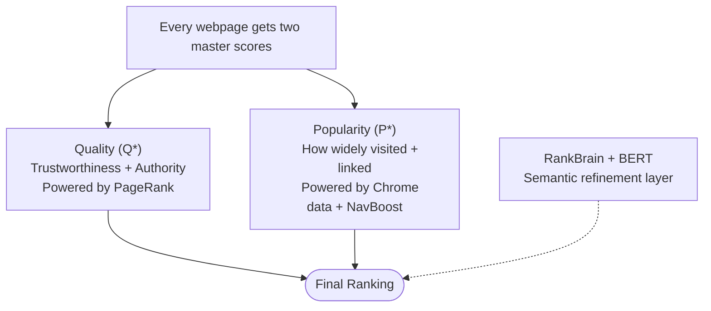
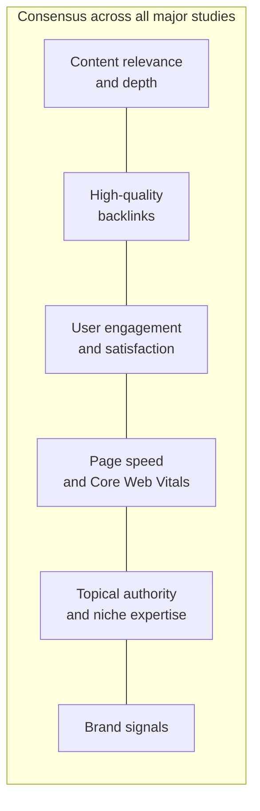
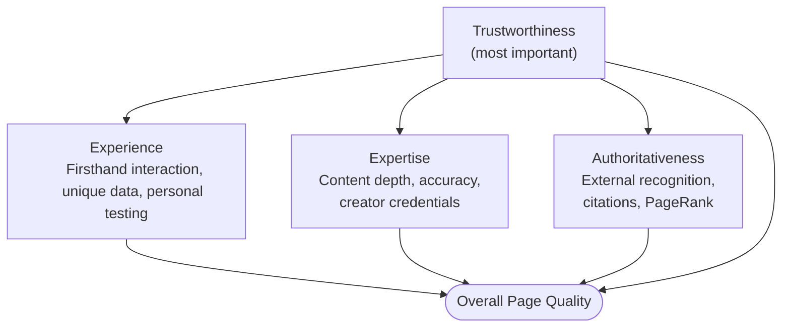
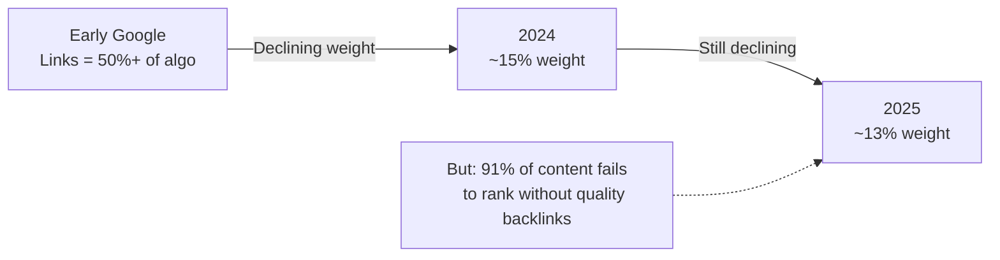
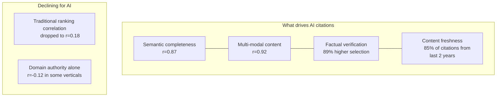
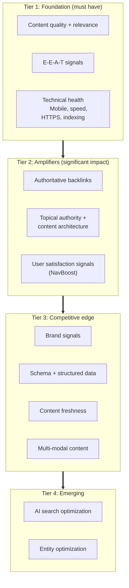

<metadata>
purpose: What Google actually measures, what studies prove, and what practitioners should prioritize in 2025-2026. Grounded in leaks, trial testimony, and million-keyword datasets.
source: https://handbook.growthx.ai/guides/marketing/seo-ranking-factors
sync_type: auto
access: build-team
last_synced: 2026-03-02
</metadata>

# SEO ranking factors

> **For:** Content marketing practitioners and agency leaders who need to separate signal from noise on what actually drives rankings.
> **Goal:** Build an evidence-based understanding of ranking factors grounded in studies, leaks, trial testimony, and practitioner testing. Not speculation.
> **Time Investment:** 8–12 hours.
> **Last Updated:** February 2026.

---

## How to use this guide

This guide is organized by evidence quality. Part 1 covers what we now know from Google's own leaked documents and antitrust trial testimony. Part 2 breaks down the major correlation studies from 2025-2026. Parts 3-8 go deep on each factor category. Part 9 covers AI search visibility. Part 10 is the practitioner playbook.

A note on correlation values (like r=0.84): correlation is not causation. But directional signals from million-keyword datasets are worth paying attention to, especially when multiple studies point the same way.

<Note>
This guide pairs with the [keyword optimization & clustering guide](/guides/marketing/keyword-optimization-clustering) (tactical: how to group keywords and choose tools) and the [SEO operating guide for EMs](/guides/marketing/seo-operating-guide) (operational: site scoring, content scoring, engagement playbook). This guide covers the *why* behind those decisions.
</Note>

---

## Part 1: What Google actually confirmed

### The Google Content Warehouse API leak (May 2024)

In May 2024, over 14,000 internal Google API documents leaked via GitHub, exposing 2,596 modules with ranking attributes Google had publicly denied for years. Rand Fishkin and Mike King published the analysis. Google confirmed the leak was real.

**What the leak revealed:**

**NavBoost: click signals are a top ranking signal.** Mentioned 84 times in the documents. NavBoost uses 13 months of rolling click data to boost, demote, or reinforce rankings. It tracks "goodClicks," "badClicks," and "lastLongestClicks." It geo-fences data by country and state, and splits mobile from desktop. Google had denied using click data for rankings for over a decade.

**siteAuthority exists.** Google spokespeople denied any "domain authority" metric for years. The leak shows Google computes a feature called "siteAuthority" stored as part of Compressed Quality Signals on a per-document basis.

**Chrome data is used.** Chrome browsing data feeds into ranking calculations. Also denied publicly.

A "hostAge" attribute handles newer domains differently, confirming the long-suspected **sandbox for new sites** that Google had denied.

**siteFocusScore and siteRadius** assess how concentrated a site's content is around core topics. This confirms topical authority as a measurable signal and validates the [topic cluster architecture](/guides/marketing/keyword-optimization-clustering#framework-2-the-topic-cluster--pillar-page-model) approach to content planning.

**Freshness signals are granular.** Multiple attributes track when content was created, when it was modified, and how "fresh" the information itself is. Not just the page date.

<Warning>
These documents show what Google *measures*, not necessarily what it *weighs* or how it *uses* each signal. Fields can exist without being active ranking factors. The architecture could change at any time.
</Warning>

---

### The DOJ antitrust trial (2024-2025)

Google's VP of Search, Pandu Nayak, testified under oath about ranking architecture.

**The two master signals: Quality (Q\*) and Popularity (P\*).**

1. **Quality (Q\*)** assesses trustworthiness and authority. Heavily influenced by PageRank, which measures a site's "distance from a known good source." It's a trust chain. Sites closely linked to known-trustworthy sources score higher.

2. **Popularity (P\*)** measures how widely visited and well-linked a page is. Directly powered by Chrome visit data and NavBoost user interaction signals.

**PageRank is still central.** Under oath, Nayak confirmed it remains a key quality signal. That settles the periodic industry debate about whether links still matter.

**Anchor text provides "a valuable clue"** to page relevance. Confirmed in testimony.

**Freshness boosting is real-time.** A system called "Instant Glue" uses a 24-hour rolling log of user interaction data to elevate fresh results for time-sensitive queries.

**Machine learning refines, not replaces.** RankBrain and BERT are refinement layers for semantic understanding. They don't replace the foundational link + click + quality signals. They make those signals more effective.

**User interaction signals are "important."** How users interact with results (click-through rates, time on page, return-to-SERP behavior) directly influences rankings through NavBoost. Nayak confirmed this under oath.

---

## Part 2: The major correlation studies (2025-2026)

### Where the studies agree

Across all major 2025-2026 studies, these factors consistently show strong correlation:

1. **Content relevance and depth.** Universally the strongest signal.
2. **High-quality backlinks.** Declining in weight but still significant.
3. **User engagement / satisfaction signals.** Growing fastest.
4. **Page speed / Core Web Vitals.** Consistent tiebreaker in competitive SERPs.
5. **Topical authority / niche expertise.** Increasingly important.
6. **Brand signals.** Emerging as a major factor for both traditional and AI search.

### Study 1: Surfer SEO — 1 million SERPs (2025)

- **Keyword density shows almost no correlation** with rankings. The era of keyword stuffing is empirically dead.
- **Exact match domains (EMDs) still correlate strongly.** Domains containing the target keyword still perform well.
- **Keywords in URL path** showed almost no correlation.
- **TTFB and page load time** showed growing correlation, confirming speed as a persistent factor.
- **Content comprehensiveness** showed moderate positive correlation.

### Study 2: DollarPocket — 10 million search results (2025)

The largest ranking factor correlation study of 2025:

| Factor category | Weight | Change from 2024 |
|----------------|--------|-------------------|
| **Page experience signals** | 28% | Fastest growing |
| **Content quality** | 25% | Stable |
| **Backlinks** | 22% | Down from 27% |
| **User engagement** | 15% | Up from 11% |
| **Other factors** | 10% | — |

**Specific correlation data:**
- High-quality referring domains: r = 0.85
- Dwell time: r = 0.84
- Mobile page speed: r = 0.83
- Bounce rate: r = -0.68 (lower is better)
- Desktop page speed: r = 0.61
- Pages with LCP under 1.0s rank 7.5 positions higher on average than those over 4.0s
- Fully AI-generated content averages position 16.8 vs. position 5.2 for mostly human content

### Study 3: FirstPageSage — weighted algorithm analysis (Q1 2025)

| Factor | Weight | Trend |
|--------|--------|-------|
| Consistent publication of satisfying content | ~23% | #1 factor for 7+ years |
| Keywords in meta title tag | 14% | Slight decline |
| Niche expertise (topical authority) | 13% | Stable |
| Backlinks | 13% | Down from 15% |
| Searcher engagement | 12% | Up from 11% |
| Trustworthiness | ~8% | Stable |
| Mobile-friendliness | ~5% | Stable |
| Page speed | ~3% | Stable |
| Internal links | ~3% | Stable |

<Tip>
Some factors are "prerequisite." You won't be penalized for having them, but you *will* be penalized for lacking them. These include: keyword in meta title, searcher engagement, trustworthiness, mobile-friendliness, and page speed.
</Tip>

### Study 4: Semrush — text relevance dominance

**Text relevance** (how well content matches query intent) appeared in 90.6% of top-10 results. The single most consistent factor across all studies.

### Study 5: Patrick Stox (Ahrefs) — 1 million keywords (2025)

Analysis of 1 million keywords confirmed links remain a crucial ranking factor with significant correlation values between rankings and various link metrics.

---

## Part 3: Content quality & E-E-A-T

### E-E-A-T: framework, not direct signal

Google has been explicit: E-E-A-T (Experience, Expertise, Authoritativeness, Trustworthiness) is not a direct ranking factor. It's a quality evaluation framework describing what Google's systems try to detect and reward. John Mueller, 2025: "You can't sprinkle some experiences on your web pages."

The indirect evidence, though, is hard to ignore:
- After the December 2025 Core Update, sites demonstrating experience and expertise saw 23% gains
- 96% of AI Overview citations come from verified authoritative sources
- The leaked PQ (Page Quality) rating system from quality rater guidelines appears in Google's internal documentation

### How Google operationalizes each component

**Experience.** Google looks for evidence of firsthand interaction: unique images, personal case studies with specific data, tools personally used. They quantify how difficult content is to replicate and measure novelty.

**Expertise.** Measured through content depth, accuracy, and creator credentials. Focused sites produce stronger signals. Internal linking structure reveals which pages are pillars of expertise.

**Authoritativeness.** Built externally. Other credible sources cite you, link to you, or mention you. PageRank still matters, especially at the domain level.

**Trustworthiness.** Google's Quality Rater Guidelines call this "the most important member of the E-E-A-T family." Evaluated through both editorial quality and technical integrity (HTTPS, transparent authorship, corrections policy).

### The content quality signals that moved in 2025

**Helpful Content is now baked into core updates.** Google folded the Helpful Content system into core ranking in March 2024. The signal is sitewide. One section of low-quality content can drag down an entire domain. [Content quality standards](/delivery/creating-good-content) matter at every level of production.

**AI-generated content penalties are real but nuanced.** DollarPocket found fully AI-generated content averages position 16.8 vs. 5.2 for mostly human content. Google's position is technology-neutral, but AI-only content underperforms. Likely because it lacks firsthand experience and original insight. Our approach to [human-AI collaboration](/delivery/human-ai-collaboration) is built around this.

---

## Part 4: Backlinks & authority

### The declining-but-still-critical signal

The weight keeps dropping:
- Once over 50% of the algorithm (Google's early years)
- FirstPageSage tracked: 15% to 13% (2024-2025)
- DollarPocket tracked: 27% to 22% (2024-2025)
- Gary Illyes (Google, 2023): Links "aren't one of the top three ranking factors anymore"

And yet:
- 85% of page-one sites had 1,000+ backlinks from different domains (Gotch SEO, 11.8M results)
- 91% of content fails to rank without quality backlinks
- 95% of SEO professionals in 2025 still rank backlinks as "critical" or "very important"

### Quality over quantity

PageRank was confirmed in antitrust testimony as measuring "distance from a known good source." It's a trust chain, not a popularity contest. Topical relevance of linking domains matters more than raw domain authority scores. A single editorial link from a respected, relevant publication can outperform hundreds of directory or guest post links.

### Backlinks in AI search

Link quality shows r=0.65 correlation with AI search visibility, the strongest relationship in Semrush's AI ranking report. Domain authority alone shows weaker correlation (r=0.23-0.36). Your backlink profile matters for AI citations even as traditional search weight declines. More on AI visibility strategy in our [AEO guides](/guides/marketing/aeo-buyer-evaluation).

---

## Part 5: User behavior & engagement signals

### NavBoost: the confirmed click system

The API leak and antitrust trial confirmed what the SEO industry suspected for years: Google uses click data extensively through the NavBoost system.

**How NavBoost works:**
- Uses 13 months of rolling click data from Google Search
- Tracks three key signal types: "goodClicks" (satisfactory visits), "badClicks" (quick returns to SERP), and "lastLongestClicks" (the final click that satisfied the user)
- Geo-fences data by country and state/province
- Differentiates between mobile and desktop behavior

**The "lastLongestClick" is particularly powerful.** It's a direct countermeasure to clickbait. If users click a result and stay (long dwell time), it's a good click. If they bounce back quickly, it's a bad click. The *last* click that kept the user satisfied signals the winning result.

### Dwell time is contextual

Dwell time matters, but context determines what "good" means. For "what is the capital of Australia," 5 seconds is satisfactory. For "how to build a backyard deck," 5 seconds signals failure. Google analyzes expected dwell time by query type, aggregating patterns across thousands of users.

### Pogo-sticking as a negative signal

Pogo-sticking is when a user clicks a result, immediately returns to the SERP, and clicks a different result. It's a strong negative satisfaction signal. Unlike bounce rate, it specifically indicates the user rejected your content in favor of a competitor's.

### Organic CTR as a ranking signal

Click-through rate from the SERP is a confirmed input to NavBoost. Pages with compelling titles and meta descriptions that earn higher CTR get a ranking boost, which earns more clicks, which boosts rankings further. Title tag optimization is one of the highest-ROI activities in SEO.

---

## Part 6: Technical SEO & Core Web Vitals

### Core Web Vitals: the tiebreaker

| Metric | What it measures | Good threshold |
|--------|-----------------|----------------|
| **LCP** (Largest Contentful Paint) | Loading performance | Under 2.5 seconds |
| **INP** (Interaction to Next Paint) | Responsiveness | Under 200 milliseconds |
| **CLS** (Cumulative Layout Shift) | Visual stability | Under 0.1 |

INP replaced FID in March 2024. Unlike FID (which only measured the first interaction), INP tracks every interaction throughout a session and reports the worst 2-5%.

**Ranking impact:** CWV weigh roughly 10-15% in Google's algorithm. They're a tiebreaker. Poor CWV won't tank a site with excellent content and authority, but they prevent full ranking potential. When competing pages have similar content and authority, CWV determines the winner.

**The data:**
- Pages with LCP under 1.0s rank 7.5 positions higher on average than pages over 4.0s
- Mobile page speed shows r=0.83 correlation vs. r=0.61 for desktop
- Rakuten optimized CWV: 53% increase in revenue per visitor, 33% higher conversion rate
- redBus improved INP by 72%: 7% increase in sales

### Mobile-first indexing

Fully established. Google uses the mobile version of your content for indexing and ranking. Mobile devices represent ~58% of web traffic in 2026. Mobile CWV performance is what matters.

### HTTPS

Confirmed ranking signal since 2014. In 2026 it's a prerequisite. Not having HTTPS creates a penalty rather than having it creating a boost.

---

## Part 7: Brand signals & entity SEO

### Brand is the new authority

Rand Fishkin's takeaway from the API leak: "Build a notable, popular, well-recognized brand in your space, outside of Google search."

**Branded search volume** is a strong trust signal. Real-world awareness that can't be easily manufactured.

**Unlinked brand mentions** function as signals even without hyperlinks. Google associates textual brand mentions with your entity.

**Entity optimization** is the modern expression of brand SEO. Google doesn't rank pages in isolation. It ranks entities. Your website, Google Business Profile, social profiles, reviews, mentions, and user behavior are evaluated together as one thing.

### The entity framework

Google's Knowledge Graph understands relationships between concepts, people, products, and organizations. Entity SEO works with that reality.

**Practical entity signals:**
- Consistent NAP (Name, Address, Phone) across all platforms
- Schema markup defining your organization, authors, products, and content
- Author pages with verifiable credentials and cross-linked profiles
- Wikipedia and Wikidata presence (for established brands)
- Consistent brand messaging across all channels

### Brand signals in AI search

Brand matters even more for LLM-based search. When AI systems generate answers, they rely on entity relationships to build accurate summaries. Brands frequently and consistently mentioned in authoritative contexts get cited more. [Tracking your AI visibility](/guides/marketing/aeo-buyer-evaluation) is how you see this in action. The prompts buyers use during evaluation are where brand signals translate directly into pipeline.

---

## Part 8: Topical authority & content architecture

### The evidence that topical authority is real

The API leak confirmed Google uses "siteFocusScore" and "siteRadius" metrics to assess how concentrated a site is around core topics.

- **Graphite (2024):** Pages with high topical authority gain traffic 57% faster
- **HubSpot:** 43% increase in organic traffic after implementing topic clusters
- **HireGrowth (2025):** Clusters drive ~30% more organic traffic and hold rankings 2.5x longer

### How to measure topical authority

**Topic Share (Kevin Indig):** Measure the percentage of traffic you capture from all keywords in a topic space. Compare to competitors. This is also covered in detail in the [keyword optimization guide](/guides/marketing/keyword-optimization-clustering#framework-3-kevin-indigs-topic-first-seo).

**Content Coverage Scoring:** Map all subtopics within your core topics. Score each on a 0-3 scale. Identify gaps. Build a content plan to fill them.

### Building topical authority: the architecture

The pillar-cluster model has the strongest evidence behind it. Full framework including SERP overlap methodology and tool comparisons in the [keyword clustering guide](/guides/marketing/keyword-optimization-clustering#framework-2-the-topic-cluster--pillar-page-model).

Depth within your niche beats breadth across many topics. A 50-page site deeply covering one topic domain can outperform a 5,000-page site with shallow coverage across hundreds.

---

## Part 9: AI search visibility

### The scale of the shift

- Zero-click searches grew from 56% in 2024 to 69% in 2025
- AI Overviews now appear in ~16% of US desktop searches
- Google's top organic CTR dropped 32% after AI Overviews (from 28% to 19%)
- Gartner predicts 25% of organic traffic will shift to AI chatbots by 2026
- ChatGPT: 700 million weekly users, 2.5 billion+ prompts daily
- Forrester: 89% of B2B buyers use generative AI as a central source

### AI Overview ranking factors (2025-2026 studies)

**Semantic completeness is the #1 factor (r=0.87).** Content providing complete, self-contained answers in 134-167 word units is 4.2x more likely to appear in AI Overviews.

**Multi-modal content integration (r=0.92).** Pages combining text + images + video + structured data see 156% higher AI Overview selection rates.

**Traditional SEO metrics are declining for AI.** Traditional ranking correlation dropped to r=0.18. 47% of AI Overview content comes from pages ranking below position 5.

**Content freshness matters.** 85% of AI Overview citations were published in the last two years.

### Who gets cited in AI?

Surfer's 36-million AI Overview analysis found extreme concentration:
- YouTube (~23.3%), Wikipedia (~18.4%), and Google.com (~16.4%) dominate citations
- Top 20 domains account for 66.18% of all citations
- 44.2% of LLM citations come from the first 30% of text

This means: put your best, most citable answers early in the content. This aligns directly with the BLUF principle in our [content quality standards](/delivery/creating-good-content).

### Traffic impact of AI Overviews

- Organic CTR drops 61% on searches that trigger AI Overviews
- BUT: pages cited inside AI Overviews earn 35% more organic clicks than uncited competitors
- Being cited in AI is now more valuable than ranking #1 and not being cited. That's a sentence worth reading twice.

Practical frameworks for tracking and improving AI visibility: [buyer evaluation playbook](/guides/marketing/aeo-buyer-evaluation), [prompt writing methodology](/guides/marketing/aeo-prompt-writing), and [prompt prioritization](/guides/marketing/aeo-prompt-prioritization).

---

## Part 10: The practitioner playbook

### The evidence-based priority stack

**Tier 1: Foundation (must have)**
1. **Content quality and relevance.** The single most correlated factor across every study.
2. **E-E-A-T signals.** The framework Google's ranking systems operationalize.
3. **Technical health.** Mobile-first, fast loading, HTTPS, crawlable, properly indexed.

**Tier 2: Amplifiers (significant impact)**
4. **Backlinks from authoritative, relevant sources.** Quality over quantity.
5. **Topical authority and content architecture.** Build pillar-cluster structures.
6. **User satisfaction signals.** NavBoost measures goodClicks and lastLongestClicks. Your content needs to genuinely satisfy.

**Tier 3: Competitive edge**
7. **Brand signals.** Branded search volume, entity consistency, unlinked mentions.
8. **Schema markup and structured data.** Drives rich results (82% higher CTR). Increasingly important for AI citation.
9. **Content freshness.** Quarterly updates for key content.
10. **Multi-modal content.** Text + images + video + structured data.

**Tier 4: Emerging (monitor and invest)**
11. **AI search optimization.** Answer-first formatting, citation-ready content, semantic completeness.
12. **Entity optimization.** Knowledge Graph presence, author entities, cross-platform identity.

### What to stop doing

- **Keyword density optimization.** Surfer's 1M SERP study: zero correlation.
- **Keywords in URL path.** Near-zero correlation.
- **Pursuing low-quality link volume.** Google's own employees say "very few links" are needed.
- **Publishing AI-only content.** Average position 16.8 vs. 5.2 for human content.
- **Ignoring user satisfaction.** NavBoost is a confirmed top signal.

---

## Appendix A: The ranking factor evidence hierarchy

Use this hierarchy when evaluating SEO claims. The further down the list, the more skepticism is warranted.

**Level 1: Confirmed by Google (under oath or in official docs)**
- PageRank as quality signal (antitrust testimony)
- NavBoost click signals (antitrust testimony + API leak)
- Core Web Vitals as ranking signal (official documentation)
- E-E-A-T as evaluation framework (Quality Rater Guidelines)
- HTTPS as ranking signal (official blog post, 2014)
- Mobile-first indexing (official documentation)

**Level 2: Revealed by leaked documentation**
- siteAuthority metric
- siteFocusScore / siteRadius (topical authority)
- Chrome data usage
- hostAge (sandbox effect)
- Freshness attributes

**Level 3: Supported by large-scale correlation studies**
- Content relevance/depth (Semrush, DollarPocket)
- Backlink correlation (Stox, Gotch SEO)
- Page speed correlation (Surfer, DollarPocket)
- Dwell time correlation (DollarPocket)
- AI Overview selection factors (Surfer 36M, AI Mode Boost)

**Level 4: Supported by practitioner testing and case studies**
- Topic cluster traffic impact (HubSpot, HireGrowth)
- Schema markup CTR impact (SearchPilot A/B tests)
- CWV business impact (Rakuten, redBus)

**Level 5: Expert consensus without formal study**
- Brand signals importance
- Anchor text diversity
- Content freshness cadence

**Level 6: Speculation / outdated claims**
- Social signals as direct ranking factor
- Keyword density thresholds
- Exact URL keyword matching

## Appendix B: Major studies & reports

| Study | Sample size | Year | Key finding |
|-------|------------|------|-------------|
| Surfer SEO | 1M SERPs | 2025 | Keyword density: zero correlation. Speed: growing |
| DollarPocket | 10M results | 2025 | Page experience: 28% weight. Dwell time: r=0.84 |
| FirstPageSage | Ongoing model | Q1 2025 | Satisfying content: #1 factor for 7+ years |
| Stox / Ahrefs | 1M keywords | 2025 | Links remain significant correlation |
| Gotch SEO | 11.8M results | 2025 | 85% of page-one sites: 1,000+ referring domains |
| Semrush | Ongoing | 2025 | Text relevance in 90.6% of top-10 results |
| Surfer AI Overviews | 36M AIO | 2025 | Semantic completeness r=0.87; multi-modal r=0.92 |
| Graphite | Not disclosed | 2024 | High TA pages gain traffic 57% faster |
| HireGrowth | Not disclosed | 2025 | Clusters: 30% more traffic, 2.5x longer rankings |

## Appendix C: Key practitioners

| Name | Affiliation | Known for |
|------|------------|-----------|
| Rand Fishkin | SparkToro | API leak analysis, brand-first SEO philosophy |
| Mike King | iPullRank | API leak technical analysis, information retrieval |
| Kevin Indig | Growth Memo | Topic Share framework, topical authority measurement |
| Eli Schwartz | Independent | Product-Led SEO, business-aligned strategy |
| Dixon Jones | InLinks | Entity SEO, Knowledge Graph optimization |
| Cyrus Shepard | Zyppy | Scientific ranking factor studies |
| Lily Ray | Amsive | E-E-A-T expertise, algorithm update analysis |
| Darren Shaw | Whitespark | Local search ranking factors research |
| Patrick Stox | Ahrefs | Large-scale ranking studies |

## Appendix D: Practice exercises

**Exercise 1: Factor audit.** Pick a client site. For each Tier 1-3 factor in the Priority Stack, score the site 1-5. Identify the three weakest areas. Build a 90-day improvement plan.

**Exercise 2: Evidence grading.** Find 10 SEO articles that make claims about ranking factors. For each claim, assign an evidence level using the hierarchy in Appendix A. How many are Level 1-2 vs. Level 5-6?

**Exercise 3: Correlation challenge.** Take the DollarPocket correlation values (dwell time r=0.84, backlinks r=0.85, mobile speed r=0.83). For each, brainstorm: could this be reverse causation? What would a controlled experiment look like?

**Exercise 4: Client audit.** Run a complete ranking factor audit for a real client: CWV scores (PageSpeed Insights), backlink profile (Ahrefs/Semrush), topical authority score, content quality assessment (E-E-A-T checklist), brand signal strength. Produce a one-page strategic recommendation.

## Appendix E: Reading list

### Books

| Title | Author | Why it's essential |
|-------|--------|-------------------|
| Product-Led SEO | Eli Schwartz | Business-aligned SEO strategy beyond keyword chasing |
| Entity SEO | Dixon Jones | How Knowledge Graph changes ranking factor dynamics |
| The Art of SEO (4th ed.) | Enge, Spencer, Stricchiola | Comprehensive reference on all ranking factor categories |
| The Executive SEO Playbook | Jessica Bowman | Enterprise-level SEO implementation and buy-in |

### Learning path

**Quick start (3 hours):**
1. Read Mike King's API leak analysis on iPullRank — 30 min
2. Read Supple Digital's "6 Takeaways for SEOs from Google's Antitrust Trial" — 20 min
3. Read FirstPageSage's weighted ranking factors breakdown — 20 min
4. Read Surfer SEO's AI Citation Report — 30 min
5. Do Exercise 1 (Factor Audit) — 60 min

**Full curriculum (8-12 hours over 3 weeks):**

*Week 1 — Ground truth:*
- Read this guide in full — 90 min
- Study the API leak analysis (Mike King + Rand Fishkin) — 2 hours
- Read the Hobo Web DOJ trial documentation — 1 hour
- Do Exercise 2 (Evidence Grading) — 60 min

*Week 2 — The studies:*
- Read Surfer's 1M SERP study — 30 min
- Study DollarPocket's 10M results analysis — 30 min
- Read Semrush's branding + SEO analysis — 30 min
- Do Exercise 3 (Correlation Challenge) — 90 min

*Week 3 — Applied practice:*
- Read Kevin Indig's topical authority measurement guide — 30 min
- Study the AI Overview ranking factors deep dive — 45 min
- Do Exercise 4 (Client Audit) — 2 hours
