<metadata>
purpose: Make LLMs write better. Context engineering, voice transfer, agentic workflows, and post-processing for genuinely good AI-assisted writing.
source: https://handbook.growthx.ai/guides/writing/llm-writing-mastery
sync_type: auto
access: build-team
last_synced: 2026-03-02
</metadata>

# LLM writing mastery

Most AI-written content has a recognizable signature. Readers can't always articulate why something feels "AI-written," but they sense it. This guide covers the full stack of making LLMs produce genuinely good, human-sounding writing — from understanding the problem through context engineering, agentic workflows, voice transfer, and post-processing.

Every claim is sourced. If something doesn't have a citation, treat it as synthesis across multiple sources.

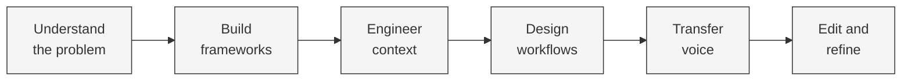

---

## Why LLM writing feels like LLM writing

### The AI slop problem

LLM-generated text converges on the statistical center of its training data. It produces "average" writing — not average in quality, but average in style, structure, and word selection. Human writing is far more variable. A human might write a brilliant sentence followed by an awkward one. An LLM rarely does either.

<CardGroup cols={2}>
  <Card title="Noun-heavy and dense" icon="font">
    A [2024 PNAS study](https://www.pnas.org/doi/10.1073/pnas.2422455122) found LLMs use present participial clauses ("leveraging," "utilizing," "enhancing") at **2-5x the rate of humans**. Classifiers detect AI text with ~66% accuracy from linguistic markers alone.
  </Card>
  <Card title="Formulaic, not original" icon="clone">
    [WritingBench](https://arxiv.org/abs/2503.05244) (2025) evaluated LLMs across 1,239 tasks in six domains. LLMs perform well on formulaic tasks but struggle with **originality, voice consistency, and personal touch**. Human evaluators aligned 84% of the time.
  </Card>
  <Card title="Competent but predictable" icon="chart-line">
    ["The Unlikely Duel"](https://arxiv.org/abs/2406.15891) (2024) found LLMs **slightly outperform the average human** on writing tasks. But humans keep a decisive edge in **originality**. AI outputs were competent but predictable; human outputs were uneven but occasionally surprising.
  </Card>
  <Card title="Hard to judge" icon="scale-balanced">
    [LitBench](https://arxiv.org/abs/2507.00769) (2025) built 2,480 debiased story comparisons. Even the best model judge (Claude-3.7-Sonnet at 73% accuracy) struggled to evaluate **narrative tension and authentic voice**.
  </Card>
</CardGroup>

### The specific tells

Trained readers — and increasingly average readers — recognize these patterns:

<Tabs>
  <Tab title="Structural">
    LLMs default to highly parallel structure. They love the rule of three. They open with a broad contextualization ("In today's rapidly evolving landscape...") before getting to the point. They use transition words mechanically: "Furthermore," "Moreover," "Additionally." Each paragraph tends to be roughly the same length.
  </Tab>
  <Tab title="Vocabulary">
    Certain words appear at dramatically higher frequencies in LLM output than in human writing:

    **The banned list:** "delve," "crucial," "navigate," "landscape," "nuanced," "tapestry," "multifaceted," "embark," "invaluable," "robust," "leverage," "utilize," "facilitate."

    Em-dashes appear at **3-10x the rate** found in typical human prose.
  </Tab>
  <Tab title="Hedging">
    LLMs hedge constantly: "it's worth noting that," "it's important to consider," "while there are certainly many factors." This comes from RLHF training — models are rewarded for being balanced and cautious. Human experts are typically more direct and willing to take a position.
  </Tab>
  <Tab title="Emotional">
    LLM text is relentlessly positive, balanced, and encouraging. It lacks rough edges, frustration, contradiction, and genuine emotion. When it does express emotion, it follows predictable patterns ("I find this genuinely fascinating") rather than the messy, specific ways humans actually emote.
  </Tab>
  <Tab title="Nominalization">
    LLMs turn verbs into nouns: "the implementation of" instead of "we implemented," "the utilization of" instead of "we used." This creates a passive, bureaucratic tone that distances the reader from the action.
  </Tab>
</Tabs>

### What makes human writing human

The inverse of AI tells reveals what matters. Human writing has **variance** — in sentence length, paragraph length, word choice, emotional register, and structure. A skilled human writer shifts between registers within a single piece. Analytical for three sentences, then a brief story, then a joke, then a sharp conclusion.

Human writing also has **specificity from lived experience.** "The office smelled like burned popcorn and anxiety" is a sentence an LLM would never generate unprompted — it combines sensory detail with emotional interpretation in a way that requires actual experience.

The research points to qualities that separate genuinely good writing from competent AI output:

- **Surprise** — ideas or phrasings the reader didn't predict
- **Vulnerability** — admitting uncertainty, failure, or confusion
- **Rhythm** — intentional variation in pacing
- **The iceberg principle** — implying more than you state

<Warning>
**The trust gap is real.** A [meta-analysis in Nature Human Behaviour](https://www.nature.com/articles/s41562-024-02024-1) found only **42% of people trust AI-created content** versus 68% for human-authored content. This gap persists even when readers don't know the content is AI-generated — they rate it lower on authenticity and engagement when it exhibits the patterns above.
</Warning>

---

## Frameworks and mental models

### The writing pipeline

The most effective approach to LLM writing isn't "prompt and pray." It's decomposing writing into stages, each with different requirements and different optimal AI-human collaboration patterns.

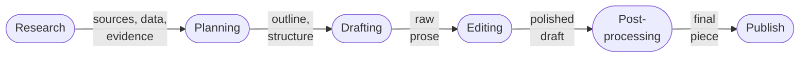

<AccordionGroup>
  <Accordion title="Stage 1: Research">
    Gather information, sources, data points, quotes, and evidence. LLMs are excellent at synthesis and summarization. Use them to process large volumes of source material, extract key points, and identify patterns.

    **Human role:** Curate sources, verify claims, add proprietary knowledge.
  </Accordion>
  <Accordion title="Stage 2: Planning">
    Create an outline, define the argument structure, identify key points and their sequence. LLMs can generate outline options quickly.

    **Human role:** Select the angle, determine what's actually interesting or novel, decide the narrative arc.
  </Accordion>
  <Accordion title="Stage 3: Drafting">
    Generate the actual prose. This is where most people start and stop with LLMs, which is the core mistake. A draft from an LLM working on a well-researched, well-planned foundation is dramatically better than one generated from a bare prompt.

    **Human role:** Provide voice context, style examples, and specific constraints.
  </Accordion>
  <Accordion title="Stage 4: Editing">
    Revise for clarity, voice, accuracy, and engagement. LLMs are good at specific editing tasks (tightening prose, catching inconsistencies, suggesting alternatives) but poor at holistic editorial judgment.

    **Human role:** Make the "is this actually good?" call, cut ruthlessly, add the specific details and personal touches that make writing memorable.
  </Accordion>
  <Accordion title="Stage 5: Post-processing">
    Fact-check, format, optimize for platform, add metadata. LLMs can assist with formatting and basic fact-checking against provided sources.

    **Human role:** Final quality gate, platform-specific optimization, publication decision.
  </Accordion>
</AccordionGroup>

### Context engineering for writing

[Anthropic's research on context engineering](/guides/ai/context-engineering) establishes that "intelligence is not the bottleneck — context is." This is the single most important mental model for LLM writing. Output quality is determined by context quality, not model capability.

Context engineering for writing has four operations:

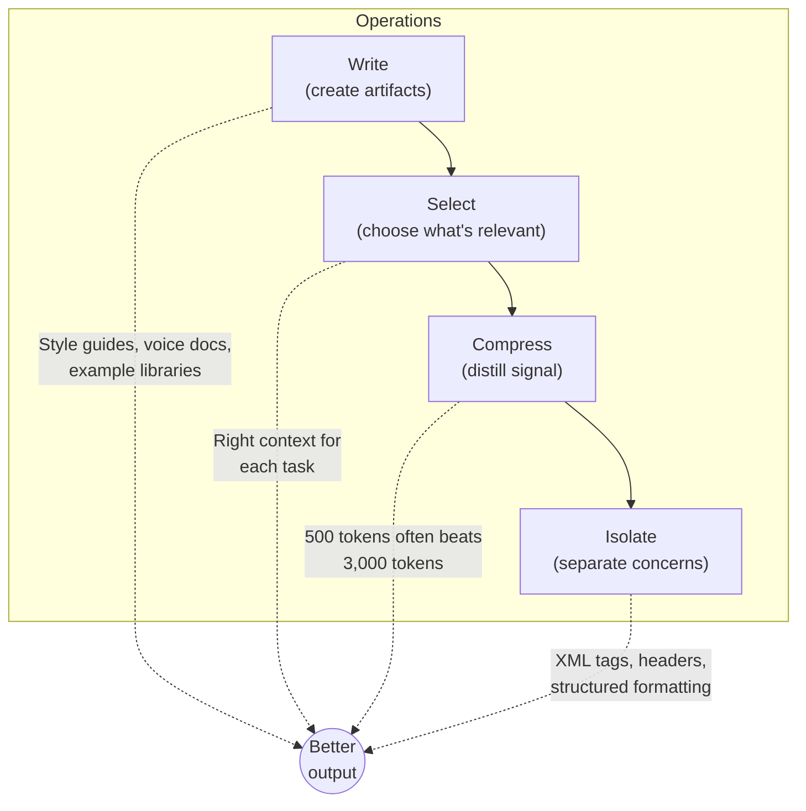

<CardGroup cols={2}>
  <Card title="Write context" icon="pen">
    Create style guides, voice documents, writing principles, and example libraries specifically formatted for LLM consumption. These are engineering artifacts, not just reference documents.
  </Card>
  <Card title="Select context" icon="filter">
    Choose the right context for each writing task. A blog post needs different context than a sales email. Don't dump everything in — curate what's relevant. Placing the most important context near the end of the prompt improves quality by up to **30%**.
  </Card>
  <Card title="Compress context" icon="compress">
    Summarize and distill context to fit token limits without losing critical information. A well-compressed style guide of 500 tokens often outperforms a verbose 3,000-token version because the signal-to-noise ratio is higher.
  </Card>
  <Card title="Isolate context" icon="layer-group">
    Separate different types of context (research, style, audience, constraints) so the model can attend to each clearly. XML tags, clear section headers, and structured formatting all help the model parse what's what.
  </Card>
</CardGroup>

### The voice triangle

Voice consistency requires three inputs working together. Miss one and the output falls flat.

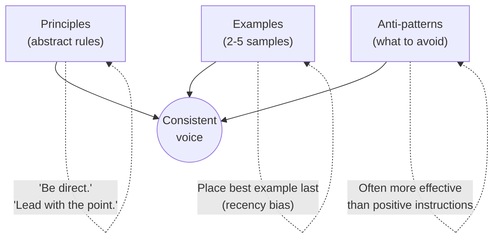

| Component | What it does | Tip |
|-----------|-------------|-----|
| **Principles** | Set guardrails — "be direct," "use active voice" | Keep to 3-5 max. More creates noise. |
| **Examples** | Teach patterns that principles can't convey — rhythm, structure, word choice | 2-5 high-quality examples. Place the best one last. |
| **Anti-patterns** | Directly counteract the model's default behaviors | "Don't use em-dashes" is often more effective than "vary your punctuation." |

### The quality gradient

Not all writing tasks need the same level of human involvement.

<Tabs>
  <Tab title="Full automation">
    **Low stakes, high volume.** Product descriptions, meta descriptions, data-driven reports, internal documentation.

    Use well-engineered prompts with strong context. Light human review of 10-20%.
  </Tab>
  <Tab title="AI-first + human edit">
    **Medium stakes.** Blog posts, newsletters, social content, client reports.

    AI generates the draft from a strong brief. Human edits for voice, adds personal touches, fact-checks. Typical: **30-40 minutes human time per piece**.
  </Tab>
  <Tab title="Human-first + AI assist">
    **High stakes.** Thought leadership, strategic communications, brand narratives.

    Human does the thinking and primary writing. AI helps with research, alternatives, editing passes. Typical: **2-4 hours human time per piece**.
  </Tab>
  <Tab title="Human only">
    **Highest stakes.** Crisis communications, legal content, deeply personal storytelling.

    AI might assist with research, but the writing is fully human.
  </Tab>
</Tabs>

### Decomposed vs. monolithic prompting

Research consistently shows that decomposing a writing task into sequential prompts produces better results than a single mega-prompt. The analogy is cooking: you don't throw all ingredients into a pot at once.

<Tabs>
  <Tab title="Monolithic (avoid)">
    "Write a 2,000-word blog post about AI in healthcare, make it engaging, include statistics, use a conversational tone, and cite your sources."

    One prompt trying to do everything. The model compromises on all dimensions.
  </Tab>
  <Tab title="Decomposed (use this)">
    **Step 1:** "Given this research [attached], identify the 3 most surprising findings about AI in healthcare."

    **Step 2:** "Create an outline for a blog post leading with [finding X]. Structure: hook, problem, evidence, implications, what to do about it."

    **Step 3:** "Write the first section following this voice guide [attached]. Here are 3 examples of how we open posts [examples]."

    **Step 4:** "Continue with section 2. Maintain the same voice. Here's what you wrote in section 1 [context]."

    **Step 5:** "Review the full draft. Flag any sentences that sound generic. Suggest specific replacements."

    Each step gets tailored instructions and focused context.
  </Tab>
</Tabs>

---

## Context engineering for writing: the details

### Building your voice document

Your voice document is the single highest-leverage artifact in your writing system. It's not a style guide for humans — it's an **engineering specification for machines**.

A human style guide says: "Write in a conversational tone." A machine-readable voice document says: "Use contractions (it's, don't, won't). Average sentence length: 12-18 words. Maximum sentence length: 25 words. Use questions to create dialogue rhythm. One idea per sentence."

<Steps>
  <Step title="Voice principles (3-5 max)">
    Each with a clear, testable definition. Not "be authentic" but "use first-person experience. Reference specific situations, not abstractions. Admit when you don't know something."
  </Step>
  <Step title="Style anchors">
    Name 2-4 writers whose style you want to channel. Include 1-2 sentence descriptions of what to borrow from each.

    Example: "[Paul Graham](https://paulgraham.com/simply.html) — conversational precision. Short sentences, short words, sophisticated ideas."
  </Step>
  <Step title="Sentence-level rules">
    Active voice. One idea per sentence. Specific rules about punctuation. Word choice mandates (use "use" not "utilize," "help" not "facilitate").
  </Step>
  <Step title="Anti-patterns with examples">
    Show before/after transformations. These teach more than abstract rules.

    **Don't write:** "It's important to note that effective communication facilitates better outcomes."

    **Write:** "Clear writing gets results."
  </Step>
  <Step title="2-5 exemplar passages">
    Full paragraphs in the target voice, not just sentences. Include variety — analytical, narrative, and persuasive. Format consistently so the model learns structural patterns too.
  </Step>
  <Step title="Domain-specific modifiers">
    If you write across contexts (blog, email, LinkedIn, technical docs), specify how the base voice shifts for each. What stays the same? What changes?
  </Step>
</Steps>

### Few-shot example engineering

Examples matter more than instructions for voice consistency. The details of how you use them significantly affect quality.

| Factor | Guidance |
|--------|----------|
| **Number** | 2-5 examples. Below 2: not enough signal. Above 5: noise and wasted tokens. |
| **Placement** | Put your best example **last**, closest to where the model generates. Recency bias works in your favor. |
| **Diversity** | Show range within your voice. Include narrative, analytical, and conversational examples. |
| **Format consistency** | If examples use a specific format, the model replicates it. Audit for unintended formatting patterns. |
| **Negative examples** | A "don't write like this" example is often more effective than a third positive example. |

<Tip>
Put research and background at the **top** of your prompt. Put style examples at the **bottom**. LLMs attend most strongly to what's closest to where they generate.
</Tip>

### System prompt architecture

For sustained writing projects, build a layered system prompt rather than crafting individual prompts:

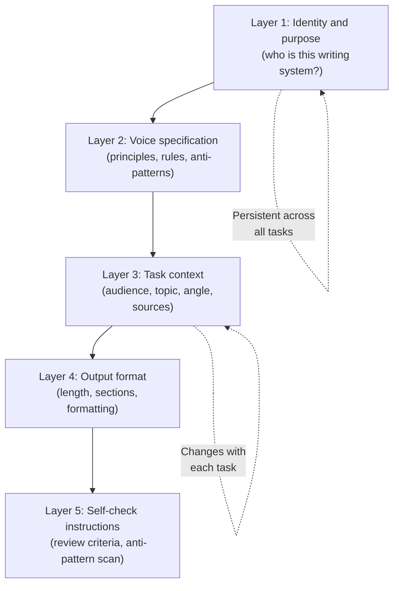

<Info>
**Explain WHY, not just WHAT.** "Use active voice" is okay. "Use active voice because passive constructions create distance between the reader and the action, which undermines our goal of feeling like a conversation" is better. LLMs follow instructions more precisely when they understand the reasoning.
</Info>

### Temperature and generation parameters

These controls directly affect writing variety. Most practitioners either ignore them or use them incorrectly.

| Parameter | Range | Writing recommendation | Notes |
|-----------|-------|----------------------|-------|
| **Temperature** | 0.0-2.0 | 0.7-1.0 for creative writing | Below 0.7 = predictable. Above 1.0 = incoherent. |
| **Top-P** | 0.0-1.0 | 0.95 | Alter temperature **OR** top-p, never both. |
| **Frequency penalty** | -2.0 to 2.0 | 0.3-0.5 | Reduces repetitive phrasing. Higher values force diversity. |
| **Presence penalty** | -2.0 to 2.0 | 0.3-0.6 | Binary "you've used this" signal. Nudges vocabulary variety. |

<Note>
**Practical default:** Temperature 0.8, top-p 0.95 (leave one at default), frequency penalty 0.3, presence penalty 0.3. Adjust temperature up for creative/brainstorming tasks, down for technical/precise tasks.
</Note>

### Structured context formats

How you structure context matters as much as what you include.

<CardGroup cols={3}>
  <Card title="XML tags" icon="code">
    Work well for Claude: `<voice>`, `<examples>`, `<anti_patterns>`, `<task>`, `<audience>`. Create clear boundaries between context types.
  </Card>
  <Card title="Markdown headers" icon="heading">
    Work well for all models. Use them to organize system prompts with clear hierarchy.
  </Card>
  <Card title="Key-value pairs" icon="list">
    For constraints: `max_length: 1500 words`, `tone: conversational`, `reading_level: grade 8`.
  </Card>
</CardGroup>

<Tip>
**Separation of data and instructions.** Place longform reference material (research, background, source text) at the **top** of your prompt. Place instructions and queries at the **bottom**, closest to generation. This can improve output quality by up to **30%**.
</Tip>

---

## Agentic writing workflows

### Why multi-agent beats single-prompt

Single-prompt writing asks one "agent" to be researcher, strategist, writer, and editor simultaneously. Multi-agent pipelines assign specialized roles to separate LLM calls, each with focused context and a specific job.

A [2025 systematic review of 109 HCI papers](https://dl.acm.org/doi/10.1145/3613904.3642134) on human-AI co-writing identified four design strategies: structured guidance, guided exploration, active co-writing, and critical feedback. The most effective systems used **multiple strategies in sequence**.

### The five-agent writing pipeline

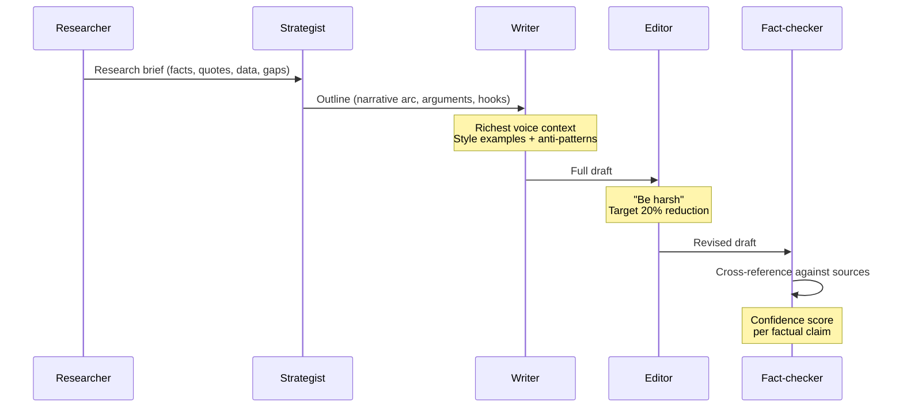

<AccordionGroup>
  <Accordion title="Agent 1: Researcher">
    **Input:** Topic, audience, angle.

    **Output:** Organized research brief with key facts, quotes, data points, source citations, and gaps identified.

    This agent has access to search tools and document retrieval. Its system prompt emphasizes thoroughness, source quality, and organized output.
  </Accordion>
  <Accordion title="Agent 2: Strategist">
    **Input:** Research brief, audience profile, content goals.

    **Output:** Detailed outline with narrative arc, key arguments in sequence, where to place evidence, and a hook recommendation.

    System prompt emphasizes audience psychology, argument structure, and engagement.
  </Accordion>
  <Accordion title="Agent 3: Writer">
    **Input:** Outline, research brief, voice document, 3-5 examples.

    **Output:** Full draft.

    This agent has the richest voice context and the most specific stylistic instructions. System prompt includes anti-patterns, sentence-level rules, and self-check criteria.
  </Accordion>
  <Accordion title="Agent 4: Editor">
    **Input:** Draft, voice document, anti-pattern list.

    **Output:** Revised draft with tracked changes and comments.

    System prompt emphasizes cutting (target 20% reduction), flagging AI-isms, tightening phrasing, and improving openings. **Instruct this agent to be harsh** — a lenient AI editor is useless.
  </Accordion>
  <Accordion title="Agent 5: Fact-checker">
    **Input:** Edited draft, original sources.

    **Output:** Verified draft with citation notes, formatting corrections, and a confidence score for each factual claim.

    Cross-references claims against provided sources and flags anything unsupported.
  </Accordion>
</AccordionGroup>

### Human-in-the-loop patterns

Research on [human-AI co-writing](https://www.nature.com/articles/s41598-024-69423-2) (Nature, 2024) found that humans who **actively co-create** with AI produce more creative output than humans who simply edit AI drafts.

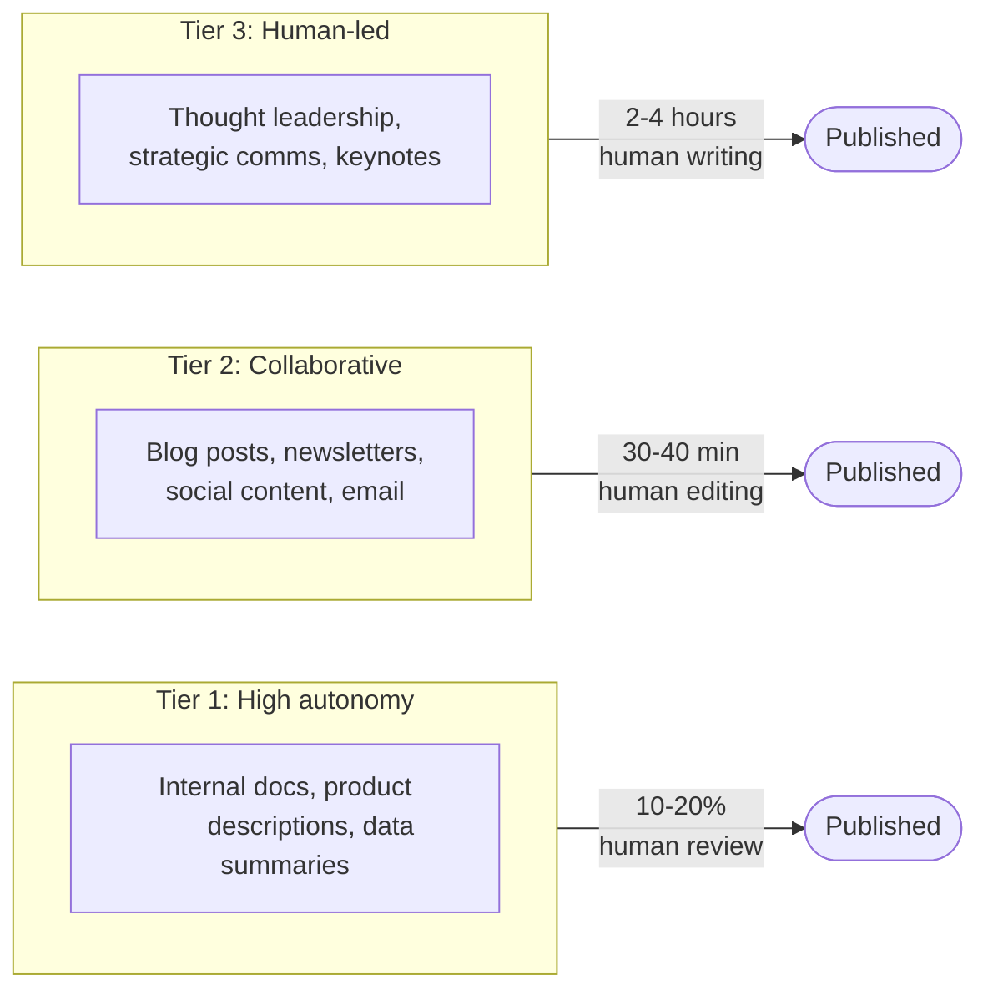

<Warning>
**Escalation rule:** Anything touching customers, brand, or strategy gets escalated from Tier 1 to Tier 2 at minimum. No exceptions.
</Warning>

### Content brief architecture

The content brief is the most underrated artifact in AI writing workflows. A strong brief matters more than a clever prompt because it provides the substantive input the AI needs.

<AccordionGroup>
  <Accordion title="Audience (go beyond demographics)">
    Not just who they are — what they believe, what would surprise them, their sophistication level with the topic, and what action you want them to take.
  </Accordion>
  <Accordion title="Angle (the specific thesis)">
    Not "write about AI in marketing" but "argue that most companies are using AI for the wrong marketing tasks — they're automating content production when they should be automating audience research."
  </Accordion>
  <Accordion title="Key points (3-5, prioritized)">
    The arguments or ideas that must appear, in rough priority order. Each with supporting evidence.
  </Accordion>
  <Accordion title="Evidence (specific, not generated)">
    Specific data points, quotes, case studies, and examples to include. **Provide the actual text/data** — don't ask the AI to find it.
  </Accordion>
  <Accordion title="Differentiation">
    What makes this piece different from the 50 other articles on this topic? The unique insight, proprietary data, or contrarian take.
  </Accordion>
  <Accordion title="Constraints">
    Word count, format, platform, reading level, mandatory/forbidden words, links to include.
  </Accordion>
</AccordionGroup>

### Tool integration

<CardGroup cols={2}>
  <Card title="Search tools" icon="magnifying-glass">
    Real-time research and fact verification. RAG [reduces hallucination by 42-68%](https://aclanthology.org/2021.findings-emnlp.320.pdf) compared to generation from parametric knowledge alone.
  </Card>
  <Card title="Analytics tools" icon="chart-bar">
    Data-driven content decisions — what topics perform, what formats engage, what headlines convert.
  </Card>
  <Card title="Style checkers" icon="spell-check">
    Running output through readability analyzers, brand voice checkers, or custom pattern matchers as part of the pipeline.
  </Card>
  <Card title="Publishing tools" icon="paper-plane">
    Direct integration with CMS, social platforms, and email systems for end-to-end automation.
  </Card>
</CardGroup>

<Tip>
**The ICE method for grounding:** Instructions (what to do), Constraints (boundaries), Escalation (what to do when uncertain — flag for human review rather than guess). This reduces hallucination by forcing the system to acknowledge uncertainty.
</Tip>

---

## Voice, tone, and style transfer

### How to capture a human voice

Voice transfer — making an LLM write like a specific person — is one of the highest-value and most difficult challenges.

<Steps>
  <Step title="Collect 10-20 samples">
    Variety matters more than volume. Include different content types (analytical, narrative, persuasive, casual), different lengths, and different moods. The samples should represent the **range** of the voice, not just its peak moments.
  </Step>
  <Step title="Analyze patterns explicitly">
    Before giving samples to an LLM, do your own analysis. Average sentence length? Question frequency? Paragraph structure? Metaphor usage? Data vs. stories? Words they overuse (in a good way)? Words they never say?
  </Step>
  <Step title="Build a voice specification">
    Turn your analysis into a structured document: principles, rules, anti-patterns, and examples. Be specific. "Conversational" means nothing. "Uses contractions, asks rhetorical questions, opens paragraphs with the topic, averages 14 words per sentence, never uses semicolons" is useful.
  </Step>
  <Step title="Test and iterate">
    Generate 5 test pieces. Compare to originals. Where does the voice break? Tighten the specification. Add anti-patterns for whatever the model got wrong. Expect **3-5 revision cycles**.
  </Step>
  <Step title="Maintain a living document">
    Voice evolves. Update quarterly. Add new examples. Retire ones that no longer represent the current voice.
  </Step>
</Steps>

### Breaking AI writing patterns

Beyond establishing a target voice, you need to actively break the patterns that make AI writing sound like AI writing.

| Technique | Instruction to give |
|-----------|-------------------|
| **Vary sentence length** | "Mix sentence lengths. Some under 5 words. Others can run to 25-30. The rhythm should feel like conversation, not a metronome." |
| **Ban AI-isms** | "Never use: delve, crucial, landscape, tapestry, multifaceted, nuanced, embark, foster, robust, leverage, utilize, facilitate, moreover, furthermore, additionally, in conclusion." |
| **Require specificity** | "Every claim must include a specific number, name, date, or example. No sentence should be true of every company — if it is, it's too vague." |
| **Inject imperfection** | "Include one sentence that's slightly rough or informal. The occasional short paragraph — even a single sentence — creates rhythm." |
| **Force structural variety** | "Don't use the same paragraph structure twice in a row. If paragraph 1 opens with a statement, paragraph 2 should open with a question, a story, or a number." |

### Computational stylistics

NLP researchers have developed tools for quantitative style analysis that practitioners can use to verify voice consistency.

**Stylometry** analyzes measurable features: average sentence length, vocabulary richness, punctuation frequency, part-of-speech distribution, and function word usage. These features are surprisingly stable within a single author and distinguishing between authors.

**Key metrics to track:**

| Metric | What it measures | Target |
|--------|-----------------|--------|
| Type-token ratio | Vocabulary diversity | Match your reference samples |
| Average sentence length | Pacing | Human: varied. AI: uniform. |
| Flesch-Kincaid grade | Readability | Grade 6-8 for broad audiences, 8-10 for professional |
| Gunning Fog | Education level needed | Lower is more accessible |
| Punctuation distribution | Style fingerprint | Compare to reference samples |

### Persona and role-playing approaches

Research (2024 EMNLP survey) found that LLM-generated personas can outperform handcrafted ones. The key: personas work best when they're **specific and grounded**, not generic.

<Tabs>
  <Tab title="Weak persona">
    "You are a professional writer."

    Too generic to produce distinctive output. The model defaults to its training average.
  </Tab>
  <Tab title="Strong persona">
    "You are a B2B content strategist with 12 years of experience. You've worked at three SaaS companies (Series A through IPO). You're skeptical of marketing fluff and believe the best content teaches something specific. You write like Paul Graham — short sentences, plain words, sophisticated ideas. You hate bullet points unless absolutely necessary."

    Specific behaviors and preferences. Grounded in expertise, not demographics.
  </Tab>
</Tabs>

<Info>
**EmotionPrompt.** [Research](https://arxiv.org/abs/2307.11760) showed that adding emotional context improves output quality by **10.9% average** and up to **115% on complex tasks**. Example: "This piece matters because it's the first thing a potential customer reads about our company. It needs to be honest and compelling — their decision to trust us starts here."
</Info>

---

## What makes content get read and shared

### The science of engagement

Understanding what drives content consumption directly informs how you instruct LLMs to write.

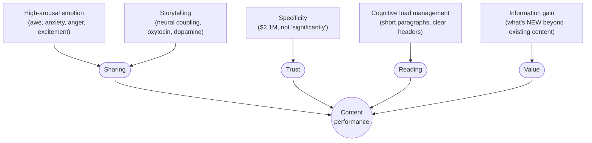

<CardGroup cols={2}>
  <Card title="Emotion drives sharing" icon="heart">
    High-arousal emotions (awe, anxiety, anger, excitement) drive sharing far more than low-arousal emotions (sadness, contentment). Content that makes people **feel something intensely** gets shared. Content that informs without provoking emotion gets bookmarked and forgotten.
  </Card>
  <Card title="Storytelling is neurological" icon="book-open">
    Three mechanisms: **neural coupling** (listener's brain mirrors storyteller's), **oxytocin release** (trust hormone from character-driven narratives), and **dopamine from anticipation** (the brain rewards pattern-seeking). This is why "How I ruined a $2M launch with one email" outperforms "3 tips for better writing."
  </Card>
  <Card title="Specificity creates credibility" icon="bullseye">
    "Revenue grew 34% to $2.1M" is more believable than "revenue grew significantly" even if the reader can't verify either claim. Specific details activate concrete-processing circuits linked to trust and memory formation.
  </Card>
  <Card title="Information gain wins" icon="lightbulb">
    Google's helpful content system and reader behavior both reward content that adds something **new**. Ask: "If someone read the top 5 existing articles on this topic, what would they still not know?" That gap is your content opportunity.
  </Card>
</CardGroup>

<Note>
**Cognitive load theory.** Working memory holds about 4 items. Content that exceeds this threshold without chunking loses readers. Short paragraphs, clear headers, one idea per section, visual breaks. Long-form content (1,500+ words) generates **3x more traffic** than short-form, but only when well-structured and scannable.
</Note>

### Platform-specific engagement

<Tabs>
  <Tab title="LinkedIn">
    - Multi-image posts drive **6.60% engagement rate**
    - Algorithm rewards shares, saves, and DM sends over likes and comments
    - Personal profiles outperform company pages
    - Optimal length: **1,200-1,500 characters**
    - Curiosity hooks ("Most B2B companies are optimizing for a search engine that's losing market share") outperform informational hooks

    See also: [LinkedIn engagement guide](/guides/social/linkedin-engagement) and [LinkedIn hooks](/guides/social/linkedin-hooks).
  </Tab>
  <Tab title="Twitter/X">
    - Replies worth **13.5-27x likes** in algorithmic weight
    - Retweets worth **20x likes**
    - First two hours after posting are critical
    - Threads outperform single tweets for depth
    - The first tweet must stand alone as a hook
  </Tab>
  <Tab title="Email newsletters">
    - Average open rate: **42.35%** (Mailchimp, 2024)
    - Personalized subjects increase opens by **26%**
    - Emojis in subject lines **decrease** open rates on average
    - Click-through rate averages **2-3%**
    - Consistency (same day, time, format) beats novelty for retention
  </Tab>
  <Tab title="YouTube">
    - Algorithm shifted from watch time to "satisfaction" (surveys, completion, return viewing)
    - Shorts: **90 billion daily views**
    - Completion rate is the strongest long-form signal
    - Titles and thumbnails determine **80%** of click-through decisions
  </Tab>
  <Tab title="TikTok">
    - **Completion rate** is the most important algorithmic signal
    - Shares and saves outweigh likes (2025)
    - Niche authority > generalist content
    - Hook in the first **1-3 seconds**
  </Tab>
</Tabs>

### Content formats that work

<CardGroup cols={2}>
  <Card title="Contrarian takes" icon="arrow-turn-down-right">
    Challenge a widely-held belief with evidence. "Most companies are doing X wrong — here's why" creates cognitive dissonance that demands resolution.
  </Card>
  <Card title="Personal failure stories" icon="person-falling-burst">
    "Here's what I got wrong and what I learned" triggers empathy, vulnerability, and information gain simultaneously.
  </Card>
  <Card title="Data-driven insights" icon="database">
    Original data is the most defensible and shareable format. "We analyzed 10,000 AI-generated blog posts and here's what we found" provides unreplicable value.
  </Card>
  <Card title="Frameworks and mental models" icon="sitemap">
    Give people a new way to think about a familiar problem. Named frameworks ("The 3-2-1 Method," "The Clarity Ladder") are especially shareable because they're easy to reference and teach.
  </Card>
</CardGroup>

---

## Expert practitioner wisdom

### On writing itself

<AccordionGroup>
  <Accordion title="Paul Graham: Write simply">
    Produces a terrible first draft as fast as possible, then rewrites many times. ["Write simply"](https://paulgraham.com/simply.html) — the way you talk, but better. Reads drafts aloud and fixes anything that wouldn't sound natural in conversation. Aims to surprise himself while writing — if he's not learning or discovering something, the reader won't either.

    **Practical rule:** Become a connoisseur of bad writing so you can recognize it in your own work. The best writing is [novel, correct, important, and strong](https://paulgraham.com/useful.html).
  </Accordion>
  <Accordion title="George Orwell: Six rules">
    From ["Politics and the English Language"](https://www.orwellfoundation.com/the-orwell-foundation/orwell/essays-and-other-works/politics-and-the-english-language/) — the most efficient style guide ever written:

    1. Never use a metaphor, simile, or figure of speech you're used to seeing in print
    2. Never use a long word where a short one will do
    3. If it's possible to cut a word out, cut it
    4. Never use the passive where you can use the active
    5. Never use a foreign phrase, scientific word, or jargon if you can think of an everyday English equivalent
    6. **Break any of these rules sooner than say anything outright barbarous**
  </Accordion>
  <Accordion title="Hemingway: The iceberg theory">
    Say less than you know. Let the reader's imagination do work. The dignity of movement of an iceberg is due to only one-eighth of it being above water. This is the **opposite** of how LLMs write — they tend to overexplain, qualify, and pad.
  </Accordion>
  <Accordion title="Anne Lamott: Shitty first drafts">
    "All good writers write terrible first drafts. That's how they end up with good second drafts and terrific third drafts." Don't expect the first generation to be good. The first draft is raw material. The value is in the revision.
  </Accordion>
  <Accordion title="Stephen King: Doors closed and open">
    "Write with the door closed, rewrite with the door open." First drafts are private, exploratory, messy. Editing is where you consider the reader. Applied to AI workflows: the research and drafting phases should be unconstrained. The editing phase is where you enforce voice, quality, and audience fit.
  </Accordion>
</AccordionGroup>

### On AI-assisted writing

<AccordionGroup>
  <Accordion title="Ethan Mollick: Four rules for working with AI">
    From [One Useful Thing](https://www.oneusefulthing.org/):

    1. **Always invite AI to the table** — use it for every task, even ones you think it can't do, to learn its boundaries
    2. **Be the human in the loop** — never accept AI output without review and modification
    3. **Treat AI like a weird, brilliant alien** — it doesn't think like you, so learn its actual capabilities
    4. **Assume this is the worst AI you'll ever use** — today's limitations are temporary, but learn the fundamentals now
  </Accordion>
  <Accordion title="Simon Willison: The over-confident pair programmer">
    From [simonwillison.net](https://simonwillison.net/): Treat the LLM as an over-confident pair programmer who sometimes makes things up. Always verify. Manage context deliberately — output quality is directly proportional to context quality. Test results against your own expertise. Don't trust; verify.
  </Accordion>
  <Accordion title="Dan Shipper: Voice-memo-first workflow">
    Record yourself talking about the topic for 5-10 minutes. Transcribe. Use the transcript as input for an AI outline — the transcript captures your natural voice, idioms, and thought patterns in a way that typing never does. His tool [Spiral](https://every.to/on-every/introducing-spiral) operationalizes this.
  </Accordion>
  <Accordion title="David Perell: Write from abundance">
    Three principles: Write from abundance (research 10x more than you publish), write from conversation (ideas get better when you talk about them before writing), write from public (sharing work-in-progress creates accountability). Structural formula: **stories + analogies + examples**. Never make a point without a concrete illustration.
  </Accordion>
  <Accordion title="Lenny Rachitsky: Follow your curiosity">
    From [Lenny's Newsletter](https://www.lennysnewsletter.com/): Write about what genuinely interests you, not what you think will "perform." Quality over quantity — one great piece beats five mediocre ones. Skip the fluff — every paragraph should teach something or advance the argument.
  </Accordion>
</AccordionGroup>

### On copywriting and persuasion

<AccordionGroup>
  <Accordion title="Eugene Schwartz: Five levels of awareness">
    The most important framework for persuasive writing, from *Breakthrough Advertising*:

    1. **Unaware** — doesn't know they have a problem
    2. **Problem-aware** — knows the problem but not the solution
    3. **Solution-aware** — knows solutions exist but not yours
    4. **Product-aware** — knows your product but isn't convinced
    5. **Most aware** — knows your product and just needs a push

    Each level requires a fundamentally different writing approach. **Most AI-generated marketing content fails because it writes at level 4-5 for a level 1-2 audience.**
  </Accordion>
  <Accordion title="Robert Cialdini: Seven principles of influence">
    From [Influence at Work](https://www.influenceatwork.com/7-principles-of-persuasion/): reciprocity (give value before asking), commitment and consistency (get small yeses first), social proof (show others doing it), authority (demonstrate expertise), liking (be relatable), scarcity (genuine urgency), and unity (shared identity). Not manipulation tactics — how humans naturally evaluate information.
  </Accordion>
  <Accordion title="Gary Halbert: The starving crowd">
    The most important element isn't the copy — it's the audience. A mediocre offer to a starving crowd outperforms a brilliant offer to an indifferent one. Know your audience's acute pain before you start writing. Halbert spent more time studying the audience than writing the copy.
  </Accordion>
  <Accordion title="Claude Hopkins: Scientific advertising">
    From [Scientific Advertising](https://archive.org/details/scientificadvert0000hopk): every claim should be testable. Specificity beats generality ("Cleans 35% faster" beats "cleans better"). "The more you tell, the more you sell" — long copy outperforms short copy when every word earns its place. Anti-cleverness: "Frivolity has no place in advertising."
  </Accordion>
  <Accordion title="Donald Miller: StoryBrand">
    From [StoryBrand](https://www.gravityglobal.com/blog/complete-guide-storybrand-framework): the customer is the hero, not your brand. Your brand is the guide. Structure every piece of marketing as: hero has a problem, meets a guide with a plan, the guide calls them to action, which leads to success (or avoids failure). Works because it maps to narrative structures humans have processed for thousands of years.
  </Accordion>
  <Accordion title="Joanna Wiebe: Research-driven copy">
    From [Copyhackers](https://copyhackers.com/): "List, offer, copy." Build a list first, craft an offer that matches their pain, then write the copy. Read customer reviews (especially **3-star reviews** — the most nuanced feedback), support tickets, and forum posts. Use the customer's exact language.
  </Accordion>
</AccordionGroup>

---

## Post-processing, editing, and quality control

### The editing pipeline

AI content requires a different editing approach than human content. Human editors focus on clarity, accuracy, and polish. With AI content, you need an additional layer: **de-robotification**.

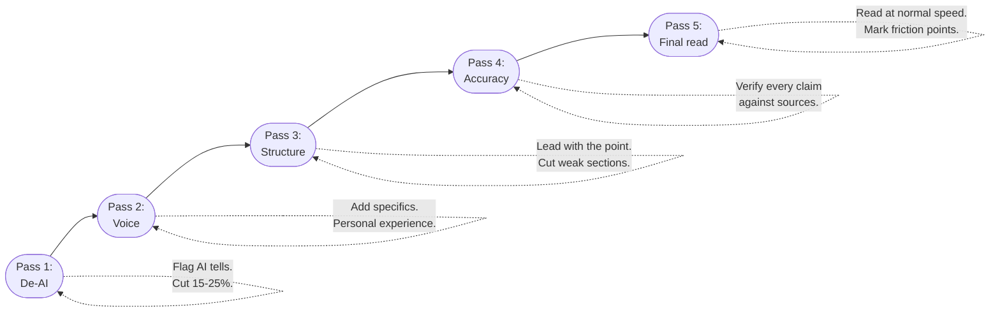

<Steps>
  <Step title="Pass 1: De-AI">
    Read specifically for AI tells. Flag and rewrite: predictable structures, em-dash overuse, nominalized verbs, hedging phrases, overly balanced tone, generic transitions, banned words. This pass often reduces word count by **15-25%** while improving quality.
  </Step>
  <Step title="Pass 2: Voice">
    Read for voice consistency. Does every paragraph sound like it was written by the target voice? Flag anything generic. Add specific details, personal experience, or surprising observations that only a human with real expertise would include.
  </Step>
  <Step title="Pass 3: Structure">
    Check argument flow. Does the piece lead with the point? Does every section earn its place? Is there logical progression, or does it meander? **Cut entire sections** if they don't advance the core argument.
  </Step>
  <Step title="Pass 4: Accuracy">
    Verify every factual claim against original sources. Check that statistics are current and correctly attributed. Verify quotes. Flag anything unsupported.
  </Step>
  <Step title="Pass 5: Final read">
    Read the whole piece at normal speed, as a reader would. Mark anything that causes you to stumble, re-read, or lose interest. Those friction points are where readers abandon the piece.
  </Step>
</Steps>

### Self-refine and iterative improvement

The [Self-Refine framework](https://arxiv.org/abs/2303.17651) (Madaan et al., 2023) demonstrated that LLMs can meaningfully improve their own output through a generate-feedback-refine loop. The process **plateaus after about 4 iterations**.

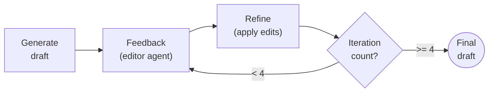

**Practical implementation:**
1. Generate the draft with your writing agent
2. Send to an "editor" agent: "Identify the 5 weakest sentences. Explain why each is weak. Suggest replacements. Flag any passages that sound like generic AI output."
3. Apply edits (automatically or with human review)
4. One more pass: "Is the opening compelling? Does it lead with the main point? Are there sentences a reader would skip?"

**Self-consistency prompting** takes a different approach: generate 3-5 independent drafts of the same section, then select or synthesize the best elements. Works particularly well for **openings and hooks**.

### Fact-checking and grounding

<CardGroup cols={3}>
  <Card title="RAG-based writing" icon="book">
    [Reduces hallucination by 42-68%](https://pmc.ncbi.nlm.nih.gov/articles/PMC12540348/). Always provide source material in the prompt rather than asking the model to recall facts. Every claim should be traceable to a specific source.
  </Card>
  <Card title="The ICE framework" icon="shield-check">
    **Instructions** (what information to use), **Constraints** (what not to claim without evidence), **Escalation** (when to flag uncertainty rather than generate a confident-sounding claim).
  </Card>
  <Card title="Verification workflow" icon="clipboard-check">
    Extract every factual claim. For each: (1) Supported by a prompt source? (2) Verifiable with search? (3) Common knowledge? Claims that fail all three: remove or flag.
  </Card>
</CardGroup>

<Info>
**On AI detection:** Tools like [GPTZero](https://gptzero.me/) achieve about 70-80% accuracy with a ~5% false positive rate. Rather than trying to evade detection, the emerging best practice is **transparency about AI use** paired with genuine human curation and editing. The market is moving toward valuing the quality of the final product regardless of tools used.
</Info>

### Quality metrics

Quantitative checks you can build into your pipeline:

| Metric | Target | Why it matters |
|--------|--------|---------------|
| **Readability** (Flesch-Kincaid) | Grade 6-8 general, 8-10 professional | Matches how people actually read on the web |
| **AI-ism frequency** | Zero banned words. Em-dashes < 1 per 500 words. | Catches the most obvious AI tells |
| **Vocabulary diversity** (type-token ratio) | Match reference samples | Human writing scores higher than AI writing |
| **Sentence length variance** (std. deviation) | Higher than AI default | Uniform length is an AI signature |
| **Paragraph length variance** | Mix of 1-sentence and 4-5 sentence paragraphs | AI tends toward uniform paragraph lengths |

<Note>
These metrics don't replace human judgment. They catch systematic issues that are easy to miss in a single read-through.
</Note>

---

## Model selection

### Current landscape (February 2026)

<CardGroup cols={2}>
  <Card title="Claude (Anthropic)" icon="message">
    Widely regarded as having "the most soul" in writing. Excels at long-form analytical and narrative content. Strong at following complex voice specifications. Ranks first on [Chatbot Arena](https://arena.ai/leaderboard/text) for both text and creative writing.

    **Best for:** Thought leadership, blog posts, newsletters, detailed analysis.
  </Card>
  <Card title="GPT-4o / o1 (OpenAI)" icon="bolt">
    Faster and punchier. Strong at technical writing, structured content, and quick-turn outputs. Good at following format specifications precisely.

    **Best for:** Product copy, technical documentation, structured content, email.
  </Card>
  <Card title="Gemini 2.5+ (Google)" icon="google">
    Competitive on creative writing benchmarks. Large context windows enable processing extensive reference material.

    **Best for:** Research-heavy writing tasks requiring synthesis of large source documents.
  </Card>
  <Card title="Open models (Llama, Mistral)" icon="microchip">
    Improving rapidly. Fine-tunable for specific voice and style. Requires more investment but offers consistency at scale.

    **Best for:** High-volume applications with consistent style needs. Worth the fine-tuning investment.
  </Card>
</CardGroup>

### Fine-tuning for writing

For organizations producing large volumes of content in a consistent voice, fine-tuning becomes cost-effective.

| Approach | What it does | When to use |
|----------|-------------|------------|
| **SFT** (Supervised Fine-Tuning) | Train on 50-200 examples of target voice. Model defaults to your voice without extensive system prompts. | Large content operations with a stable voice. |
| **[DPO](https://arxiv.org/abs/2305.18290)** (Direct Preference Optimization) | Provide pairs of outputs, label which is better. 40-75% cheaper than RLHF. | Subjective quality dimensions: tone, style, clarity. |
| **Constitutional AI** | Self-improvement against a set of principles without human labels for every example. | Enforcing style rules at scale. |

<Tip>
**Start here, scale up:** Most teams should start with prompt engineering and context engineering, move to RAG-augmented generation when they have a content library, and consider fine-tuning only when prompt engineering has hit a ceiling.
</Tip>

---

## Getting good: the learning path

### The sequence

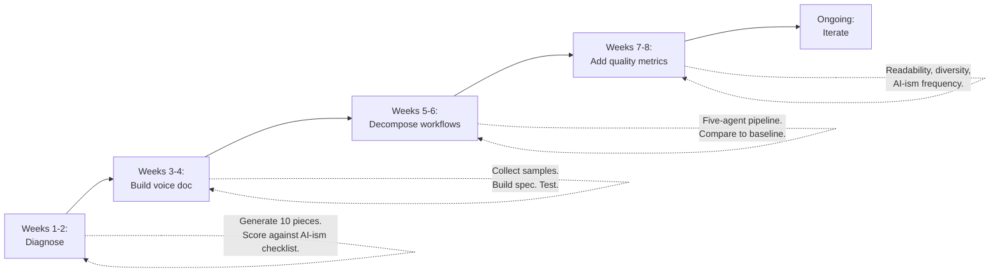

<Tabs>
  <Tab title="Beginner (0-2 weeks)">
    Start here if you're writing with basic prompts and getting mediocre results.

    1. Read the [foundations section](#why-llm-writing-feels-like-llm-writing) to understand why AI writing sounds like AI writing
    2. Read George Orwell's ["Politics and the English Language"](https://www.orwellfoundation.com/the-orwell-foundation/orwell/essays-and-other-works/politics-and-the-english-language/) (free online, 20 minutes)
    3. Build your first voice document using the template below
    4. Implement a 3-step workflow: research prompt, draft prompt, edit prompt
    5. Generate 5 pieces and score them against the quality checklist below
  </Tab>
  <Tab title="Intermediate (2-6 weeks)">
    For practitioners with basic workflows who want consistent quality.

    1. Read the [frameworks](#frameworks-and-mental-models) and [context engineering](#context-engineering-for-writing-the-details) sections in depth
    2. Study 3 style anchors in detail — read their actual writing, not summaries
    3. Build a comprehensive voice document with 5+ examples and tested anti-patterns
    4. Implement the [five-agent pipeline](#the-five-agent-writing-pipeline)
    5. Set up quality metrics (readability, AI-ism frequency, vocabulary diversity)
    6. Read *On Writing Well* by Zinsser and *Bird by Bird* by Lamott
  </Tab>
  <Tab title="Advanced (6+ weeks)">
    For teams building scalable AI writing systems.

    1. Read the [agentic workflows](#agentic-writing-workflows), [voice transfer](#voice-tone-and-style-transfer), and [post-processing](#post-processing-editing-and-quality-control) sections
    2. Implement automated quality checking in your pipeline
    3. Build a content brief system with templates for each content type
    4. Experiment with [fine-tuning (DPO)](https://arxiv.org/abs/2305.18290) if volume justifies it
    5. Study Schwartz's *Breakthrough Advertising* for persuasion architecture
    6. Build a feedback loop: publish, measure engagement, trace back to writing variables, improve prompts
    7. Read the research papers in the references below
  </Tab>
</Tabs>

### Skills that distinguish great AI-assisted writers

<CardGroup cols={3}>
  <Card title="Context curation" icon="filter">
    Selecting and structuring the right context for each task. The most important skill and hardest to teach. Requires understanding both the writing task and how LLMs process information.
  </Card>
  <Card title="Voice analysis" icon="ear-listen">
    Reading a piece and articulating what makes its voice distinctive in machine-usable terms. Not "it sounds professional" but "sentences average 11 words, every third paragraph opens with a question."
  </Card>
  <Card title="Ruthless editing" icon="scissors">
    The AI generates; you sculpt. Most people are too gentle with AI output. The best AI-assisted writers cut **20-40%** of what the model generates and add **10-20%** of their own material.
  </Card>
  <Card title="Prompt iteration" icon="code-branch">
    Treating prompts as code — versioned, tested, improved based on output quality. Keep a library of prompts that you refine continuously.
  </Card>
  <Card title="System thinking" icon="diagram-project">
    Seeing the writing pipeline as a system with inputs, transformations, and outputs. Knowing where to invest time for maximum quality improvement.
  </Card>
  <Card title="Writing craft" icon="pen-fancy">
    The fundamentals still matter. You can't edit AI output well if you can't write well yourself. See our [writing craft guide](/guides/writing/craft).
  </Card>
</CardGroup>

---

## Templates

<AccordionGroup>
  <Accordion title="Voice document template">
    ```markdown
    # [Brand/Person] Voice Specification

    ## Voice Principles (3-5 max)
    1. [Principle]: [Specific, testable definition]
    2. [Principle]: [Specific, testable definition]
    3. [Principle]: [Specific, testable definition]

    ## Style Anchors
    - [Writer 1] — [What to borrow: specific technique in 1 sentence]
    - [Writer 2] — [What to borrow]

    ## Sentence Rules
    - Average sentence length: [X] words
    - Maximum sentence length: [X] words
    - Voice: [active/conversational/etc]
    - Contractions: [yes/no]
    - Questions: [frequency guidance]

    ## Anti-Patterns (DO NOT)
    - Never use: [word list]
    - Never open with: [pattern list]
    - Never structure as: [structure list]

    ## Examples (3-5)

    ### Analytical example
    > [Paragraph in target voice]

    ### Narrative example
    > [Paragraph in target voice]

    ### Persuasive example
    > [Paragraph in target voice]

    ## Negative Example
    > DON'T WRITE LIKE THIS: [Paragraph showing what to avoid]
    > WRITE LIKE THIS INSTEAD: [Same content in target voice]
    ```
  </Accordion>
  <Accordion title="Content brief template">
    ```markdown
    # Content Brief: [Title]

    ## Audience
    - Who: [Specific reader profile]
    - What they believe: [Current assumptions]
    - What would surprise them: [Key insight]
    - Sophistication level: [1-5 with this topic]
    - Desired action: [What you want them to do after reading]

    ## Angle
    [One sentence: the specific thesis or perspective]

    ## Key Points (priority order)
    1. [Point + supporting evidence]
    2. [Point + supporting evidence]
    3. [Point + supporting evidence]

    ## Differentiation
    [What makes this different from existing content on this topic]

    ## Evidence to Include
    - [Specific stat/quote/case study]
    - [Specific stat/quote/case study]

    ## Constraints
    - Length: [word count]
    - Format: [blog/newsletter/social/etc]
    - Reading level: [grade level]
    - Forbidden: [words, phrases, approaches to avoid]

    ## Reference Pieces
    - [URL/title of piece with similar quality/voice]
    ```
  </Accordion>
  <Accordion title="Pre-publish quality checklist">
    **AI-ism check:**
    - Zero instances of banned words (delve, crucial, landscape, etc.)
    - Em-dash count < 1 per 500 words
    - No "In today's..." or "In an era of..." openings
    - No "It's important to note that..." filler
    - No rule-of-three unless intentional
    - Sentence length varies (mix of 5-word and 25-word)
    - Paragraph length varies

    **Voice check:**
    - Reads naturally aloud (Hemingway test)
    - Matches target voice examples
    - Contains specific details only a practitioner would know
    - Has at least one moment of surprise or personality

    **Structure check:**
    - Main point in first 2 sentences
    - Every paragraph earns its place
    - Can cut 20% of words without losing meaning
    - Logical progression (not a list of loosely related points)

    **Accuracy check:**
    - Every statistic traced to a source
    - Quotes verified against original
    - No claims unsupported by evidence
    - Dates and numbers double-checked

    **Engagement check:**
    - Opening creates curiosity or tension
    - Contains concrete examples or stories
    - Ends with a clear takeaway or call to action
    - Would you actually read this if you found it online?
  </Accordion>
</AccordionGroup>

---

## Further reading

### Books

| Title | Author | Key contribution |
|-------|--------|-----------------|
| On Writing Well | William Zinsser | The standard guide for clear nonfiction writing |
| Bird by Bird | Anne Lamott | The psychology of writing, "shitty first drafts" |
| On Writing | Stephen King | Craft + discipline + the door-closed/door-open method |
| [Politics and the English Language](https://www.orwellfoundation.com/the-orwell-foundation/orwell/essays-and-other-works/politics-and-the-english-language/) | George Orwell | The 6 rules for clarity |
| Several Short Sentences About Writing | Verlyn Klinkenborg | Radical sentence-level thinking |
| Breakthrough Advertising | Eugene Schwartz | 5 levels of awareness, market sophistication |
| [Scientific Advertising](https://archive.org/details/scientificadvert0000hopk) | Claude Hopkins | Data-driven persuasion, specificity, testing |
| [Influence](https://www.influenceatwork.com/7-principles-of-persuasion/) | Robert Cialdini | 7 principles of persuasion |
| [The Boron Letters](https://www.thegaryhalbertletter.com/newsletters/direct_marketing_to_a_starving_crowd.htm) | Gary Halbert | Direct-response fundamentals, the "starving crowd" |
| [Building a StoryBrand](https://www.gravityglobal.com/blog/complete-guide-storybrand-framework) | Donald Miller | The 7-part customer-as-hero framework |
| [Everybody Writes](https://annhandley.com/everybodywrites/) | Ann Handley | Writing as a professional skill and daily practice |
| The Elements of Style | Strunk & White | Foundational brevity and clarity rules |

### Key research papers

| Paper | Year | Key finding |
|-------|------|-------------|
| [PNAS: Linguistic markers of AI text](https://www.pnas.org/doi/10.1073/pnas.2422455122) | 2024 | LLMs are noun-heavy, use participial clauses at 2-5x human rate |
| [WritingBench](https://arxiv.org/abs/2503.05244) | 2025 | 6 core domains, 100 subdomains, 84% human alignment |
| [LitBench](https://arxiv.org/abs/2507.00769) | 2025 | 2,480 debiased creative writing comparisons |
| [The Unlikely Duel](https://arxiv.org/abs/2406.15891) | 2024 | LLMs slightly outperform average humans; humans keep edge in originality |
| [Self-Refine](https://arxiv.org/abs/2303.17651) | 2023 | Generate-feedback-refine loop, plateaus after 4 iterations |
| [EmotionPrompt](https://arxiv.org/abs/2307.11760) | 2024 | Emotional context improves output by 10.9% average |
| [Human-AI Co-Writing](https://www.nature.com/articles/s41598-024-69423-2) | 2024 | Co-creators outperform editors in creativity |
| [RAG Hallucination Reduction](https://aclanthology.org/2021.findings-emnlp.320.pdf) | 2024 | RAG reduces hallucination by 42-68% |
| [DPO](https://arxiv.org/abs/2305.18290) | 2023 | 40-75% cheaper than RLHF for preference alignment |

### Practitioner sources

| Source | Author | Why it matters |
|--------|--------|---------------|
| [One Useful Thing](https://www.oneusefulthing.org/) | Ethan Mollick | Rigorous, practical AI integration advice |
| [Simon Willison's Blog](https://simonwillison.net/) | Simon Willison | Deep technical understanding of LLM capabilities |
| [Every](https://every.to/on-every/introducing-spiral) | Dan Shipper | AI-native writing workflows and the future of writing |
| [Lenny's Newsletter](https://www.lennysnewsletter.com/) | Lenny Rachitsky | Content strategy that scales |
| [VeryGoodCopy](https://www.verygoodcopy.com/microlessons) | Eddie Shleyner | 207 micro-lessons on copywriting craft |
| [Copyhackers](https://copyhackers.com/) | Joanna Wiebe | Research-driven conversion copywriting |

### Tools

| Tool | Use case |
|------|----------|
| [Hemingway Editor](https://hemingwayapp.com/) | Readability analysis, sentence complexity |
| Grammarly | Grammar, clarity, AI-assisted rewriting |
| ProWritingAid | Deep writing analysis (20 reports), best for long-form |
| [Originality.ai](https://originality.ai/) | AI detection and plagiarism checking |
| [GPTZero](https://gptzero.me/) | AI detection (academic focus) |
| [CrewAI](https://docs.crewai.com/) | Multi-agent workflow orchestration |
| LangChain / LangGraph | LLM application framework with agent support |
| [Spiral](https://every.to/on-every/introducing-spiral) | Voice-memo-to-draft workflow (Dan Shipper) |

---

This guide synthesizes research from 1,000+ sources including academic papers, practitioner blogs, platform documentation, books, and expert interviews. For the latest developments, follow the practitioner blogs listed above and track benchmark updates on [Chatbot Arena](https://arena.ai/leaderboard/text) and [WritingBench](https://github.com/X-PLUG/WritingBench).
