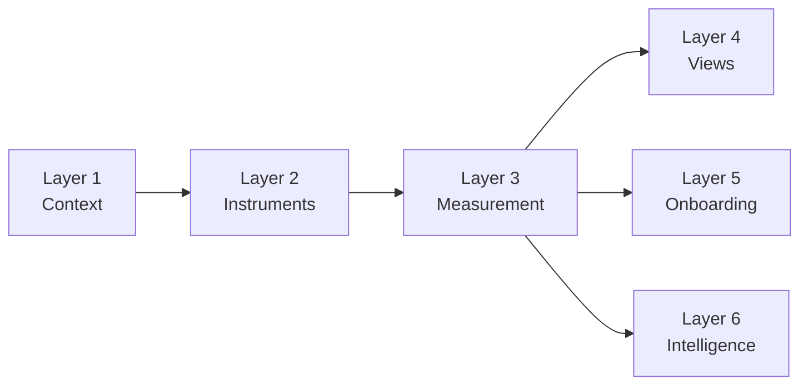

<metadata>
purpose: The six-layer architecture that takes CheckThat from visibility dashboard to AI brand research platform.
source: https://handbook.growthx.ai/products/checkthat/architecture
sync_type: auto
access: build-team
last_synced: 2026-03-02
</metadata>

# CheckThat architecture

## The big idea

CheckThat doesn't monitor prompts. It surveys AI engines the way brands survey consumers.

Brand research has established disciplines: brand tracking, awareness surveys, NPS. They all work the same way — you define what truth looks like, you build instruments to probe perception, and you measure the gap between truth and perception over time.

CheckThat does this for AI. The "consumers" are AI engines. The "survey questions" are prompts. The "perception" is what ChatGPT, Perplexity, Claude, and Gemini say when buyers ask about your category.

| Brand research | CheckThat equivalent |
|----------------|---------------------|
| Survey population | AI engines (ChatGPT, Perplexity, Claude, Gemini, Google) |
| Survey questions | Prompts |
| Sample size | Number of runs per prompt (30-100+) |
| Survey wave | Tracking cadence (daily/weekly) |
| Brand awareness % | Presence Score |
| Brand favorability | Reputation Score |
| Perception survey | Perception Score (6 attributes) |
| Media influence | Influence Score |

The killer insight: **no other AEO tool measures the narrative AI constructs about your brand across buyer-relevant attributes — and compares it against your truth.** They show you mentions. We tell you if AI is *right*, and where to fix it.

---

## Three foundational layers

The ontology defines three layers. Every feature in CheckThat lives inside one of them.

### Layer 1: Context — the answer key

What IS true about your brand, your market, your buyers. This is the answer key that everything else is measured against.

Seven elements make up a complete brand answer key:

| Element | What it captures |
|---------|-----------------|
| Company | Name, description, founding, stage, size |
| Products | What you sell, key features |
| Positioning | How you want to be perceived |
| Pricing | Plans, price points, model |
| Differentiators | What makes you different (claimed) |
| Target personas | Who buys, roles, pain points |
| Competitor context | Competitors with their positioning |

Beyond brand context, two additional context types complete the picture:

- **Market context** — the competitive landscape, category definition, how the market is evolving, a map of all brands in the category.
- **Buyer context** — buyer personas, buying criteria, buying journey, key questions by stage. This is what connects "we sell expense management software" to "CFOs at mid-market SaaS companies ask about the best expense tool for their size."

A completeness score (0-100%) tracks how much of the answer key is filled. More context means more accurate alignment insights.

### Layer 2: Instruments — the classified survey

Prompts aren't random questions. They're research instruments, classified for analysis. Six independent axes classify every prompt:

| Axis | What it captures | Example values |
|------|-----------------|----------------|
| Market (WHERE) | Category + topic | Category, subcategory, topic cluster |
| Intent (WHAT action) | Cognitive action the buyer performs | Learn, Explore, Compare, Validate, Act |
| Buyer Stage (WHEN) | Where in the purchasing process | Problem Recognition, Solution Exploration, Evaluation, Decision, Post-Purchase |
| Question Type (WHAT kind) | Structural category | 16 types: Problem Definition, Direct Comparison, Best-of-Category, Pricing & Cost, etc. |
| Context Modifiers (WHO) | Buyer context that shapes the question | Industry, Company Size, Buyer Role, Use Case, Geography, Tech Stack, Budget, Timeline |
| Measurement Purpose (WHY) | What this prompt is designed to reveal | Recall, Sentiment, Alignment, Competitive Position |

Without classification, prompts are a wall of text. With it, you can ask "how are we doing on comparison prompts in the evaluation stage?" or "are we covering the healthcare segment?"

Every prompt also gets a quality score across five dimensions: Buyer Realism, Commercial Intent, Measurement Value, Competitive Differentiation, and Volume Proxy. This creates priority tiers so the team knows what matters most.

### Layer 3: Measurement — what we learn

The intelligence extracted from AI responses. Four scores map to established brand research:

- **[Presence](/products/checkthat/presence)** — does AI recommend us? Evaluation-stage, unaided only. Measures whether AI includes you in buyer shortlists when your name isn't in the prompt. Tiered scoring: presence rate (70%), stability, position, source control, cross-engine coverage.
- **[Reputation](/products/checkthat/reputation)** — what does the world think? External market signals from review platforms, community, and press coverage. Reputation is the INPUT that feeds AI's perception. Sub-metrics: review platform signal, community signal, authority signal.
- **[Perception](/products/checkthat/perception)** — what story does AI tell? The narrative AI constructs, scored across six buyer-relevant attributes: Capability, Usability, Value, Trust, Support, Innovation. Each 0-10, composited into 0-100. When brand context is populated, each attribute also checks accuracy — feature accuracy under Capability, pricing accuracy under Value, positioning under Innovation.
- **[Influence](/products/checkthat/influence)** — how much impact can we have? The diagnostic score. Measures how much control you have over the other 3 scores — internal (your content's citation authority) vs external (third-party sources driving AI's perception).

Composite scores summarize everything:
- **AI Brand Health** — weighted average of all 4 scores (default: equal 25/25/25/25). The NPS of AI visibility.
- **AI Share of Voice** — your presence vs competitors across the same prompts.
- **AI Endorsement** — how strongly AI advocates for your brand when buyers ask for recommendations.

Lift is a cross-cutting trend layer applied to all 4 scores — temporal trend, competitive shift, cross-engine spread, and content lift. It's not a score itself; it's how all scores move over time.

---

## Three experience layers

The first three layers are the *engine* (backend, workflows, data model). The next three are the *experience* (frontend, UX, communication).

### Layer 4: Views — how users see the data

Measurement without visualization is just a database. Six views turn data into understanding:

- **The Score** — AI Brand Health Score front and center. One number, trend arrow, sparkline. Presence, Reputation, Perception, and Influence as cards below. Competitive comparison.
- **Presence view** — evaluation-stage visibility by buyer stage, position distribution, cross-engine breakdown, stability over time, source control (domain citation share).
- **Reputation view** — external market signals. Review platform scores, community sentiment, authority signal. Gap analysis vs Perception.
- **Perception view** — the six attributes: Capability, Usability, Value, Trust, Support, Innovation. Attribute-level drill-downs. Misalignment flags when brand context is populated.
- **Influence view** — internal vs external split. Source map, citation share, source authority rank, signal concentration.
- **Lift view** — all-scores trend line, competitive movement, cross-engine spread changes.
- **Coverage view** — buyer stage heatmap, question type distribution, topic cluster map. Shows where you're visible and where you're invisible.

### Layer 5: Onboarding — value in 3 minutes

The best B2B onboarding shows you value first and asks you to confirm, not construct.

Our advantage: we already track 5,828+ brands. For most B2B SaaS companies, we have data before they sign up.

The target flow:

| Step | What happens | Time |
|------|-------------|------|
| Enter brand | User enters domain or company name | 15s |
| "Here's what we know" | Auto-generated context shown for confirmation. Toggles, not forms. | 30s |
| "Here's how AI sees you" | The wow moment. Recall rate, competitor comparison, misalignment flags, engine breakdown. | 30s |
| "Here's what to track" | Top 20 prompt suggestions by priority. One-click "Start tracking all." | 30s |
| You're live | Dashboard populated. Custom prompts activated. First tracking run scheduled. | — |

The critical shift: steps 2 and 3 deliver value instead of asking for work. "Here's what we already know about your market — is this right?" instead of "Tell us about your market."

### Layer 6: Intelligence — what to do about it

The "so what?" layer. Users can see data. They need to understand what it means and what action to take.

**Weekly intelligence reports** include:
- Score summary — AI Brand Health this week vs last, sub-scores with directional change.
- Significant changes — automated change detection that filters noise. Recall changes, sentiment shifts, alignment gaps, competitive movements.
- Action recommendations — pattern-matched from the methodology playbook. Each significant change maps to a specific content action.

| What happened | What to do |
|---------------|-----------|
| Not appearing in "[X] vs [Y]" | Create a definitive comparison page |
| AI citing incorrect information | Update the relevant page, add schema markup |
| Mentioned but not cited | Improve content structure, lead with answers |
| Strong early-stage but disappearing in evaluation | Build deeper evaluation-stage content |

Without intelligence, CheckThat is a dashboard. With intelligence, it's an advisor that says "your pricing alignment dropped 20% — AI is citing old pricing on 3 engines — update your pricing page."

---

## How the layers connect

Each layer depends on the ones before it. Context feeds instruments. Instruments feed measurement. Measurement feeds everything else.

The critical path: **Context → Measurement → Views → Onboarding wow moment**. The bottleneck is the measurement engine — views can't show meaningful data without it, and the onboarding wow moment needs scores to display.

Layers 1-3 are the engine. They can be built and validated before the experience ships on top. Layers 4-6 are the experience. They make the engine useful.

<Tip>
The architecture turns CheckThat from "a visibility dashboard that shows mentions" into "an AI brand research platform that tells you if AI is right about you — and what to do when it isn't."
</Tip>
