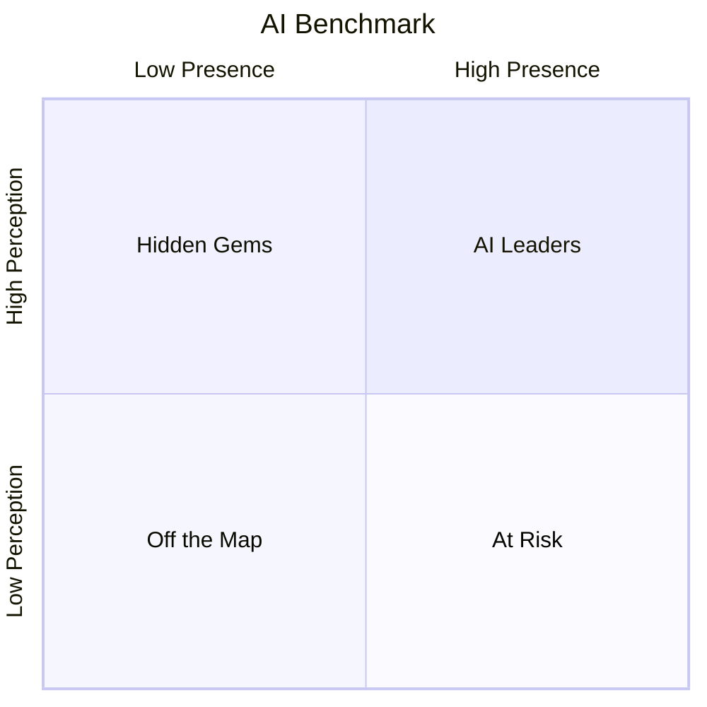

<metadata>
purpose: The open, per-category visualization of how AI sees every brand — two axes, four quadrants, updated continuously.
source: https://handbook.growthx.ai/products/checkthat/benchmark
sync_type: auto
access: build-team
last_synced: 2026-03-02
</metadata>

# CheckThat AI Benchmark

## What it is

The CheckThat AI Benchmark is our signature category visualization. Two axes, four quadrants, dot size for market reputation, and trend arrows for momentum. One chart that shows every brand in a category and how AI perceives them.

Gartner measures how analysts see you. G2 measures how users see you. The CheckThat AI Benchmark measures how AI sees you — and AI is where 94% of B2B buyers now start their research.

Every major evaluation framework uses two primary axes. Gartner: Ability to Execute vs Completeness of Vision. Forrester: Current Offering vs Strategy. G2: Satisfaction vs Market Presence. The structure is universal because it works — it compresses complex evaluation into an instantly readable chart.

The CheckThat AI Benchmark follows the same structure but measures a surface none of them can touch. Both axes are AI-native. No analyst firm, review platform, or competitor tool can produce either axis — because no one else surveys AI engines at scale, tracks brand mentions across evaluation-stage prompts, and classifies AI narratives across buyer-relevant attributes.

---

## The axes

**X-axis: [Presence Score](/products/checkthat/presence) (0-100)** — When buyers are evaluating solutions and ask AI for recommendations without naming you, does AI include you? Always unaided, always evaluation-stage. The Presence Score uses a tiered component model where visibility rate is the foundation (70%) and durability, recommendation quality, source control, and engine coverage modulate the score. The scale is intentionally hard — scoring above 60 requires roughly 75%+ visibility rate with strong quality signals across all dimensions.

**Y-axis: [Perception Score](/products/checkthat/perception) (0-100)** — What story does AI tell about your brand? Scored across six attributes: Capability, Usability, Value, Trust, Support, Innovation. Each 0-10, composited into 0-100.

Together: Presence asks *are you in the conversation?* Perception asks *is the conversation any good?* A brand needs both.

---

## The four quadrants

### AI Leaders (top-right)

High Presence + High Perception. AI mentions you frequently during buyer evaluation and tells a strong story when it does.

**What it means:** You've earned AI's trust on both dimensions. Buyers using AI to evaluate your category will find you and hear a compelling narrative.

**What to do:** Defend. Track weekly for stability. Watch for competitors gaining ground. Keep brand context current so the AI narrative doesn't go stale.

### At Risk (bottom-right)

High Presence + Low Perception. AI mentions you a lot but the narrative is weak. Maybe you're the "old guard" that gets mentioned but described as legacy. Maybe AI surfaces pricing concerns or feature gaps.

**What it means:** High visibility with a bad story is arguably worse than low visibility — buyers find you and hear reasons not to choose you. **This is the most urgent quadrant to fix.**

**What to do:** Use [Perception](/products/checkthat/perception) attribute scores to identify which of the 6 attributes are dragging you down. Use [Influence](/products/checkthat/influence) data to find which sources feed the bad story. Fix your content and inaccurate external sources.

### Hidden Gems (top-left)

Low Presence + High Perception. When AI does mention you, it says great things. But it rarely mentions you during evaluation.

**What it means:** Your content is good enough that when AI finds it, AI tells a compelling story. You just haven't built enough signal for AI to volunteer your name. **This is the opportunity quadrant** — the hardest part (building a great narrative) is already done.

**What to do:** Solve the distribution problem. Build third-party citations (Reddit, G2, press, guest posts). Implement schema markup. Create comparison and "best of" content AI can cite.

### Off the Map (bottom-left)

Low Presence + Low Perception. AI doesn't know you exist, and when it does find you, the story isn't compelling.

**What it means:** This is where most brands start. It's not a judgment — it's a starting position. Under the tiered Presence scoring, most B2B categories will have the majority of brands below 60 on Presence — including category leaders in enterprise and niche verticals. This is by design. The AI Benchmark shows where AI actually is, not where we wish it was.

**What to do:** Build [Reputation](/products/checkthat/reputation) first. Get reviews on G2 and Capterra. Participate on Reddit. Get press coverage. AI learns from these sources. As external credibility builds, Presence follows.

---

## The third and fourth dimensions

### Dot size = [Reputation Score](/products/checkthat/reputation)

What the external market thinks, independent of AI. Two brands in the same quadrant tell different stories based on dot size:

| Quadrant + Dot Size | What it means |
|---|---|
| AI Leader + big dot | The complete package. AI recommends you, describes you well, AND the market agrees. |
| AI Leader + small dot | Winning in AI but the market hasn't caught up. Fragile if AI models retrain. |
| Hidden Gem + big dot | The market loves you but AI doesn't recommend you yet. Biggest opportunity — the signal is there, AI hasn't picked it up. |
| Off the Map + big dot | Market reputation exists but isn't translating to AI. Technical AEO problem, not a brand problem. |

### Trend arrows = 30-90 day movement

Direction and magnitude of change. A brand moving toward the top-right is improving. A brand moving toward the bottom-left is losing ground.

A Hidden Gem with an arrow pointing right is about to become an AI Leader. An AI Leader with an arrow pointing down is about to become At Risk.

---

## How it maps to the four scores

| Score | Role in the AI Benchmark |
|---|---|
| **[Presence](/products/checkthat/presence)** | X-axis position |
| **[Perception](/products/checkthat/perception)** | Y-axis position |
| **[Reputation](/products/checkthat/reputation)** | Dot size |
| **[Influence](/products/checkthat/influence)** | Not on the visualization — it's the diagnostic layer underneath that explains WHY you're where you are |

Influence is deliberately excluded from the public visualization. It's the "what to do about it" score, not the "where you are" score. When a brand asks "why am I in the At Risk quadrant?" — Influence tells them whether the problem is their own content, a third-party source, or AI hallucination.

---

## How it's published

**Per category.** Like Gartner publishes a Magic Quadrant per market, CheckThat publishes an AI Benchmark per category. "The CheckThat AI Benchmark for Expense Management." Every brand in the category plotted on the same chart.

**Updated continuously.** Not annually like Gartner. Not quarterly like G2. The AI Benchmark reflects live data — updated as new probes run and new responses are captured.

**Public and free.** No paywall. No $30,000-$45,000 reprint fees. The AI Benchmark lives on CheckThat's category pages as part of the open index. Anyone can see where any brand sits. Transparency is the positioning.

**Shareable.** Brands can earn and display their position: "AI Leader on the CheckThat AI Benchmark 2026." Badges for websites, press releases, and LinkedIn.

<Tip>
AI Brand Health is what you check on Monday morning. The AI Benchmark is what you put in board decks and on your website.
</Tip>
