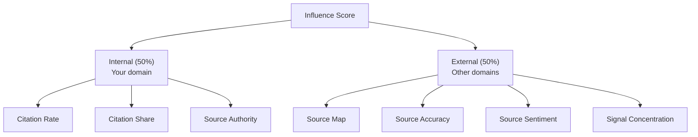

<metadata>
purpose: How much impact can you have? The diagnostic score that measures source control, citation authority, and actionability across all other scores.
source: https://handbook.growthx.ai/products/checkthat/influence
sync_type: auto
access: build-team
last_synced: 2026-03-02
</metadata>

# Influence Score

## The question

How much impact can I have on my Presence, Reputation, and Perception?

**Brand research analog:** No direct equivalent. Closest: earned media influence, share of voice by source, brand narrative control.

**Score type:** Control — measures your leverage over the other 3 scores

The other three scores measure *what's happening*. Influence measures *what you can do about it*.

## Why Influence exists

Without Influence, a user sees: "Your [Perception](/products/checkthat/perception) Score is 45." They don't know where to start.

With Influence, they see: "Your Perception Score is 45. 72% of AI's information about you comes from an outdated G2 review from 2024. Your own domain accounts for only 8% of citations. Fix your G2 profile first, then improve your own content's citability."

Influence turns monitoring into action. It's the diagnostic metric that connects every other score to a specific fix.

## Two dimensions

Influence splits into **Internal** (your domain's influence on AI) and **External** (third-party domains' influence on AI). Together they explain where AI gets its information about you and how much control you have over the narrative.



---

## Internal Influence — your domain

How much weight your own content carries in shaping AI's perception.

### Own-Domain Citation Rate

When AI talks about you, does it reference YOUR content?

```
Own-Domain Citation Rate = (citations to your domain / total probes mentioning your brand) x 100
```

The most direct measure of internal influence. High own-domain citation rate means AI trusts your content. When you update your pricing page, AI's pricing answer will eventually follow.

<Note>
**Own-Domain Citation Rate vs. Source Control:** The [Presence Score](/products/checkthat/presence) includes a Source Control tier that also uses citation data but measures something different. Source Control = your domain's citations / all responses with any citation in your category. It's a **competitive share metric** — "of all citations in the category, how many are yours?" Own-Domain Citation Rate is a **brand-specific diagnostic** — "when AI talks about YOU, does it cite your content?" Both matter. Source Control tells you your competitive position in the citation landscape. Own-Domain Citation Rate tells you how much of your own narrative you control.
</Note>

### Own-Domain Citation Share

Your citations as a percentage of ALL citations in responses about you.

```
Own-Domain Citation Share = (citations to your domain / total citations in responses about you) x 100
```

AI might cite 5 sources when answering about you. If 3 are yours, you have 60% citation share — strong internal influence. If 0 are yours, AI's description of you is built entirely from third-party sources. You have no direct lever.

### Source Authority Rank

Where your domain ranks among all cited sources in your category.

```
Aggregate all citations across all prompts in your category.
Rank domains by citation frequency.
Output: your rank position among all domains.
```

Top 5 = strong source authority. Top 20 = moderate. Not ranked = AI doesn't consider your domain a source in your category.

---

## External Influence — other domains

Which third-party sources shape AI's narrative about you, and whether they're helping or hurting. These are the same sources that compose your [Reputation Score](/products/checkthat/reputation) — but here we measure their individual impact on AI's output.

### Third-Party Source Map

Which external domains drive AI's perception of you?

```
Example output:
  G2:            34% of external citations about you
  Reddit:        22%
  TechCrunch:    15%
  Competitor X:  12%
  Wikipedia:      8%
  Other:          9%
```

Directly actionable. If G2 drives 34% of AI's perception, your G2 profile matters enormously. If a competitor's blog drives 12%, that's a threat you can counter.

### External Source Accuracy

Are third-party sources saying correct things about you?

```
Cross-reference content of top external sources against brand context.

Example output per source:
  G2:         73% accurate (pricing outdated, features correct)
  Reddit:     45% accurate (mixed opinions, some misinformation)
  TechCrunch: 91% accurate (recent article, facts correct)
```

This connects Influence to [Perception](/products/checkthat/perception). If your Perception score is low, this metric tells you whether the problem is YOUR content (internal) or THIRD-PARTY content (external). Different diagnosis, different remedy.

### External Source Sentiment

Are third-party sources positive or negative about you?

```
Example output per source:
  G2:         Positive (4.2/5 rating reflected in citations)
  Reddit:     Mixed (positive on features, negative on pricing)
  Competitor: Negative (positions you as inferior alternative)
```

### Signal Concentration

How concentrated is external influence?

```
Signal Concentration = (citations from top source / total external citations) x 100
```

High concentration (>50% from one source) = single point of failure. If that one G2 review changes, your entire AI narrative shifts. Low concentration = more resilient but harder to influence strategically.

## How the composite is calculated

```
INTERNAL INFLUENCE (50% weight):
  Own-Domain Citation Rate:  40% of internal
  Own-Domain Citation Share: 35% of internal
  Source Authority Rank:     25% of internal

EXTERNAL INFLUENCE (50% weight):
  Source Map Diversity (inverse of Signal Concentration): 30% of external
  External Source Accuracy:                               40% of external
  External Source Sentiment:                              30% of external

INFLUENCE SCORE =
  (Internal Influence x 0.50) + (External Influence x 0.50)

Scale: 0-100
```

## Score interpretation

| Range | Meaning |
|---|---|
| 80-100 | Strong influence. High citation rates from owned content. Changes you make will flow through to AI. |
| 60-79 | Moderate influence. Some authority but significant third-party dependency. |
| 40-59 | Limited influence. AI shaped more by external sources than your content. |
| 20-39 | Weak. Almost no owned-content citation. External sources dominate. |
| 0-19 | No influence. AI has no reliable source. Perception is essentially hallucinated. |

## The diagnostic matrix

Influence's real power is in diagnosis. Cross any score with Influence to understand cause and action:

| Situation | Diagnosis | Action |
|---|---|---|
| Low [Presence](/products/checkthat/presence) + Low Internal Influence | AI has no source material from you | Establish source authority from scratch — build comprehensive content that AI can cite |
| Low [Perception](/products/checkthat/perception) + High Internal Influence | Your own content is misleading AI | Fix your content — pricing pages, feature descriptions, positioning |
| Low Perception + High External Influence | Third parties are misleading AI | Fix external sources — update G2 profile, engage in Reddit threads, correct Wikipedia |
| Low Perception + Low Influence overall | AI is hallucinating with no reliable source | Build both owned and third-party content simultaneously |
| High Presence + Low Internal Influence | Mentioned but your content isn't cited. The Presence tier breakdown will show high Visibility but low Source Control. | Technical AEO problem — improve crawlability, add schema markup. Build citeable content (comparisons, "best of" lists) to strengthen Source Control. |
| Good scores + High Signal Concentration | Strong but fragile — dependent on one source | Diversify citation sources before that one source changes |

## Building Influence

### Internal Influence actions

| Action | Impact | Timeline |
|---|---|---|
| **Content structure for AI** | Answer-first format, standalone sections, schema markup | One-time setup + maintenance |
| **Structured data** | JSON-LD schema: Organization, Product, FAQPage, HowTo (0.68 correlation with citation) | One-time setup |
| **Semantic HTML** | Proper heading hierarchy, semantic elements (0.65 correlation) | One-time setup |
| **Content freshness** | 90-day refresh cycle for key pages (65% of citations from &lt;1yr content) | Quarterly |
| **Comprehensive coverage** | Multi-angle content covering topics fully (0.87 correlation with citation) | Ongoing |

### External Influence actions

| Action | Impact | Timeline |
|---|---|---|
| **G2 profile** | Active review management — 8.25% of ChatGPT evaluation citations | Ongoing |
| **Reddit presence** | Authentic participation in relevant subreddits — 40%+ of Perplexity citations | Weekly |
| **Wikipedia** | Accurate, current page — 12.1% of ChatGPT citations | 3-6 months |
| **Press coverage** | PR, guest posts, analyst relationships | Monthly |
| **Brand search volume** | Brand awareness campaigns — strongest single predictor of AI visibility (0.334 correlation) | Ongoing, compounds over time |
