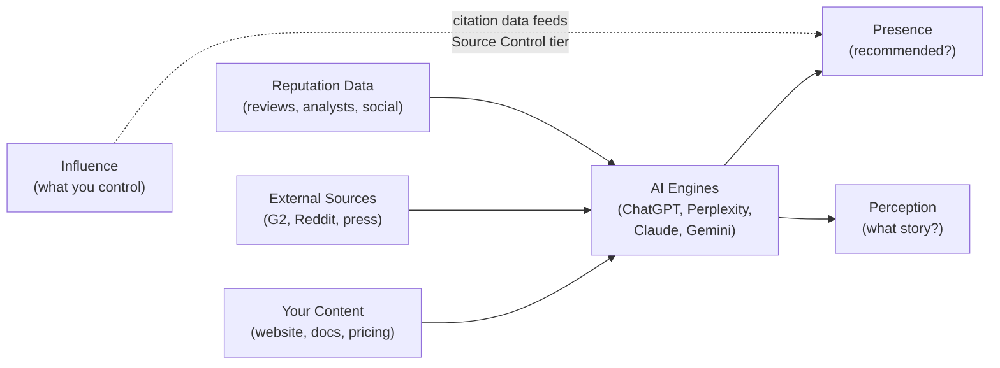

<metadata>
purpose: Four scores, one framework — how CheckThat measures AI brand perception using brand research principles.
source: https://handbook.growthx.ai/products/checkthat/methodology
sync_type: auto
access: build-team
last_synced: 2026-03-02
</metadata>

# CheckThat methodology

## The framework

CheckThat surveys AI engines the way brands survey consumers.

Brand research has established disciplines — brand tracking, awareness surveys, NPS. They all work the same way: define what truth looks like, build instruments to probe perception, measure the gap between truth and perception over time.

CheckThat does this for AI. The "consumers" are AI engines. The "survey questions" are prompts. The "perception" is what ChatGPT, Perplexity, Claude, Gemini, and Google say when buyers ask about your category.

94% of B2B buyers now use LLMs during their buying process. Half start in a chatbot before they touch Google. The brands that win the AI recommendation are the ones that show up, get described correctly, and have leverage over the narrative.

## Four scores, four questions

Every brand needs to answer four questions about their AI presence. Each question maps to a score.

| Score | Question | What it measures | Type |
|---|---|---|---|
| **Presence** | When buyers evaluate, does AI recommend you? | Whether AI includes you in evaluation-stage answers where buyers don't name you. Tiered scoring: visibility rate (70%), durability, position, source control, coverage. | Output |
| **Reputation** | What does the world think? | External market signals — reviews, press, community, analysts | Input |
| **Perception** | What story does AI tell about you? | The narrative AI constructs across 6 buyer-relevant attributes | Output |
| **Influence** | How much impact can I have? | Your leverage over the other 3 scores — source control, citation authority, actionability | Control |

The first three are **what's happening**. Influence is **what you can do about it**.

### How the scores relate

Reputation feeds AI. Perception is what comes out. Presence is whether you show up at all. Influence measures how much leverage you have over the entire chain — and citation data from Influence feeds directly into Presence's Source Control tier.

### Why this framework exists

Every AEO tool on the market measures roughly the same thing: "Are you mentioned in AI?" They count mentions, track keywords, show you a dashboard. That's visibility — and it's the least interesting question you can ask.

Visibility alone is meaningless. A brand can be "visible" because AI mentions it in an awareness-stage explainer. Or because a buyer asked about it by name. Or because it appeared 5th in a comma-separated list with a caveat. None of that tells you whether AI is actually helping you win deals.

The framework borrows from brand research because brand research already solved this problem for a different surface. For decades, brands haven't asked "does the consumer know our name?" and stopped there. They measure *awareness* (do they think of us unprompted?), *favorability* (what do they think?), *accuracy* (do they understand us correctly?), and *influence* (what shapes their perception?). Those are the questions that matter for AI too.

**What other AEO tools measure vs what CheckThat measures:**

| What others do | What CheckThat does | Why it matters |
|---|---|---|
| Count AI mentions across all contexts | Measure Presence during **evaluation only**, unaided only | Buyers build shortlists at the evaluation stage. Awareness-stage mentions don't win deals. |
| Show sentiment (positive/negative) | Score Perception across **6 buyer-relevant attributes** | "Positive sentiment" doesn't tell you what to fix. Knowing your Trust score is 4/10 while Capability is 8/10 does. |
| No concept of accuracy | Compare AI's narrative against **your brand context** (the answer key) | If AI says your pricing is $99/mo but it's actually $249/mo, that costs you deals. Only CheckThat catches this. |
| No source analysis | Map **which sources drive AI's perception** and whether they're accurate | Knowing your score is low isn't enough. Knowing it's low because an outdated G2 review drives 34% of AI's citations — that's actionable. |
| Snapshot data | Separate what's happening (Presence, Reputation, Perception) from **what you can do about it** (Influence) | Most tools tell you the score. CheckThat tells you where the lever is. |

The result: four scores that a CMO can understand in 30 seconds and act on in a week, built on the same principles that power the brand research industry — applied to the surface that now matters most.

---

## The four scores

Each score has a dedicated deep-dive page with full sub-metrics, calculation formulas, scoring rubrics, diagnostic patterns, and actionable recommendations.

<CardGroup cols={2}>
  <Card title="Presence" icon="radar" href="/products/checkthat/presence">
    **When buyers evaluate, does AI recommend you?** The foundational score — unaided, evaluation-stage AI visibility. Tiered scoring: Presence Rate (70%), Stability, Position, Source Control, Cross-Engine Coverage.
  </Card>
  <Card title="Reputation" icon="star" href="/products/checkthat/reputation">
    **What does the world think?** The input score — external market signals from reviews, press, community, and analysts. The raw material AI learns from.
  </Card>
  <Card title="Perception" icon="brain" href="/products/checkthat/perception">
    **What story does AI tell about you?** The heart of CheckThat — six buyer-relevant attributes (Capability, Usability, Value, Trust, Support, Innovation) scored from AI-generated narrative.
  </Card>
  <Card title="Influence" icon="sliders" href="/products/checkthat/influence">
    **How much impact can I have?** The control score — measures source control, citation authority, and actionability. Turns monitoring into action.
  </Card>
</CardGroup>

### Quick reference

| Score | Question | Type | Key insight |
|---|---|---|---|
| **[Presence](/products/checkthat/presence)** | Does AI recommend you during evaluation? | Output | Must be non-zero before other scores matter |
| **[Reputation](/products/checkthat/reputation)** | What does the world think? | Input | The raw material AI learns from — feeds Perception |
| **[Perception](/products/checkthat/perception)** | What story does AI tell? | Output | 6 attributes scored 0-10 with accuracy checking against brand context |
| **[Influence](/products/checkthat/influence)** | How much can I change? | Control | Connects every score to a specific fix |

---

## Composite scores

Three headline numbers that summarize everything for leadership.

### AI Brand Health

The NPS of AI visibility. One number (0-100) that goes on the dashboard, in board decks, and in LinkedIn posts.

Weighted average of all 4 scores. Default: equal (25/25/25/25), configurable per workspace. The Presence Score uses a tiered component model that produces a harder scoring curve — a category leader at 33% visibility might score Presence 32. This is deliberate: AI Brand Health is hard to achieve without genuine AI visibility.

| Score | Rating | What it means |
|---|---|---|
| 80+ | Strong | AI knows you, describes you accurately, and you have the levers to maintain it |
| 60-79 | Moderate | AI knows you but has gaps in accuracy or source control |
| 40-59 | Needs Work | Significant issues in one or more dimensions |
| Under 40 | Critical | AI doesn't know you, misrepresents you, or you have no control |

### AI Share of Voice

Your presence vs competitors across the same prompts. Combines Visibility Share, Citation Share, and Position-Weighted Share. The metric marketing teams present to leadership: "We have 23% AI Share of Voice, up from 18% last quarter."

### AI Endorsement

How strongly AI advocates for your brand when buyers ask for recommendations. Combines Recommendation Strength (40%), Position Score (25%), Narrative Frame (20%), and Comparative Framing (15%). A high score means AI champions your brand.

---

## Lift — the trend layer

Lift is not a score. It's a meta-layer applied to all 4 scores.

| Dimension | What it shows |
|---|---|
| **Temporal Trend** | Is each score Improving, Stable, or Declining? With magnitude and confidence. |
| **Competitive Shift** | Are you gaining ground, holding steady, or losing ground vs competitors? |
| **Cross-Engine Spread** | Are you appearing on more engines (Expanding), the same (Stable), or fewer (Contracting)? |
| **Content Lift** (v2) | Metric changes correlated with content publication dates — the brand lift study analog. |

---

## Score relationships

The 4 scores are related but independent. The gaps between them are diagnostic:

| Pattern | What it means | Priority action |
|---|---|---|
| High Presence + Low Perception | AI mentions you but gets the story wrong | Fix content accuracy and positioning |
| High Presence + Low Reputation | AI mentions you but the world's opinion is weak | Invest in reviews, press, community |
| High Presence + Low Source Control | Visible but fragile — third parties control your narrative | Build owned citeable content: "best of" lists, comparison pages, technical guides |
| High Reputation + Low Presence | The world loves you but AI doesn't mention you | Technical AEO — content structure, schema |
| High Reputation + Low Perception | Strong external signals but AI misinterprets them | Adjust content for AI consumption |
| High Perception + Low Influence | AI tells a good story but you can't maintain it | Build owned-content authority before a source shift breaks it |
| Low Everything | Starting from scratch | Build Reputation first. Then Presence. Perception and Influence follow. |

<Tip>
Four questions. Four scores. One framework. Do you exist in AI? What does the world think? What story does AI tell? How much impact can I have? Everything else is a drill-down.
</Tip>
