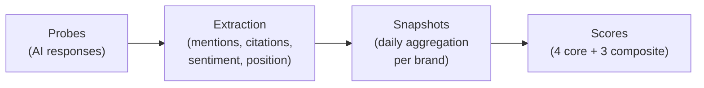
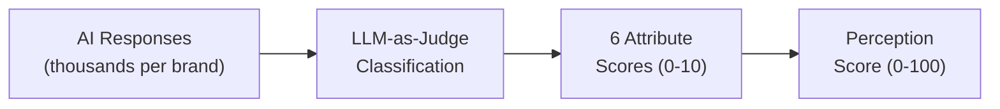

<metadata>
purpose: How every CheckThat metric is calculated — formulas, data sources, weights, and aggregation for all four scores and three composites.
source: https://handbook.growthx.ai/products/checkthat/metrics
sync_type: auto
access: build-team
last_synced: 2026-03-02
</metadata>

# Metrics & calculations

## How the scoring pipeline works

Raw AI responses become scores through a four-stage pipeline:



Every day, CheckThat sends prompts to five AI engines (ChatGPT, Perplexity, Claude, Gemini, Google AI Overviews). Each response is analyzed for brand mentions, citation URLs, sentiment, and mention position. These raw signals are aggregated into daily snapshots per brand, then composed into scores.

---

## Presence Score

**Question:** When buyers evaluate, does AI recommend you?

**Data source:** AI probe responses to evaluation-stage, unbranded prompts

**Scale:** 0-100

The Presence Score uses a **tiered component model**. Visibility rate is the foundation (70% of total points). Four quality tiers modulate the score, each gated by Rate so they can't inflate a near-zero score. 100 is theoretical perfection — like an LLM benchmark, the top of the scale is nearly unreachable.

### Formula

```
TIER 1 — VISIBILITY (0-70 pts)
  70 × (Rate / 100)

TIER 2 — DURABILITY (0-9 pts)
  9 × (Stability / 100) × (Rate / 100)

TIER 3 — POSITION (0-8 pts)
  8 × (Position / 100) × sqrt(Rate / 100)

TIER 4 — SOURCE CONTROL (0-8 pts)
  8 × (SourceControl / 100) × sqrt(Rate / 100)

TIER 5 — COVERAGE (0-5 pts)
  5 × (CrossEngine / 100) × sqrt(Rate / 100)

PRESENCE SCORE = T1 + T2 + T3 + T4 + T5
```

### Sub-metric calculations

| Sub-metric | Formula | Range |
|---|---|---|
| **Presence Rate** | `(evaluation prompts mentioning brand / total evaluation prompts tracked) × 100` | 0-100 |
| **Stability Index** | `100 - (stdev of weekly presence rates / mean presence rate) × 100` | 0-100 |
| **Position Score** | Weighted average of mention positions: Recommended (5), 1st (4), 2nd-3rd (3), Listed (2), Afterthought (1). Normalized to 0-100. | 0-100 |
| **Source Control** | `(responses citing your domain / total responses with any citation) × 100` | 0-100 |
| **Cross-Engine Coverage** | `(engines mentioning brand / total engines tracked) × 100` | 0-100 |

### Gating functions

Tiers 2-5 are gated by Rate so they only contribute when the brand has meaningful visibility:

- **Linear gate** (Durability): `metric × (Rate / 100)`. At 10% Rate, only 10% of the tier's points are available. Stability can't be measured reliably on a thin sample.
- **Sqrt gate** (Position, Source Control, Coverage): `metric × sqrt(Rate / 100)`. At 10% Rate, ~32% of the tier's points are available. These quality signals carry real signal even at moderate visibility.

### Score interpretation

| Range | Rating |
|---|---|
| 85-100 | Exceptional — near-perfection across all dimensions |
| 70-84 | Strong — dominant in category, minor gaps |
| 50-69 | Moderate — clear presence with room to grow |
| 30-49 | Low — shows up but inconsistently |
| 10-29 | Weak — rarely recommended |
| 0-9 | Invisible — AI doesn't mention you during evaluation |

<Info>
Full context on what Presence measures, prompt types, and diagnostic patterns: [Presence Score](/products/checkthat/presence)
</Info>

---

## Reputation Score

**Question:** What does the world think?

**Data source:** External platforms — review sites, community, press, analysts

**Scale:** 0-100

Reputation measures market opinion independent of AI. It's the raw material AI learns from. Computed from external data — no AI probes required.

### Formula

```
REPUTATION SCORE =
  (Review Platform Signal × 0.50) +
  (Community Signal × 0.25) +
  (Authority Signal × 0.25)
```

### Sub-metric calculations

**Review Platform Signal (50%)**

Weighted average of normalized scores from review platforms:

```
G2:              35% weight
Capterra:        25% weight
TrustRadius:     20% weight
Gartner PI:      20% weight
```

Each platform's score is normalized to 0-100 from its native scale (e.g., G2's 5-star scale, TrustRadius's trScore). Missing platforms receive a 0.

**Community Signal (25%)**

```
Reddit presence score (0-100):
  Active in relevant subreddits?        (+25)
  Mentioned positively in recommendations? (+25)
  Recent mentions (last 90 days)?       (+25)
  Response/engagement from brand?       (+25)

Social proof score (0-100):
  LinkedIn discussion mentions          (+40)
  Professional community presence       (+30)
  Social media sentiment                (+30)

Community Signal = (Reddit score + Social proof score) / 2
```

**Authority Signal (25%)**

```
Press recency and quality (0-100):
  Major press coverage in last 6 months? (+40)
  Industry analyst mentions?             (+30)
  Wikipedia page exists and is current?  (+30)
```

### Score interpretation

| Range | Rating |
|---|---|
| 80-100 | Strong — well-reviewed, well-covered, strong community presence |
| 60-79 | Solid — good signals with gaps (strong reviews but weak press, or vice versa) |
| 40-59 | Moderate — mixed signals across platforms |
| 20-39 | Weak — few reviews, minimal press, thin community |
| 0-19 | Silent — near-zero external market signal |

<Info>
Full context on data sources, key stats, and the Reputation-Perception gap: [Reputation Score](/products/checkthat/reputation)
</Info>

---

## Perception Score

**Question:** What story does AI tell about you?

**Data source:** AI probe responses to branded prompts, classified by LLM-as-judge

**Scale:** 0-100

Perception scores the narrative AI builds about your brand across six buyer-relevant attributes. Each attribute is scored 0-10 by an LLM-as-judge classifier, then composited.

### Formula

```
PERCEPTION SCORE = (avg of 6 attribute scores) × 10
```

### Six attributes

| Attribute | What it scores | Score 0-3 | Score 7-8 | Score 9-10 |
|---|---|---|---|---|
| **Capability** | Features, scalability, integrations, product depth | Limited, basic | Strong, comprehensive | Best-in-class |
| **Usability** | Ease of use, implementation speed, time to value | Hard to use, slow to implement | Intuitive, reasonable onboarding | Exceptional UX, instant value |
| **Value** | Pricing, ROI, cost of ownership | Expensive, unclear value | Strong value for capabilities | Best-in-class value |
| **Trust** | Security, compliance, reliability, vendor stability | Security concerns, unreliable | Specific certifications, enterprise-ready | Category standard for safety |
| **Support** | Support quality, docs, customer success | Significant weakness | Strong, responsive | Competitive advantage |
| **Innovation** | Vision, roadmap, differentiation, uniqueness | Stagnant, generic | Actively evolving, differentiated | Category-defining innovator |

### Classification pipeline



1. **Input:** Every AI-generated response about the brand across all engines and prompts
2. **Classification:** LLM-as-judge scores each relevant attribute 0-10. Not every response scores every attribute — a pricing response won't score Innovation
3. **Aggregation:** Per-attribute scores are aggregated with recency weighting (recent responses count more), engine diversity weighting (multi-engine consistency is stronger), and category normalization
4. **Output:** Average of 6 attribute scores × 10

### Accuracy layer

When brand context is populated, each attribute gains an accuracy dimension:

| Accuracy check | Attribute |
|---|---|
| AI describes features you don't have or misses ones you do | Capability |
| AI cites wrong pricing or outdated plans | Value |
| AI tells a different story than your positioning | Innovation |
| AI doesn't mention claimed differentiators | Innovation |
| AI gets basic facts wrong (founding year, compliance certs) | Trust + Capability |

### Score interpretation

| Range | Rating |
|---|---|
| 80-100 | Excellent — strong, accurate, differentiated story |
| 60-79 | Positive — mostly positive with gaps in some attributes |
| 40-59 | Mixed — some attributes strong, others weak or inaccurate |
| 20-39 | Weak — poor story across most dimensions |
| 0-19 | Blank — AI doesn't describe you in detail or gets it fundamentally wrong |

<Info>
Full attribute rubrics, signal examples, and alignment methodology: [Perception Score](/products/checkthat/perception)
</Info>

---

## Influence Score

**Question:** How much can you change?

**Data source:** Citation analysis from AI probe responses

**Scale:** 0-100

Influence measures your leverage over the other three scores. It splits 50/50 into Internal (your domain's citation authority) and External (third-party sources shaping AI's narrative).

### Formula

```
INTERNAL INFLUENCE (50% weight):
  Own-Domain Citation Rate:   40% of internal
  Own-Domain Citation Share:  35% of internal
  Source Authority Rank:      25% of internal

EXTERNAL INFLUENCE (50% weight):
  Source Map Diversity:       30% of external
  External Source Accuracy:   40% of external
  External Source Sentiment:  30% of external

INFLUENCE SCORE =
  (Internal Influence × 0.50) + (External Influence × 0.50)
```

### Sub-metric calculations

**Internal Influence**

| Sub-metric | Formula |
|---|---|
| **Own-Domain Citation Rate** | `(citations to your domain / total probes mentioning your brand) × 100` |
| **Own-Domain Citation Share** | `(citations to your domain / total citations in responses about you) × 100` |
| **Source Authority Rank** | Rank your domain by citation frequency among all domains in the category. Top 5 = strong (100), Top 20 = moderate (50), Not ranked = 0. |

**External Influence**

| Sub-metric | Formula |
|---|---|
| **Source Map Diversity** | Inverse of Signal Concentration: `100 - (citations from top source / total external citations) × 100` |
| **External Source Accuracy** | Cross-reference content of top external sources against brand context. Average accuracy across top sources, 0-100. |
| **External Source Sentiment** | Weighted sentiment across top external sources, 0-100. |

<Note>
**Source Control (Presence) vs. Own-Domain Citation Rate (Influence):** Both use citation data but answer different questions. Source Control = your domain's citations / all responses with any citation in your category. It's a competitive share metric. Own-Domain Citation Rate = citations to your domain / probes mentioning your brand. It's a brand-specific diagnostic.
</Note>

### Score interpretation

| Range | Rating |
|---|---|
| 80-100 | Strong influence — high citation rates, changes you make will flow through to AI |
| 60-79 | Moderate influence — some authority but significant third-party dependency |
| 40-59 | Limited influence — AI shaped more by external sources than your content |
| 20-39 | Weak — almost no owned-content citation |
| 0-19 | No influence — AI has no reliable source, perception is essentially hallucinated |

<Info>
Full diagnostic matrix, source analysis, and action playbook: [Influence Score](/products/checkthat/influence)
</Info>

---

## Composite scores

Three headline numbers that summarize the four core scores for leadership reporting.

### AI Brand Health

The NPS of AI visibility. One number for dashboards, board decks, and LinkedIn posts.

```
AI BRAND HEALTH = weighted avg of (Presence, Reputation, Perception, Influence)

Default weights: 25 / 25 / 25 / 25 (configurable per workspace)
```

| Score | Rating |
|---|---|
| 80+ | Strong — AI knows you, describes you accurately, you have the levers to maintain it |
| 60-79 | Moderate — AI knows you but has gaps in accuracy or source control |
| 40-59 | Needs work — significant issues in one or more dimensions |
| Under 40 | Critical — AI doesn't know you, misrepresents you, or you have no control |

<Warning>
The Presence Score uses a tiered model that produces a harder scoring curve than the other three scores. A category leader at 33% visibility might score Presence 32. This is deliberate — AI Brand Health is hard to achieve without genuine AI visibility.
</Warning>

### AI Share of Voice

Your presence vs. competitors across the same prompts.

```
AI SHARE OF VOICE = composite of:
  Visibility Share:        brand mentions / total mentions across all brands
  Citation Share:          brand citations / total citations across all brands
  Position-Weighted Share: mentions weighted by position (Recommended = 5x Afterthought)
```

The metric marketing teams present to leadership: "We have 23% AI Share of Voice, up from 18% last quarter."

### AI Endorsement

How strongly AI advocates for your brand when buyers ask for recommendations.

```
AI ENDORSEMENT = composite of:
  Recommendation Strength:  40%
  Position Score:           25%
  Narrative Frame:          20%
  Comparative Reputation:   15%
```

| Component | What it measures |
|---|---|
| **Recommendation Strength** | Does AI champion you or hedge? Five levels from Strong Endorsement to Mentioned With Caveats. |
| **Position Score** | Are you recommended first or listed as an afterthought? |
| **Narrative Frame** | What role does AI cast you in? Market Leader, Rising Challenger, Budget Option, etc. |
| **Comparative Reputation** | In head-to-head responses, does AI prefer you? Preferred Over → Equal To → Alternative To → Inferior To. |

---

## Lift — the trend layer

Lift is not a score. It's a meta-layer applied to all four scores that captures movement over time.

| Dimension | Formula |
|---|---|
| **Temporal Trend** | Direction and magnitude of each metric over a rolling window. Classified as Improving, Stable, or Declining with confidence. |
| **Competitive Shift** | Your metric movement relative to competitors. Gaining, Holding, or Losing ground. |
| **Cross-Engine Spread** | Change in which engines mention you. Expanding, Stable, or Contracting. |
| **Content Lift** (v2) | Metric changes correlated with content publication dates. Before/after on matched prompts. |
| **Authority Lift** (v2) | Metric changes after third-party signals (press, reviews). |

---

## Complete sub-metric reference

Every sub-metric in one table, with its formula, parent score, and data source.

| Sub-metric | Parent Score | Formula | Data Source |
|---|---|---|---|
| Presence Rate | Presence (T1) | `eval prompts mentioning brand / total eval prompts × 100` | Probe mentions |
| Stability Index | Presence (T2) | `100 - (stdev weekly rates / mean rate) × 100` | Probe mentions (time series) |
| Position Score | Presence (T3) | Weighted avg of mention ranks, normalized 0-100 | Probe mentions (rank) |
| Source Control | Presence (T4) | `responses citing domain / responses with any citation × 100` | Probe citations |
| Cross-Engine Coverage | Presence (T5) | `engines mentioning / engines tracked × 100` | Probe mentions (per engine) |
| Review Platform Signal | Reputation | Weighted avg of G2 (35%), Capterra (25%), TrustRadius (20%), Gartner PI (20%) | External platforms |
| Community Signal | Reputation | Avg of Reddit presence (0-100) + Social proof (0-100) | External platforms |
| Authority Signal | Reputation | Press recency (40%) + Analyst mentions (30%) + Wikipedia (30%) | External platforms |
| Capability | Perception | LLM-as-judge classification, 0-10 | AI probe responses |
| Usability | Perception | LLM-as-judge classification, 0-10 | AI probe responses |
| Value | Perception | LLM-as-judge classification, 0-10 | AI probe responses |
| Trust | Perception | LLM-as-judge classification, 0-10 | AI probe responses |
| Support | Perception | LLM-as-judge classification, 0-10 | AI probe responses |
| Innovation | Perception | LLM-as-judge classification, 0-10 | AI probe responses |
| Own-Domain Citation Rate | Influence (Int.) | `citations to domain / probes mentioning brand × 100` | Probe citations |
| Own-Domain Citation Share | Influence (Int.) | `citations to domain / total citations about brand × 100` | Probe citations |
| Source Authority Rank | Influence (Int.) | Domain rank by citation frequency in category | Probe citations |
| Source Map Diversity | Influence (Ext.) | `100 - (top source citations / total external citations) × 100` | Probe citations |
| External Source Accuracy | Influence (Ext.) | Cross-reference external source content vs. brand context | Probe citations + Brand context |
| External Source Sentiment | Influence (Ext.) | Weighted sentiment across top external sources | Probe citations |

---

## Related resources

- [Methodology](/products/checkthat/methodology) — the 4-score framework, how scores relate, and composite definitions
- [Presence](/products/checkthat/presence) — tiered scoring deep-dive, prompt types, diagnostic patterns
- [Reputation](/products/checkthat/reputation) — data sources, platform analysis, Reputation-Perception gap
- [Perception](/products/checkthat/perception) — six attribute rubrics, accuracy layer, classification pipeline
- [Influence](/products/checkthat/influence) — source analysis, diagnostic matrix, action playbook
- [AI Benchmark](/products/checkthat/benchmark) — the 2×2 category visualization using Presence and Perception
- [Database queries](/tutorials/checkthat-db-queries) — SQL reference for querying raw metric data
