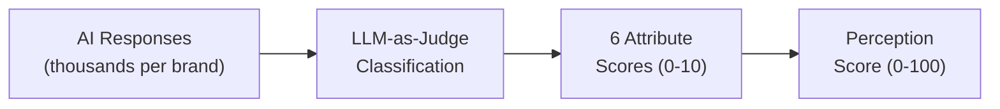

<metadata>
purpose: What story does AI tell about you? Six buyer-relevant attributes scored from AI-generated narrative — with accuracy checking against your brand truth.
source: https://handbook.growthx.ai/products/checkthat/perception
sync_type: auto
access: build-team
last_synced: 2026-03-02
</metadata>

# Perception Score

## The question

What story does AI tell about you?

**Brand research analog:** Brand perception survey, brand attribute study

**Score type:** Output — measures what AI engines actually say about your brand

This is the heart of CheckThat. [Presence](/products/checkthat/presence) tells you if AI recommends you. [Reputation](/products/checkthat/reputation) tells you what the world thinks. Perception tells you what AI *actually says* — the narrative it builds across the dimensions buyers care about.

This is the score no one else can produce. Traditional brand tracking surveys humans. Review platforms aggregate ratings. CheckThat reads the actual AI-generated narrative and scores it across six attributes.

## Where branded queries live

[Presence](/products/checkthat/presence) is always unaided — your brand name never appears in the prompt. Branded evaluation queries ("Ramp vs Brex," "Ramp pricing," "Does Ramp have X?", "Ramp reviews") feed Perception, not Presence.

When a buyer asks about you by name, Presence already did its job. Now the question is what story AI tells. That's Perception.

## Six attributes

Six attributes. One word each. Scored 0-10. Together they compose the Perception Score.

| Attribute | What it answers | What it absorbs |
|---|---|---|
| **Capability** | Is the product powerful and complete, or limited? | Features, scalability, integrations, AI/automation, product depth |
| **Usability** | Is it easy to use, or painful to adopt? | Ease of use, implementation speed, onboarding, learning curve, UX |
| **Value** | Is it worth the money, or expensive? | Pricing, ROI, total cost of ownership, pricing transparency |
| **Trust** | Is it safe and reliable, or risky? | Security, compliance, reliability, vendor stability, brand credibility |
| **Support** | Is support responsive, or slow? | Customer support, documentation, success management, onboarding help |
| **Innovation** | Is it forward-thinking, or stagnant? | Product vision, roadmap, differentiation, competitive uniqueness |

Each attribute is scored by an LLM-as-judge that classifies AI-generated responses against defined rubrics. Not every response scores every attribute — only what's present in the text.

**Perception Score = (average of 6 attribute scores) x 10**

Example: if the average across attributes is 7.2, the Perception Score is 72.

### Why these six

Every B2B vendor evaluation framework in existence collapses to a small number of dimensions. Gartner uses 15 criteria but two axes. Forrester uses three dimensions. G2 uses two. The platforms that last are the ones that pick the right abstractions.

We tested each attribute against three filters:

1. **Does a CMO instantly understand it?** No jargon. No explanation needed. If you have to define the word, it's wrong.
2. **Can an LLM reliably score it from AI-generated text?** We're not surveying humans. We're classifying language. The attribute must map to detectable patterns in how AI engines talk about brands.
3. **Does it map to a distinct buyer concern with zero overlap?** Six attributes means zero waste. Each one must stand on its own.

We started with 10 attributes. We collapsed to 6. Scalability folded into Capability. Integration/Ecosystem folded into Capability. AI/Automation folded into Capability. Reliability folded into Trust. Market Position was cut (it's an outcome of the other scores). Differentiation folded into Innovation.

---

## Capability

**Does AI describe your product as powerful and complete, or limited and narrow?**

What it absorbs: core features, functionality, scalability, AI/automation capabilities, integration and ecosystem fit, product depth and breadth.

**How we score it:** We classify every AI-generated mention of a brand for language related to product capabilities, feature completeness, scalability, integrations, and technical depth.

| Signal type | Examples |
|---|---|
| **Positive** | "comprehensive," "feature-rich," "handles enterprise scale," "robust API," "integrates with" |
| **Negative** | "limited," "basic," "lacks," "doesn't support," "standalone tool" |

| Score | Meaning |
|---|---|
| 0-3 | AI describes the product as limited, basic, or narrow in scope |
| 4-6 | AI describes adequate functionality with noted gaps |
| 7-8 | AI describes strong, comprehensive capabilities |
| 9-10 | AI positions the product as best-in-class across multiple dimensions |

**Why Capability is first:** Every evaluation framework starts here. Gartner's Product/Service criterion is typically the heaviest-weighted factor. Forrester's Current Offering axis spans 8-25+ sub-criteria, all rooted in what the product actually does. G2's "Meets Requirements" is one of only three HIGH-weight satisfaction dimensions.

89% of B2B buyers in 2025 purchased solutions with AI features baked in (6sense, n=4,000). 81% rated AI functionality as important or very important (G2 2024).

**Alignment embedded:** Feature Accuracy from the old Alignment metric now lives here. When we score Capability, we're inherently measuring whether AI accurately represents what the product can do. A hallucinated feature is a Capability signal (inaccurate). A missing feature is a Capability signal (incomplete).

---

## Usability

**Does AI describe your product as easy to use and fast to implement, or complex and painful to adopt?**

What it absorbs: ease of use, implementation speed, onboarding complexity, time to value, learning curve, UX quality, ease of administration.

**How we score it:** We classify AI-generated text for language about user experience, setup complexity, learning curve, and time to value.

| Signal type | Examples |
|---|---|
| **Positive** | "intuitive," "easy to set up," "minimal training," "quick onboarding," "user-friendly interface" |
| **Negative** | "steep learning curve," "complex setup," "requires training," "difficult to configure," "clunky" |

| Score | Meaning |
|---|---|
| 0-3 | AI describes a product that's hard to use, slow to implement, and frustrating |
| 4-6 | AI describes a product that's functional but requires effort to adopt |
| 7-8 | AI describes a product that's intuitive with reasonable onboarding |
| 9-10 | AI describes an exceptional user experience with near-instant time to value |

**Why Usability stands alone:** The most consistently high-weighted dimension across every review platform. G2 weights "Ease of Use" as HIGH — one of only three dimensions at that level. Capterra gives "Ease of Use" 50% weight on its entire usability axis.

57% of B2B buyers expect ROI within three months of purchase. 11% expect it immediately (G2 2024). 58% report regretting purchases partly due to onboarding challenges. Usability isn't just about daily experience — it's about how fast a buyer gets value.

**Alignment embedded:** Implementation accuracy from the old Alignment metric now lives here. When AI says "easy to set up in minutes" but the real implementation takes weeks, that's a Usability misalignment flagged by comparing against brand context.

---

## Value

**Does AI position you as worth the money, or as expensive relative to what you deliver?**

What it absorbs: pricing, affordability, ROI, total cost of ownership, pricing transparency, contract flexibility, cost efficiency.

**How we score it:** We classify AI-generated text for language about pricing, cost, ROI, and financial value.

| Signal type | Examples |
|---|---|
| **Positive** | "affordable," "competitive pricing," "strong ROI," "transparent pricing," "good value," "free tier" |
| **Negative** | "expensive," "overpriced," "hidden costs," "not worth it," "pricing complexity" |

| Score | Meaning |
|---|---|
| 0-3 | AI describes the product as expensive with unclear value |
| 4-6 | AI describes adequate value with pricing caveats |
| 7-8 | AI describes strong value relative to capabilities |
| 9-10 | AI positions the product as best-in-class value in the category |

**Why Value is the #1 purchase driver:** TrustRadius found that 66% of buyers selected their product because it "met our needs for the best price" — the single most cited purchase driver across 2,164 respondents. CFOs now hold final decision-making power in 79% of purchases. Products with transparent pricing achieved 3.2x more AI visibility (Goodie AI, 2.2M prompts analyzed).

**Alignment embedded:** Pricing Accuracy from the old Alignment metric now lives here. When AI cites your pricing, we compare it against brand context. "AI says $99/mo, actual is $249/mo" is a critical Value misalignment.

---

## Trust

**Does AI describe you as a safe, reliable, secure choice, or as a risk?**

What it absorbs: security, compliance, reliability, uptime, data protection, brand credibility, enterprise-readiness, vendor stability, breach history.

**How we score it:** We classify AI-generated text for language about security posture, compliance certifications, reliability, data handling, and enterprise-readiness.

| Signal type | Examples |
|---|---|
| **Positive** | "SOC 2 compliant," "enterprise-grade security," "reliable," "trusted by," "99.9% uptime," "GDPR compliant" |
| **Negative** | "security concerns," "data breach," "reliability issues," "downtime," "not enterprise-ready" |

| Score | Meaning |
|---|---|
| 0-3 | AI raises security concerns or describes unreliable/risky product |
| 4-6 | AI describes adequate security without strong trust signals |
| 7-8 | AI references specific certifications and enterprise readiness |
| 9-10 | AI positions the product as the safe, trusted standard in the category |

**Why Trust is the biggest collapse:** Trust collapses the most sub-dimensions into one word. Security, compliance, reliability, brand credibility, and vendor stability all answer the same buyer question: can I bet my job on this?

Security is the #1 consideration across six major department types (G2 2024). 81% of enterprise buyers consider vendor breach history. 97% involve a security stakeholder. Forrester's MaxDiff analysis: competency (18.5%), consistency (17.0%), and dependability (16.8%) are the top three trust attributes.

**Alignment embedded:** Factual Accuracy from the old Alignment metric maps here when it touches security claims, compliance certifications, and reliability track record.

---

## Support

**Does AI describe your support as responsive and helpful, or slow and frustrating?**

What it absorbs: customer support quality, responsiveness, documentation, self-service resources, success management, onboarding assistance.

**How we score it:** We classify AI-generated text for language about support quality, responsiveness, and customer success.

| Signal type | Examples |
|---|---|
| **Positive** | "excellent support," "responsive team," "great documentation," "dedicated success manager," "24/7 support" |
| **Negative** | "poor support," "slow response," "limited documentation," "no phone support," "long wait times" |

| Score | Meaning |
|---|---|
| 0-3 | AI describes support as a significant weakness |
| 4-6 | AI describes adequate support with noted limitations |
| 7-8 | AI describes strong, responsive support |
| 9-10 | AI positions support as a competitive advantage and differentiator |

**Why Support can't fold into anything else:** Support isn't Trust (that's about whether you're safe to choose). Support isn't Usability (that's about whether you can figure it out yourself). Support is what happens when things break, when implementation stalls, when a buyer needs help.

Every review platform measures it independently. Capterra gives Customer Support 50% weight on its entire satisfaction axis. G2 rates Quality of Support as one of only three HIGH-weight satisfaction dimensions. At the renewal stage, support quality is one of the strongest predictors of retention.

Support also absorbs customer success — proactive guidance, strategic reviews, and outcome-driven engagement. When AI says "offers dedicated account management," that's a Support signal.

---

## Innovation

**Does AI describe you as forward-thinking and evolving, or stagnant and falling behind?**

What it absorbs: product vision, roadmap, differentiation, competitive uniqueness, R&D investment, emerging capabilities, market leadership trajectory.

**How we score it:** We classify AI-generated text for language about product direction, uniqueness, and forward momentum.

| Signal type | Examples |
|---|---|
| **Positive** | "rapidly improving," "recently launched," "innovative approach," "unique in that," "leading the way," "pioneering" |
| **Negative** | "hasn't changed," "falling behind," "legacy," "stagnant," "no clear roadmap," "generic" |

| Score | Meaning |
|---|---|
| 0-3 | AI describes a stagnant product with no differentiation |
| 4-6 | AI describes a product with some unique aspects but limited vision |
| 7-8 | AI describes an actively evolving product with clear differentiation |
| 9-10 | AI positions the product as a category-defining innovator |

**Why Innovation absorbs Differentiation:** CEB research found that only 14% of companies offer benefits customers find truly unique. An attribute that scores 86% of brands the same way isn't useful. But the signal matters — Innovation captures both "where are you going?" (vision, roadmap) and "what makes you different?" (uniqueness, competitive separation).

Gartner's Completeness of Vision axis evaluates market understanding, innovation investment, and offering strategy. Forrester's Strategy dimension covers roadmap, innovation commitment, and business model. Both combine trajectory with differentiation. We're doing the same.

**Alignment embedded:** Positioning Match and Differentiator Recognition from the old Alignment metric now live here. Does AI correctly convey what makes you different? Does it tell the story you want told about where you're going?

---

## Accuracy — built into every attribute

Other AEO tools show you what AI says. CheckThat tells you if AI is *right*.

When brand context is populated (the answer key), each attribute gains an accuracy dimension — the gap between what AI says and what the brand claims:

| Accuracy check | Which attribute catches it |
|---|---|
| AI describes features you don't have (or misses ones you do) | Capability |
| AI cites wrong pricing or outdated plans | Value |
| AI tells a different story than your intended positioning | Innovation |
| AI doesn't mention your claimed differentiators | Innovation |
| AI gets basic facts wrong (founding year, integrations, compliance) | Trust + Capability |

This surfaces as misalignment flags: "AI says your pricing is $99/mo, but your actual pricing is $249/mo." No other AEO tool has this capability — because no other tool has the concept of an answer key to check against. Use the [Influence Score](/products/checkthat/influence) to identify which sources are driving the inaccuracy.

| Old Alignment dimension | Now lives in | How |
|---|---|---|
| Feature Accuracy | Capability | Comparing AI's feature descriptions against brand context |
| Pricing Accuracy | Value | Comparing AI's pricing claims against brand context |
| Positioning Match | Innovation | Comparing AI's differentiation narrative against brand positioning |
| Differentiator Recognition | Innovation | Checking whether AI mentions claimed differentiators |
| Narrative Alignment | All 6 (holistic) | The overall gap between AI's story and the brand's intended story |
| Factual Accuracy | Trust + Capability | Checking basic facts against brand context |

## How the Perception Score is calculated



### Input

Every AI-generated response about a brand, tracked across ChatGPT, Perplexity, Claude, Gemini, and Google AI Overviews. Thousands of responses per brand, collected across hundreds of prompts per category.

### Classification

Each response runs through a classification layer (LLM-as-judge) that scores each relevant attribute on a 0-10 scale based on the language used. Not every response contains signals for every attribute. A response about pricing won't score on Innovation. A response about product roadmap won't score on Support. The classifier only scores what's present.

### Aggregation

For each attribute, we aggregate all classified scores across all responses:

- **Weight by recency** — recent responses count more than older ones
- **Weight by engine diversity** — appearing positive across multiple engines is stronger
- **Normalize against category peers** — a 7 in CRM means something different than a 7 in DevOps

### Output

```
PERCEPTION SCORE = (avg of 6 attribute scores) x 10

Example:
  Capability:  7.8
  Usability:   8.2
  Value:       6.5
  Trust:       7.0
  Support:     7.4
  Innovation:  6.1

  Average: 7.17
  Perception Score: 72 / 100
```

Equal weight by default. In the dashboard, users can apply custom weights to match what matters most in their category (e.g., Trust might matter more in security software; Usability might matter more in design tools).

## Score interpretation

| Range | Meaning |
|---|---|
| 80-100 | AI tells a strong, accurate, differentiated story about your brand. |
| 60-79 | AI tells a mostly positive story with gaps in some attributes. |
| 40-59 | AI's narrative is mixed — some attributes strong, others weak or inaccurate. |
| 20-39 | AI's story is weak across most dimensions. Major perception issues. |
| 0-19 | AI either doesn't describe you in detail or gets the story fundamentally wrong. |
