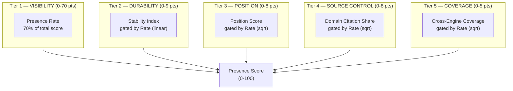

<metadata>
purpose: When buyers evaluate solutions, does AI recommend you? The foundational score that measures unaided, evaluation-stage AI visibility.
source: https://handbook.growthx.ai/products/checkthat/presence
sync_type: auto
access: build-team
last_synced: 2026-03-02
</metadata>

# Presence Score

## The question

When buyers evaluate solutions, does AI recommend you?

**Brand research analog:** Unaided brand awareness

**Score type:** Output — measures what AI produces in response to buyer queries

If AI doesn't name your brand when buyers ask about your category, nothing else matters. Presence is the foundation — it must be non-zero before the other scores have meaning.

## Why Presence is different from "AI visibility"

Every AEO tool on the market measures "AI visibility" — are you mentioned somewhere in AI? That metric is vague and doesn't mean anything. A brand can have 90% "AI visibility" because AI knows their name when asked directly, or because they show up in awareness-stage queries like "what is expense management?" Neither tells you whether buyers will find you at the moment that matters.

Presence measures something specific: **when a buyer is actively evaluating solutions and asks AI for recommendations without naming you, does AI include you?**

The boundary is crisp:

- **If your brand name is in the prompt, it's not Presence.** Branded queries ("What is Ramp?", "Ramp pricing", "Ramp vs Brex") feed the [Perception Score](/products/checkthat/perception) — they measure what story AI tells when asked about you.
- **If the prompt is awareness-stage or post-purchase, it's not Presence.** Only evaluation-stage prompts count — the moment buyers build shortlists.
- **Presence is always unaided.** AI must volunteer your name. The buyer asks about the category, the problem, or a competitor — and AI decides to include you.

This is the "unaided brand awareness" test for AI engines. In traditional brand research, you ask consumers "name three expense management tools" without prompting them. In CheckThat, you ask AI "best expense management tools for startups" and see if it names you.

## Why Presence is first

If AI doesn't recommend you when buyers evaluate your category, nothing else matters. You can have perfect Perception and stellar Reputation, but if you're invisible during the evaluation moment, buyers never see it.

The data:
- Only **30% of brands** maintain stable AI visibility
- Less than **1% of responses** produce identical brand lists across two runs
- **67.4% of domains** are cited by exactly one AI platform
- **95% of the time**, the winning vendor was already on the buyer's Day One shortlist (6sense)

If AI builds that shortlist and you're not on it, you've lost before the conversation started.

## Sub-metrics

### Presence Rate

The percentage of evaluation-stage, unbranded prompts where AI mentions your brand. The headline number — and the foundation of the Presence Score (70% of total points).

```
Presence Rate = (evaluation prompts where brand is mentioned / total evaluation prompts tracked) x 100
```

Only unbranded prompts count. Only evaluation-stage prompts count. This tells you: when buyers ask AI for recommendations in your category, how often does AI include you?

### Stability Index

How consistent is your presence over time?

```
Stability Index = 100 - (standard deviation of weekly presence rates / mean presence rate) x 100
```

High stability (&gt;80) means your position is entrenched. Low stability (&lt;40) means you're volatile — could disappear any week. High-authority domains maintain &lt;10% volatility. Building authority signals (brand search volume, Wikipedia presence, review platforms, structured data) reduces volatility.

### Position

Not just "are you mentioned?" but "are you recommended or listed as an afterthought?"

| Position | Score | What it means |
|----------|-------|--------------|
| **Recommended** | 5 | Named as a primary recommendation or solo answer |
| **1st Mention** | 4 | Named first in a list of options |
| **2nd-3rd** | 3 | Named early but not first |
| **Listed** | 2 | In a list without prominence |
| **Afterthought** | 1 | Mentioned in caveats, footnotes, or "you could also consider..." |

Being the recommended answer is fundamentally different from being listed 5th in a comma-separated list. A solo recommendation ("I recommend Ramp for startups") carries 5x the weight of an afterthought mention ("you could also consider Ramp").

### Source Control

Of all AI responses that include citations, how often is your domain cited?

```
Source Control = (responses with citations that cite your domain / total responses with any citation) x 100
```

This is a category-wide metric — it measures your share of the citation landscape across all AI responses in your category, not just responses about your brand.

A brand that appears in 33% of AI recommendations but is never cited as a source has fragile presence — it's built entirely on third-party content that can shift. A brand that owns 15% of all citations in its category has defensible presence — AI uses its content as source material.

<Note>
**Source Control vs. [Influence](/products/checkthat/influence):** Both use citation data but answer different questions. Source Control measures your competitive share of the category's citation landscape — "of all citations, how many are yours?" Influence's Own-Domain Citation Rate measures brand-specific diagnostic — "when AI talks about YOU, does it cite your content?" Source Control is competitive. Influence is diagnostic.
</Note>

### Cross-Engine Coverage

Which AI engines recommend you during evaluation?

```
Cross-Engine Coverage = (engines mentioning brand for evaluation prompts / total engines tracked) x 100
```

A brand recommended on ChatGPT but invisible on Perplexity during evaluation has a coverage problem. Given ChatGPT = 87% of AI referral traffic, which engines matter is a strategic question. Only **6.5% of brands** achieve presence across 5+ platforms.

## What prompts measure Presence

All Presence prompts share two properties: (1) they are evaluation-stage — the buyer is building a shortlist or comparing solutions, and (2) they are unbranded — your brand name does not appear in the prompt.

### Best-of-category — the shortlist builders

The most important evaluation prompts. Where vendor shortlists are born.

```
"Best [category] tools for [constraint]"
"Top [category] platforms for [industry]"
"What [category] software do you recommend for [company size]?"
"Best [category] with [integration/feature]"
```

### Landscape and market map

Buyers understanding the competitive field before shortlisting.

```
"Who are the main players in [category]?"
"What are the leading [category] solutions?"
"Map the [category] software market"
```

### Alternatives-to-competitor

High-intent switching queries. Your name is NOT in the prompt; the competitor's name is.

```
"Alternatives to [Competitor]"
"Best [Competitor] alternatives for [use case]"
"What can I use instead of [Competitor]?"
```

### Unbranded comparison

AI generates a comparison without being told which brands to include.

```
"Compare top [category] tools for [use case]"
"Which [category] tools should I evaluate for [constraint]?"
"Rank the best [category] options for [industry]"
```

<Warning>
**What does NOT count as Presence:** Any prompt containing your brand name. "[Your Brand] vs [Competitor]", "[Your Brand] pricing", "[Your Brand] reviews", "What is [Your Brand]?" — all of these feed the [Perception Score](/products/checkthat/perception), not Presence. If the buyer already named you, Presence already did its job.
</Warning>

## How the composite is calculated

The Presence Score uses a **tiered component model**. Presence Rate is the foundation — 70% of the total score. The remaining 30 points come from four quality tiers, each gated by Rate so they can't inflate a near-zero score.

The design is intentional: 100 is theoretical perfection. Like an LLM benchmark, the top of the scale is nearly unreachable. There is always room to improve.



### The formula

```
TIER 1 — VISIBILITY (0-70 pts)
  70 x (Rate / 100)

TIER 2 — DURABILITY (0-9 pts)
  9 x (Stability / 100) x (Rate / 100)

TIER 3 — POSITION (0-8 pts)
  8 x (Position / 100) x sqrt(Rate / 100)

TIER 4 — SOURCE CONTROL (0-8 pts)
  8 x (SourceControl / 100) x sqrt(Rate / 100)

TIER 5 — COVERAGE (0-5 pts)
  5 x (CrossEngine / 100) x sqrt(Rate / 100)

PRESENCE SCORE = T1 + T2 + T3 + T4 + T5

Scale: 0-100
```

### Why this structure

Each tier maps to a level of Presence maturity — and each tier is harder to earn than the last:

1. **You show up.** Visibility is the score. 70% of total points.
2. **You show up consistently.** Durability uses a linear gate — stability at near-zero presence is noise. Only contributes meaningfully above ~20% Rate.
3. **When you show up, you're the recommendation.** Position uses a sqrt gate — starts contributing at moderate rates where the sample is large enough to trust.
4. **You control why you show up.** Source Control uses a sqrt gate — your domain's share of citations reflects defensible, owned presence vs. fragile third-party dependence.
5. **You show up across engines.** Coverage gets the smallest allocation (5 pts) because Rate already captures multi-engine data — the tracked prompts run across all engines. Coverage captures the distribution gap.

### Gating functions

**Linear gate** (Durability): `metric x (Rate / 100)`. At 10% Rate, only 10% of the tier's points are available. At 50% Rate, half. The contribution scales proportionally with visibility because stability can't be measured reliably on a thin sample.

**Sqrt gate** (Position, Source Control, Coverage): `metric x sqrt(Rate / 100)`. At 10% Rate, ~32% of the tier's points are available. At 50%, ~71%. The sqrt function unlocks these tiers faster than linear because even at moderate visibility, Position and Source Control carry real signal.

### What it takes to reach the top

| Scenario | Rate | T1 | T2 | T3 | T4 | T5 | Score |
|---|---|---|---|---|---|---|---|
| Invisible (Eon) | 0.1% | 0.1 | 0.0 | 0.1 | 0.0 | 0.0 | **~0** |
| Weak (HYCU) | 10% | 7.0 | 0.4 | 1.3 | 1.9 | 0.6 | **11** |
| Moderate (Veeam) | 33% | 23.1 | 2.1 | 3.4 | 0.8 | 2.3 | **32** |
| Category leader | 65% | 45.5 | 4.8 | 5.4 | 4.2 | 3.4 | **63** |
| Dominant | 80% | 56.0 | 6.1 | 6.4 | 5.1 | 4.0 | **78** |
| Near-perfect | 90% | 63.0 | 7.5 | 7.0 | 5.9 | 4.4 | **88** |
| Elite | 95% | 66.5 | 8.1 | 7.5 | 6.4 | 4.7 | **93** |
| Theoretical max | 100% | 70.0 | 9.0 | 8.0 | 8.0 | 5.0 | **100** |

## Score interpretation

The tiered model produces a harder curve than traditional 0-100 scales. Scoring above 70 requires dominant visibility with strong quality signals across all dimensions. This is deliberate — there is always room to improve.

| Range | Rating | Meaning |
|---|---|---|
| 85-100 | Exceptional | Near-perfection across all dimensions. AI recommends you first, consistently, across engines, backed by your own content. Practically unreachable — reserved for brands with 90%+ Rate and near-perfect quality. |
| 70-84 | Strong | Dominant category presence with minor gaps. AI recommends you frequently and your content is a primary citation source. Very few B2B brands globally reach this tier. |
| 50-69 | Moderate | Clear presence with room to grow. AI includes you regularly but with gaps — inconsistent position, missing engines, or weak source control. The upper end of what today's category leaders achieve. |
| 30-49 | Low | Shows up but inconsistently. Buyers using AI have a roughly coin-flip chance of seeing you. Typical range for established B2B brands in competitive categories. |
| 10-29 | Weak | Rarely recommended. Most buyers using AI to build a shortlist will miss you. Some citation presence but not enough to drive consistent mentions. |
| 0-9 | Invisible | AI doesn't mention you during evaluation. Zero or near-zero visibility. Where most brands start. |

## Diagnostic patterns

### Cross-score patterns

Cross-reference Presence with the other scores to diagnose what's happening:

| Pattern | Diagnosis | Priority action |
|---|---|---|
| Low Presence + Low [Influence](/products/checkthat/influence) | AI has no source material from you | Establish source authority from scratch |
| High [Reputation](/products/checkthat/reputation) + Low Presence | The world loves you but AI doesn't mention you | Technical AEO — content structure, schema, crawlability |
| High Presence + Low [Perception](/products/checkthat/perception) | AI mentions you but gets the story wrong | Fix content accuracy and positioning |
| Low Presence + Low [Reputation](/products/checkthat/reputation) | Starting from scratch | Build Reputation first. Then Presence follows. |

### Within-score patterns

The tier breakdown reveals where Presence is strong and where it's fragile:

| Pattern | Diagnosis | Priority action |
|---|---|---|
| High Visibility + Low Source Control | Visible but fragile — third parties control your narrative | Build owned citeable content: "best of" lists, comparison pages, technical guides |
| Low Visibility + High Source Control | Your content is cited but AI doesn't recommend you during evaluation | Solve distribution — the content is good, but AI needs more signal to volunteer your name |
| High Visibility + Low Position | Mentioned often but as an afterthought, not a recommendation | Strengthen brand narrative and positioning. Move from "listed" to "recommended." |
| High Visibility + Low Durability | Shows up but inconsistently week to week | Build authority signals — brand search volume, Wikipedia, review platforms, structured data |
| High Visibility + Low Coverage | Strong on one engine, invisible on others | Engine-specific strategy — different AI engines weight different source types |
