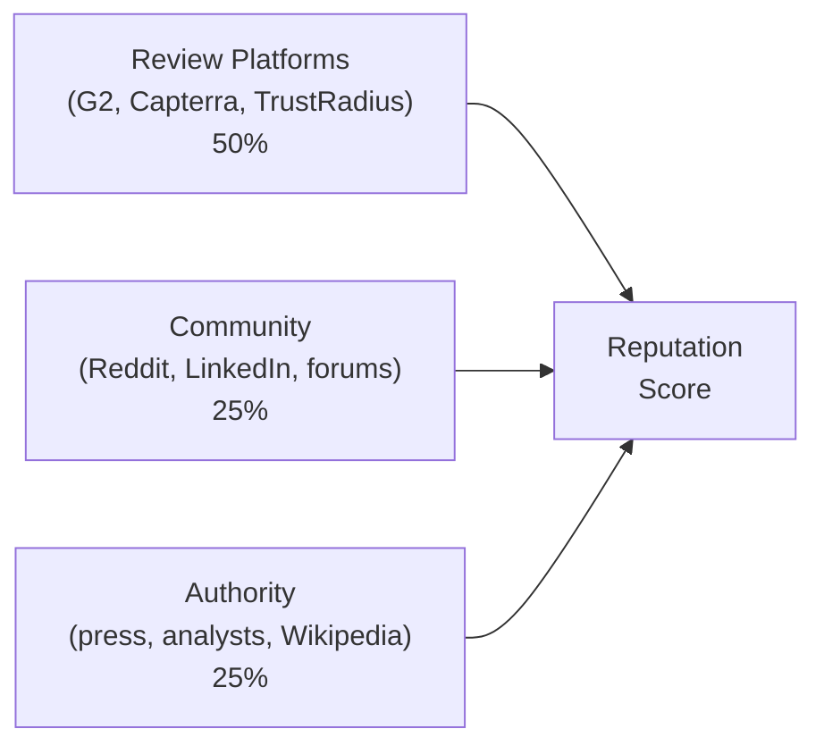

<metadata>
purpose: What does the world think? The input score that measures external market signals — reviews, press, community, analysts — independent of AI.
source: https://handbook.growthx.ai/products/checkthat/reputation
sync_type: auto
access: build-team
last_synced: 2026-03-02
</metadata>

# Reputation Score

## The question

What does the world think?

**Brand research analog:** Brand favorability, NPS, review scores, analyst ratings

**Score type:** Input — measures the raw material AI learns from, independent of what AI says

Reputation measures the market's opinion of your brand independent of what AI says. It's the raw material AI learns from. Reputation is the **input**. [Perception](/products/checkthat/perception) is the **output**. They're related but not the same.

## Why Reputation is separate from Perception

AI doesn't just parrot review scores. It filters, recombines, and sometimes invents. A brand with 4.8 stars on G2 might get described by AI as "good but complex to set up" because AI weighted one specific dimension of reviews. A brand with modest review scores might get glowing AI descriptions because a TechCrunch article hit at the right time.

Reputation is the external truth. Perception is AI's interpretation of it. Both matter.

## Why Reputation matters

The world's opinion shapes everything:

- **95% of the time**, the winning vendor was already on the buyer's Day One shortlist (6sense). Reputation builds that shortlist before AI even enters the picture.
- **78% of buyers** shortlist products they've already heard of — 86% among enterprise buyers (TrustRadius).
- **Reddit is cited in 40%+** of Perplexity responses and is a top-10 most-cited domain across all AI engines.
- **G2 accounts for 8.25%** of ChatGPT citations for evaluation queries.

Reputation feeds AI. Low Reputation almost guarantees low Perception.

## Data sources

Reputation aggregates signals from three categories of external platforms that buyers and AI engines both rely on.



### Review platforms (50% weight)

The richest signal for buyer satisfaction and feature sentiment.

| Platform | What it captures | Why it matters |
|---|---|---|
| **G2** | User reviews, satisfaction scores, feature ratings, Grid placement | Largest review volume, most cited by AI engines |
| **Capterra** | User reviews, Overall/Ease of Use/Support/Value scores | Broad SMB coverage |
| **TrustRadius** | trScore, Buyer's Choice criteria (capabilities, value, relationship) | Enterprise buyer depth, rigorous scoring |
| **Gartner Peer Insights** | Overall rating, Service & Support, Integration & Deployment, Product Capabilities | Enterprise analyst-adjacent signal |

```
Review Platform Signal = weighted average of normalized scores
  G2:              35% weight (largest volume, most cited by AI)
  Capterra:        25% weight (broad SMB coverage)
  TrustRadius:     20% weight (enterprise depth)
  Gartner PI:      20% weight (enterprise authority)
```

### Community (25% weight)

Authentic buyer language and raw sentiment from where professionals actually discuss software.

| Source | Signal type | Key stat |
|---|---|---|
| **Reddit** | Raw buyer language, authentic recommendations, unfiltered opinions | **40%+ of Perplexity citations**; top-10 most-cited domain across all engines |
| **LinkedIn** | Professional discussion, industry credibility | Growing AI citation source |
| **Forums** | Deep technical community, niche expertise | Category-specific signal |

```
Community Signal = composite of:
  Reddit presence score (0-100):
    Active in relevant subreddits? (+25)
    Mentioned positively in recommendations? (+25)
    Recent mentions (last 90 days)? (+25)
    Response/engagement from brand? (+25)
  Social proof score (0-100):
    LinkedIn discussion mentions (+40)
    Professional community presence (+30)
    Social media sentiment (+30)
```

### Authority (25% weight)

Credibility, editorial weight, and institutional endorsement.

| Source | Signal type | Key stat |
|---|---|---|
| **Press coverage** | TechCrunch, Forbes, industry publications — recency, sentiment, prominence | Authority signal, news freshness |
| **Analyst firms** | Gartner, Forrester, IDC coverage and placement | Institutional credibility |
| **Wikipedia** | Page existence, accuracy, freshness | **12.1% of ChatGPT citations overall** |

```
Authority Signal = composite of:
  Press recency and quality (0-100):
    Major press coverage in last 6 months? (+40)
    Industry analyst mentions? (+30)
    Wikipedia page exists and is current? (+30)
```

## How the composite is calculated

Reputation doesn't require running prompts against AI engines. It's computed from external data.

```
REPUTATION SCORE =
  (Review Platform Signal x 0.50) +
  (Community Signal x 0.25) +
  (Authority Signal x 0.25)

Scale: 0-100
```

## Score interpretation

| Range | Meaning |
|---|---|
| 80-100 | Strong market reputation. Well-reviewed, well-covered, strong community presence. AI has good material to work with. |
| 60-79 | Solid reputation with gaps — maybe strong reviews but weak press, or good press but thin community presence. |
| 40-59 | Moderate reputation. Some signals strong, others weak or absent. AI has mixed material to draw from. |
| 20-39 | Weak reputation. Few reviews, minimal press, thin community presence. AI has little external signal. |
| 0-19 | Near-zero market signal. AI has almost nothing to work with from external sources. |

## The Reputation-Perception gap

The gap between Reputation and [Perception](/products/checkthat/perception) is diagnostic. It tells you whether AI is accurately reflecting the world's opinion — or distorting it.

| Pattern | Diagnosis | Action |
|---|---|---|
| High Reputation + High Perception | The system works. External signals translate correctly into AI narrative. | Monitor and maintain. |
| High Reputation + Low Perception | AI isn't reading the room. Your external reputation is strong but AI doesn't reflect it. | Source citation or crawlability problem. Check [Influence](/products/checkthat/influence) for source analysis. Also check [Presence](/products/checkthat/presence) Source Control tier — if your domain has citations but low visibility, the content exists but isn't being surfaced during evaluation. |
| Low Reputation + High Perception | Rare and fragile. AI has a positive view not backed by market evidence. | Will self-correct as models update. Build real Reputation before it does. |
| Low Reputation + Low Perception | Expected. Low external signal = low AI narrative quality. | Fix Reputation first. Reviews, press, community — then AI follows. |

## Building Reputation

Reputation is the score you build in the real world, not in AI. The actions are traditional brand-building applied to the sources AI reads:

| Signal | Action | Timeline |
|---|---|---|
| **Review platforms** | Actively grow G2, Capterra, TrustRadius profiles. Respond to all reviews. | Ongoing, quarterly review pushes |
| **Reddit** | Authentic participation in 3-5 relevant subreddits. Consistency over volume. | Ongoing, weekly cadence |
| **Press** | PR, guest posts, podcast appearances, analyst relationships | Ongoing, monthly cadence |
| **Wikipedia** | Ensure accurate page if notable. Focus on notability signals. | 3-6 months |
| **Brand search volume** | Brand awareness campaigns, thought leadership | Ongoing, compounds over time — strongest cross-engine signal (0.334 correlation) |
