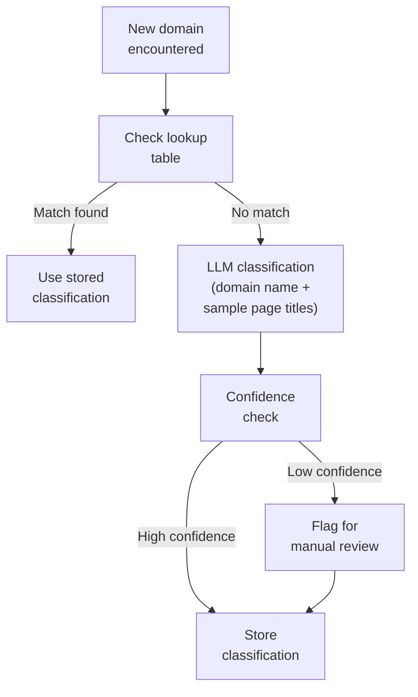

<metadata>
purpose: 11 domain types, authority weights, and classification logic — how CheckThat categorizes the sources that shape AI perception.
source: https://handbook.growthx.ai/products/checkthat/sources/domain-classification
sync_type: auto
access: build-team
last_synced: 2026-03-02
</metadata>

# Domain classification

## The question

When AI cites a source, what kind of source is it?

A G2 review, a competitor's blog post, a Gartner report, and a Reddit thread all shape AI's perception differently. A brand whose presence is built on review platform citations has a fundamentally different strategic position than one built on competitor content. Domain classification makes this distinction visible.

## The 11 domain types

Every cited domain is classified into one of 11 types. The taxonomy is designed to be exhaustive (every domain fits somewhere) and mutually exclusive (no domain fits two types).

| Type | Definition | Example Domains |
|---|---|---|
| **Own Domain** | The tracked brand's own website and secondary domains | brand.com, docs.brand.com, blog.brand.com |
| **Competitor** | A tracked competitor's website and secondary domains | competitor.com, docs.competitor.com |
| **Review Platform** | Sites where users publish structured reviews and ratings | G2, Capterra, TrustRadius, Gartner Peer Insights, PeerSpot, SoftwareReviews |
| **Community** | User-generated discussion platforms | Reddit, Stack Overflow, LinkedIn, Quora, Hacker News, Spiceworks |
| **Tech Media** | Technology-focused editorial and review publications | TechRadar, PCMag, CNET, ZDNet, Tom's Hardware, The Verge |
| **Press / News** | General business press and industry publications | Forbes, WSJ, Bloomberg, TechCrunch, VentureBeat, Business Insider |
| **Analyst** | Research and advisory firms (non-review content) | Gartner (reports), Forrester, IDC, 451 Research |
| **Reference** | Factual reference, encyclopedic, and educational content | Wikipedia, .edu domains, MDN, official documentation sites |
| **Aggregator** | Comparison and listicle sites without primary review data | SelectHub, FinancesOnline, AlternativeTo, Slashdot, SourceForge |
| **Video** | Video hosting and streaming platforms | YouTube, Vimeo |
| **Other** | Domains that don't fit the above categories | Unclassified or ambiguous domains |

### Boundary cases

Some domains straddle categories. These rules resolve ambiguity:

- **Gartner Peer Insights** is a Review Platform (user reviews), not Analyst. Gartner's paywalled research reports are Analyst.
- **TechCrunch** is Press / News (editorial journalism), not Tech Media. Tech Media is reserved for product-focused review publications like TechRadar and PCMag.
- **LinkedIn** is Community (discussion), not Press. LinkedIn articles by individual professionals are community content, not editorial press.
- **AlternativeTo** is Aggregator (comparison lists), not Review Platform. It doesn't host structured user reviews with ratings.
- **Medium** is classified based on the subdomain — a brand's Medium blog is Own Domain behavior, but medium.com generally is Community.

## Authority weights

Each domain type carries an authority weight (0.0-1.0) reflecting how much credibility the source carries for AI's perception. The weights are calibrated against buyer trust signals and AI engine citation patterns.

| Type | Weight | Reasoning |
|---|---|---|
| **Own Domain** | 0.4 | Known but potentially biased. AI engines treat first-party content with moderate trust. High value for [Influence](/products/checkthat/influence) (you can change it) but lower signal strength for third-party perception. |
| **Competitor** | 0.4 | Same bias profile as own domain. Competitors describing themselves are as biased as you describing yourself. When competitor domains dominate your citation landscape, they control the comparative narrative. |
| **Review Platform** | 0.9 | Buyer-generated content with structured ratings. High trust signal for both AI engines and human buyers. G2 accounts for 8.25% of ChatGPT evaluation citations. Directly shapes the [Reputation Score](/products/checkthat/reputation). |
| **Community** | 0.7 | Authentic buyer language. Unfiltered. Reddit is cited in 40%+ of Perplexity responses and is a top-10 most-cited domain across all engines. Growing faster than any other source category. |
| **Tech Media** | 0.8 | Established editorial authority for product recommendations. Listicle pages ("Best X Tools 2026") are the single most influential content format for evaluation-stage AI responses. |
| **Press / News** | 1.0 | Highest editorial credibility. AI engines weight press citations heavily. Recency matters — articles older than 12 months decay in citation weight. |
| **Analyst** | 1.0 | Institutional authority. Gartner and Forrester carry maximum weight. Much paywalled content surfaces through summaries and secondary citations. |
| **Reference** | 0.8 | Factual authority. Wikipedia alone accounts for 12.1% of ChatGPT citations. Educational and documentation sites carry strong factual trust. |
| **Aggregator** | 0.5 | Mixed signal quality. Comparison content without primary review data. Some aggregator sites are SEO-optimized content farms; others are legitimate comparison tools. |
| **Video** | 0.6 | Growing citation source with high engagement signal. A single YouTube video can generate hundreds of AI citations. Authority varies widely by creator. |
| **Other** | 0.2 | Default for unclassified domains. Conservative weight until properly classified. |

### Why 0.4 for own domain

The most counterintuitive weight. Your own content is the most controllable source — high [Influence](/products/checkthat/influence) value — but AI engines discount first-party claims. When AI cites your pricing page, it uses the data but doesn't treat it as an independent endorsement. When AI cites a G2 review of your pricing, that's third-party validation. The weight reflects AI's trust, not your control.

### Why 1.0 for press and analyst

These are the sources AI engines treat as most authoritative for factual claims. A TechCrunch article saying "Ramp raised $300M" carries more weight than ramp.com saying the same thing. Analyst reports carry institutional credibility that AI models are trained to respect. The practical implication: brands with strong press and analyst coverage get more favorable treatment from AI.

## How domains are classified



**Lookup table:** A maintained table of ~500 known domains mapped to types and authority weights. This covers 95%+ of citations in most B2B categories. Review platforms, major tech media, press outlets, and community sites are pre-mapped.

**LLM classification:** For unknown domains, an LLM classifier uses the domain name plus a sample of page titles from that domain's cited URLs. The classifier assigns a domain type with a confidence score. High-confidence classifications (>80%) are auto-applied. Low-confidence results are flagged for review.

**Permanence:** Domain classification is stable — a domain's type doesn't change between snapshots. Classify once, store permanently. The lookup table grows over time as new domains are encountered and classified.

**Workspace context:** Own Domain and Competitor classifications are workspace-specific. G2 is always a Review Platform, but whether `veeam.com` is a Competitor depends on which brand's workspace you're analyzing.

## Which metrics domain classification impacts

### Presence — Source Control

The [Presence Score](/products/checkthat/presence) Source Control tier (T4) measures your domain's share of the citation landscape. Domain classification adds a critical dimension: not just "how much" but "who."

| Without classification | With classification |
|---|---|
| "Your domain: 8% of citations" | "Your domain: 8%. Competitors: 64%. Review platforms: 15%. You're outnumbered 8:1 by competitors in the citation landscape." |

This distinction drives different strategies. Low source control against competitor domains means you need more owned content. Low source control against tech media means you need to get on listicles. Low source control against review platforms means you need to build your review presence.

### Reputation — Signal mapping

The [Reputation Score](/products/checkthat/reputation) weights three signal categories: Review Platforms (50%), Community (25%), Authority (25%). Domain classification makes this mapping explicit:

| Domain Type | Reputation Signal | Weight in Reputation |
|---|---|---|
| Review Platform | Review Platform Signal | 50% |
| Community | Community Signal | 25% |
| Press / News | Authority Signal | 25% (shared) |
| Analyst | Authority Signal | 25% (shared) |
| Reference | Authority Signal | 25% (shared) |

When a new review platform emerges (e.g., a vertical-specific site), classifying its domain type automatically routes its citations to the correct Reputation signal category.

### Influence — Typed source map

The [Influence Score](/products/checkthat/influence) Third-Party Source Map currently shows raw domain percentages. Domain classification transforms this into an actionable breakdown by source type:

```
BEFORE: "g2.com: 34%, reddit.com: 22%, techcrunch.com: 15%, competitor.com: 12%"

AFTER:
  Review Platforms:  37%  (authority: 0.9)  — G2 34%, PeerSpot 3%
  Community:         26%  (authority: 0.7)  — Reddit 22%, Stack Overflow 4%
  Press:             15%  (authority: 1.0)  — TechCrunch 15%
  Competitors:       12%  (authority: 0.4)  — competitor.com 12%
```

The typed view reveals that the highest-authority sources (press) contribute the smallest share, while the fastest-growing category (community) has moderate authority. That's a strategic insight raw percentages can't provide.

### Influence — Signal Concentration

Signal Concentration currently measures "what percentage of citations come from the single top source." Domain classification enables concentration analysis by type: "72% of citations come from just two source types (competitor domains + tech media)." Type-level concentration reveals structural fragility that domain-level concentration might miss.

## Worked example: Cloud Backup (Eon)

Real data from the Eon audit (234 prompts, 35,050 responses, 5 AI engines):

| Domain Type | % of Citations | Trend | Key Domains | Strategic Implication |
|---|---|---|---|---|
| **Competitor** | 64% | Stable | Acronis (11%), HYCU (8%), N2WS (7%), Veeam (6%) | Competitors own the narrative. Eon has zero own-domain citations. Every competitor outranks Eon in the citation landscape. |
| **Tech Media** | 49% | Growing | TechRadar (13%), PCMag (7%), PCWorld (6%) | AI builds "best of" shortlists from listicles. Eon is absent from all major listicles. Getting on one listicle could shift visibility. |
| **Review Platform** | 15% | Surging (+9%) | Gartner PI (14%), G2 (6%), SoftwareReviews (3%) | Gartner PI surged from ~2% to 14% in 30 days — the single largest mover. Customer reviews directly shape AI recommendations. |
| **Video** | 5% | Growing (+3%) | YouTube (5%) | A single video generated 210 citations. High-impact, low-effort opportunity. |
| **Community** | 4% | Growing (+3%) | Reddit (4%) | A single r/Backup thread generated 106 citations. Fastest-growing source type. |
| **Own Domain** | 0% | — | — | Zero own-domain citations. Eon's website is invisible to AI as a source. |

**What the classification reveals:** Eon's zero Presence isn't just a visibility problem — it's a source problem. Competitors and tech media control 100% of the narrative. The strategic playbook writes itself:

1. **Get on listicles** — one TechRadar inclusion could shift 13% of the citation landscape
2. **Build Gartner PI reviews** — the fastest-growing source type with 0.9 authority weight
3. **Participate in r/Backup** — a single thread generates 100+ citations
4. **Create citeable own-domain content** — comparisons, "best of" guides, technical deep-dives

## Related resources

- [Sources overview](/products/checkthat/sources/overview) — what sources are and the two-layer model
- [URL Classification](/products/checkthat/sources/url-classification) — content types within domains
- [Influence Score](/products/checkthat/influence) — the diagnostic score built on source analysis
- [Reputation Score](/products/checkthat/reputation) — how review, community, and authority signals compose the score
