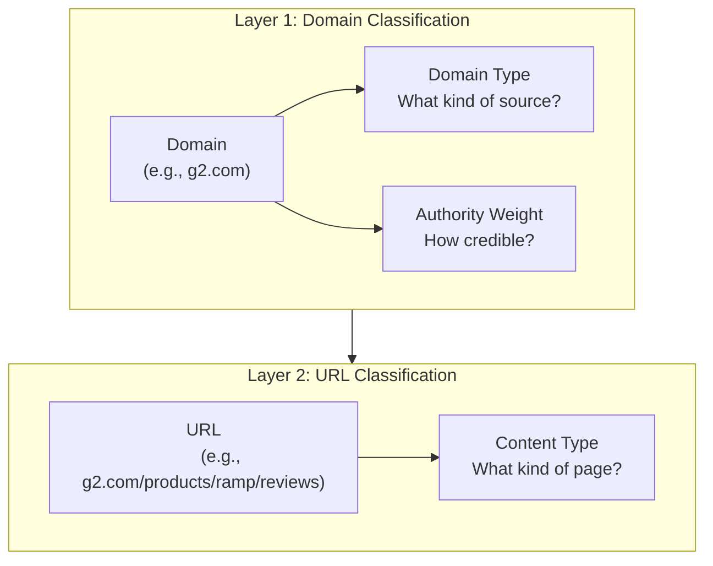
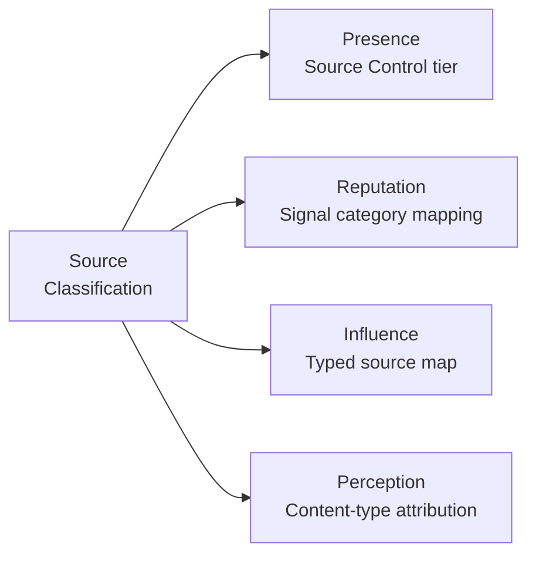

<metadata>
purpose: What sources are, why they shape every CheckThat score, and how two-layer classification turns raw citation data into actionable intelligence.
source: https://handbook.growthx.ai/products/checkthat/sources/overview
sync_type: auto
access: build-team
last_synced: 2026-03-02
</metadata>

# Sources in CheckThat

## What sources are

Every AI response is built from source material. When ChatGPT recommends a backup solution or Perplexity compares expense management tools, it draws from websites, reviews, articles, forum threads, analyst reports, and documentation. These are **sources** — the raw material that feeds AI's perception of every brand.

Sources are not metadata. They are the mechanism. They determine:

- **Whether AI mentions you** — if no source in AI's training or retrieval pipeline references your brand for a category query, you don't appear. Sources are the input to [Presence](/products/checkthat/presence).
- **What story AI tells** — the narrative AI constructs comes from the sources it cites. A brand described primarily through G2 reviews gets a different story than one described through TechCrunch articles. Sources shape [Perception](/products/checkthat/perception).
- **How much control you have** — if 80% of the sources AI cites about your brand are third-party content you don't control, your narrative is fragile. Sources are the foundation of [Influence](/products/checkthat/influence).

## Why source classification matters

CheckThat tracks every URL and domain that AI engines cite. Across a typical category workspace, that's tens of thousands of cited URLs and thousands of unique domains. Raw citation data tells you *what* AI references. Source classification tells you *why* AI says what it says — and *where* to act.

**Without classification:** "G2 accounts for 34% of citations, reddit.com for 22%, techcrunch.com for 15%."

**With classification:** "Review Platforms drive 37% of AI's source material — G2 and PeerSpot dominate. Community sources (Reddit, forums) account for 26% and are the fastest-growing category. Press coverage (TechCrunch) contributes 15% but is aging — the most-cited article is 8 months old."

The second version is actionable. It tells a brand exactly which source categories to invest in, which are growing, and which are decaying.

## Two layers of classification

Sources are classified at two levels, each answering a different question:

### Layer 1: Domain classification

**Question:** What kind of source is this domain?

Every cited domain gets classified into one of 11 types — review platform, community, press, analyst, competitor, and so on. Domain classification is **stable**: G2 is always a review platform, Reddit is always community. Classify once, store permanently.

Each domain type carries an **authority weight** (0.0-1.0) reflecting how much credibility AI engines and buyers assign to that source category.

Full taxonomy and reasoning: [Domain Classification](/products/checkthat/sources/domain-classification)

### Layer 2: URL classification

**Question:** What kind of content is this specific page?

Within any domain, different pages serve different purposes. A G2 review page and a G2 category comparison page carry different signal. A competitor's pricing page and their blog post tell AI different things. URL classification captures the **content type** — listicle, review, comparison, pricing page, documentation, forum thread, and so on.

URL classification is **variable**: the same domain hosts many content types. Classification uses page metadata (title, description) that CheckThat already scrapes.

Full taxonomy and detection signals: [URL Classification](/products/checkthat/sources/url-classification)

### Why two layers

A single-layer system misses important distinctions:

| Scenario | Domain-only view | With URL classification |
|---|---|---|
| G2 drives 34% of citations | "Review platform dominates" | "60% of G2 citations are reviews, 25% are comparisons, 15% are category pages — different content, different strategic response" |
| Competitor.com drives 20% | "Competitor controls narrative" | "80% from their blog, 15% from pricing page, 5% from docs — their thought leadership content is what AI cites, not their product pages" |
| TechRadar drives 13% | "Tech media contributes" | "100% from a single 'Best Backup Software 2026' listicle — fragile, single-page dependency" |

Domain classification tells you WHO shapes AI's perception. URL classification tells you WHAT content shapes it. Both are required for a complete diagnostic.

## How sources connect to scores

Source classification enhances every core score in the [CheckThat methodology](/products/checkthat/methodology):

### Presence — Source Control

The [Presence Score](/products/checkthat/presence) includes a Source Control tier (T4) measuring what share of citations come from your domain. Source classification adds depth: "Your domain accounts for 8% of citations. Competitor domains account for 64%. Tech media listicles account for 49%." That's three different problems requiring three different strategies.

### Reputation — Signal categories

The [Reputation Score](/products/checkthat/reputation) weights three signal categories: Review Platforms (50%), Community (25%), Authority (25%). Domain classification makes this mapping explicit rather than hardcoded. When a new review platform emerges, it's classified as a review platform and automatically weighted correctly.

### Influence — Typed source map

The [Influence Score](/products/checkthat/influence) includes a Third-Party Source Map showing which external domains drive AI's perception. Source classification transforms raw domain percentages into typed, weighted analysis:

| Without classification | With classification |
|---|---|
| g2.com: 34% | Review Platforms: 37% (authority weight: 0.9) |
| reddit.com: 22% | Community: 26% (authority weight: 0.7) |
| techcrunch.com: 15% | Press: 15% (authority weight: 1.0) |
| competitor.com: 12% | Competitor Domains: 12% (authority weight: 0.4) |

The right column is immediately actionable. A brand knows to invest in review platforms (high authority, high share) and community (growing share, moderate authority) rather than trying to influence press coverage that already carries high authority.

### Perception — Content-type attribution

[Perception](/products/checkthat/perception) scores six attributes (Capability, Usability, Value, Trust, Support, Innovation). URL classification connects specific content types to specific attributes: review content drives Trust and Support signals. Product pages drive Capability. Pricing pages drive Value. When a brand's Value score is low, content-type attribution can reveal that AI's pricing information comes from an outdated comparison page — a specific, fixable problem.

## What this section covers

<CardGroup cols={2}>
  <Card title="Domain Classification" icon="globe" href="/products/checkthat/sources/domain-classification">
    11 domain types, authority weights, classification logic, and which metrics each type impacts. The "who" behind AI's sources.
  </Card>
  <Card title="URL Classification" icon="file" href="/products/checkthat/sources/url-classification">
    13 content types, detection signals, classification logic, and how content types connect to perception attributes. The "what" behind AI's sources.
  </Card>
</CardGroup>

## Related resources

- [Metrics & calculations](/products/checkthat/metrics) — how every score is calculated, including citation-based sub-metrics
- [Influence Score](/products/checkthat/influence) — the diagnostic score built on source analysis
- [Reputation Score](/products/checkthat/reputation) — data sources and signal category weights
- [Presence Score](/products/checkthat/presence) — Source Control tier and citation share
- [Database queries](/tutorials/checkthat-db-queries) — SQL for querying cited domains and URLs directly
