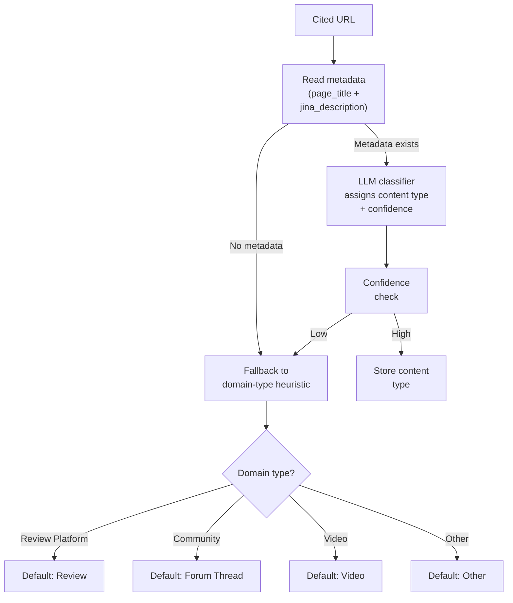

<metadata>
purpose: 13 content types, detection signals, and classification logic — how CheckThat categorizes the specific pages that AI engines cite.
source: https://handbook.growthx.ai/products/checkthat/sources/url-classification
sync_type: auto
access: build-team
last_synced: 2026-03-02
</metadata>

# URL classification

## The question

Within any domain, different pages serve different purposes. A G2 review page and a G2 category comparison page carry different signal. A competitor's pricing page and their blog post tell AI different things. A TechRadar listicle and a TechRadar product deep-dive shape buyer perception differently.

[Domain classification](/products/checkthat/sources/domain-classification) tells you WHO shapes AI's perception. URL classification tells you WHAT content shapes it.

## The 13 content types

Every cited URL is classified into one of 13 types based on page metadata. The taxonomy covers the content formats that AI engines cite in B2B evaluation contexts.

### Product / Feature Page

Vendor's own description of what the product does.

| Detection signals | `page_title` contains product name + "features", "platform", "product"; URL patterns: `/product`, `/features`, `/solutions` |
|---|---|
| **Example** | `ramp.com/features`, `veeam.com/products/cloud-backup` |
| **What it tells AI** | Core capabilities, integrations, scalability claims |
| **Perception attribute** | Drives **Capability** signals |

### Pricing Page

Vendor pricing information — plans, tiers, costs.

| Detection signals | URL: `/pricing`, `/plans`; `page_title` contains "pricing", "plans", "cost" |
|---|---|
| **Example** | `ramp.com/pricing`, `veeam.com/pricing` |
| **What it tells AI** | Price points, tier structure, free tier availability |
| **Perception attribute** | Drives **Value** signals. Most common source of pricing inaccuracy — outdated pricing pages cause misaligned Value scores. |

### Comparison / Versus

Head-to-head comparisons between two or more products.

| Detection signals | `page_title` contains "vs", "versus", "compared", "comparison"; URL: `/compare`, `/vs` |
|---|---|
| **Example** | `g2.com/compare/ramp-vs-brex`, `capterra.com/compare/veeam-vs-acronis` |
| **What it tells AI** | Relative strengths and weaknesses, competitive positioning |
| **Perception attribute** | Drives **Capability** and **Value** (comparative framing). High influence on [AI Endorsement](/products/checkthat/metrics#ai-endorsement) — comparison pages shape whether AI prefers one brand over another. |

### Listicle / Best-Of

Ranked or curated lists of products in a category.

| Detection signals | `page_title` contains "best", "top N", "leading", numbered list format; URL: `/best-`, `/top-` |
|---|---|
| **Example** | `techradar.com/best/backup-software`, `pcmag.com/picks/best-expense-management-software` |
| **What it tells AI** | Category shortlists, recommendations, ranked positioning |
| **Perception attribute** | The single most influential content format for [Presence](/products/checkthat/presence). In the Eon audit, ~80% of AI's "best of" category recommendations traced back to listicle content. A brand absent from top listicles is likely invisible during evaluation. |

### Review

Individual or aggregate user reviews with ratings.

| Detection signals | URL: `/reviews`; `page_title` contains "review", "reviews", "rating"; on review platform domain |
|---|---|
| **Example** | `g2.com/products/ramp/reviews`, `trustradius.com/products/veeam/reviews` |
| **What it tells AI** | User satisfaction, specific strengths and pain points |
| **Perception attribute** | Drives **Trust** and **Support** signals. Review content is the primary input for the [Reputation Score](/products/checkthat/reputation)'s Review Platform Signal (50% weight). |

### Case Study / Testimonial

Customer success stories and use-case documentation.

| Detection signals | `page_title` contains "case study", "how X uses", "customer story", "success story"; URL: `/customers`, `/case-studies` |
|---|---|
| **Example** | `ramp.com/customers/shopify`, `veeam.com/case-studies/enterprise` |
| **What it tells AI** | Real-world validation, specific use cases, named customers |
| **Perception attribute** | Drives **Trust** (social proof) and **Capability** (demonstrated use cases). Case studies carry high credibility because they name specific customers and outcomes. |

### Documentation / How-To

Technical docs, integration guides, setup instructions, tutorials.

| Detection signals | URL: `/docs`, `/help`, `/guide`, `/api`; `page_title` contains "documentation", "how to", "guide", "tutorial" |
|---|---|
| **Example** | `docs.ramp.com/integrations`, `helpcenter.veeam.com/docs` |
| **What it tells AI** | Technical depth, integration ecosystem, implementation complexity |
| **Perception attribute** | Drives **Capability** (integrations, features) and **Usability** (setup complexity, documentation quality). Well-documented products score higher on Usability. |

### Blog / Article

Editorial content, thought leadership, news coverage, analysis.

| Detection signals | URL: `/blog`; `page_title` indicates editorial content; on press/news or tech media domain |
|---|---|
| **Example** | `techcrunch.com/2026/01/ramp-series-d`, `brand.com/blog/product-update` |
| **What it tells AI** | Brand narrative, industry positioning, recent developments |
| **Perception attribute** | Drives **Innovation** (product vision, roadmap, differentiation). Blog content shapes how AI frames a brand's trajectory — "rapidly improving" vs. "hasn't changed." |

### Forum Thread

User discussions on community platforms — questions, answers, recommendations.

| Detection signals | On community domain (Reddit, Stack Overflow, Quora); URL patterns for threads/posts/comments |
|---|---|
| **Example** | `reddit.com/r/Backup/comments/abc123`, `stackoverflow.com/questions/12345` |
| **What it tells AI** | Unfiltered buyer language, authentic recommendations, pain points |
| **Perception attribute** | Drives **Support** (user complaints, help-seeking) and **Usability** (real-world experience). Forum threads carry high authenticity signal — AI engines weight them as unbiased user experience. Reddit is cited in 40%+ of Perplexity responses. |

### Video

Video content on hosting platforms or embedded video pages.

| Detection signals | On video domain (YouTube, Vimeo); `page_title` indicates video content |
|---|---|
| **Example** | `youtube.com/watch?v=abc123` |
| **What it tells AI** | Product demos, tutorials, reviews in video format |
| **Perception attribute** | Variable — depends on video content. Product demos drive **Capability** and **Usability**. Review videos drive **Trust**. A single video can generate hundreds of citations. |

### Market Report

Analyst reports, market maps, industry landscapes.

| Detection signals | `page_title` contains "market", "quadrant", "wave", "landscape", "report"; on analyst domain |
|---|---|
| **Example** | `gartner.com/reviews/market/backup-and-data-protection`, `forrester.com/report/the-forrester-wave` |
| **What it tells AI** | Market positioning, category leadership, competitive landscape |
| **Perception attribute** | Drives **Innovation** (market leadership narrative) and **Trust** (institutional endorsement). Analyst reports carry 1.0 authority weight — maximum credibility. |

### Landing Page

Generic marketing pages without specific content depth.

| Detection signals | Generic marketing language in title; no specific content type signals; URL: `/solutions`, `/enterprise`, `/industries` |
|---|---|
| **Example** | `brand.com/solutions/enterprise`, `brand.com/industries/healthcare` |
| **What it tells AI** | Broad positioning claims, target market signals |
| **Perception attribute** | Low signal density. Landing pages contribute to **Capability** (claimed use cases) but carry less weight than product pages or documentation because they're marketing-oriented. |

### Other

Pages that don't match any content type signals.

| Detection signals | No strong signals detected from title or URL patterns |
|---|---|
| **Example** | Pages with generic titles, broken metadata, or uncommon formats |
| **Perception attribute** | Classified but not weighted. Flagged for manual review if citation volume is significant. |

## How URLs are classified



**Metadata source:** CheckThat already scrapes page content for every citation via the `probe_citations` table. The `jina_title` and `jina_description` fields provide the classification input. No additional scraping is needed.

**LLM classifier:** Uses page title + description to assign a content type with a confidence score. The classification prompt checks against the 13 content type definitions and their detection signals.

**Domain-type fallback:** When page metadata is missing or the classifier has low confidence, the URL inherits a default content type from its domain type. Pages on review platform domains default to "Review." Pages on community domains default to "Forum Thread." This ensures every URL has a classification even when metadata is thin.

**Batch processing:** URL classification runs during snapshot aggregation, not in real-time. New URLs cited in daily probes are classified in batch and stored for all subsequent analysis.

## Which metrics URL classification impacts

### Presence — content format analysis

The [Presence Score](/products/checkthat/presence) measures whether AI recommends a brand during evaluation. URL classification reveals which content formats drive that recommendation.

In the Eon audit, ~80% of AI's category recommendations traced back to listicle content. This means a brand's Presence strategy is largely a listicle strategy — get listed on the "Best X" pages that AI engines cite.

| Content type | Impact on Presence |
|---|---|
| Listicle / Best-Of | Highest impact. Where AI builds "best of" shortlists. Absence = invisibility. |
| Comparison / Versus | High impact for head-to-head queries ("alternatives to X"). |
| Review | Moderate. Reviews influence Presence indirectly through Reputation. |
| Forum Thread | Growing impact. A single Reddit recommendation thread can shift visibility. |

### Perception — attribute attribution

Each content type maps to specific [Perception](/products/checkthat/perception) attributes. When a brand's Value score is low, URL classification can identify the source:

| Content type | Primary attributes | Diagnostic value |
|---|---|---|
| Pricing Page | Value | "AI's pricing info comes from an outdated page — update it" |
| Product / Feature Page | Capability | "AI describes features from your 2024 product page — the 2026 features aren't being cited" |
| Review | Trust, Support | "AI's Trust score is driven by 2-star reviews on G2 — address those reviews" |
| Documentation | Capability, Usability | "AI describes your product as 'complex to set up' — the cited help doc is outdated" |
| Blog / Article | Innovation | "AI frames you as 'stagnant' — the most-cited blog post is 18 months old" |

This connects Perception scores to specific, fixable content. Not "your Usability score is low" but "your Usability score is low because AI cites a 2024 help doc describing a painful setup process that you've since redesigned."

### Influence — source accuracy by content type

The [Influence Score](/products/checkthat/influence) includes External Source Accuracy — whether third-party sources say correct things about a brand. URL classification makes accuracy scoring more meaningful:

- **Pricing pages** should be accurate — if AI cites an outdated pricing page, that's a high-priority fix
- **Forum threads** may contain opinions, not facts — accuracy scoring is less applicable
- **Listicles** should be current — if the most-cited listicle describes your product's 2024 feature set, that's a fixable problem

Content type determines whether a source accuracy gap is a content problem (fix the source) or a structural problem (you can't control Reddit opinions).

## The content type x domain type matrix

The two classification layers combine for richer diagnostics. A single domain can host multiple content types, and the distribution matters:

```
G2 (Review Platform):
  Reviews:      60%  ← primary signal, buyer-generated
  Comparisons:  25%  ← high influence on head-to-head queries
  Category:     15%  ← market landscape framing

TechRadar (Tech Media):
  Listicles:    85%  ← "Best X" pages dominate
  Articles:     15%  ← editorial coverage

Competitor.com (Competitor):
  Blog:         80%  ← thought leadership driving narrative
  Pricing:      15%  ← pricing info AI cites for comparison
  Docs:          5%  ← technical details
```

The matrix reveals strategic priorities. If 85% of TechRadar citations come from a single "Best Backup Software 2026" listicle, that one page controls 13% of the entire citation landscape. Getting listed on that page is a high-leverage action.

## Worked example: Cloud Backup (Eon)

Applying URL classification to the top 25 cited URLs from Eon's category:

| Rank | URL (simplified) | Domain Type | Content Type | Citations | Strategic Note |
|---|---|---|---|---|---|
| 1 | gartner.com/reviews/market/backup | Review Platform | Market Report | 1,460 | Gartner PI market page — surged from near-zero. Customer reviews here directly shape AI. |
| 2 | techradar.com/best/backup-software | Tech Media | Listicle | 1,200+ | The single most-cited page. Eon is absent. Getting listed here changes everything. |
| 3 | pcmag.com/picks/best-backup | Tech Media | Listicle | 800+ | Second listicle. Same pattern — Eon missing. |
| 4 | acronis.com/blog/cloud-backup-guide | Competitor | Blog | 650+ | Competitor thought leadership. AI cites this when explaining the category. |
| 5 | reddit.com/r/Backup/comments/... | Community | Forum Thread | 106 | Single thread, 106 citations. Authentic recommendations carry high weight. |
| 6 | youtube.com/watch?v=... | Video | Video | 210 | Single video, 210 citations. Demonstrates the outsized impact of individual content pieces. |

**What the classification reveals:**

- **Listicles dominate.** Two listicle pages account for ~2,000 citations. Eon's absence from both is the primary driver of zero Presence.
- **Gartner PI is surging.** A review platform market report page went from near-zero to the #1 cited source. Customer reviews on Gartner PI are now the most influential single source in this category.
- **Competitor blogs drive narrative.** Acronis's blog is cited 650+ times — not because AI recommends Acronis, but because Acronis's content *explains the category*. AI uses competitor content as educational material.
- **Single content pieces have outsized impact.** One Reddit thread (106 citations), one YouTube video (210 citations). Content that resonates creates disproportionate citation volume.

The strategic playbook by content type:

1. **Listicles:** Get on TechRadar and PCMag's "Best Backup" lists
2. **Reviews:** Build Gartner PI review volume (the market report page cites customer reviews)
3. **Blog:** Create category-defining content that AI cites as educational material (the Acronis playbook)
4. **Forum:** Participate authentically in r/Backup discussions
5. **Video:** Create one definitive video — product overview or category comparison

## Related resources

- [Sources overview](/products/checkthat/sources/overview) — what sources are and the two-layer model
- [Domain Classification](/products/checkthat/sources/domain-classification) — the 11 domain types and authority weights
- [Perception Score](/products/checkthat/perception) — the six attributes that content types map to
- [Influence Score](/products/checkthat/influence) — source accuracy and citation analysis
