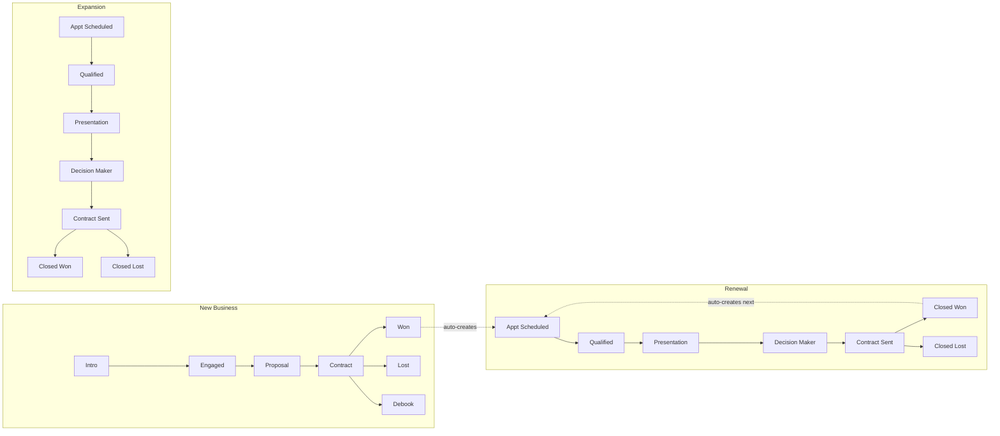
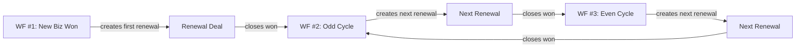
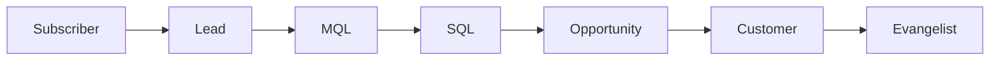
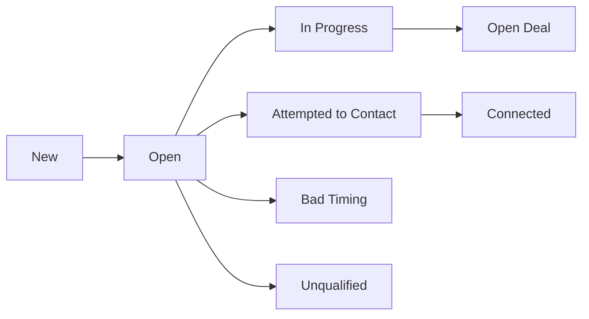
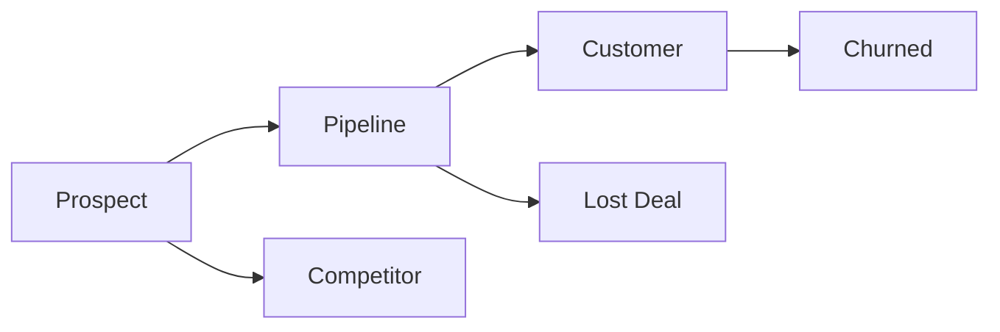

<metadata>
purpose: Deal pipelines, lifecycle stages, lead status, and account stages in GrowthX HubSpot.
source: https://handbook.growthx.ai/systems/hubspot/pipelines-and-lifecycle
sync_type: auto
access: build-team
last_synced: 2026-03-02
</metadata>

# Pipelines and lifecycle

## Deal pipelines

GrowthX has 3 deal pipelines reflecting the full customer lifecycle — from first conversation through renewal.

### New Business pipeline

The primary sales pipeline. Deals follow a simplified, GrowthX-specific flow.

<Steps>
  <Step title="Intro">
    First conversation scheduled or held. Deal created, contact set to MQL.
  </Step>
  <Step title="Engaged">
    Prospect is actively in discussions. Discovery and qualification underway.
  </Step>
  <Step title="Proposal">
    Scope and pricing shared. SEMrush data pushed to the deal automatically.
  </Step>
  <Step title="Contract">
    SoW or contract in review. At this stage, a Growth Execution deal is auto-generated if the contract type is Sprint.
  </Step>
  <Step title="Won">
    Deal closed, contract signed. Triggers: renewal deal creation, company set to Customer, line item validation.
  </Step>
  <Step title="Lost">
    Deal did not close. Closed Lost Reason captured.
  </Step>
  <Step title="Debook">
    Won deal reversed or canceled before kickoff.
  </Step>
</Steps>

### Expansion pipeline

For upsells on existing client accounts.

| Stage | Description |
|-------|-------------|
| Appointment Scheduled | Upsell conversation booked |
| Qualified To Buy | Budget and need confirmed |
| Presentation Scheduled | Proposal meeting set |
| Decision Maker Bought-In | Exec sponsor aligned |
| Contract Sent | SoW sent for signature |
| Closed Won / Closed Lost | Final outcome |

### Renewal pipeline

Renewal deals are auto-created when a New Business deal closes won. The renewal chain uses a 3-workflow system:

Renewal alerts fire automatically:

| Alert | Timing | Channel |
|-------|--------|---------|
| Early warning | 90 days before renewal | Slack |
| Active alert | 60 days before renewal | Slack |
| Urgent alert | 30 days before renewal | Slack |

---

## Contact lifecycle stages

Lifecycle stages track how a contact progresses from first touch to customer.

| Stage | How contacts enter |
|-------|-------------------|
| **Subscriber** | Newsletter signup, form fill with no sales intent |
| **Lead** | Form submission, imported list |
| **MQL** | Auto-set when a deal is created for the contact |
| **SQL** | Manual promotion by sales |
| **Opportunity** | Active deal in pipeline |
| **Customer** | Deal closed won |
| **Evangelist** | Manual — champion or reference customer |

<Note>
When a deal is created, the primary contact is automatically set to MQL and a Lead object is created.
</Note>

---

## Contact lead status

Lead status tracks the sales outreach state of a contact, independent of lifecycle stage.

| Status | Meaning |
|--------|---------|
| **New** | Just entered the system, no outreach yet |
| **Open** | Assigned, ready for outreach |
| **In Progress** | Active outreach underway |
| **Open Deal** | Deal created, in pipeline |
| **Attempted to Contact** | Outreach sent, no response |
| **Connected** | Conversation established |
| **Bad Timing** | Interested but not ready |
| **Unqualified** | Does not meet criteria |

---

## Company account stage

Account stage tracks the overall relationship status at the company level.

| Stage | Description | How it's set |
|-------|-------------|-------------|
| **Prospect** | Not yet in active sales | Default state |
| **Pipeline** | Active deal in pipeline | When deal is created |
| **Customer** | Active client | Workflow on deal close |
| **Churned** | Former client | Manual |
| **Lost Deal** | Had a deal, didn't close | Manual or workflow |
| **Competitor** | Identified competitor | Manual |

---

## Company fit score (ICP alignment)

Measures how closely a company matches the GrowthX ideal customer profile. Calculated by a workflow that fires when revenue or funding data updates.

| Score | Meaning |
|-------|---------|
| **Good** | Strong ICP fit — priority target |
| **Medium** | Acceptable, moderate priority |
| **Low** | Poor fit for GrowthX services |

The fit score is synced from the Company record to all associated Contacts.
