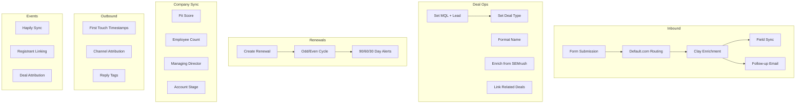
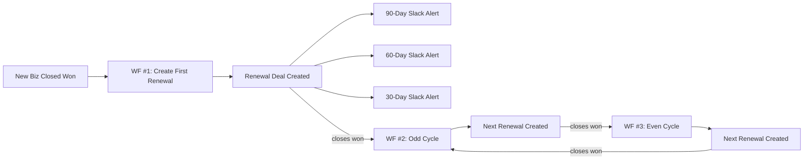

<metadata>
purpose: All active HubSpot workflows at GrowthX — inbound, deal management, renewals, data sync, outbound tracking, and events.
source: https://handbook.growthx.ai/systems/hubspot/workflows-and-automations
sync_type: auto
access: build-team
last_synced: 2026-03-02
</metadata>

# Workflows and automations

GrowthX runs 50+ active workflows in HubSpot, organized into 6 categories.

## Inbound workflows

These workflows handle everything from form submission to enriched contact creation.

<Accordion title="New Sales Inbound Submission (via Default)">
  **Status**: Active &middot; **Object**: Contact &middot; **109 revisions**

  The main inbound flow. When a prospect fills out the sales form:
  1. Default.com routes the submission
  2. Clay enriches the contact and company with firmographic and traffic data
  3. Enrichment data syncs to standard contact and company fields
  4. If no meeting is booked, triggers outreach via Zapier

  This is the most-revised workflow in the system.
</Accordion>

<Accordion title="New Sales Inbound - Did Not Complete 2nd Form">
  **Status**: Active &middot; **Object**: Contact

  Follow-up automation for prospects who started but didn't complete the second form in the Default.com flow.
</Accordion>

<Accordion title="Push Default Enrichment to Contact Main Fields">
  **Status**: Active &middot; **Object**: Contact

  Copies enrichment data from Default/Clay-specific fields to standard HubSpot contact fields where they're empty.
</Accordion>

<Accordion title="Push Default Enrichment to Company Main Fields">
  **Status**: Active &middot; **Object**: Contact

  Same as above, but syncs enrichment data to the associated company record.
</Accordion>

<Accordion title="AI-Led Growth Resource Request">
  **Status**: Active &middot; **Object**: Contact &middot; **34 revisions**

  Delivers content (lead magnets) when prospects fill out a resource request form. Uses the Content Name and Content URL properties to dynamically populate the delivery email.
</Accordion>

<Accordion title="Send follow-up email after form submission">
  **Status**: Active &middot; **Object**: Contact

  Generic follow-up email triggered by form submissions.
</Accordion>

---

## Deal pipeline management

These workflows automate deal creation, naming, enrichment, and validation.

<Accordion title="Based on Pipeline, set Deal Type">
  **Status**: Active &middot; **Object**: Deal

  Automatically sets the Deal Type (New Business, Expansion, Renewal) based on which pipeline the deal is in.
</Accordion>

<Accordion title="Deal - New Biz Pipe - Update Deal Name">
  **Status**: Active &middot; **Object**: Deal

  Auto-formats deal names to the convention: `{Company} - {Type} - {Month Year}`
</Accordion>

<Accordion title="Push Company SEMrush data to Newly Created New Biz Deal">
  **Status**: Active &middot; **Object**: Deal

  When a new deal is created in the New Business pipeline, pulls SEMrush traffic data from the associated company onto the deal for quick reference during qualification.
</Accordion>

<Accordion title="Auto Generate Growth Deal for Sprint entering Contract Stage">
  **Status**: Active &middot; **Object**: Deal

  When a Sprint deal moves to the Contract stage, automatically creates a linked Growth Execution deal.
</Accordion>

<Accordion title="Make primary contact MQL when deal is created">
  **Status**: Active &middot; **Object**: Deal

  Sets the primary contact's lifecycle stage to MQL when any deal is created.
</Accordion>

<Accordion title="Create lead when MQL created">
  **Status**: Active &middot; **Object**: Contact

  Creates a Lead object when a contact becomes an MQL.
</Accordion>

<Accordion title="Stamp Close Date on Won/Lost Deals">
  **Status**: Active &middot; **Object**: Deal

  Auto-sets the close date timestamp when a deal moves to Won or Lost.
</Accordion>

<Accordion title="Confirm Line Items value for Closed Won New Biz">
  **Status**: Active &middot; **Object**: Deal

  Validates that line items are present and match the deal amount before allowing Closed Won.
</Accordion>

<Accordion title="Populate Contract End Date">
  **Status**: Active &middot; **Object**: Deal

  Calculates the contract end date from start date + term length.
</Accordion>

<Accordion title="Contract is Active - T/F">
  **Status**: Active &middot; **Object**: Deal

  Sets a boolean flag indicating whether the contract is currently active based on dates and deal stage.
</Accordion>

<Accordion title="Data Update - Attribution Valid?">
  **Status**: Active &middot; **Object**: Deal

  Validates attribution data on deals to ensure reporting accuracy.
</Accordion>

---

## Renewal automation

A 3-workflow chain that automatically creates and manages renewal deals.

<Accordion title="Create Renewal - WF #1 | Closed Won New Business">
  **Status**: Active &middot; **Object**: Deal &middot; **34 revisions**

  Triggered when a New Business deal closes won. Creates the first renewal deal with:
  - Renewal date = contract end date + 1
  - Prior deal information linked
  - Contract terms copied
</Accordion>

<Accordion title="Create Renewal - WF #2 | Renewal Cycle = Odd">
  **Status**: Active &middot; **Object**: Deal &middot; **22 revisions**

  Handles odd-numbered renewal cycles. When a renewal deal closes won, creates the next renewal deal.
</Accordion>

<Accordion title="Create Renewal - WF #3 | Renewal Closed Won - Cycle = Even">
  **Status**: Active &middot; **Object**: Deal

  Handles even-numbered renewal cycles. Alternates with WF #2 to maintain the renewal chain.
</Accordion>

<Accordion title="90 / 60 / 30 Day Renewal Alerts">
  **Status**: Active &middot; **Object**: Deal

  Three workflows that send Slack notifications at 90, 60, and 30 days before a renewal date.
</Accordion>

<Accordion title="Closed Lost Renewals">
  **Status**: Active &middot; **Object**: Deal

  Handles cleanup when a renewal deal is closed lost (churn).
</Accordion>

---

## Company data sync

Workflows that keep company data in sync with contacts and calculate scoring.

<Accordion title="Set Company Fit Score | Revenue or Funding Updated">
  **Status**: Active &middot; **Object**: Company

  Calculates the ICP Fit Score (Good / Medium / Low) when a company's revenue or funding data changes.
</Accordion>

<Accordion title="Sync Company Fit Score to Contacts">
  **Status**: Active &middot; **Object**: Company

  Copies the company's Fit Score to all associated contacts.
</Accordion>

<Accordion title="Sync Company # of Employees to Contacts">
  **Status**: Active &middot; **Object**: Company

  Copies the employee count to all associated contacts (needed because the contact-level employee property is an enum, not a number).
</Accordion>

<Accordion title="Sync Company Managing Director to Contacts">
  **Status**: Active &middot; **Object**: Company

  Syncs the Engagement Manager name to all associated contacts.
</Accordion>

<Accordion title="Sync Deal Count to Contacts">
  **Status**: Active &middot; **Object**: Company

  Syncs the company's deal count to associated contacts.
</Accordion>

<Accordion title="Set Account Potential - Funding/Establishment">
  **Status**: Active &middot; **Object**: Company

  Calculates the account potential score based on funding and establishment data.
</Accordion>

<Accordion title="Set Account Stage to Customer">
  **Status**: Active &middot; **Object**: Company

  Sets the company's Account Stage to "Customer" when a deal closes won.
</Accordion>

<Accordion title="Set Enrichment Status | Clay Enrichment Date Set">
  **Status**: Active &middot; **Object**: Company

  Flags a company as enriched when the Clay Enrichment Date is set.
</Accordion>

---

## Outbound tracking

Workflows that track attribution across outbound channels.

<Accordion title="First Instantly Touch Date Timestamp">
  **Status**: Active &middot; **Object**: Contact

  Records the first time a contact was touched by an Instantly email campaign.
</Accordion>

<Accordion title="First HeyReach Touch Date Timestamp">
  **Status**: Active &middot; **Object**: Contact

  Records the first time a contact was touched by a HeyReach LinkedIn campaign.
</Accordion>

<Accordion title="Best Performing Channel">
  **Status**: Active &middot; **Object**: Contact

  Calculates which outbound channel performed best for each contact.
</Accordion>

<Accordion title="First Touch Channel">
  **Status**: Active &middot; **Object**: Contact

  Records which channel made first contact.
</Accordion>

<Accordion title="Active on HeyReach and Instantly Update">
  **Status**: Active &middot; **Object**: Contact

  Flags contacts that are active on both outbound platforms.
</Accordion>

<Accordion title="Has Replied tag">
  **Status**: Active &middot; **Object**: Contact

  Tags contacts who have replied to outbound campaigns.
</Accordion>

---

## Event tracking (Hapily / Luma)

Workflows that sync Luma events to HubSpot and handle event attribution.

<Accordion title="Hapily Sync Webhooks (5 workflows)">
  **Status**: Active &middot; **Objects**: Events, Sessions, Registrants

  Webhook-triggered workflows that sync data from Luma to HubSpot custom objects when events, sessions, or registrants are created or updated.
</Accordion>

<Accordion title="New Registrant Created">
  **Status**: Active &middot; **Object**: Hapily Registrant &middot; **14 revisions**

  When a new registrant syncs from Luma, links them to the matching HubSpot contact and associated company.
</Accordion>

<Accordion title="Registrant Attends">
  **Status**: Active &middot; **Object**: Hapily Registrant

  Updates contact and company records when a registrant actually attends an event.
</Accordion>

<Accordion title="Company Associated to Event">
  **Status**: Active &middot; **Object**: Company

  Handles company-level event association and tracking.
</Accordion>

<Accordion title="Deal Attribution - Influenced Creation">
  **Status**: Active &middot; **Object**: Deal

  When a deal is created, checks if the associated contact attended an event before the deal was created. If so, associates the event to the deal as an influenced creation.
</Accordion>

<Accordion title="Deal Attribution - Influenced Close">
  **Status**: Active &middot; **Object**: Deal

  When a deal closes won, checks if the associated contact attended an event before the close. If so, associates the event to the deal as an influenced close.
</Accordion>

<Accordion title="Events - Copy Luma data from contact to company">
  **Status**: Active &middot; **Object**: Contact

  Copies Luma event data from individual contacts up to the associated company for company-level event reporting.
</Accordion>
