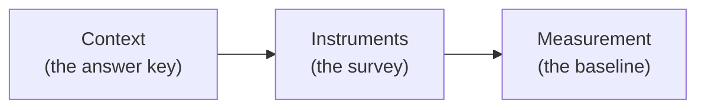

<metadata>
purpose: The framework for configuring a new brand in CheckThat — from context to prompts to first measurement.
source: https://handbook.growthx.ai/tutorials/checkthat-brand-setup
sync_type: auto
access: build-team
last_synced: 2026-03-02
</metadata>

# Brand setup methodology

## The framework

Setting up a brand in CheckThat follows the same logic as designing a brand research study. You need three things before you can measure anything:

1. **Context** — the answer key (what IS true about this brand)
2. **Instruments** — the survey (which prompts to run against AI engines)
3. **Measurement** — the baseline (what the scores mean on day one)

Each phase builds on the previous one. Context informs which prompts matter. Prompts determine which scores you can compute. Scores only make sense when you have context to align against.



---

## Phase 1: Context — the answer key

Context is the foundation. Without it, CheckThat can tell you what AI says about a brand — but not whether AI is right. Context turns monitoring into measurement.

### The seven brand context elements

Every brand has seven elements that together define what truth looks like. This is the answer key that Perception scores are measured against.

| Element | What it captures | Why it matters |
|---|---|---|
| **Company** | Name, description, founding, stage, size, headquarters | The basic facts AI should get right |
| **Products** | What they sell, key features, product lines | What Capability scores are measured against |
| **Positioning** | How the brand wants to be perceived, core narrative | What Innovation and narrative alignment are measured against |
| **Pricing** | Plans, price points, model, free tier | What Value scores are measured against — wrong pricing in AI = lost deals |
| **Differentiators** | What makes them different (their claim, not ours) | What Innovation scores look for in AI's narrative |
| **Target personas** | Who buys, roles, pain points, buying triggers | Determines which context modifiers matter for prompts |
| **Competitor context** | Top competitors with their positioning | Determines which comparison and alternatives prompts to run |

### Context completeness

Not all seven elements are required on day one. But more context means more accurate alignment insights.

| Completeness | What you get |
|---|---|
| **2 of 7** (minimum: Company + Products) | Presence and Perception scores. Basic alignment flags for features and facts. |
| **3-4 of 7** (+ Positioning or Pricing) | Deeper alignment: positioning match, pricing accuracy flags. Misalignment detection becomes useful. |
| **5-7 of 7** (full context) | Full alignment across all 6 Perception attributes. Differentiator recognition. Competitor-aware diagnostics. |

The principle: **confirm, don't construct.** For brands already in the index (5,828+), CheckThat has pre-existing data. The setup process should show what we already know and ask the user to confirm or correct — not ask them to fill forms from scratch.

### Market and buyer context

Beyond the brand itself, two additional context layers complete the picture:

**Market context** — the competitive landscape. Which category does this brand compete in? What are the sub-segments? Who are the other players? How is the market evolving? Market context determines which prompts are relevant and which brands to benchmark against.

**Buyer context** — the people who buy. Which personas matter? What are their buying criteria? What questions do they ask at each stage of the buying journey? Buyer context determines which prompt patterns to prioritize and which context modifiers (industry, company size, role) to apply.

### The generation chain

For new brands, context can be generated in sequence:

```
Company URL → Brand context (auto-generated, confirm/edit)
           → Market context (category, players, dynamics)
           → Buyer context (personas, criteria, questions by stage)
           → Workspace taxonomy (topic clusters, context modifiers)
```

Each step uses the previous step's output as input. The whole chain runs automatically. The user reviews and confirms.

---

## Phase 2: Instruments — the survey

Prompts are not random questions. They're research instruments — classified, quality-scored, and designed to measure specific things. The goal is a prompt library that covers the brand's AI presence comprehensively, with no blind spots and no wasted prompts.

### The prompt-to-score relationship

Different prompts feed different scores. This is the most important thing to understand when designing a prompt library:

| Prompt type | What it feeds | Example |
|---|---|---|
| **Unbranded, evaluation-stage** | **Presence** | "Best expense management tools for startups" |
| **Branded evaluation** | **Perception** | "Ramp vs Brex for series A startups" |
| **Review/reputation queries** | **Perception** (Trust, Support) | "Ramp reviews 2026" |
| **Feature/capability queries** | **Perception** (Capability) | "Does Ramp integrate with NetSuite?" |
| **Pricing queries** | **Perception** (Value) | "Ramp pricing vs Brex pricing" |
| **Alternatives-to queries** | **Presence** + Perception | "Alternatives to Brex" (Presence if your brand isn't named) |

The split is crisp: if the brand name is NOT in the prompt, it feeds Presence. If the brand name IS in the prompt, it feeds Perception. Unbranded prompts tell you whether AI recommends the brand. Branded prompts tell you what story AI tells.

### Six prompt categories

Every brand's prompt library should cover six categories. These map to the six types of questions buyers actually ask during evaluation:

| Category | Pattern | What it measures |
|---|---|---|
| **Direct Comparison** | "[Brand A] vs [Brand B]" | Head-to-head perception. How AI frames the matchup. |
| **Alternatives To** | "Alternatives to [Competitor]" | High-intent switching. Does AI recommend you when buyers want to leave a competitor? |
| **Category + Use Case** | "Best [category] for [constraint]" | Shortlist building. The most important Presence prompts. |
| **Review & Reputation** | "[Brand] reviews" / "Is [Brand] good for [use case]?" | Trust validation. What AI says when buyers fact-check you. |
| **Pricing & Cost** | "[Brand] pricing" / "Best [category] under $X" | Value perception. Whether AI has correct pricing. |
| **Feature & Integration** | "Does [Brand] have [feature]?" | Capability validation. Whether AI knows what the product does. |

### Prompt classification

Every prompt gets classified across six independent axes. This turns a wall of text into structured, filterable, analyzable data:

| Axis | What it captures | Why it matters |
|---|---|---|
| **Market** (WHERE) | Category + topic cluster | Group prompts by market segment |
| **Intent** (WHAT action) | Learn, Explore, Compare, Validate, Act | Know what cognitive action the buyer is performing |
| **Buyer Stage** (WHEN) | Problem Recognition → Decision | Focus resources on the stages that convert |
| **Question Type** (WHAT kind) | 16 types (Direct Comparison, Best-of-Category, etc.) | Structured analysis by prompt pattern |
| **Context Modifiers** (WHO) | Industry, company size, role, use case, geography | Segment performance by buyer profile |
| **Measurement Purpose** (WHY) | Presence, Reputation, Perception, Influence | Know which score each prompt feeds |

Without classification, you have a list of prompts. With it, you can ask: "How are we doing on comparison prompts in the evaluation stage for enterprise buyers in healthcare?"

### Prompt quality scoring

Not all prompts are equally valuable. Five dimensions score each prompt (1-5 each, max 25):

| Dimension | What it evaluates |
|---|---|
| **Buyer Realism** | Would a real buyer actually ask this? |
| **Commercial Intent** | Does this query signal buying intent? |
| **Measurement Value** | Does the AI response produce scorable data? |
| **Competitive Differentiation** | Does this prompt reveal competitive dynamics? |
| **Volume Proxy** | Does this represent a high-frequency buyer question? |

Quality scores create priority tiers:
- **Tier 1** (20-25): Track weekly. These are your highest-value prompts.
- **Tier 2** (15-19): Track bi-weekly. Solid prompts that round out coverage.
- **Tier 3** (10-14): Track monthly. Lower priority but fill coverage gaps.
- **Tier 4** (under 10): Deprioritize. Low measurement value.

### How many prompts

The right size depends on the brand's maturity and tier:

| Maturity | Prompt count | Coverage |
|---|---|---|
| **Getting started** | 50-100 | Top 2-3 competitors, primary use case, core category prompts |
| **Growing** | 200-500 | Multiple personas, industries, broader competitor set |
| **Enterprise** | 500+ | Full matrix coverage, multi-segment, multi-region |

For reliable Perception scoring, minimum prompt volumes per attribute:

| Attribute | Minimum | Recommended |
|---|---|---|
| Capability | 8 | 15-25 |
| Usability | 5 | 10-15 |
| Value | 5 | 10-15 |
| Trust | 5 | 10-15 |
| Support | 5 | 8-12 |
| Innovation | 5 | 8-12 |
| **Total** | **33** | **66-94** |

### The competitor parity rule

For every prompt mentioning the brand, run the exact same prompt for the top 3 competitors. If AI says "steep learning curve" for everyone in the category, it's a category trait, not a brand flaw. Without competitor context, you're measuring in a vacuum.

---

## Phase 3: Measurement — the baseline

Once context is populated and prompts are running, the first scores arrive. Here's how to think about day-one results.

### What to expect on day one

First results are a snapshot, not a verdict. AI visibility is volatile — only 30% of brands maintain stable visibility, and less than 1% of responses produce identical brand lists across two runs. A single measurement is directional, not definitive.

**For Presence:** The first read tells you whether AI includes this brand during evaluation at all. A Presence Score above 40 means AI knows the brand exists in the category. Below 20 means the brand is effectively invisible to AI buyers.

**For Reputation:** This score populates from external data (reviews, press, community) independent of AI. It should be relatively stable from day one. If Reputation is high but Presence is low, the brand has a distribution problem — the market signal exists but AI isn't picking it up.

**For Perception:** Requires enough branded prompt responses to score the six attributes. The first read shows AI's current narrative. Compare each attribute against brand context to identify misalignment flags. Focus on the attributes that matter most for this brand's category.

**For Influence:** The diagnostic layer. On day one, look at the source map — which domains does AI cite when talking about this brand? High own-domain citation rate means the brand's content has authority. Low own-domain citation rate means third parties control the narrative.

### The four quadrants on the AI Benchmark

Map the brand's Presence (X) and Perception (Y) to the benchmark:

| Quadrant | Meaning | First action |
|---|---|---|
| **AI Leader** (top-right) | AI recommends and describes well | Defend — monitor weekly, watch for competitive shifts |
| **At Risk** (bottom-right) | AI recommends but gets the story wrong | Fix narrative — use Perception attributes to find what's dragging the score |
| **Hidden Gem** (top-left) | Great story but AI doesn't recommend | Fix distribution — build citations, schema, third-party mentions |
| **Off the Map** (bottom-left) | Starting from scratch | Build Reputation first — reviews, press, community. AI follows. |

### Interpreting score gaps

The gaps between scores are diagnostic. On day one, look for these patterns:

| Pattern | Diagnosis | Priority |
|---|---|---|
| High Reputation + Low Presence | Market signal exists but AI isn't picking it up | Technical AEO — content structure, schema markup |
| High Reputation + Low Perception | AI misinterprets strong external signals | Adjust content for AI consumption |
| High Presence + Low Perception | Visible but misrepresented | Use Influence to find which sources feed the bad narrative |
| Low Influence + Low Perception | No reliable source material for AI | Build both owned and third-party content |

### Cadence

| Action | Frequency |
|---|---|
| Review AI Brand Health score | Weekly |
| Review Presence changes | Weekly |
| Deep Perception attribute review | Bi-weekly |
| Influence source map check | Monthly |
| Prompt library review and expansion | Monthly |
| Full competitive benchmark | Monthly |

---

## Principles

Five principles that apply across all three phases:

**1. Confirm, don't construct.** For brands in the index, show what we know and ask users to confirm. Don't make them fill empty forms.

**2. Context drives alignment.** Without brand context, you're monitoring. With it, you're measuring. More context = more accurate misalignment detection.

**3. Prompts are instruments, not keywords.** Each prompt is designed to measure something specific. Classify and quality-score every prompt before tracking it.

**4. Unbranded feeds Presence, branded feeds Perception.** The split is non-negotiable. If the brand name is in the prompt, it's not measuring Presence.

**5. Measure as a percentage, not a point.** AI is probabilistic. Any single response is noise. Visibility is a percentage across 30-100 runs. Check weekly, not daily. Ignore fluctuations under 10%.

---

## Related resources

- [CheckThat methodology](/products/checkthat/methodology) — the 4-score framework (Presence, Reputation, Perception, Influence)
- [CheckThat AI Benchmark](/products/checkthat/benchmark) — the 2x2 category visualization
- [Buyer evaluation playbook](/guides/marketing/aeo-buyer-evaluation) — the 6 prompt categories in depth
- [Prompt writing methodology](/guides/marketing/aeo-prompt-writing) — how to write reliable, unbiased monitoring prompts
- [Prompt prioritization](/guides/marketing/aeo-prompt-prioritization) — how to choose and prioritize which prompts to track
