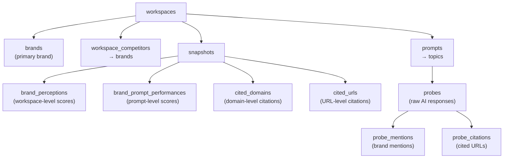

<metadata>
purpose: How to query the CheckThat database directly — schema, patterns, and ready-to-use SQL for brand analysis.
source: https://handbook.growthx.ai/tutorials/checkthat-db-queries
sync_type: auto
access: build-team
last_synced: 2026-03-02
</metadata>

# Querying CheckThat data

## When to query the database

The CheckThat UI shows scores, trends, and benchmarks. But sometimes you need to go deeper — compare specific metrics across dates, pull raw probe responses, analyze citation patterns, or answer a question the UI doesn't have a view for.

All queries run through the **Render MCP** tool (`query_render_postgres`). They're read-only — you can't break anything.

**Common use cases:**

- Pull a competitive leaderboard for a client call
- Trace which prompts a brand wins vs. loses
- Find the top cited domains shaping AI's perception of a category
- Inspect raw AI responses to understand why a brand scores the way it does
- Build a trend analysis across specific date ranges

---

## Prerequisites

You need access to the Render MCP server configured in your environment. The connection details:

| Parameter | Value |
|---|---|
| MCP Tool | `query_render_postgres` |
| Postgres ID | `dpg-d2sbu3odl3ps73ebrvkg-a` |
| Database | `checkthat_pg` |
| Read Replica | `dpg-d2sbu3odl3ps73ebrvkg-b` |

<Warning>
All queries are wrapped in a read-only transaction by the MCP tool. You cannot INSERT, UPDATE, or DELETE.
</Warning>

---

## The data model

CheckThat's database follows a snapshot architecture. AI engines are probed daily, responses are analyzed, and metrics are aggregated into snapshots at different scopes.



### Snapshots — the core concept

Snapshots are the heart of the data model. Every day, CheckThat captures metrics at multiple scopes:

| Scope | Metrics Table | What It Tracks |
|---|---|---|
| `Workspace` | `brand_perceptions` | Overall brand scores for the day |
| `Subcategorization` | `brand_perceptions` | Brand scores within a subcategory |
| `Prompt` | `brand_prompt_performances` | Per-prompt brand metrics |
| `Workspace` | `cited_domains` | Domain-level citation tracking |
| `Workspace` | `cited_urls` | URL-level citation tracking |

The `snapshots` table connects everything — it links a workspace, brand, date, scope, and metrics table together. Most queries join through snapshots.

### AI engines tracked

| Vendor | Model |
|---|---|
| Anthropic | claude-haiku-4-5 |
| Google Gemini | gemini-2.0-flash |
| Google AI Overview | ai-overview |
| OpenAI | gpt-5-mini |
| Perplexity | sonar |

---

## Finding your workspace

Every query needs a workspace ID. If you know the workspace name, find it:

```sql
SELECT w.id, w.name, b.name AS brand, w.pricing_plan, w.created_at
FROM workspaces w
JOIN brands b ON w.brand_id = b.id
WHERE w.deleted_at IS NULL
ORDER BY w.name;
```

Once you have the workspace UUID, replace `'WORKSPACE_ID'` in every query below.

<Tip>
For the queries that follow, all placeholder values are marked with `'WORKSPACE_ID'`. Replace this with the actual UUID before running.
</Tip>

---

## Query recipes

### Get the lay of the land

Start here. This tells you what data exists for a workspace — how many prompts, competitors, and days of tracking.

```sql
SELECT
  w.name AS workspace,
  b.name AS primary_brand,
  b.url,
  w.pricing_plan,
  w.created_at,
  (SELECT COUNT(*) FROM prompts WHERE workspace_id = w.id) AS prompt_count,
  (SELECT COUNT(*) FROM workspace_competitors WHERE workspace_id = w.id) AS competitor_count,
  (SELECT COUNT(DISTINCT captured_date) FROM snapshots WHERE workspace_id = w.id) AS tracking_days,
  (SELECT MIN(captured_date) FROM snapshots WHERE workspace_id = w.id) AS first_tracked,
  (SELECT MAX(captured_date) FROM snapshots WHERE workspace_id = w.id) AS last_tracked
FROM workspaces w
JOIN brands b ON w.brand_id = b.id
WHERE w.id = 'WORKSPACE_ID';
```

**What to look for:** `tracking_days` tells you how much history exists. If it's under 7, trend data will be thin. `prompt_count` should match what's configured in the UI.

### List competitors

```sql
SELECT b.name, b.url, b.domain
FROM workspace_competitors wc
JOIN brands b ON wc.brand_id = b.id
WHERE wc.workspace_id = 'WORKSPACE_ID'
ORDER BY b.name;
```

---

### Competitive leaderboard (latest snapshot)

The most common query. Shows every brand in the workspace ranked by visibility on the most recent date.

```sql
SELECT
  s.captured_date,
  b.name AS brand,
  bp.visibility_score,
  bp.sentiment_score,
  bp.citation_rate,
  bp.citation_share,
  bp.avg_position,
  bp.top3_percentage,
  bp.total_mentions,
  bp.total_citations,
  bp.total_probes
FROM snapshots s
JOIN brand_perceptions bp
  ON s.snapshotable_id = bp.id
  AND s.snapshotable_type = 'BrandPerception'
JOIN brands b ON s.brand_id = b.id
WHERE s.workspace_id = 'WORKSPACE_ID'
  AND s.scope_type = 'Workspace'
  AND s.captured_date = (
    SELECT MAX(captured_date)
    FROM snapshots
    WHERE workspace_id = 'WORKSPACE_ID'
  )
ORDER BY bp.visibility_score DESC;
```

**How to read the results:**

| Column | What It Means |
|---|---|
| `visibility_score` | Presence Rate — % of probes where the brand is mentioned |
| `sentiment_score` | Overall sentiment (0-100) |
| `citation_rate` | % of probes where the brand's domain is cited |
| `citation_share` | Brand's citations as % of all citations |
| `avg_position` | Average rank when mentioned (lower = better) |
| `top3_percentage` | % of mentions where brand appears in positions 1-3 |

---

### Brand trend over time

Track how the primary brand's metrics change day-to-day. Use this for client reporting or to spot the impact of content changes.

```sql
SELECT
  s.captured_date,
  bp.visibility_score,
  bp.sentiment_score,
  bp.citation_rate,
  bp.citation_share,
  bp.total_mentions,
  bp.total_citations
FROM snapshots s
JOIN brand_perceptions bp
  ON s.snapshotable_id = bp.id
  AND s.snapshotable_type = 'BrandPerception'
JOIN workspaces w
  ON w.id = 'WORKSPACE_ID'
  AND s.brand_id = w.brand_id
WHERE s.workspace_id = 'WORKSPACE_ID'
  AND s.scope_type = 'Workspace'
ORDER BY s.captured_date DESC;
```

### Competitor trend comparison

Same as above, but for all brands in the workspace. Useful for visualizing competitive movement.

```sql
SELECT
  s.captured_date,
  b.name AS brand,
  bp.visibility_score,
  bp.sentiment_score,
  bp.citation_rate
FROM snapshots s
JOIN brand_perceptions bp
  ON s.snapshotable_id = bp.id
  AND s.snapshotable_type = 'BrandPerception'
JOIN brands b ON s.brand_id = b.id
WHERE s.workspace_id = 'WORKSPACE_ID'
  AND s.scope_type = 'Workspace'
ORDER BY s.captured_date DESC, bp.visibility_score DESC;
```

---

### Top prompts (where the brand wins)

Which prompts does the primary brand perform best on? These are your stronghold prompts — the ones where AI already recommends the brand.

```sql
SELECT
  p.content AS prompt,
  bpp.visibility_score,
  bpp.share_of_voice,
  bpp.sentiment_score,
  bpp.citation_rate,
  bpp.total_mentions,
  bpp.total_probes
FROM snapshots s
JOIN brand_prompt_performances bpp
  ON s.snapshotable_id = bpp.id
  AND s.snapshotable_type = 'BrandPromptPerformance'
JOIN prompts p
  ON s.scope_id = p.id
  AND s.scope_type = 'Prompt'
JOIN workspaces w
  ON w.id = 'WORKSPACE_ID'
  AND s.brand_id = w.brand_id
WHERE s.workspace_id = 'WORKSPACE_ID'
  AND s.captured_date = (
    SELECT MAX(captured_date)
    FROM snapshots
    WHERE workspace_id = 'WORKSPACE_ID'
  )
ORDER BY bpp.visibility_score DESC
LIMIT 20;
```

### Worst prompts (where the brand loses)

The inverse — prompts where the brand is invisible. These represent the biggest opportunities.

```sql
SELECT
  p.content AS prompt,
  bpp.visibility_score,
  bpp.share_of_voice,
  bpp.sentiment_score,
  bpp.citation_rate,
  bpp.total_mentions
FROM snapshots s
JOIN brand_prompt_performances bpp
  ON s.snapshotable_id = bpp.id
  AND s.snapshotable_type = 'BrandPromptPerformance'
JOIN prompts p
  ON s.scope_id = p.id
  AND s.scope_type = 'Prompt'
JOIN workspaces w
  ON w.id = 'WORKSPACE_ID'
  AND s.brand_id = w.brand_id
WHERE s.workspace_id = 'WORKSPACE_ID'
  AND s.captured_date = (
    SELECT MAX(captured_date)
    FROM snapshots
    WHERE workspace_id = 'WORKSPACE_ID'
  )
ORDER BY bpp.visibility_score ASC
LIMIT 20;
```

**Strategy:** Compare the top and bottom lists. What do the winning prompts have in common? What's different about the losing ones? Often, the pattern is specific — the brand wins on feature queries but loses on "best of" category queries, or wins on one AI engine but loses on another.

---

### Top cited domains

Which domains does AI cite most in this category? This reveals who controls the narrative.

```sql
SELECT
  s.captured_date,
  cd.domain,
  cd.citation_count,
  cd.probes_count,
  cd.citation_rate
FROM snapshots s
JOIN cited_domains cd
  ON s.snapshotable_id = cd.id
  AND s.snapshotable_type = 'CitedDomain'
WHERE s.workspace_id = 'WORKSPACE_ID'
  AND s.scope_type = 'Workspace'
  AND s.captured_date = (
    SELECT MAX(captured_date)
    FROM snapshots
    WHERE workspace_id = 'WORKSPACE_ID'
  )
ORDER BY cd.citation_count DESC
LIMIT 25;
```

**What to look for:** If the primary brand's domain appears in the top 5, they have strong [Source Control](/products/checkthat/presence). If competitor domains dominate, AI's narrative is built from competitor content. If review sites (G2, Capterra) dominate, the [Reputation](/products/checkthat/reputation) layer is driving perception.

### Top cited URLs

Drill deeper — which specific pages does AI reference?

```sql
SELECT
  s.captured_date,
  cu.url,
  cu.page_title,
  cu.domain,
  cu.citation_count,
  cu.probes_count,
  cu.citation_rate
FROM snapshots s
JOIN cited_urls cu
  ON s.snapshotable_id = cu.id
  AND s.snapshotable_type = 'CitedUrl'
WHERE s.workspace_id = 'WORKSPACE_ID'
  AND s.scope_type = 'Workspace'
  AND s.captured_date = (
    SELECT MAX(captured_date)
    FROM snapshots
    WHERE workspace_id = 'WORKSPACE_ID'
  )
ORDER BY cu.citation_count DESC
LIMIT 25;
```

---

### Prompt library with classification

See the full prompt inventory and how each prompt is classified.

```sql
SELECT
  p.content,
  p.funnel_stage,
  p.likelihood,
  p.specificity,
  p.relevance,
  p.branded,
  p.active,
  t.name AS topic
FROM prompts p
LEFT JOIN topics t ON p.topic_id = t.id
WHERE p.workspace_id = 'WORKSPACE_ID'
ORDER BY p.content;
```

**Key columns:** `branded` tells you whether the prompt feeds [Presence](/products/checkthat/presence) (unbranded) or [Perception](/products/checkthat/perception) (branded). `funnel_stage` maps to the buyer journey. `active` shows whether the prompt is currently being tracked.

### AI engine breakdown

Which engines are running for this workspace?

```sql
SELECT DISTINCT pr.vendor, pr.model
FROM probes pr
JOIN prompts p ON pr.prompt_id = p.id
WHERE p.workspace_id = 'WORKSPACE_ID'
ORDER BY pr.vendor, pr.model;
```

---

### Sentiment by brand

Break down mention sentiment across all brands in the workspace.

```sql
SELECT
  b.name AS brand,
  pm.sentiment,
  COUNT(*) AS mention_count
FROM probe_mentions pm
JOIN probes pr ON pm.probe_id = pr.id
JOIN prompts p ON pr.prompt_id = p.id
JOIN brands b ON pm.brand_id = b.id
WHERE p.workspace_id = 'WORKSPACE_ID'
GROUP BY b.name, pm.sentiment
ORDER BY b.name, mention_count DESC;
```

### Raw probe inspection

When you need to read what AI actually said. Useful for understanding _why_ a score looks the way it does.

```sql
SELECT
  pr.vendor,
  pr.model,
  pr.captured_date,
  p.content AS prompt,
  LEFT(pr.response, 500) AS response_preview
FROM probes pr
JOIN prompts p ON pr.prompt_id = p.id
WHERE p.workspace_id = 'WORKSPACE_ID'
ORDER BY pr.captured_date DESC
LIMIT 10;
```

<Note>
`LEFT(pr.response, 500)` truncates the response to 500 characters. Remove the `LEFT()` wrapper to see full responses, but be aware that some responses are very long.
</Note>

---

## Key join patterns

Most queries follow the same structure. Once you understand the join pattern, you can build any query.

### Snapshot → metrics

Every metrics query joins through the `snapshots` table:

```sql
-- For workspace-level scores
FROM snapshots s
JOIN brand_perceptions bp
  ON s.snapshotable_id = bp.id
  AND s.snapshotable_type = 'BrandPerception'
WHERE s.scope_type = 'Workspace'

-- For prompt-level scores
FROM snapshots s
JOIN brand_prompt_performances bpp
  ON s.snapshotable_id = bpp.id
  AND s.snapshotable_type = 'BrandPromptPerformance'
WHERE s.scope_type = 'Prompt'

-- For citation data
FROM snapshots s
JOIN cited_domains cd
  ON s.snapshotable_id = cd.id
  AND s.snapshotable_type = 'CitedDomain'
```

### Filtering to latest date

Almost every query needs the latest snapshot date:

```sql
AND s.captured_date = (
  SELECT MAX(captured_date)
  FROM snapshots
  WHERE workspace_id = 'WORKSPACE_ID'
)
```

### Filtering to primary brand

To get only the workspace's primary brand (not competitors):

```sql
JOIN workspaces w
  ON w.id = 'WORKSPACE_ID'
  AND s.brand_id = w.brand_id
```

---

## Mapping columns to CheckThat scores

The database columns map directly to the [CheckThat methodology](/products/checkthat/methodology):

| DB Column | CheckThat Concept | Score |
|---|---|---|
| `visibility_score` | Presence Rate | [Presence](/products/checkthat/presence) (Tier 1) |
| `avg_position` / `top3_percentage` | Position | [Presence](/products/checkthat/presence) (Tier 3) |
| `citation_rate` / `citation_share` | Source Control | [Presence](/products/checkthat/presence) (Tier 4) |
| `sentiment_score` | Sentiment | [Perception](/products/checkthat/perception) |
| `share_of_voice` | AI Share of Voice | Composite |

<Tip>
The Presence Score uses a [tiered component model](/products/checkthat/presence#how-the-composite-is-calculated) where visibility rate is 70% of the score. When analyzing data, `visibility_score` is the column that matters most.
</Tip>

---

## Related resources

- [CheckThat methodology](/products/checkthat/methodology) — the 4-score framework
- [Presence Score](/products/checkthat/presence) — tiered scoring model and interpretation
- [Brand setup methodology](/tutorials/checkthat-brand-setup) — how brands and prompts are configured
- [CheckThat architecture](/products/checkthat/architecture) — the six-layer system design
