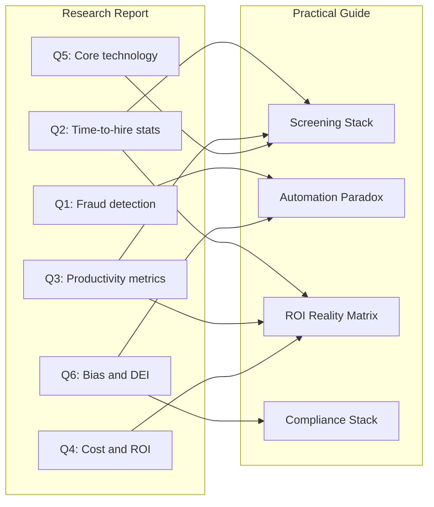
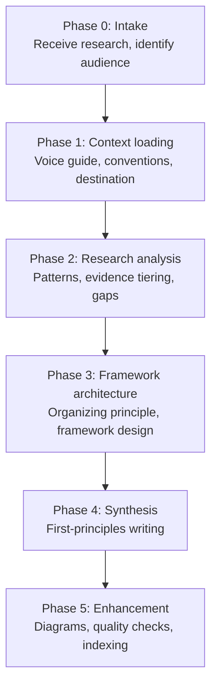
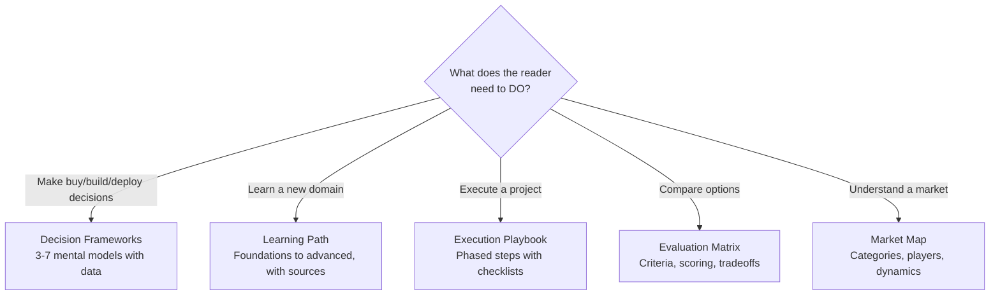
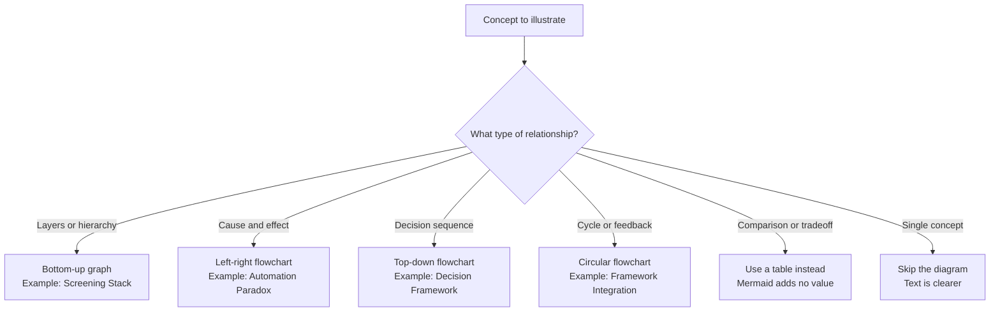

<metadata>
purpose: How to transform raw research into a framework-heavy practical guide that helps people make decisions, not just learn facts.
source: https://handbook.growthx.ai/tutorials/research-to-practical-guide
sync_type: auto
access: build-team
last_synced: 2026-03-02
</metadata>

# Research to practical guide

You have a research report. Maybe 10,000 words. Thirteen questions answered. Sources cited. Data tiered. Solid work.

Now what?

Most people summarize it. Compress 10,000 words into 3,000 and call it a guide. That's a recap, not a transformation. The reader gets the same information in fewer words but doesn't think any differently afterward.

This tutorial teaches you how to do something harder and more valuable: take structured research and reframe it through mental models and frameworks so the reader can make better decisions. The output isn't smaller research. It's a different kind of document entirely.

---

## What this actually is

Research reports answer questions. Practical guides help people decide and act.

The difference isn't length or formatting. It's organizational structure. Research is organized by topic (each question gets its own section). A practical guide is organized by decision (each framework pulls from multiple topics).

Notice the many-to-many mapping. Q2 (time-to-hire stats) feeds both the Screening Stack and the ROI Reality Matrix. Q6 (bias and DEI) feeds both the Automation Paradox and the Compliance Stack. No research question maps to exactly one framework. That reorganization is where the insight lives.

<Tip>
If every research question maps 1:1 to a section in your guide, you've summarized, not transformed. The whole point is cross-pollination between topics.
</Tip>

---

## When to use this

This process works when three conditions are true:

1. **You have completed research.** Not a topic to explore, but actual research already done. Structured Q&A, data gathered, sources cited.
2. **The audience needs to make decisions.** They're evaluating, implementing, or governing something. They need frameworks, not just facts.
3. **The research spans multiple related topics.** If it's a single narrow topic, a study guide is better. This process shines when cross-cutting patterns exist across 5+ research areas.

| Situation | Better approach |
|---|---|
| You need to research a topic from scratch | [Research to study guide](/guides/ai/context-engineering) workflow |
| You have research and the audience needs to learn | Study guide (organized by learning path) |
| You have research and the audience needs to decide | **This process** (organized by decision framework) |
| You have research and the audience needs to execute | Playbook (organized by execution phase) |
| You need to write a blog post or thought piece | [Writing workflow](/guides/writing/style) |

---

## The process

Six phases. Each one builds on the previous. Don't skip the analysis phase. It's where the thinking happens.

---

## Phase 0: Intake

Before you touch the research, answer three questions.

<Steps>
  <Step title="Who is the audience?">
    Not "business leaders" but specifically: What decisions do they face? What do they already know? What would make them act differently after reading this?

    For the AI screening guide, the audience was enterprise talent acquisition leaders evaluating whether and how to implement AI screening tools. They needed to decide what to buy, how to comply, and what to promise stakeholders.
  </Step>
  <Step title="What's the research?">
    Assess the raw material. How many distinct topics does it cover? How strong is the evidence? Are there cross-cutting patterns or is each topic isolated?

    The AI screening research had 13 Q&A sections covering fraud, ROI, productivity, technology, bias, compliance, satisfaction, adoption, integration, and trends. Heavy cross-cutting patterns. Strong Tier 1 evidence for ROI. Weak evidence for quality-of-hire. That assessment shaped everything downstream.
  </Step>
  <Step title="Where does the output live?">
    Confirm the file path, naming convention, and index to update. For scratchpad drafts: `pipeline/scratchpad/[descriptive-name]-v1.md`.
  </Step>
</Steps>

---

## Phase 1: Context loading

Load three things before you start writing.

| What to load | Why | Where |
|---|---|---|
| Voice and style guide | Sets tone, structure pattern, quality bar | `context/voice/writing-style-context-v2.md` |
| Pipeline conventions | Stage definitions, metadata format | `pipeline/README.md` |
| Destination index | Existing file format, categories | `pipeline/scratchpad/INDEX.md` or equivalent |

The voice guide is especially important. It defines the structure pattern you'll follow: Lead (state the point) then Decompose (break it down from first principles) then Connect (show how pieces relate) then Summarize (reinforce why it matters).

---

## Phase 2: Research analysis

This is where most people rush and where the quality of your guide is actually determined. You're doing four things.

### Read everything end to end

Don't skim. Don't jump to the sections that seem most relevant. Read the full research linearly. You're looking for patterns that only appear when you hold multiple sections in your head simultaneously.

### Extract cross-cutting patterns

Ask: what themes appear across three or more research questions?

In the AI screening research, five patterns emerged across all 13 questions:

| Pattern | Where it appeared |
|---|---|
| Vendor marketing claims exceed verified evidence | Q2, Q3, Q4, Q7, Q9 |
| Regulatory compliance is non-optional | Q1, Q6, Q8 |
| Candidate trust constrains ROI | Q1, Q6, Q7 |
| Implementation difficulty is underestimated | Q3, Q4, Q10 |
| Fraud is an existential emerging threat | Q1, Q5, Q12 |

These five patterns became the backbone of five of the six frameworks in the final guide. The patterns ARE the frameworks. You're not inventing frameworks and then filling them with research. You're discovering frameworks that already exist in the data.

<Warning>
If you can't find at least three cross-cutting patterns, the research may not have enough interconnection for a framework-based guide. Consider a different output format.
</Warning>

### Tier every metric by evidence quality

Not all data is equal. Create three tiers and assign every claim.

| Tier | What qualifies | How to use it |
|---|---|---|
| **Tier 1: Proven** | Forrester TEI, Gartner surveys, SHRM benchmarks, peer-reviewed research, regulatory authority | Lead with these. Defensible in front of a CFO or board. |
| **Tier 2: Probable** | Named case studies (Unilever, IBM), industry surveys (1,000+ respondents), major law firm analysis | Use for directional support. Flag as "not independently audited." |
| **Tier 3: Aspirational** | Vendor marketing claims, secondary source citations, small sample studies | Use only as market sentiment. Never as primary evidence. |

This tiering discipline is what separates a credible guide from a vendor pitch dressed up as analysis.

### Flag gaps and contradictions

Note where the evidence is thin or where sources disagree. These gaps are valuable. They tell the reader where to be cautious.

In the AI screening guide, the biggest gap was quality-of-hire metrics. No Tier 1 source provided verified data. That gap became explicit in the ROI Reality Matrix as a "Tier 3: Aspirational" category, which is more useful than pretending the evidence exists.

---

## Phase 3: Framework architecture

This is the creative phase. You're designing the structure of the guide.

### Choose your organizing principle

The most consequential decision. Different research calls for different structures.

The answer always derives from what the reader needs to **do** with the information. Not what the research covers. Not what's most interesting. What decision or action does this enable?

### Design the framework set

Aim for 3-7 frameworks. Fewer than 3 and you don't have enough structure. More than 7 and the reader can't hold them all.

Each framework should:

| Requirement | Why |
|---|---|
| Have a clear name | The reader should remember it ("The Automation Paradox" sticks. "Framework 2" doesn't.) |
| Draw from 2+ research sections | If it only uses one section, it's a summary, not a framework. |
| Answer a specific question | The Screening Stack answers "where should AI operate?" The Compliance Stack answers "what must we do legally?" |
| Include concrete data | Frameworks without numbers are opinions. |
| Connect to other frameworks | They should reference each other. The guide is a system, not a list. |

### Map research to frameworks

Explicitly map which research questions feed which frameworks. This is your construction blueprint. Every important finding from the research should appear in at least one framework. If a finding doesn't fit any framework, either the framework set is incomplete or the finding isn't important enough to include.

### Decide inclusions and exclusions

Not everything in the research belongs in the guide. Make explicit cuts.

In the AI screening guide, three exclusion decisions shaped the final output:

- **Excluded:** Vendor-specific product details (Alex AI section). Vendor content doesn't belong in a frameworks guide.
- **Excluded:** ATS integration technical specs. Too tactical for a mental models document.
- **Compressed:** Machine learning architecture details. Practitioners don't need to know about BERT vs. GCN. They need to know what the technology actually does in plain language.
- **Elevated:** The cross-cutting patterns section from the original research. It contained the most valuable strategic thinking and became the backbone of the frameworks.

<Tip>
Write down your exclusion decisions and why. This forces clarity about what the guide is and isn't. If you can't articulate why something is excluded, it probably shouldn't be.
</Tip>

---

## Phase 4: Synthesis

Now you write. Follow this sequence.

### Start with first principles

Don't start with the frameworks. Start by decomposing the core concept from scratch. What is the fundamental thing we're dealing with?

The AI screening guide didn't start with "here are six frameworks for AI screening." It started with "what is screening?" and decomposed it into signal extraction, the three constraints (speed, accuracy, fairness), and where machines beat humans vs. where they don't. The frameworks only make sense after you've established what screening actually is.

This is the [first-principles thinking](/guides/mental-models/first-principles-thinking) pattern: decompose to fundamentals, then build up.

### Write each framework

For each framework, follow this internal structure:

<Steps>
  <Step title="Name and concept">
    What is this framework? One paragraph. Make it immediately clear what mental model you're offering.
  </Step>
  <Step title="The data">
    What does the evidence say? Use Tier 1 metrics first, Tier 2 for support. Tables work well here.
  </Step>
  <Step title="The implication">
    So what? What does this mean for the reader's decisions? This is where frameworks differ from summaries. A summary says "ROI is 282-449%." A framework says "lead with Tier 1 metrics for your CFO, use Tier 2 for directional support, ignore Tier 3 for the business case, and always include the hidden cost layer."
  </Step>
  <Step title="Connection to other frameworks">
    How does this framework interact with the others? The Automation Paradox says every capability creates a new risk. The Trust Equation says one of those risks (trust erosion) directly constrains the ROI that the ROI Reality Matrix promises. These connections are what make the guide a system.
  </Step>
</Steps>

### Write the decision tool

After all frameworks, synthesize them into something actionable. A decision tree, a checklist, a scoring rubric. The AI screening guide used a five-gate evaluation flowchart where each gate maps to a framework. If the answer is "no" at any gate, you loop back with a specific action.

### Curate reference tables

End with the numbers. Tables of the highest-confidence metrics, organized by category, with source and confidence level. These are the tables people copy into their slide decks and business cases.

### Write the integration section

Show how the frameworks connect into a system. The reader should walk away understanding not just six individual models but how they chain together. The AI screening guide ended with: "Start with the Screening Stack. For each layer, run it through the other five frameworks. If it passes all five, deploy."

---

## Phase 5: Enhancement and indexing

### Add diagrams

Not every concept needs a diagram. Use this decision rule:

The rule: diagrams should show relationships that are hard to see in prose. If a diagram just restates what the text says, cut it.

### Run quality checks

Before finishing, verify:

| Check | What to look for |
|---|---|
| First-sentence test | Is the main point in the first two sentences of the guide? |
| Read-aloud test | Would you say each sentence to a smart friend? |
| Framework independence | Does each framework answer a distinct question? |
| Evidence grounding | Does every claim cite a specific source and tier? |
| Cross-references | Do frameworks reference each other? |
| Exclusion clarity | Can you explain why excluded content was excluded? |
| Diagram value | Does every diagram show a relationship not obvious from text? |

### Index the output

Add the file to the appropriate INDEX.md with type and description.

---

## The full example

This tutorial was derived from a real session that transformed a 15,000-word AI candidate screening research report into a practical guide. Here's how the process played out:

| Phase | What happened | Time |
|---|---|---|
| **Intake** | Received 13-question research report. Audience: enterprise TA leaders making buy/deploy decisions. | 2 min |
| **Context loading** | Loaded voice guide, pipeline README, scratchpad INDEX format. | 3 min |
| **Analysis** | Found 5 cross-cutting patterns. Tiered all metrics into 3 evidence levels. Flagged quality-of-hire as a major gap. | 10 min |
| **Architecture** | Chose decision frameworks as organizing principle. Designed 6 frameworks. Mapped all 13 questions to frameworks. Excluded vendor details, ATS integration specs, ML architecture. | 15 min |
| **Synthesis** | Wrote the guide: first-principles lead, 6 frameworks, decision checklist, 5 reference tables, integration section. | 30 min |
| **Enhancement** | Added 5 mermaid diagrams (stack layers, cause-effect, compliance layers, decision flowchart, framework integration). Registered in INDEX. | 10 min |

The six frameworks that emerged:

1. **The Screening Stack** — four layers of AI capability with different maturity and risk (answers: where should AI operate?)
2. **The Automation Paradox** — every capability creates a proportional new problem (answers: what will go wrong?)
3. **The ROI Reality Matrix** — evidence-tiered returns from proven to aspirational (answers: what can we promise?)
4. **The Compliance Stack** — layered federal/state/local regulatory requirements (answers: what must we do?)
5. **The Trust Equation** — candidate trust as the hidden constraint on ROI (answers: will candidates accept this?)
6. **The Maturity Curve** — Gartner Hype Cycle mapped to investment timing (answers: when should we invest?)

---

## Common traps

<AccordionGroup>
  <Accordion title="Summarizing instead of reframing">
    The most common failure. If your guide follows the same structure as the research (question by question, topic by topic), you've compressed, not transformed. The test: does your guide have sections that don't exist in the research? If not, you're summarizing.
  </Accordion>
  <Accordion title="Inventing frameworks without data">
    Frameworks should emerge from patterns in the research, not from your desire to have a nice-sounding model. If you can't point to data from 2+ research sections supporting a framework, it's an opinion, not a framework.
  </Accordion>
  <Accordion title="Skipping evidence tiering">
    Mixing Forrester TEI data (rigorously audited) with vendor blog claims (self-reported) without distinguishing them destroys credibility. The tiering discipline is what makes the guide trustworthy.
  </Accordion>
  <Accordion title="Including everything">
    A guide that includes everything from the research is just the research with better formatting. The courage to exclude is what makes the guide focused. Write down what you're cutting and why.
  </Accordion>
  <Accordion title="Diagrams that restate text">
    A mermaid diagram of "Step 1 leads to Step 2 leads to Step 3" adds nothing. Diagrams should reveal relationships (many-to-many mappings, feedback loops, layered hierarchies) that prose struggles to convey.
  </Accordion>
</AccordionGroup>

---

## Principles

Five principles that apply across all phases:

**1. The organizing principle comes from the reader, not the research.** Structure the guide around what the reader needs to decide, not what the researcher investigated. This single choice determines whether the output is useful or just shorter.

**2. Frameworks emerge from patterns.** Don't invent frameworks and backfill with data. Find patterns that span multiple research areas, name them, and organize the evidence around them.

**3. Evidence tiering is non-negotiable.** Every metric in the guide should carry its confidence level. Mixing proven and aspirational claims without distinction is how vendor marketing works. Don't do that.

**4. Cross-cutting is the point.** If a framework only draws from one research section, it's a summary of that section. The value of frameworks is synthesizing across topics to produce insight neither topic provides alone.

**5. Exclusion is an act of clarity.** What you leave out defines the guide as much as what you include. Make exclusion decisions explicit and document why.

---

## Related resources

<Columns cols={3}>
  <Card
    title="First principles thinking"
    icon="atom"
    href="/guides/mental-models/first-principles-thinking"
  >
    The decomposition method used in Phase 4. Break problems into fundamentals, reason up.
  </Card>
  <Card
    title="Writing style"
    icon="pen"
    href="/guides/writing/style"
  >
    The voice and structure pattern. Lead, decompose, connect, summarize.
  </Card>
  <Card
    title="Context engineering"
    icon="microchip"
    href="/guides/ai/context-engineering"
  >
    How to structure information for AI agents. Same principles apply to structuring guides for humans.
  </Card>
</Columns>
