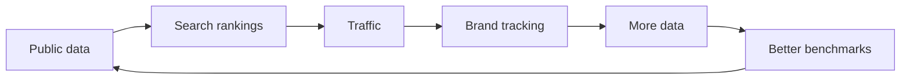
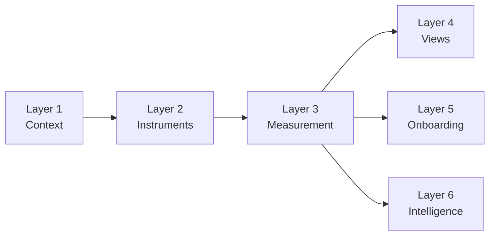
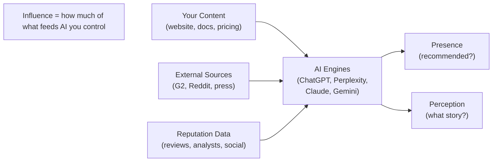
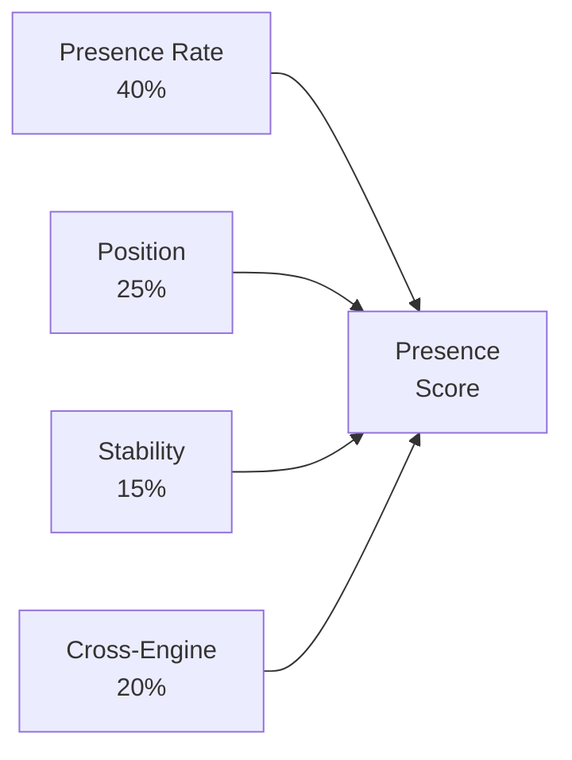
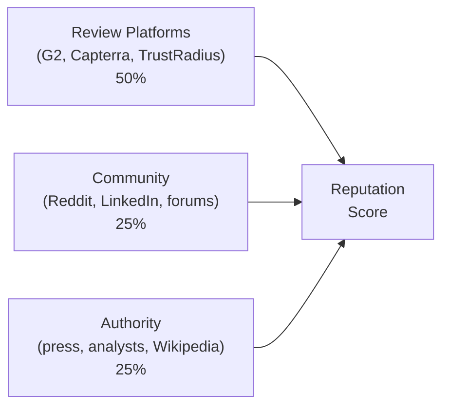
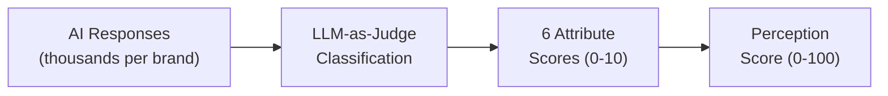
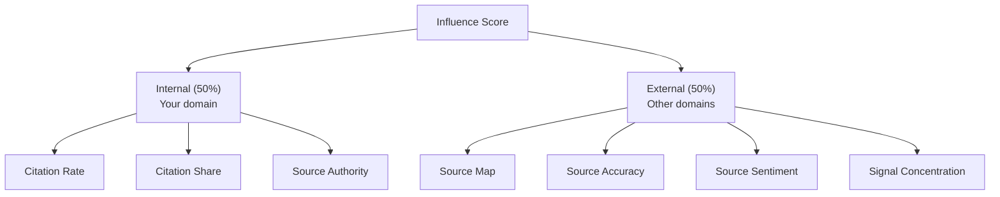
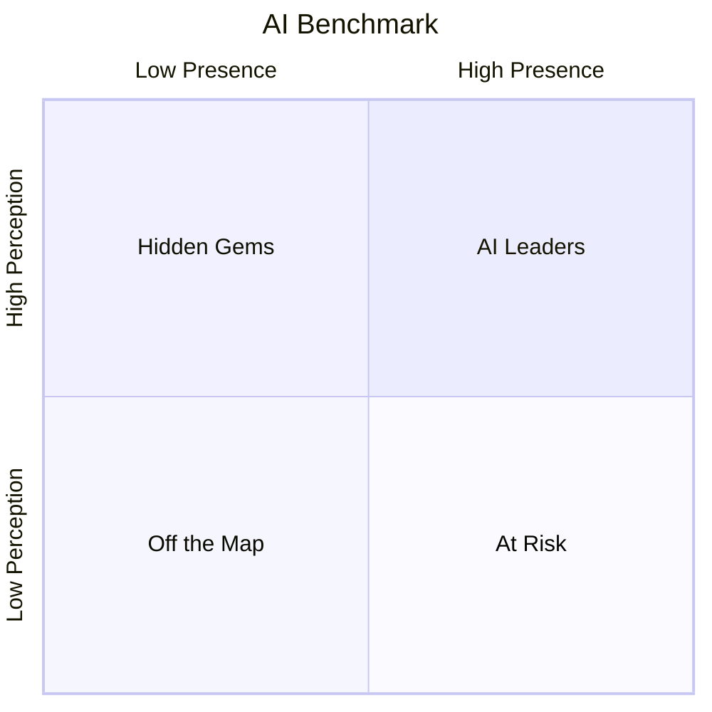

<metadata>
purpose: Comprehensive product documentation for CheckThat — the open AI visibility index for B2B, covering overview, vision, architecture, methodology, all four scores, benchmark, messaging, and metrics
audience: All team members, product team, engineering, sales, marketing
summary: Complete CheckThat product documentation consolidating overview, vision, six-layer architecture, four-score methodology (Presence, Reputation, Perception, Influence), AI Benchmark, messaging/positioning, and metrics framework.
domain: product
confidence: canonical
context_tier: 1
last_updated: 2026-02-22
</metadata>

# CheckThat

The open AI visibility index for B2B — survey AI engines the way brands survey consumers.

---

## Overview

CheckThat surveys AI engines the way brands survey consumers. It measures how AI describes your brand across the dimensions buyers care about — and tells you what to do about it.

94% of B2B buyers now use LLMs during their buying process. Half start in a chatbot before they touch Google. CheckThat is how brands measure and improve their presence in those conversations.

### Four scores, one framework

Every brand needs to answer four questions about their AI presence. Each maps to a score.

| Score | Question | Type |
|---|---|---|
| **Presence** | When buyers evaluate, does AI recommend you? | Output |
| **Reputation** | What does the world think? | Input |
| **Perception** | What story does AI tell about you? | Output |
| **Influence** | How much impact can I have? | Control |

The first three measure **what's happening**. Influence measures **what you can do about it**.

### What makes CheckThat different

| What others do | What CheckThat does |
|---|---|
| Count AI mentions across all contexts | Measure Presence during **evaluation only**, unaided only |
| Show sentiment (positive/negative) | Score Perception across **6 buyer-relevant attributes** |
| No concept of accuracy | Compare AI's narrative against **your brand context** (the answer key) |
| No source analysis | Map **which sources drive AI's perception** and whether they're accurate |
| Snapshot data | Separate what's happening from **what you can do about it** |

> **Note:** Four questions. Four scores. One framework. Do you exist in AI? What does the world think? What story does AI tell? How much impact can I have? Everything else is a drill-down.

---

## Vision

### TL;DR

- Search has flipped. Buyers ask AI for answers. By 2028, AI answers will drive most B2B demand.
- Current AEO tools are broken: pay upfront, guess prompts, get a CSV. No strategy.
- We're building the open AI visibility index for B2B. Think Crunchbase for funding, G2 for reviews, but for AI visibility.
- Three parts: open index (public data), personal tracking (paid), personalized insights (what to do next).
- The flywheel: public data → SEO rankings → traffic → brand tracking → more data → repeat.

### The shift

Search has flipped.

Buyers aren't typing "best tools" into Google anymore. They're asking AI:

> "What's the best expense management tool for a 200-person finance team?"
> "Create a detailed comparison guide for Ramp vs Brex for series A startups."

By 2028, these AI answers will drive most B2B demand. They already convert 3x better.

Every brand on the planet is scrambling to crack AI visibility. Answer Engine Optimization (AEO) is how they *think* they'll measure and improve how they show up in those answers.

Right now, it's broken.

### The problem

Brands can't answer three basic questions:

1. **Do we show up in AI answers for the questions our buyers actually ask?**
2. **How do we show up? Are we the safe choice, the upstart, or missing entirely?**
3. **What should we do next to become the best answer?**

The 163+ tools in the "AEO" category don't solve this. They all work roughly the same way:

- Pay upfront
- Guess which 50 to 100 prompts matter for your category
- Wait weeks while data trickles in
- Get thousands of rows of raw answers back

You don't get strategy. You get a CSV with pretty graphs.

Worse: everyone's running the same research in private. How AI sees your category never becomes public knowledge. Every brand starts from scratch.

### The enemy

Our enemy is closed AEO dashboards.

Every competitor follows the same pattern:

- **Brand first. Market blind.** You see your own dashboard, not the shape of the category.
- **Paywall first. Value later.** You pay before learning which questions matter.
- **Data dump. No direction.** Thousands of answers and a summary. No clear next move.
- **Closed by default.** Everyone runs the same research alone. Nothing becomes public.

They're all selling the same thing:

> "If you look at enough dashboards, you will figure out what to do."

You won't.

We are not building AEO dashboard tool number 164.

### What we're building

We're building the **open AI visibility index for B2B.**

That's the core. Everything else supports that mission.

Think Crunchbase for funding, G2 for reviews, SimilarWeb for traffic. But for AI visibility.

#### 1. The open index

We define categories. We map buyer questions. We track how AI answers them across engines over time.

Then we make it all public. No signup required.

Anyone can see which brands AI prefers in any category, how rankings shift, which narratives stick. That historical data can't be recreated. That's our moat.

**We also create the best answers.** We run editorial workflows to build definitive pages for every category — "Best Expense Management Tools," "Ramp alternatives."

This does two things:

- High-intent buyers land on CheckThat (massive organic traffic)
- We become the benchmark we measure AI engines against

#### 2. Personal tracking (how users fund the index)

You see the open index. You want your brand tracked. You add it.

All that historical data flows into your dashboard. You layer on custom prompts.

Every paid account covers its own data cost and contributes tracking data back to the shared index.

We fund the flywheel by making sure every user pays for what they need while building the shared moat.

#### 3. Personalized insights (what you get)

Once you're tracking your brand, you answer the three questions that actually matter:

1. **Do we show up in AI answers for questions our buyers actually ask?**
2. **How do we show up? Safe choice, scrappy challenger, or invisible?**
3. **What should we do next to become the best answer?**

Our **knowledge graph** gives you actual direction:

> "These 17 questions in your category consistently underserve buyers. Here's what top brands do differently. Here's the gap you can own."

The open index attracts organic traffic. Personal tracking funds the data. Personalized insights keep users coming back.

### How we win long-term

We run the Crunchbase / G2 / SimilarWeb playbook:

**Make data open** → **Rank for searches** → **Traffic brings data** → **More data improves rankings** → **Repeat**

Our advantages:

1. Category-level AI visibility (unique)
2. We rank for buyer questions because our pages beat raw AI output

#### The flywheel



The loops:

- More brands → fuller categories → more signups
- More data → better SEO → more conversions
- More history → better benchmarks → more trust

Every brand tracked fills category gaps. Every AI response becomes irreplaceable historical data.

We need self-serve revenue early to fund data collection, not maximize average revenue per user (ARPU).

Our mission is to become the source of truth for AI visibility for B2B brands.

### The story we're telling

Everyone else says:

> "AI is scary and opaque. Buy our platform, plug in your brand, we'll show you some charts so you feel better."

We say:

> "AI engines already tell a story about your market every day. We capture that story, make it public, and help you change it."

You shouldn't have to guess which questions matter, pay just to see if you exist in your own category, or reverse-engineer AI's view of the market alone.

You should be able to look up any B2B category, see who AI is pushing, see how it's shifting, and get a clear path to becoming the best answer.

### The bottom line

The future of B2B discovery will live inside AI answers.

Every brand will have to choose:

1. Rent a view of themselves from another closed SaaS dashboard.
2. Or help build (and benefit from) the **AI visibility index** everyone else benchmarks against.

We're building the second path.

---

## Architecture

### The big idea

CheckThat doesn't monitor prompts. It surveys AI engines the way brands survey consumers.

Brand research has established disciplines: brand tracking, awareness surveys, NPS. They all work the same way — you define what truth looks like, you build instruments to probe perception, and you measure the gap between truth and perception over time.

CheckThat does this for AI. The "consumers" are AI engines. The "survey questions" are prompts. The "perception" is what ChatGPT, Perplexity, Claude, and Gemini say when buyers ask about your category.

| Brand research | CheckThat equivalent |
|----------------|---------------------|
| Survey population | AI engines (ChatGPT, Perplexity, Claude, Gemini, Google) |
| Survey questions | Prompts |
| Sample size | Number of runs per prompt (30-100+) |
| Survey wave | Tracking cadence (daily/weekly) |
| Brand awareness % | Presence Score |
| Brand favorability | Reputation Score |
| Perception survey | Perception Score (6 attributes) |
| Media influence | Influence Score |

The killer insight: **no other AEO tool measures the narrative AI constructs about your brand across buyer-relevant attributes — and compares it against your truth.** They show you mentions. We tell you if AI is *right*, and where to fix it.

---

### Three foundational layers

The ontology defines three layers. Every feature in CheckThat lives inside one of them.

#### Layer 1: Context — the answer key

What IS true about your brand, your market, your buyers. This is the answer key that everything else is measured against.

Seven elements make up a complete brand answer key:

| Element | What it captures |
|---------|-----------------|
| Company | Name, description, founding, stage, size |
| Products | What you sell, key features |
| Positioning | How you want to be perceived |
| Pricing | Plans, price points, model |
| Differentiators | What makes you different (claimed) |
| Target personas | Who buys, roles, pain points |
| Competitor context | Competitors with their positioning |

Beyond brand context, two additional context types complete the picture:

- **Market context** — the competitive landscape, category definition, how the market is evolving, a map of all brands in the category.
- **Buyer context** — buyer personas, buying criteria, buying journey, key questions by stage. This is what connects "we sell expense management software" to "CFOs at mid-market SaaS companies ask about the best expense tool for their size."

A completeness score (0-100%) tracks how much of the answer key is filled. More context means more accurate alignment insights.

#### Layer 2: Instruments — the classified survey

Prompts aren't random questions. They're research instruments, classified for analysis. Six independent axes classify every prompt:

| Axis | What it captures | Example values |
|------|-----------------|----------------|
| Market (WHERE) | Category + topic | Category, subcategory, topic cluster |
| Intent (WHAT action) | Cognitive action the buyer performs | Learn, Explore, Compare, Validate, Act |
| Buyer Stage (WHEN) | Where in the purchasing process | Problem Recognition, Solution Exploration, Evaluation, Decision, Post-Purchase |
| Question Type (WHAT kind) | Structural category | 16 types: Problem Definition, Direct Comparison, Best-of-Category, Pricing & Cost, etc. |
| Context Modifiers (WHO) | Buyer context that shapes the question | Industry, Company Size, Buyer Role, Use Case, Geography, Tech Stack, Budget, Timeline |
| Measurement Purpose (WHY) | What this prompt is designed to reveal | Recall, Sentiment, Alignment, Competitive Position |

Without classification, prompts are a wall of text. With it, you can ask "how are we doing on comparison prompts in the evaluation stage?" or "are we covering the healthcare segment?"

Every prompt also gets a quality score across five dimensions: Buyer Realism, Commercial Intent, Measurement Value, Competitive Differentiation, and Volume Proxy. This creates priority tiers so the team knows what matters most.

#### Layer 3: Measurement — what we learn

The intelligence extracted from AI responses. Four scores map to established brand research:

- **Presence** — does AI recommend us? Evaluation-stage, unaided only. Measures whether AI includes you in buyer shortlists when your name isn't in the prompt. Sub-metrics: presence rate, position, stability, cross-engine coverage.
- **Reputation** — what does the world think? External market signals from review platforms, community, and press coverage. Reputation is the INPUT that feeds AI's perception. Sub-metrics: review platform signal, community signal, authority signal.
- **Perception** — what story does AI tell? The narrative AI constructs, scored across six buyer-relevant attributes: Capability, Usability, Value, Trust, Support, Innovation. Each 0-10, composited into 0-100. When brand context is populated, each attribute also checks accuracy — feature accuracy under Capability, pricing accuracy under Value, positioning under Innovation.
- **Influence** — how much impact can we have? The diagnostic score. Measures how much control you have over the other 3 scores — internal (your content's citation authority) vs external (third-party sources driving AI's perception).

Composite scores summarize everything:
- **AI Brand Health** — weighted average of all 4 scores (default: equal 25/25/25/25). The NPS of AI visibility.
- **AI Share of Voice** — your presence vs competitors across the same prompts.
- **AI Endorsement** — how strongly AI advocates for your brand when buyers ask for recommendations.

Lift is a cross-cutting trend layer applied to all 4 scores — temporal trend, competitive shift, cross-engine spread, and content lift. It's not a score itself; it's how all scores move over time.

---

### Three experience layers

The first three layers are the *engine* (backend, workflows, data model). The next three are the *experience* (frontend, UX, communication).

#### Layer 4: Views — how users see the data

Measurement without visualization is just a database. Six views turn data into understanding:

- **The Score** — AI Brand Health Score front and center. One number, trend arrow, sparkline. Presence, Reputation, Perception, and Influence as cards below. Competitive comparison.
- **Presence view** — evaluation-stage visibility by buyer stage, position distribution, cross-engine breakdown, stability over time.
- **Reputation view** — external market signals. Review platform scores, community sentiment, authority signal. Gap analysis vs Perception.
- **Perception view** — the six attributes: Capability, Usability, Value, Trust, Support, Innovation. Attribute-level drill-downs. Misalignment flags when brand context is populated.
- **Influence view** — internal vs external split. Source map, citation share, source authority rank, signal concentration.
- **Lift view** — all-scores trend line, competitive movement, cross-engine spread changes.
- **Coverage view** — buyer stage heatmap, question type distribution, topic cluster map. Shows where you're visible and where you're invisible.

#### Layer 5: Onboarding — value in 3 minutes

The best B2B onboarding shows you value first and asks you to confirm, not construct.

Our advantage: we already track 5,828+ brands. For most B2B SaaS companies, we have data before they sign up.

The target flow:

| Step | What happens | Time |
|------|-------------|------|
| Enter brand | User enters domain or company name | 15s |
| "Here's what we know" | Auto-generated context shown for confirmation. Toggles, not forms. | 30s |
| "Here's how AI sees you" | The wow moment. Recall rate, competitor comparison, misalignment flags, engine breakdown. | 30s |
| "Here's what to track" | Top 20 prompt suggestions by priority. One-click "Start tracking all." | 30s |
| You're live | Dashboard populated. Custom prompts activated. First tracking run scheduled. | — |

The critical shift: steps 2 and 3 deliver value instead of asking for work. "Here's what we already know about your market — is this right?" instead of "Tell us about your market."

#### Layer 6: Intelligence — what to do about it

The "so what?" layer. Users can see data. They need to understand what it means and what action to take.

**Weekly intelligence reports** include:
- Score summary — AI Brand Health this week vs last, sub-scores with directional change.
- Significant changes — automated change detection that filters noise. Recall changes, sentiment shifts, alignment gaps, competitive movements.
- Action recommendations — pattern-matched from the methodology playbook. Each significant change maps to a specific content action.

| What happened | What to do |
|---------------|-----------|
| Not appearing in "[X] vs [Y]" | Create a definitive comparison page |
| AI citing incorrect information | Update the relevant page, add schema markup |
| Mentioned but not cited | Improve content structure, lead with answers |
| Strong early-stage but disappearing in evaluation | Build deeper evaluation-stage content |

Without intelligence, CheckThat is a dashboard. With intelligence, it's an advisor that says "your pricing alignment dropped 20% — AI is citing old pricing on 3 engines — update your pricing page."

---

### How the layers connect

Each layer depends on the ones before it. Context feeds instruments. Instruments feed measurement. Measurement feeds everything else.



The critical path: **Context → Measurement → Views → Onboarding wow moment**. The bottleneck is the measurement engine — views can't show meaningful data without it, and the onboarding wow moment needs scores to display.

Layers 1-3 are the engine. They can be built and validated before the experience ships on top. Layers 4-6 are the experience. They make the engine useful.

> **Note:** The architecture turns CheckThat from "a visibility dashboard that shows mentions" into "an AI brand research platform that tells you if AI is right about you — and what to do when it isn't."

---

## Methodology

### The framework

CheckThat surveys AI engines the way brands survey consumers.

Brand research has established disciplines — brand tracking, awareness surveys, NPS. They all work the same way: define what truth looks like, build instruments to probe perception, measure the gap between truth and perception over time.

CheckThat does this for AI. The "consumers" are AI engines. The "survey questions" are prompts. The "perception" is what ChatGPT, Perplexity, Claude, Gemini, and Google say when buyers ask about your category.

94% of B2B buyers now use LLMs during their buying process. Half start in a chatbot before they touch Google. The brands that win the AI recommendation are the ones that show up, get described correctly, and have leverage over the narrative.

### Four scores, four questions

Every brand needs to answer four questions about their AI presence. Each question maps to a score.

| Score | Question | What it measures | Type |
|---|---|---|---|
| **Presence** | When buyers evaluate, does AI recommend you? | Whether AI includes you in evaluation-stage answers where buyers don't name you | Output |
| **Reputation** | What does the world think? | External market signals — reviews, press, community, analysts | Input |
| **Perception** | What story does AI tell about you? | The narrative AI constructs across 6 buyer-relevant attributes | Output |
| **Influence** | How much impact can I have? | Your leverage over the other 3 scores — source control, citation authority, actionability | Control |

The first three are **what's happening**. Influence is **what you can do about it**.

#### How the scores relate

Reputation feeds AI. Perception is what comes out. Presence is whether you show up at all. Influence measures how much leverage you have over the entire chain.



#### Why this framework exists

Every AEO tool on the market measures roughly the same thing: "Are you mentioned in AI?" They count mentions, track keywords, show you a dashboard. That's visibility — and it's the least interesting question you can ask.

Visibility alone is meaningless. A brand can be "visible" because AI mentions it in an awareness-stage explainer. Or because a buyer asked about it by name. Or because it appeared 5th in a comma-separated list with a caveat. None of that tells you whether AI is actually helping you win deals.

The framework borrows from brand research because brand research already solved this problem for a different surface. For decades, brands haven't asked "does the consumer know our name?" and stopped there. They measure *awareness* (do they think of us unprompted?), *favorability* (what do they think?), *accuracy* (do they understand us correctly?), and *influence* (what shapes their perception?). Those are the questions that matter for AI too.

**What other AEO tools measure vs what CheckThat measures:**

| What others do | What CheckThat does | Why it matters |
|---|---|---|
| Count AI mentions across all contexts | Measure Presence during **evaluation only**, unaided only | Buyers build shortlists at the evaluation stage. Awareness-stage mentions don't win deals. |
| Show sentiment (positive/negative) | Score Perception across **6 buyer-relevant attributes** | "Positive sentiment" doesn't tell you what to fix. Knowing your Trust score is 4/10 while Capability is 8/10 does. |
| No concept of accuracy | Compare AI's narrative against **your brand context** (the answer key) | If AI says your pricing is $99/mo but it's actually $249/mo, that costs you deals. Only CheckThat catches this. |
| No source analysis | Map **which sources drive AI's perception** and whether they're accurate | Knowing your score is low isn't enough. Knowing it's low because an outdated G2 review drives 34% of AI's citations — that's actionable. |
| Snapshot data | Separate what's happening (Presence, Reputation, Perception) from **what you can do about it** (Influence) | Most tools tell you the score. CheckThat tells you where the lever is. |

The result: four scores that a CMO can understand in 30 seconds and act on in a week, built on the same principles that power the brand research industry — applied to the surface that now matters most.

---

### The four scores

Each score has a dedicated deep-dive section below with full sub-metrics, calculation formulas, scoring rubrics, diagnostic patterns, and actionable recommendations.

#### Quick reference

| Score | Question | Type | Key insight |
|---|---|---|---|
| **Presence** | Does AI recommend you during evaluation? | Output | Must be non-zero before other scores matter |
| **Reputation** | What does the world think? | Input | The raw material AI learns from — feeds Perception |
| **Perception** | What story does AI tell? | Output | 6 attributes scored 0-10 with accuracy checking against brand context |
| **Influence** | How much can I change? | Control | Connects every score to a specific fix |

---

### Composite scores

Three headline numbers that summarize everything for leadership.

#### AI Brand Health

The NPS of AI visibility. One number (0-100) that goes on the dashboard, in board decks, and in LinkedIn posts.

Weighted average of all 4 scores. Default: equal (25/25/25/25), configurable per workspace.

| Score | Rating | What it means |
|---|---|---|
| 80+ | Strong | AI knows you, describes you accurately, and you have the levers to maintain it |
| 60-79 | Moderate | AI knows you but has gaps in accuracy or source control |
| 40-59 | Needs Work | Significant issues in one or more dimensions |
| Under 40 | Critical | AI doesn't know you, misrepresents you, or you have no control |

#### AI Share of Voice

Your presence vs competitors across the same prompts. Combines Visibility Share, Citation Share, and Position-Weighted Share. The metric marketing teams present to leadership: "We have 23% AI Share of Voice, up from 18% last quarter."

#### AI Endorsement

How strongly AI advocates for your brand when buyers ask for recommendations. Combines Recommendation Strength (40%), Position Score (25%), Narrative Frame (20%), and Comparative Framing (15%). A high score means AI champions your brand.

---

### Lift — the trend layer

Lift is not a score. It's a meta-layer applied to all 4 scores.

| Dimension | What it shows |
|---|---|
| **Temporal Trend** | Is each score Improving, Stable, or Declining? With magnitude and confidence. |
| **Competitive Shift** | Are you gaining ground, holding steady, or losing ground vs competitors? |
| **Cross-Engine Spread** | Are you appearing on more engines (Expanding), the same (Stable), or fewer (Contracting)? |
| **Content Lift** (v2) | Metric changes correlated with content publication dates — the brand lift study analog. |

---

### Score relationships

The 4 scores are related but independent. The gaps between them are diagnostic:

| Pattern | What it means | Priority action |
|---|---|---|
| High Presence + Low Perception | AI mentions you but gets the story wrong | Fix content accuracy and positioning |
| High Presence + Low Reputation | AI mentions you but the world's opinion is weak | Invest in reviews, press, community |
| High Reputation + Low Presence | The world loves you but AI doesn't mention you | Technical AEO — content structure, schema |
| High Reputation + Low Perception | Strong external signals but AI misinterprets them | Adjust content for AI consumption |
| High Perception + Low Influence | AI tells a good story but you can't maintain it | Build owned-content authority before a source shift breaks it |
| Low Everything | Starting from scratch | Build Reputation first. Then Presence. Perception and Influence follow. |

> **Note:** Four questions. Four scores. One framework. Do you exist in AI? What does the world think? What story does AI tell? How much impact can I have? Everything else is a drill-down.

---

## Presence

### The question

When buyers evaluate solutions, does AI recommend you?

**Brand research analog:** Unaided brand awareness

**Score type:** Output — measures what AI produces in response to buyer queries

If AI doesn't name your brand when buyers ask about your category, nothing else matters. Presence is the foundation — it must be non-zero before the other scores have meaning.

### Why Presence is different from "AI visibility"

Every AEO tool on the market measures "AI visibility" — are you mentioned somewhere in AI? That metric is vague and doesn't mean anything. A brand can have 90% "AI visibility" because AI knows their name when asked directly, or because they show up in awareness-stage queries like "what is expense management?" Neither tells you whether buyers will find you at the moment that matters.

Presence measures something specific: **when a buyer is actively evaluating solutions and asks AI for recommendations without naming you, does AI include you?**

The boundary is crisp:

- **If your brand name is in the prompt, it's not Presence.** Branded queries ("What is Ramp?", "Ramp pricing", "Ramp vs Brex") feed the Perception Score — they measure what story AI tells when asked about you.
- **If the prompt is awareness-stage or post-purchase, it's not Presence.** Only evaluation-stage prompts count — the moment buyers build shortlists.
- **Presence is always unaided.** AI must volunteer your name. The buyer asks about the category, the problem, or a competitor — and AI decides to include you.

This is the "unaided brand awareness" test for AI engines. In traditional brand research, you ask consumers "name three expense management tools" without prompting them. In CheckThat, you ask AI "best expense management tools for startups" and see if it names you.

### Why Presence is first

If AI doesn't recommend you when buyers evaluate your category, nothing else matters. You can have perfect Perception and stellar Reputation, but if you're invisible during the evaluation moment, buyers never see it.

The data:
- Only **30% of brands** maintain stable AI visibility
- Less than **1% of responses** produce identical brand lists across two runs
- **67.4% of domains** are cited by exactly one AI platform
- **95% of the time**, the winning vendor was already on the buyer's Day One shortlist (6sense)

If AI builds that shortlist and you're not on it, you've lost before the conversation started.

### Sub-metrics

#### Presence Rate (40% weight)

The percentage of evaluation-stage, unbranded prompts where AI mentions your brand. The headline number.

```
Presence Rate = (evaluation prompts where brand is mentioned / total evaluation prompts tracked) x 100
```

Only unbranded prompts count. Only evaluation-stage prompts count. This tells you: when buyers ask AI for recommendations in your category, how often does AI include you?

#### Position (25% weight)

Not just "are you mentioned?" but "are you recommended or listed as an afterthought?"

| Position | Score | What it means |
|----------|-------|--------------|
| **Recommended** | 5 | Named as a primary recommendation or solo answer |
| **1st Mention** | 4 | Named first in a list of options |
| **2nd-3rd** | 3 | Named early but not first |
| **Listed** | 2 | In a list without prominence |
| **Afterthought** | 1 | Mentioned in caveats, footnotes, or "you could also consider..." |

Being the recommended answer is fundamentally different from being listed 5th in a comma-separated list. A solo recommendation ("I recommend Ramp for startups") carries 5x the weight of an afterthought mention ("you could also consider Ramp").

#### Stability Index (15% weight)

How consistent is your presence over time?

```
Stability Index = 100 - (standard deviation of weekly presence rates / mean presence rate) x 100
```

High stability (>80) means your position is entrenched. Low stability (<40) means you're volatile — could disappear any week. High-authority domains maintain <10% volatility. Building authority signals (brand search volume, Wikipedia presence, review platforms, structured data) reduces volatility.

#### Cross-Engine Coverage (20% weight)

Which AI engines recommend you during evaluation?

```
Cross-Engine Coverage = (engines mentioning brand for evaluation prompts / total engines tracked) x 100
```

A brand recommended on ChatGPT but invisible on Perplexity during evaluation has a coverage problem. Given ChatGPT = 87% of AI referral traffic, which engines matter is a strategic question. Only **6.5% of brands** achieve presence across 5+ platforms.

### What prompts measure Presence

All Presence prompts share two properties: (1) they are evaluation-stage — the buyer is building a shortlist or comparing solutions, and (2) they are unbranded — your brand name does not appear in the prompt.

#### Best-of-category — the shortlist builders

The most important evaluation prompts. Where vendor shortlists are born.

```
"Best [category] tools for [constraint]"
"Top [category] platforms for [industry]"
"What [category] software do you recommend for [company size]?"
"Best [category] with [integration/feature]"
```

#### Landscape and market map

Buyers understanding the competitive field before shortlisting.

```
"Who are the main players in [category]?"
"What are the leading [category] solutions?"
"Map the [category] software market"
```

#### Alternatives-to-competitor

High-intent switching queries. Your name is NOT in the prompt; the competitor's name is.

```
"Alternatives to [Competitor]"
"Best [Competitor] alternatives for [use case]"
"What can I use instead of [Competitor]?"
```

#### Unbranded comparison

AI generates a comparison without being told which brands to include.

```
"Compare top [category] tools for [use case]"
"Which [category] tools should I evaluate for [constraint]?"
"Rank the best [category] options for [industry]"
```

> **Warning:** **What does NOT count as Presence:** Any prompt containing your brand name. "[Your Brand] vs [Competitor]", "[Your Brand] pricing", "[Your Brand] reviews", "What is [Your Brand]?" — all of these feed the Perception Score, not Presence. If the buyer already named you, Presence already did its job.

### How the composite is calculated



```
PRESENCE SCORE =
  (Presence Rate x 0.40) +
  (Position Score [normalized 0-100] x 0.25) +
  (Stability Index x 0.15) +
  (Cross-Engine Coverage x 0.20)

Scale: 0-100
```

Presence Rate is weighted highest because the most fundamental question is binary: when buyers evaluate, are you there or not? Position captures whether AI recommends you or just lists you. Coverage ensures you're not dependent on a single engine. Stability ensures your presence is durable, not a one-week fluke.

### Score interpretation

| Range | Meaning |
|---|---|
| 80-100 | AI consistently recommends you when buyers evaluate your category. Strong, stable, multi-engine presence. |
| 60-79 | AI includes you regularly during evaluation but with gaps — missing engines, inconsistent position, or volatile week to week. |
| 40-59 | AI includes you sometimes during evaluation. Significant gaps. Buyers have a coin-flip chance of seeing you. |
| 20-39 | AI rarely recommends you during evaluation. Most buyers using AI to build a shortlist will miss you. |
| 0-19 | Invisible during evaluation. Buyers using AI to shortlist solutions will not find you. |

### Diagnostic patterns

Cross-reference Presence with the other scores to diagnose what's happening:

| Pattern | Diagnosis | Priority action |
|---|---|---|
| Low Presence + Low Influence | AI has no source material from you | Establish source authority from scratch |
| High Reputation + Low Presence | The world loves you but AI doesn't mention you | Technical AEO — content structure, schema, crawlability |
| High Presence + Low Perception | AI mentions you but gets the story wrong | Fix content accuracy and positioning |
| Low Presence + Low Reputation | Starting from scratch | Build Reputation first. Then Presence follows. |

---

## Reputation

### The question

What does the world think?

**Brand research analog:** Brand favorability, NPS, review scores, analyst ratings

**Score type:** Input — measures the raw material AI learns from, independent of what AI says

Reputation measures the market's opinion of your brand independent of what AI says. It's the raw material AI learns from. Reputation is the **input**. Perception is the **output**. They're related but not the same.

### Why Reputation is separate from Perception

AI doesn't just parrot review scores. It filters, recombines, and sometimes invents. A brand with 4.8 stars on G2 might get described by AI as "good but complex to set up" because AI weighted one specific dimension of reviews. A brand with modest review scores might get glowing AI descriptions because a TechCrunch article hit at the right time.

Reputation is the external truth. Perception is AI's interpretation of it. Both matter.

### Why Reputation matters

The world's opinion shapes everything:

- **95% of the time**, the winning vendor was already on the buyer's Day One shortlist (6sense). Reputation builds that shortlist before AI even enters the picture.
- **78% of buyers** shortlist products they've already heard of — 86% among enterprise buyers (TrustRadius).
- **Reddit is cited in 40%+** of Perplexity responses and is a top-10 most-cited domain across all AI engines.
- **G2 accounts for 8.25%** of ChatGPT citations for evaluation queries.

Reputation feeds AI. Low Reputation almost guarantees low Perception.

### Data sources

Reputation aggregates signals from three categories of external platforms that buyers and AI engines both rely on.



#### Review platforms (50% weight)

The richest signal for buyer satisfaction and feature sentiment.

| Platform | What it captures | Why it matters |
|---|---|---|
| **G2** | User reviews, satisfaction scores, feature ratings, Grid placement | Largest review volume, most cited by AI engines |
| **Capterra** | User reviews, Overall/Ease of Use/Support/Value scores | Broad SMB coverage |
| **TrustRadius** | trScore, Buyer's Choice criteria (capabilities, value, relationship) | Enterprise buyer depth, rigorous scoring |
| **Gartner Peer Insights** | Overall rating, Service & Support, Integration & Deployment, Product Capabilities | Enterprise analyst-adjacent signal |

```
Review Platform Signal = weighted average of normalized scores
  G2:              35% weight (largest volume, most cited by AI)
  Capterra:        25% weight (broad SMB coverage)
  TrustRadius:     20% weight (enterprise depth)
  Gartner PI:      20% weight (enterprise authority)
```

#### Community (25% weight)

Authentic buyer language and raw sentiment from where professionals actually discuss software.

| Source | Signal type | Key stat |
|---|---|---|
| **Reddit** | Raw buyer language, authentic recommendations, unfiltered opinions | **40%+ of Perplexity citations**; top-10 most-cited domain across all engines |
| **LinkedIn** | Professional discussion, industry credibility | Growing AI citation source |
| **Forums** | Deep technical community, niche expertise | Category-specific signal |

```
Community Signal = composite of:
  Reddit presence score (0-100):
    Active in relevant subreddits? (+25)
    Mentioned positively in recommendations? (+25)
    Recent mentions (last 90 days)? (+25)
    Response/engagement from brand? (+25)
  Social proof score (0-100):
    LinkedIn discussion mentions (+40)
    Professional community presence (+30)
    Social media sentiment (+30)
```

#### Authority (25% weight)

Credibility, editorial weight, and institutional endorsement.

| Source | Signal type | Key stat |
|---|---|---|
| **Press coverage** | TechCrunch, Forbes, industry publications — recency, sentiment, prominence | Authority signal, news freshness |
| **Analyst firms** | Gartner, Forrester, IDC coverage and placement | Institutional credibility |
| **Wikipedia** | Page existence, accuracy, freshness | **12.1% of ChatGPT citations overall** |

```
Authority Signal = composite of:
  Press recency and quality (0-100):
    Major press coverage in last 6 months? (+40)
    Industry analyst mentions? (+30)
    Wikipedia page exists and is current? (+30)
```

### How the composite is calculated

Reputation doesn't require running prompts against AI engines. It's computed from external data.

```
REPUTATION SCORE =
  (Review Platform Signal x 0.50) +
  (Community Signal x 0.25) +
  (Authority Signal x 0.25)

Scale: 0-100
```

### Score interpretation

| Range | Meaning |
|---|---|
| 80-100 | Strong market reputation. Well-reviewed, well-covered, strong community presence. AI has good material to work with. |
| 60-79 | Solid reputation with gaps — maybe strong reviews but weak press, or good press but thin community presence. |
| 40-59 | Moderate reputation. Some signals strong, others weak or absent. AI has mixed material to draw from. |
| 20-39 | Weak reputation. Few reviews, minimal press, thin community presence. AI has little external signal. |
| 0-19 | Near-zero market signal. AI has almost nothing to work with from external sources. |

### The Reputation-Perception gap

The gap between Reputation and Perception is diagnostic. It tells you whether AI is accurately reflecting the world's opinion — or distorting it.

| Pattern | Diagnosis | Action |
|---|---|---|
| High Reputation + High Perception | The system works. External signals translate correctly into AI narrative. | Monitor and maintain. |
| High Reputation + Low Perception | AI isn't reading the room. Your external reputation is strong but AI doesn't reflect it. | Source citation or crawlability problem. Check Influence for source analysis. |
| Low Reputation + High Perception | Rare and fragile. AI has a positive view not backed by market evidence. | Will self-correct as models update. Build real Reputation before it does. |
| Low Reputation + Low Perception | Expected. Low external signal = low AI narrative quality. | Fix Reputation first. Reviews, press, community — then AI follows. |

### Building Reputation

Reputation is the score you build in the real world, not in AI. The actions are traditional brand-building applied to the sources AI reads:

| Signal | Action | Timeline |
|---|---|---|
| **Review platforms** | Actively grow G2, Capterra, TrustRadius profiles. Respond to all reviews. | Ongoing, quarterly review pushes |
| **Reddit** | Authentic participation in 3-5 relevant subreddits. Consistency over volume. | Ongoing, weekly cadence |
| **Press** | PR, guest posts, podcast appearances, analyst relationships | Ongoing, monthly cadence |
| **Wikipedia** | Ensure accurate page if notable. Focus on notability signals. | 3-6 months |
| **Brand search volume** | Brand awareness campaigns, thought leadership | Ongoing, compounds over time — strongest cross-engine signal (0.334 correlation) |

---

## Perception

### The question

What story does AI tell about you?

**Brand research analog:** Brand perception survey, brand attribute study

**Score type:** Output — measures what AI engines actually say about your brand

This is the heart of CheckThat. Presence tells you if AI recommends you. Reputation tells you what the world thinks. Perception tells you what AI *actually says* — the narrative it builds across the dimensions buyers care about.

This is the score no one else can produce. Traditional brand tracking surveys humans. Review platforms aggregate ratings. CheckThat reads the actual AI-generated narrative and scores it across six attributes.

### Where branded queries live

Presence is always unaided — your brand name never appears in the prompt. Branded evaluation queries ("Ramp vs Brex," "Ramp pricing," "Does Ramp have X?", "Ramp reviews") feed Perception, not Presence.

When a buyer asks about you by name, Presence already did its job. Now the question is what story AI tells. That's Perception.

### Six attributes

Six attributes. One word each. Scored 0-10. Together they compose the Perception Score.

| Attribute | What it answers | What it absorbs |
|---|---|---|
| **Capability** | Is the product powerful and complete, or limited? | Features, scalability, integrations, AI/automation, product depth |
| **Usability** | Is it easy to use, or painful to adopt? | Ease of use, implementation speed, onboarding, learning curve, UX |
| **Value** | Is it worth the money, or expensive? | Pricing, ROI, total cost of ownership, pricing transparency |
| **Trust** | Is it safe and reliable, or risky? | Security, compliance, reliability, vendor stability, brand credibility |
| **Support** | Is support responsive, or slow? | Customer support, documentation, success management, onboarding help |
| **Innovation** | Is it forward-thinking, or stagnant? | Product vision, roadmap, differentiation, competitive uniqueness |

Each attribute is scored by an LLM-as-judge that classifies AI-generated responses against defined rubrics. Not every response scores every attribute — only what's present in the text.

**Perception Score = (average of 6 attribute scores) x 10**

Example: if the average across attributes is 7.2, the Perception Score is 72.

#### Why these six

Every B2B vendor evaluation framework in existence collapses to a small number of dimensions. Gartner uses 15 criteria but two axes. Forrester uses three dimensions. G2 uses two. The platforms that last are the ones that pick the right abstractions.

We tested each attribute against three filters:

1. **Does a CMO instantly understand it?** No jargon. No explanation needed. If you have to define the word, it's wrong.
2. **Can an LLM reliably score it from AI-generated text?** We're not surveying humans. We're classifying language. The attribute must map to detectable patterns in how AI engines talk about brands.
3. **Does it map to a distinct buyer concern with zero overlap?** Six attributes means zero waste. Each one must stand on its own.

We started with 10 attributes. We collapsed to 6. Scalability folded into Capability. Integration/Ecosystem folded into Capability. AI/Automation folded into Capability. Reliability folded into Trust. Market Position was cut (it's an outcome of the other scores). Differentiation folded into Innovation.

---

### Capability

**Does AI describe your product as powerful and complete, or limited and narrow?**

What it absorbs: core features, functionality, scalability, AI/automation capabilities, integration and ecosystem fit, product depth and breadth.

**How we score it:** We classify every AI-generated mention of a brand for language related to product capabilities, feature completeness, scalability, integrations, and technical depth.

| Signal type | Examples |
|---|---|
| **Positive** | "comprehensive," "feature-rich," "handles enterprise scale," "robust API," "integrates with" |
| **Negative** | "limited," "basic," "lacks," "doesn't support," "standalone tool" |

| Score | Meaning |
|---|---|
| 0-3 | AI describes the product as limited, basic, or narrow in scope |
| 4-6 | AI describes adequate functionality with noted gaps |
| 7-8 | AI describes strong, comprehensive capabilities |
| 9-10 | AI positions the product as best-in-class across multiple dimensions |

**Why Capability is first:** Every evaluation framework starts here. Gartner's Product/Service criterion is typically the heaviest-weighted factor. Forrester's Current Offering axis spans 8-25+ sub-criteria, all rooted in what the product actually does. G2's "Meets Requirements" is one of only three HIGH-weight satisfaction dimensions.

89% of B2B buyers in 2025 purchased solutions with AI features baked in (6sense, n=4,000). 81% rated AI functionality as important or very important (G2 2024).

**Alignment embedded:** Feature Accuracy from the old Alignment metric now lives here. When we score Capability, we're inherently measuring whether AI accurately represents what the product can do. A hallucinated feature is a Capability signal (inaccurate). A missing feature is a Capability signal (incomplete).

---

### Usability

**Does AI describe your product as easy to use and fast to implement, or complex and painful to adopt?**

What it absorbs: ease of use, implementation speed, onboarding complexity, time to value, learning curve, UX quality, ease of administration.

**How we score it:** We classify AI-generated text for language about user experience, setup complexity, learning curve, and time to value.

| Signal type | Examples |
|---|---|
| **Positive** | "intuitive," "easy to set up," "minimal training," "quick onboarding," "user-friendly interface" |
| **Negative** | "steep learning curve," "complex setup," "requires training," "difficult to configure," "clunky" |

| Score | Meaning |
|---|---|
| 0-3 | AI describes a product that's hard to use, slow to implement, and frustrating |
| 4-6 | AI describes a product that's functional but requires effort to adopt |
| 7-8 | AI describes a product that's intuitive with reasonable onboarding |
| 9-10 | AI describes an exceptional user experience with near-instant time to value |

**Why Usability stands alone:** The most consistently high-weighted dimension across every review platform. G2 weights "Ease of Use" as HIGH — one of only three dimensions at that level. Capterra gives "Ease of Use" 50% weight on its entire usability axis.

57% of B2B buyers expect ROI within three months of purchase. 11% expect it immediately (G2 2024). 58% report regretting purchases partly due to onboarding challenges. Usability isn't just about daily experience — it's about how fast a buyer gets value.

**Alignment embedded:** Implementation accuracy from the old Alignment metric now lives here. When AI says "easy to set up in minutes" but the real implementation takes weeks, that's a Usability misalignment flagged by comparing against brand context.

---

### Value

**Does AI position you as worth the money, or as expensive relative to what you deliver?**

What it absorbs: pricing, affordability, ROI, total cost of ownership, pricing transparency, contract flexibility, cost efficiency.

**How we score it:** We classify AI-generated text for language about pricing, cost, ROI, and financial value.

| Signal type | Examples |
|---|---|
| **Positive** | "affordable," "competitive pricing," "strong ROI," "transparent pricing," "good value," "free tier" |
| **Negative** | "expensive," "overpriced," "hidden costs," "not worth it," "pricing complexity" |

| Score | Meaning |
|---|---|
| 0-3 | AI describes the product as expensive with unclear value |
| 4-6 | AI describes adequate value with pricing caveats |
| 7-8 | AI describes strong value relative to capabilities |
| 9-10 | AI positions the product as best-in-class value in the category |

**Why Value is the #1 purchase driver:** TrustRadius found that 66% of buyers selected their product because it "met our needs for the best price" — the single most cited purchase driver across 2,164 respondents. CFOs now hold final decision-making power in 79% of purchases. Products with transparent pricing achieved 3.2x more AI visibility (Goodie AI, 2.2M prompts analyzed).

**Alignment embedded:** Pricing Accuracy from the old Alignment metric now lives here. When AI cites your pricing, we compare it against brand context. "AI says $99/mo, actual is $249/mo" is a critical Value misalignment.

---

### Trust

**Does AI describe you as a safe, reliable, secure choice, or as a risk?**

What it absorbs: security, compliance, reliability, uptime, data protection, brand credibility, enterprise-readiness, vendor stability, breach history.

**How we score it:** We classify AI-generated text for language about security posture, compliance certifications, reliability, data handling, and enterprise-readiness.

| Signal type | Examples |
|---|---|
| **Positive** | "SOC 2 compliant," "enterprise-grade security," "reliable," "trusted by," "99.9% uptime," "GDPR compliant" |
| **Negative** | "security concerns," "data breach," "reliability issues," "downtime," "not enterprise-ready" |

| Score | Meaning |
|---|---|
| 0-3 | AI raises security concerns or describes unreliable/risky product |
| 4-6 | AI describes adequate security without strong trust signals |
| 7-8 | AI references specific certifications and enterprise readiness |
| 9-10 | AI positions the product as the safe, trusted standard in the category |

**Why Trust is the biggest collapse:** Trust collapses the most sub-dimensions into one word. Security, compliance, reliability, brand credibility, and vendor stability all answer the same buyer question: can I bet my job on this?

Security is the #1 consideration across six major department types (G2 2024). 81% of enterprise buyers consider vendor breach history. 97% involve a security stakeholder. Forrester's MaxDiff analysis: competency (18.5%), consistency (17.0%), and dependability (16.8%) are the top three trust attributes.

**Alignment embedded:** Factual Accuracy from the old Alignment metric maps here when it touches security claims, compliance certifications, and reliability track record.

---

### Support

**Does AI describe your support as responsive and helpful, or slow and frustrating?**

What it absorbs: customer support quality, responsiveness, documentation, self-service resources, success management, onboarding assistance.

**How we score it:** We classify AI-generated text for language about support quality, responsiveness, and customer success.

| Signal type | Examples |
|---|---|
| **Positive** | "excellent support," "responsive team," "great documentation," "dedicated success manager," "24/7 support" |
| **Negative** | "poor support," "slow response," "limited documentation," "no phone support," "long wait times" |

| Score | Meaning |
|---|---|
| 0-3 | AI describes support as a significant weakness |
| 4-6 | AI describes adequate support with noted limitations |
| 7-8 | AI describes strong, responsive support |
| 9-10 | AI positions support as a competitive advantage and differentiator |

**Why Support can't fold into anything else:** Support isn't Trust (that's about whether you're safe to choose). Support isn't Usability (that's about whether you can figure it out yourself). Support is what happens when things break, when implementation stalls, when a buyer needs help.

Every review platform measures it independently. Capterra gives Customer Support 50% weight on its entire satisfaction axis. G2 rates Quality of Support as one of only three HIGH-weight satisfaction dimensions. At the renewal stage, support quality is one of the strongest predictors of retention.

Support also absorbs customer success — proactive guidance, strategic reviews, and outcome-driven engagement. When AI says "offers dedicated account management," that's a Support signal.

---

### Innovation

**Does AI describe you as forward-thinking and evolving, or stagnant and falling behind?**

What it absorbs: product vision, roadmap, differentiation, competitive uniqueness, R&D investment, emerging capabilities, market leadership trajectory.

**How we score it:** We classify AI-generated text for language about product direction, uniqueness, and forward momentum.

| Signal type | Examples |
|---|---|
| **Positive** | "rapidly improving," "recently launched," "innovative approach," "unique in that," "leading the way," "pioneering" |
| **Negative** | "hasn't changed," "falling behind," "legacy," "stagnant," "no clear roadmap," "generic" |

| Score | Meaning |
|---|---|
| 0-3 | AI describes a stagnant product with no differentiation |
| 4-6 | AI describes a product with some unique aspects but limited vision |
| 7-8 | AI describes an actively evolving product with clear differentiation |
| 9-10 | AI positions the product as a category-defining innovator |

**Why Innovation absorbs Differentiation:** CEB research found that only 14% of companies offer benefits customers find truly unique. An attribute that scores 86% of brands the same way isn't useful. But the signal matters — Innovation captures both "where are you going?" (vision, roadmap) and "what makes you different?" (uniqueness, competitive separation).

Gartner's Completeness of Vision axis evaluates market understanding, innovation investment, and offering strategy. Forrester's Strategy dimension covers roadmap, innovation commitment, and business model. Both combine trajectory with differentiation. We're doing the same.

**Alignment embedded:** Positioning Match and Differentiator Recognition from the old Alignment metric now live here. Does AI correctly convey what makes you different? Does it tell the story you want told about where you're going?

---

### Accuracy — built into every attribute

Other AEO tools show you what AI says. CheckThat tells you if AI is *right*.

When brand context is populated (the answer key), each attribute gains an accuracy dimension — the gap between what AI says and what the brand claims:

| Accuracy check | Which attribute catches it |
|---|---|
| AI describes features you don't have (or misses ones you do) | Capability |
| AI cites wrong pricing or outdated plans | Value |
| AI tells a different story than your intended positioning | Innovation |
| AI doesn't mention your claimed differentiators | Innovation |
| AI gets basic facts wrong (founding year, integrations, compliance) | Trust + Capability |

This surfaces as misalignment flags: "AI says your pricing is $99/mo, but your actual pricing is $249/mo." No other AEO tool has this capability — because no other tool has the concept of an answer key to check against. Use the Influence Score to identify which sources are driving the inaccuracy.

| Old Alignment dimension | Now lives in | How |
|---|---|---|
| Feature Accuracy | Capability | Comparing AI's feature descriptions against brand context |
| Pricing Accuracy | Value | Comparing AI's pricing claims against brand context |
| Positioning Match | Innovation | Comparing AI's differentiation narrative against brand positioning |
| Differentiator Recognition | Innovation | Checking whether AI mentions claimed differentiators |
| Narrative Alignment | All 6 (holistic) | The overall gap between AI's story and the brand's intended story |
| Factual Accuracy | Trust + Capability | Checking basic facts against brand context |

### How the Perception Score is calculated



#### Input

Every AI-generated response about a brand, tracked across ChatGPT, Perplexity, Claude, Gemini, and Google AI Overviews. Thousands of responses per brand, collected across hundreds of prompts per category.

#### Classification

Each response runs through a classification layer (LLM-as-judge) that scores each relevant attribute on a 0-10 scale based on the language used. Not every response contains signals for every attribute. A response about pricing won't score on Innovation. A response about product roadmap won't score on Support. The classifier only scores what's present.

#### Aggregation

For each attribute, we aggregate all classified scores across all responses:

- **Weight by recency** — recent responses count more than older ones
- **Weight by engine diversity** — appearing positive across multiple engines is stronger
- **Normalize against category peers** — a 7 in CRM means something different than a 7 in DevOps

#### Output

```
PERCEPTION SCORE = (avg of 6 attribute scores) x 10

Example:
  Capability:  7.8
  Usability:   8.2
  Value:       6.5
  Trust:       7.0
  Support:     7.4
  Innovation:  6.1

  Average: 7.17
  Perception Score: 72 / 100
```

Equal weight by default. In the dashboard, users can apply custom weights to match what matters most in their category (e.g., Trust might matter more in security software; Usability might matter more in design tools).

### Perception score interpretation

| Range | Meaning |
|---|---|
| 80-100 | AI tells a strong, accurate, differentiated story about your brand. |
| 60-79 | AI tells a mostly positive story with gaps in some attributes. |
| 40-59 | AI's narrative is mixed — some attributes strong, others weak or inaccurate. |
| 20-39 | AI's story is weak across most dimensions. Major perception issues. |
| 0-19 | AI either doesn't describe you in detail or gets the story fundamentally wrong. |

---

## Influence

### The question

How much impact can I have on my Presence, Reputation, and Perception?

**Brand research analog:** No direct equivalent. Closest: earned media influence, share of voice by source, brand narrative control.

**Score type:** Control — measures your leverage over the other 3 scores

The other three scores measure *what's happening*. Influence measures *what you can do about it*.

### Why Influence exists

Without Influence, a user sees: "Your Perception Score is 45." They don't know where to start.

With Influence, they see: "Your Perception Score is 45. 72% of AI's information about you comes from an outdated G2 review from 2024. Your own domain accounts for only 8% of citations. Fix your G2 profile first, then improve your own content's citability."

Influence turns monitoring into action. It's the diagnostic metric that connects every other score to a specific fix.

### Two dimensions

Influence splits into **Internal** (your domain's influence on AI) and **External** (third-party domains' influence on AI). Together they explain where AI gets its information about you and how much control you have over the narrative.



---

### Internal Influence — your domain

How much weight your own content carries in shaping AI's perception.

#### Own-Domain Citation Rate

When AI talks about you, does it reference YOUR content?

```
Own-Domain Citation Rate = (citations to your domain / total probes mentioning your brand) x 100
```

The most direct measure of internal influence. High own-domain citation rate means AI trusts your content. When you update your pricing page, AI's pricing answer will eventually follow.

#### Own-Domain Citation Share

Your citations as a percentage of ALL citations in responses about you.

```
Own-Domain Citation Share = (citations to your domain / total citations in responses about you) x 100
```

AI might cite 5 sources when answering about you. If 3 are yours, you have 60% citation share — strong internal influence. If 0 are yours, AI's description of you is built entirely from third-party sources. You have no direct lever.

#### Source Authority Rank

Where your domain ranks among all cited sources in your category.

```
Aggregate all citations across all prompts in your category.
Rank domains by citation frequency.
Output: your rank position among all domains.
```

Top 5 = strong source authority. Top 20 = moderate. Not ranked = AI doesn't consider your domain a source in your category.

---

### External Influence — other domains

Which third-party sources shape AI's narrative about you, and whether they're helping or hurting. These are the same sources that compose your Reputation Score — but here we measure their individual impact on AI's output.

#### Third-Party Source Map

Which external domains drive AI's perception of you?

```
Example output:
  G2:            34% of external citations about you
  Reddit:        22%
  TechCrunch:    15%
  Competitor X:  12%
  Wikipedia:      8%
  Other:          9%
```

Directly actionable. If G2 drives 34% of AI's perception, your G2 profile matters enormously. If a competitor's blog drives 12%, that's a threat you can counter.

#### External Source Accuracy

Are third-party sources saying correct things about you?

```
Cross-reference content of top external sources against brand context.

Example output per source:
  G2:         73% accurate (pricing outdated, features correct)
  Reddit:     45% accurate (mixed opinions, some misinformation)
  TechCrunch: 91% accurate (recent article, facts correct)
```

This connects Influence to Perception. If your Perception score is low, this metric tells you whether the problem is YOUR content (internal) or THIRD-PARTY content (external). Different diagnosis, different remedy.

#### External Source Sentiment

Are third-party sources positive or negative about you?

```
Example output per source:
  G2:         Positive (4.2/5 rating reflected in citations)
  Reddit:     Mixed (positive on features, negative on pricing)
  Competitor: Negative (positions you as inferior alternative)
```

#### Signal Concentration

How concentrated is external influence?

```
Signal Concentration = (citations from top source / total external citations) x 100
```

High concentration (>50% from one source) = single point of failure. If that one G2 review changes, your entire AI narrative shifts. Low concentration = more resilient but harder to influence strategically.

### How the composite is calculated

```
INTERNAL INFLUENCE (50% weight):
  Own-Domain Citation Rate:  40% of internal
  Own-Domain Citation Share: 35% of internal
  Source Authority Rank:     25% of internal

EXTERNAL INFLUENCE (50% weight):
  Source Map Diversity (inverse of Signal Concentration): 30% of external
  External Source Accuracy:                               40% of external
  External Source Sentiment:                              30% of external

INFLUENCE SCORE =
  (Internal Influence x 0.50) + (External Influence x 0.50)

Scale: 0-100
```

### Score interpretation

| Range | Meaning |
|---|---|
| 80-100 | Strong influence. High citation rates from owned content. Changes you make will flow through to AI. |
| 60-79 | Moderate influence. Some authority but significant third-party dependency. |
| 40-59 | Limited influence. AI shaped more by external sources than your content. |
| 20-39 | Weak. Almost no owned-content citation. External sources dominate. |
| 0-19 | No influence. AI has no reliable source. Perception is essentially hallucinated. |

### The diagnostic matrix

Influence's real power is in diagnosis. Cross any score with Influence to understand cause and action:

| Situation | Diagnosis | Action |
|---|---|---|
| Low Presence + Low Internal Influence | AI has no source material from you | Establish source authority from scratch — build comprehensive content that AI can cite |
| Low Perception + High Internal Influence | Your own content is misleading AI | Fix your content — pricing pages, feature descriptions, positioning |
| Low Perception + High External Influence | Third parties are misleading AI | Fix external sources — update G2 profile, engage in Reddit threads, correct Wikipedia |
| Low Perception + Low Influence overall | AI is hallucinating with no reliable source | Build both owned and third-party content simultaneously |
| High Presence + Low Internal Influence | Mentioned but your content isn't cited | Technical AEO problem — improve crawlability, add schema markup, restructure content for AI extraction |
| Good scores + High Signal Concentration | Strong but fragile — dependent on one source | Diversify citation sources before that one source changes |

### Building Influence

#### Internal Influence actions

| Action | Impact | Timeline |
|---|---|---|
| **Content structure for AI** | Answer-first format, standalone sections, schema markup | One-time setup + maintenance |
| **Structured data** | JSON-LD schema: Organization, Product, FAQPage, HowTo (0.68 correlation with citation) | One-time setup |
| **Semantic HTML** | Proper heading hierarchy, semantic elements (0.65 correlation) | One-time setup |
| **Content freshness** | 90-day refresh cycle for key pages (65% of citations from <1yr content) | Quarterly |
| **Comprehensive coverage** | Multi-angle content covering topics fully (0.87 correlation with citation) | Ongoing |

#### External Influence actions

| Action | Impact | Timeline |
|---|---|---|
| **G2 profile** | Active review management — 8.25% of ChatGPT evaluation citations | Ongoing |
| **Reddit presence** | Authentic participation in relevant subreddits — 40%+ of Perplexity citations | Weekly |
| **Wikipedia** | Accurate, current page — 12.1% of ChatGPT citations | 3-6 months |
| **Press coverage** | PR, guest posts, analyst relationships | Monthly |
| **Brand search volume** | Brand awareness campaigns — strongest single predictor of AI visibility (0.334 correlation) | Ongoing, compounds over time |

---

## Benchmark

### What it is

The CheckThat AI Benchmark is our signature category visualization. Two axes, four quadrants, dot size for market reputation, and trend arrows for momentum. One chart that shows every brand in a category and how AI perceives them.

Gartner measures how analysts see you. G2 measures how users see you. The CheckThat AI Benchmark measures how AI sees you — and AI is where 94% of B2B buyers now start their research.

Every major evaluation framework uses two primary axes. Gartner: Ability to Execute vs Completeness of Vision. Forrester: Current Offering vs Strategy. G2: Satisfaction vs Market Presence. The structure is universal because it works — it compresses complex evaluation into an instantly readable chart.

The CheckThat AI Benchmark follows the same structure but measures a surface none of them can touch. Both axes are AI-native. No analyst firm, review platform, or competitor tool can produce either axis — because no one else surveys AI engines at scale, tracks brand mentions across evaluation-stage prompts, and classifies AI narratives across buyer-relevant attributes.

---

### The axes



**X-axis: Presence Score (0-100)** — When buyers are evaluating solutions and ask AI for recommendations without naming you, does AI include you? Always unaided, always evaluation-stage.

**Y-axis: Perception Score (0-100)** — What story does AI tell about your brand? Scored across six attributes: Capability, Usability, Value, Trust, Support, Innovation. Each 0-10, composited into 0-100.

Together: Presence asks *are you in the conversation?* Perception asks *is the conversation any good?* A brand needs both.

---

### The four quadrants

#### AI Leaders (top-right)

High Presence + High Perception. AI mentions you frequently during buyer evaluation and tells a strong story when it does.

**What it means:** You've earned AI's trust on both dimensions. Buyers using AI to evaluate your category will find you and hear a compelling narrative.

**What to do:** Defend. Track weekly for stability. Watch for competitors gaining ground. Keep brand context current so the AI narrative doesn't go stale.

#### At Risk (bottom-right)

High Presence + Low Perception. AI mentions you a lot but the narrative is weak. Maybe you're the "old guard" that gets mentioned but described as legacy. Maybe AI surfaces pricing concerns or feature gaps.

**What it means:** High visibility with a bad story is arguably worse than low visibility — buyers find you and hear reasons not to choose you. **This is the most urgent quadrant to fix.**

**What to do:** Use Perception attribute scores to identify which of the 6 attributes are dragging you down. Use Influence data to find which sources feed the bad story. Fix your content and inaccurate external sources.

#### Hidden Gems (top-left)

Low Presence + High Perception. When AI does mention you, it says great things. But it rarely mentions you during evaluation.

**What it means:** Your content is good enough that when AI finds it, AI tells a compelling story. You just haven't built enough signal for AI to volunteer your name. **This is the opportunity quadrant** — the hardest part (building a great narrative) is already done.

**What to do:** Solve the distribution problem. Build third-party citations (Reddit, G2, press, guest posts). Implement schema markup. Create comparison and "best of" content AI can cite.

#### Off the Map (bottom-left)

Low Presence + Low Perception. AI doesn't know you exist, and when it does find you, the story isn't compelling.

**What it means:** This is where most brands start. It's not a judgment — it's a starting position.

**What to do:** Build Reputation first. Get reviews on G2 and Capterra. Participate on Reddit. Get press coverage. AI learns from these sources. As external credibility builds, Presence follows.

---

### The third and fourth dimensions

#### Dot size = Reputation Score

What the external market thinks, independent of AI. Two brands in the same quadrant tell different stories based on dot size:

| Quadrant + Dot Size | What it means |
|---|---|
| AI Leader + big dot | The complete package. AI recommends you, describes you well, AND the market agrees. |
| AI Leader + small dot | Winning in AI but the market hasn't caught up. Fragile if AI models retrain. |
| Hidden Gem + big dot | The market loves you but AI doesn't recommend you yet. Biggest opportunity — the signal is there, AI hasn't picked it up. |
| Off the Map + big dot | Market reputation exists but isn't translating to AI. Technical AEO problem, not a brand problem. |

#### Trend arrows = 30-90 day movement

Direction and magnitude of change. A brand moving toward the top-right is improving. A brand moving toward the bottom-left is losing ground.

A Hidden Gem with an arrow pointing right is about to become an AI Leader. An AI Leader with an arrow pointing down is about to become At Risk.

---

### How it maps to the four scores

| Score | Role in the AI Benchmark |
|---|---|
| **Presence** | X-axis position |
| **Perception** | Y-axis position |
| **Reputation** | Dot size |
| **Influence** | Not on the visualization — it's the diagnostic layer underneath that explains WHY you're where you are |

Influence is deliberately excluded from the public visualization. It's the "what to do about it" score, not the "where you are" score. When a brand asks "why am I in the At Risk quadrant?" — Influence tells them whether the problem is their own content, a third-party source, or AI hallucination.

---

### How it's published

**Per category.** Like Gartner publishes a Magic Quadrant per market, CheckThat publishes an AI Benchmark per category. "The CheckThat AI Benchmark for Expense Management." Every brand in the category plotted on the same chart.

**Updated continuously.** Not annually like Gartner. Not quarterly like G2. The AI Benchmark reflects live data — updated as new probes run and new responses are captured.

**Public and free.** No paywall. No $30,000-$45,000 reprint fees. The AI Benchmark lives on CheckThat's category pages as part of the open index. Anyone can see where any brand sits. Transparency is the positioning.

**Shareable.** Brands can earn and display their position: "AI Leader on the CheckThat AI Benchmark 2026." Badges for websites, press releases, and LinkedIn.

> **Note:** AI Brand Health is what you check on Monday morning. The AI Benchmark is what you put in board decks and on your website.

---

## Messaging

### One-liner

AI visibility platform powered by buyer intent.

### AI visibility platform. Powered by buyer intent.

AI search is where B2B buyers decide. We track **what they ask**, **how AI answers**, and **who wins** across 172 categories, 5,800+ brands, 2.6M+ AI responses.

Brand context, buyer prompts, historical data. We did the heavy lifting so you don't start from zero.

### Buyer intent intelligence meets AEO

We mapped how buyers discover and evaluate B2B software in AI search. Here's what we built:

1. **Index of top B2B software categories** — Every B2B software category where buyers ask AI for recommendations. Already mapped. Already tracked.
2. **Deep research on brands, products, personas** — Context on thousands of brands. Products, features, positioning, competitors, buyer personas. Contextual intelligence.
3. **Shared prompt library** — Built on how real buyers evaluate software. Human editorial review on every prompt. No guessing which questions matter.
4. **Historical tracking across AI engines** — Daily responses across ChatGPT, Perplexity, Claude, Google AI Mode. Open shared dataset with historical trends. No cold start.

### The problem

B2B buyers now ask AI before they talk to sales. They're evaluating you inside ChatGPT, Perplexity, Claude, and Google AI Mode. Most companies have no idea what AI says about them, how they compare, or what buyers are even asking.

The 160+ AEO tools in market don't solve this. They hand you an empty dashboard and say good luck. You guess which prompts matter. You pay before you learn anything. You get data dumps, not direction.

### The solution

CheckThat is the AI visibility platform for B2B software. We mapped how buyers discover and evaluate software in AI search. Categories, brands, prompts, responses. All already built.

You don't start from zero. You plug in and get answers.

### Who it's for

**Primary:** Marketing leaders at B2B software companies trying to figure out AEO.

**Specifically:**
- CMOs and VPs of Marketing at VC-funded startups (Seed to Series C)
- Growth and demand gen leaders at mid-market software companies
- Marketing teams at public tech companies entering new categories

**What they have in common:**
- They know AI search matters but don't know where to start
- They don't have months to build tracking infrastructure
- They want intelligence, not another dashboard to babysit

**Who it's not for:**
- Agencies (for now)
- Non-software B2B
- Companies outside tech

### Core positioning

**Category:** AI visibility platform / AEO platform

**Frame:** Buyer intent intelligence meets AEO

**Versus competitors:** Other tools track AI mentions. We map buyer intent. They start you from zero. We did the heavy lifting.

**Versus doing nothing:** Buyers are already deciding inside AI. If you're not visible, you're not in the conversation.

### Key messages

**Primary message:**
AI search is where B2B buyers decide. We track what they ask, how AI answers, and who wins.

**Supporting messages:**

1. **No cold start.** Categories mapped. Brands researched. Prompts built. Historical data tracked. Everything ready.
2. **Buyer intent, not just mentions.** We don't just track if AI mentions you. We map what buyers ask and how AI answers across your entire category.
3. **Open by default.** Public index for AI visibility. See your market before you pay. The data compounds for everyone.
4. **Historical moat.** Daily tracking across every major AI engine. Trends you can't backfill. Competitors who start later will always be behind.

### Differentiators

| Us | Them |
|----|------|
| Buyer intent intelligence | Mention tracking |
| Open index, public data | Closed dashboards |
| Already built, no cold start | Empty dashboard, figure it out |
| Historical data moat | Start from scratch |
| Context on brands and personas | Generic tracking |
| Human-reviewed prompt library | Guess which prompts matter |

### Voice and tone

- Direct. No corporate jargon.
- Short sentences. Say it once.
- Lead with the insight, not the feature.
- Speak to the problem they're feeling, not the category they're buying.
- Confident but not arrogant. We did the work. Here it is.

### Proof points

- 172 B2B software categories mapped
- 5,800+ brands tracked
- 2.6M+ AI responses collected
- Daily tracking across ChatGPT, Perplexity, Claude, Google AI Mode
- Human editorial review on prompt library

### What we're not

- Not another AEO dashboard
- Not a data dump with pretty charts
- Not a tool that makes you guess which prompts matter
- Not gated behind a paywall before you see value

### The story in one paragraph

Buyers are deciding inside AI search before they ever talk to sales. But most companies have no idea what AI says about them. The AEO tools in market don't help — they hand you an empty dashboard and make you guess which prompts matter.

We took a different approach.

We mapped every B2B software category, researched thousands of brands, built the prompt library, and started tracking daily across every AI engine. We then made all of this open, shared, and free. No cold start. You only pay if you want more historical data or to track more custom prompts.

It's AEO with a buyer intent layer on top.

---

## Metrics

### How the framework works

CheckThat surveys AI engines the way brands survey consumers. The metrics framework borrows from brand research — awareness, favorability, accuracy, influence — and applies it to what AI engines say when buyers ask questions.

Three tiers, each for a different audience:

| Tier | What it is | Who uses it |
|------|-----------|-------------|
| **Core metrics** | Five dimensions of AI brand perception | Product, marketing, and data teams |
| **Composites** | Three headline numbers | Leadership, board reporting |
| **Operational** | Daily-use metrics at the prompt level | Practitioners running campaigns |

The five core metrics split into three types:
- **Output metrics** (what AI says about you): Visibility, Reputation, Alignment
- **Input metric** (what drives what AI says): Influence
- **Change metric** (whether it's moving): Lift

Together they form a complete diagnostic: what's happening, why it's happening, and whether your actions are working.

---

### Core metric 1: Visibility

**The question:** Does AI mention us?

**Brand research analog:** Brand awareness (unaided and aided)

If AI doesn't name your brand when buyers ask about your category, nothing else matters. You can have perfect alignment and stellar reputation, but if you're invisible, buyers never see it.

#### Sub-metrics

**Visibility Rate** — the headline number. The percentage of tracked prompts where AI mentions your brand. Split into:

- **Unaided Visibility** — mentions in unbranded prompts. The buyer didn't ask about you. AI volunteered your name. This is the high-signal metric.
- **Aided Visibility** — mentions in branded prompts. The buyer asked about you directly. Lower bar but still valuable — some brands aren't recognized even when asked.

**Position** — not just "are you mentioned?" but "are you first or an afterthought?" Categories: 1st Mention, 2nd Mention, 3rd Mention, Listed, Afterthought. Weighted into a Position Score (1st = 5, Afterthought = 1).

**Stability Index** — how consistent is your visibility? AI visibility is volatile. Only 30% of brands maintain stable visibility. Less than 1% of ChatGPT responses produce identical lists across two runs. A brand that shows up 80% of the time is in a fundamentally different position than one that fluctuates between 20% and 80%.

**Cross-Engine Coverage** — which engines know about you? A brand visible on ChatGPT but invisible on Perplexity has a coverage problem. Given ChatGPT drives 87% of AI referral traffic, which engines matter most is a strategic question.

---

### Core metric 2: Reputation

**The question:** How does AI describe us?

**Brand research analog:** Brand favorability, brand perception

Being visible isn't enough. If AI mentions you but frames you as "outdated" or "only suitable for enterprise," your reputation works against you. Reputation captures the full picture — not just positive/negative, but what concepts AI associates with you, what story it tells, and how enthusiastically it recommends you.

#### Sub-metrics

**Sentiment Score** — overall valence on a -100 to +100 scale. This is the baseline most competitors offer. Our differentiation is in the sub-metrics below.

**Attribute Map** — the most actionable Reputation sub-metric. Not just "positive or negative" but specifically *what* AI thinks about you. Example output: "affordable" (67% of responses, positive), "enterprise-grade" (45%, positive), "complex setup" (34%, negative). That tells a brand exactly what to fix.

**Narrative Frame** — beyond individual attributes to the overall story. Every brand gets cast in a role: Market Leader, Established Player, Rising Challenger, Niche Specialist, Budget Option, or Legacy/Declining. If your positioning says "market leader" but AI frames you as "budget option," that's a narrative misalignment you can act on.

**Recommendation Strength** — the closest thing to NPS in the AI world. When a buyer asks "what should I use?" — does AI champion you or hedge? Five levels: Strong Endorsement, Conditional, Mentioned Positively, Listed Without Opinion, Mentioned With Caveats.

**Comparative Reputation** — in responses mentioning both your brand and a competitor, how does AI frame the relationship? Preferred Over, Equal To, Alternative To, or Inferior To. Per-competitor comparison matrix.

---

### Core metric 3: Alignment

**The question:** Does AI match our truth?

**Brand research analog:** Message recall accuracy, positioning perception vs intent

This is the killer feature. **No other AEO tool has it.** Every competitor shows you what AI says. Only CheckThat tells you if AI is *right*.

Alignment compares AI's description of your brand against your own stated truth — the brand context answer key. If you say your pricing is "Free, Pro at $249/mo, Business at $1,500/mo" and AI says "pricing starts at $99/mo" — that's a measurable alignment failure that costs you deals.

#### Six dimensions

Each scored 0-100 by LLM-as-judge with structured evaluation criteria:

| Dimension | What it compares |
|-----------|-----------------|
| Feature Accuracy | Does AI correctly describe what you do? Per-feature: correct, incorrect, or missing. |
| Pricing Accuracy | Does AI have the right pricing? Correct, outdated, incorrect, or missing. |
| Positioning Match | Does AI position you the way you want? Scored 1-5 from exact match to opposite positioning. |
| Differentiator Recognition | Does AI know what makes you different? Per-differentiator: recognized, not recognized, or attributed to a competitor. |
| Narrative Alignment | Is the story AI tells the story you want told? Qualitative complement to the quantitative metrics above. |
| Factual Accuracy | Are basic facts correct? Founding year, headquarters, size, integrations, platforms. |

**Hard dependency:** Brand context must be populated. Without the answer key, there's nothing to align against. Minimum: 2 of 7 fields (company + products). Full alignment needs 3+ fields.

---

### Core metric 4: Influence

**The question:** What shapes AI's perception of us — and how much of it do we control?

**Brand research analog:** No direct equivalent. This is new.

Visibility, Reputation, and Alignment measure *outputs* — what AI says. Influence measures the *inputs* — what's driving what AI says. This is the diagnostic metric. It tells you not just that your alignment is low, but *why* it's low and *where to fix it*.

#### Internal Influence — your domain

How much weight your own content carries in shaping AI's perception.

- **Own-Domain Citation Rate** — when AI talks about you, does it reference YOUR content? High rate = AI trusts your content.
- **Own-Domain Citation Share** — your citations as a percentage of all citations in responses about you. If AI cites 5 sources and 3 are yours, you have 60% citation share — strong internal influence.
- **Source Authority Rank** — where your domain ranks among all cited sources in your category. Top 5 = strong. Not ranked = AI doesn't consider your domain a source.

#### External Influence — other domains

Which third-party sources shape AI's narrative about you, and whether they're helping or hurting.

- **Third-Party Source Map** — ranked list of external domains driving AI's perception. If G2 drives 34% of external citations about you, your G2 profile matters enormously.
- **External Source Accuracy** — are third-party sources saying correct things about you? Connects Influence to Alignment. If your alignment score is low, this tells you whether the problem is your content or third-party content.
- **External Source Sentiment** — are third-party sources positive or negative? Connects Influence to Reputation.
- **Signal Concentration** — how concentrated is external influence? High concentration (>50% from one source) = single point of failure.

#### Why Influence changes the conversation

Without Influence, a user sees: "Your Alignment score is 45%." They don't know where to start.

With Influence, they see: "Your Alignment score is 45%. 72% of AI's information comes from an outdated G2 review. Your own domain accounts for only 8% of citations. Fix your G2 profile first."

| Situation | Diagnosis | Action |
|-----------|----------|--------|
| Low Alignment + High Internal Influence | Your own content is misleading AI | Fix your content (pricing page, features, positioning) |
| Low Alignment + High External Influence | Third parties are misleading AI | Fix external sources (update G2, respond to Reddit) |
| Low Alignment + Low Influence overall | AI is hallucinating with no reliable source | Establish source authority — publish authoritative content |
| High Visibility + Low Internal Influence | Mentioned but AI doesn't use your content | Technical AEO problem — improve crawlability, add schema |

---

### Core metric 5: Lift

**The question:** Is it getting better?

**Brand research analog:** Brand tracking trend, brand lift studies

A snapshot is interesting. A trend is actionable. Lift turns every other metric into a trajectory.

#### Sub-metrics

**Temporal Trend** — directional movement of each metric over time. Improving, Stable, or Declining, with magnitude and confidence.

**Competitive Shift** — your movement relative to competitors. Gaining ground, holding steady, or losing ground. Not just "am I getting better?" but "am I getting better faster than the competition?"

**Cross-Engine Spread** — change in which engines know about you. Expanding (appearing on more engines), Stable, or Contracting. Expanding is a leading indicator. Contracting is an early warning.

**Content Lift** (v2) — metric changes correlated with content actions. User marks content publication dates, system measures before/after on matched prompts. The brand lift study analog.

**Authority Lift** (v2) — metric changes after third-party signals like press or reviews. Hardest to attribute but most valuable.

---

### Composite scores

Three headline numbers that summarize everything for leadership:

#### AI Brand Health

Overall AI brand perception health. One number. The NPS of AI visibility.

Weighted average of Visibility, Reputation, Alignment, and Influence (default: equal weighting, configurable per workspace). Lift is excluded — it's a meta-metric about change, not a snapshot.

| Score | Rating | What it means |
|-------|--------|---------------|
| 80+ | Strong | AI accurately represents your brand, cites your content, recommends you |
| 60-79 | Moderate | AI knows you but has gaps in accuracy or recommendation strength |
| 40-59 | Needs Work | Significant issues in one or more dimensions |
| <40 | Critical | AI doesn't know you, misrepresents you, or relies on wrong sources |

#### AI Share of Voice

Your presence vs competitors across the same prompts. Combines Visibility Share, Citation Share, and Position-Weighted Share. The metric marketing teams present to leadership: "We have 23% AI Share of Voice, up from 18% last quarter."

#### AI Endorsement

How strongly AI advocates for your brand when buyers ask for recommendations. Combines Recommendation Strength (40%), Position Score (25%), Narrative Frame (20%), and Comparative Reputation (15%).

A high score means: when buyers ask AI for recommendations, AI champions your brand — first position, enthusiastic recommendation, market leader narrative, preferred over competitors.

---

### What makes this different

Every significant metric tracked by competitors is covered. But six metrics are unique to CheckThat — no competitor offers them:

1. **Alignment** — the entire core metric. Comparing AI output against brand truth.
2. **Influence** — the entire core metric. Internal vs external source analysis.
3. **Narrative Frame** — what story does AI tell about you?
4. **Attribute Map** — what specific concepts does AI associate with you?
5. **External Source Accuracy** — are third-party sources right about you?
6. **AI Endorsement** — how strongly does AI advocate for you?

> **Note:** Most AEO tools show you what AI says. CheckThat tells you if AI is right, why it's wrong, and where to fix it.
