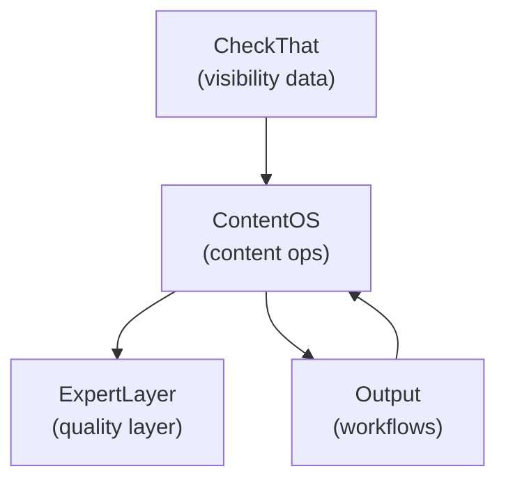

<metadata>
purpose: Documents GrowthX's multi-product ecosystem strategy — how CheckThat, ContentOS, Output, and ExpertLayer work together
audience: All team members, leadership, new hires
summary: How GrowthX's four products create compounding value through audience segmentation, data flywheels, and a connected customer journey from discovery to advanced workflows.
domain: product
confidence: canonical
context_tier: 1
last_updated: 2026-02-22
</metadata>

# Product Ecosystem

How GrowthX's multi-product strategy creates compounding value across different audiences and price points.

## Why multiple products

GrowthX builds a **multi-product ecosystem**, not a monolithic platform. This is intentional:

- **Serve different audiences** with purpose-built solutions optimized for their needs
- **Capture value at multiple price points** from self-serve to enterprise
- **Build network effects** where each product strengthens the others
- **Reduce risk** by diversifying revenue and market positioning
- **Move faster** by decoupling development cycles and go-to-market motions

Each product exists for a specific strategic reason, targets a distinct audience, and operates at its own economic model — but they integrate to create a cohesive ecosystem that compounds in value.

## The products

- **CheckThat** — The open AI visibility index for B2B. Freemium product-led growth engine that plants our flag in the AI visibility category and generates leads at scale.
- **ContentOS** — Content operations platform — our core revenue engine. Makes content agencies obsolete with an all-batteries-included platform for enterprise content teams.
- **Output** — Open-source AI framework for building agents and workflows. Our technical credibility play and long-term infrastructure bet.
- **ExpertLayer** — Expert marketplace that solves the AI content quality problem. Provides the human quality layer across the ecosystem.

## How they work together

While each product is separate, they integrate to create an ecosystem worth more than the sum of its parts.

### The customer journey

1. **Discovery** — Learn about AI-led growth through content and community.
2. **Entry point (CheckThat)** — Sign up for freemium AI visibility monitoring. Get recommendations on content opportunities.
3. **Conversion (ContentOS)** — Realize they need help executing on opportunities. Upgrade to self-operated or GrowthX-operated ContentOS.
4. **Quality layer (ExpertLayer)** — Need expert writers and editors to review AI-generated content. Hire directly through the platform.
5. **Advanced workflows (Output)** — Want custom workflows beyond out-of-box features. Deploy workflows from the marketplace or build custom.

### Integration points

**CheckThat → ContentOS:**
CheckThat identifies AI visibility opportunities. ContentOS uses those insights to prioritize content creation. Shared data on rankings, competitors, and trends. Single login across both products.

**ContentOS → ExpertLayer:**
ContentOS surfaces content that needs expert review. ExpertLayer provides the experts. Work tracking flows back into the ContentOS dashboard. Quality scores inform future content strategy.

**ContentOS → Output:**
ContentOS uses Output workflows under the hood. Custom workflows from the marketplace can replace defaults. Enterprise customers can deploy private workflows.

**Output → Everything:**
Output provides the infrastructure layer. All workflow execution runs on the Output runtime. Shared learnings improve the framework. Technical credibility supports all go-to-market motions.

### Data flywheel

1. **CheckThat collects visibility data** across thousands of companies
2. **ContentOS uses this data** to improve recommendations
3. **ExpertLayer captures quality feedback** on content outputs
4. **Output learns from execution patterns** across all workflows

## Why multiple products win

### Audience segmentation

Each product targets a fundamentally different buyer:

- **CheckThat:** Self-serve individual contributors and small teams
- **ContentOS:** Enterprise buyers with dedicated content teams
- **ExpertLayer:** Both buyers (companies) and sellers (experts)
- **Output:** Developers and technical decision-makers

Merging them would create confused positioning, watered-down messaging, and slower go-to-market.

### Development velocity

Separate products allow independent roadmaps, team specialization, experimentation freedom, and clear success metrics. A merged product creates coupled roadmaps, conflicting priorities, and slower iteration.

### Market positioning

Multiple products create stronger market perception:

- "GrowthX has a product for every stage of the journey"
- "They understand the full ecosystem of AI-led growth"
- "I can start with CheckThat and grow into ContentOS"
- "They're building the category, not just a tool"

### Risk distribution

If content creation becomes commoditized, ExpertLayer provides differentiation. If AI providers commoditize visibility data, CheckThat suffers but ContentOS thrives. If our infrastructure bet fails, Output doesn't kill the core business.

> **Warning:** The main risk of multiple products is inability to focus. Leadership attention is spread, and one product can impact the other without dedicated product leaders owning them independently.

## Brand architecture

All products live under the GrowthX umbrella but maintain distinct identities:

- **GrowthX CheckThat** — freemium AI visibility
- **GrowthX ContentOS** — content operations platform
- **GrowthX ExpertLayer** — expert marketplace
- **Output.ai** — technical open-source framework (can live as a separate brand)

This creates a unified brand story, product clarity, cross-sell opportunities, and portfolio value.
