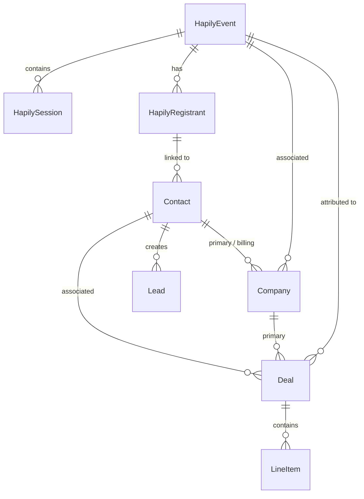
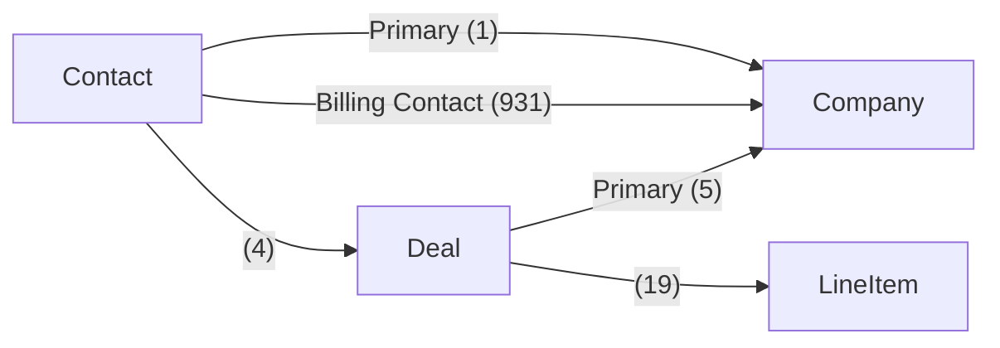
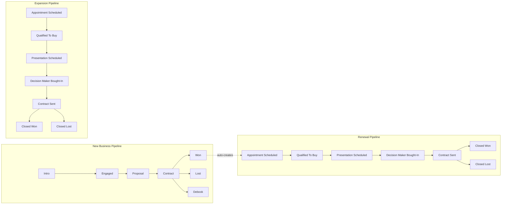
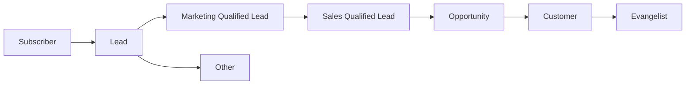
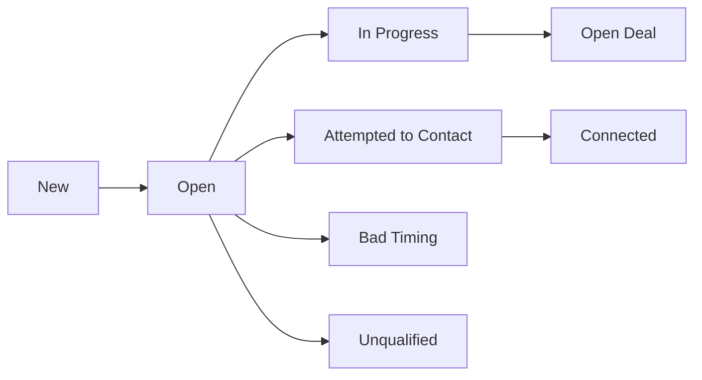
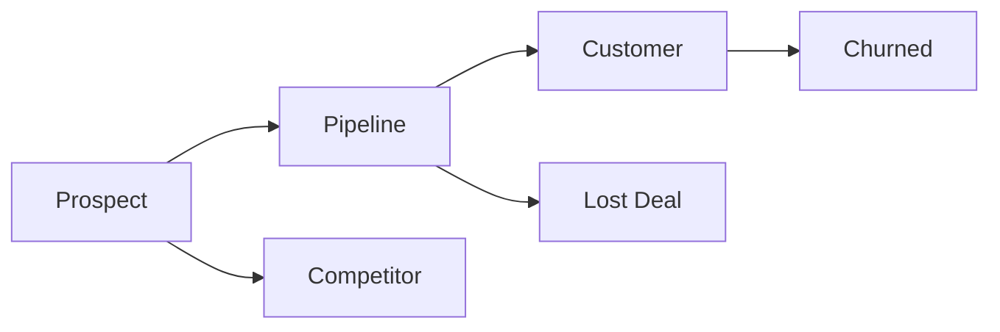
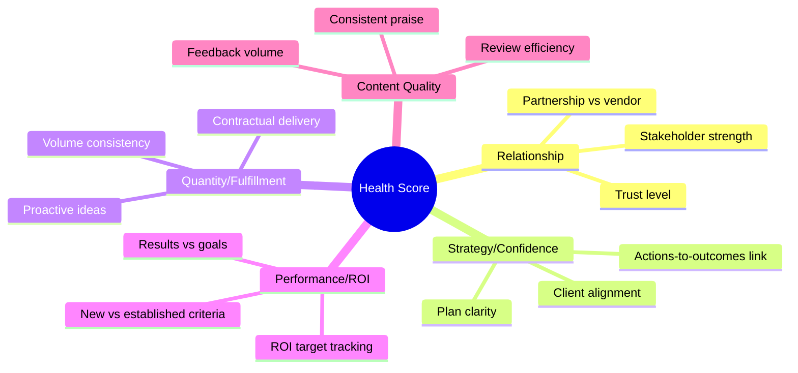
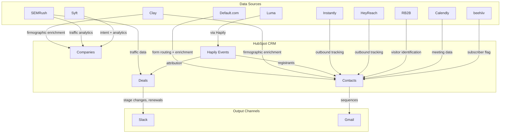
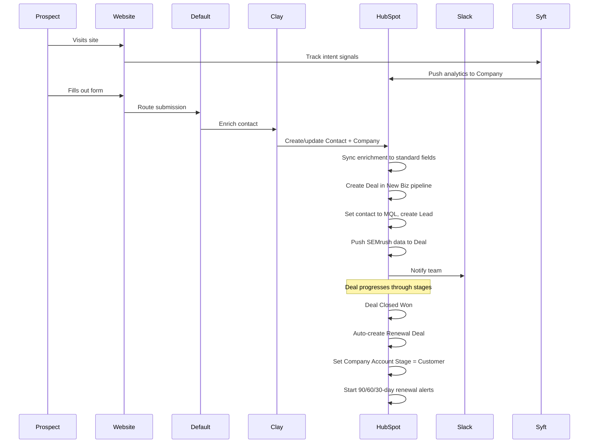

# HubSpot CRM System Guide — GrowthX

<metadata>
purpose: Comprehensive reference for how GrowthX uses HubSpot — objects, properties, pipelines, workflows, and integrations
audience: Internal — Marcel, engineering, operations, delivery
related_files:
  - pipeline/scratchpad/2026-02-26-hubspot-system-exploration-v1.md
domain: operations
confidence: high
last_updated: 2026-02-26
</metadata>

---

## 1. Account Overview

| Field | Value |
|-------|-------|
| Portal ID | 341940338 |
| Owner | Marcel Santilli (marcel@growthx.ai) |
| Account Type | Standard |
| Time Zone | America/Los_Angeles (UTC-8) |
| Currency | USD |
| UI Domain | app-na3.hubspot.com |

---

## 2. Object Model

GrowthX uses 4 core standard objects plus 3 custom objects from the Hapily (Luma) integration:

### Standard Objects

| Object | ID | Properties | Property Groups | Role |
|--------|----|-----------|----------------|------|
| **Contacts** | 0-1 | ~700+ | 23 | Every person we interact with |
| **Companies** | 0-2 | ~234 | 20 | Client and prospect organizations |
| **Deals** | 0-3 | ~444 | 23 | Revenue opportunities and active contracts |
| **Leads** | 0-136 | ~46 | — | MQL tracking object |
| **Line Items** | — | — | — | Revenue line items on deals |

### Custom Objects (Hapily / Luma)

| Object | Type ID | Role |
|--------|---------|------|
| **hapily_registrant** | 2-159540856 | Event registrants synced from Luma |
| **hapily_session** | 2-159540861 | Event sessions |
| **hapily_event** | 2-159540866 | Events synced from Luma |

### Associations

---

## 3. Pipelines and Deal Stages

GrowthX has 3 deal pipelines reflecting the customer lifecycle:

### New Business Pipeline (Primary)

The main sales pipeline. Deals follow a simplified, GrowthX-specific flow:

| Stage | Description |
|-------|-------------|
| Intro | First conversation scheduled or held |
| Engaged | Prospect is actively in discussions |
| Proposal | Scope and pricing shared |
| Contract | SoW/contract in review or sent |
| Won | Deal closed, contract signed |
| Lost | Deal did not close |
| Debook | Won deal reversed/canceled before kickoff |

### Expansion Pipeline

For upsells on existing client accounts:

| Stage | Description |
|-------|-------------|
| Appointment Scheduled | Upsell conversation booked |
| Qualified To Buy | Budget and need confirmed |
| Presentation Scheduled | Proposal meeting set |
| Decision Maker Bought-In | Exec sponsor aligned |
| Contract Sent | SoW sent for signature |
| Closed Won / Closed Lost | Outcome |

### Renewal Pipeline

Automated renewal tracking. Deals are auto-created when a New Business deal closes:

| Stage | Description |
|-------|-------------|
| Appointment Scheduled through Contract Sent | Same stages as Expansion |
| Closed Won / Closed Lost | Outcome |

Renewal alerts fire at **90**, **60**, and **30 days** before renewal date.

---

## 4. Lifecycle and Status Flows

### Contact Lifecycle Stage

Lifecycle stages are managed both manually and via workflows. Key automations:
- **Deal created** → primary contact set to MQL
- **MQL created** → Lead object created
- **Deal won** → contact set to Customer

### Contact Lead Status

### Company Account Stage

Set via workflow when deals close. "Customer" status is triggered by a dedicated workflow.

### Company Fit Score (ICP Alignment)

Three tiers based on firmographics, funding, and technographics:
- **Good** — Strong ICP fit
- **Medium** — Acceptable, moderate priority
- **Low** — Poor fit

Calculated by a workflow that fires when revenue or funding data updates.

---

## 5. Deal Types and Contract Structure

### Deal Types
| Type | When Used |
|------|-----------|
| New Business | First engagement with a company |
| Expansion | Upsell on existing account |
| Renewal | Contract renewal |
| Renewal - Upsell | Renewal with increased scope |
| Renewal - Downsell | Renewal with reduced scope |

### Contract Types (workstream_type)
| Type | Description |
|------|-------------|
| Sprint + Growth Execution | Strategy sprint followed by ongoing execution |
| Pilot + Workstream | Trial period then workstream |
| Standard Terms (Just Workstream) | Ongoing engagement without sprint |
| Other | Non-standard arrangement |

### Deal Naming Convention
Pattern: `{Company} - {Type} - {Month Year}`

Examples:
- `Tavus - Strategy Sprint - July 2025`
- `Diligent - Growth Execution - Aug 2025`
- `LILT - New Biz - May 2025` (auto-formatted by workflow)

### Contract Fields
| Field | Description |
|-------|-------------|
| Contract Start Date | When service begins |
| Contract End Date | When service ends |
| Contract End Date (Calculated) | Auto-calculated from start + term |
| Renewal Date | Contract end + 1 day |
| Term (months/weeks) | Contract duration |
| Billing Frequency | Monthly / Quarterly / Semi-Annually / Annually |
| Billing Timing | When payment is due relative to delivery |
| Payment Terms (Net Days) | Days to pay after invoice |
| Auto Renewal | Whether contract auto-renews |

---

## 6. Contact Properties — Custom Groups

### Default (Inbound) Enrichment — 31 properties

Data enriched via Default.com's inbound workflow and Clay tables. When a prospect fills out a form, Default routes them and Clay enriches the record with:

- **Company data**: Annual revenue, company domain, company name
- **Traffic data** (via Clay/SEMrush): Organic search visits, organic social visits, total users, pages per visit, time on site, traffic rank
- **Meeting tracking**: Meeting booked flag, booked meeting owner
- **Form data**: Date of initial submission, context for discussion
- **Automation triggers**: Did-not-book outreach trigger, DQ outreach trigger (via Zapier)

### Luma Events — 9 properties

Event attendance tracking per specific event:
- Individual event attendance flags (AI GTM Exec Dinner, GrowthX Breakfast, Inbound HH, Own the AI Front Page Webinar)
- Physical event / Virtual event attendance flags
- Most recent Luma activity date

### AI-Led Growth — 3 properties

Lead magnet and content delivery:
- Content name, content URL (populated dynamically via hidden form fields)
- Marketing consent

### OutboundSync — 52 properties

Tracks all outbound activity from Instantly and HeyReach:
- Email campaigns: campaign name, send time, open time, click time, reply time
- LinkedIn activity: likes, follows, connection requests
- Engagement details: reply messages, reply subjects, bounce tracking
- Status: connection status, unsubscribe tracking

### Calendly — 20 properties

10 question/answer pairs from Calendly booking forms.

### Key Custom Contact Fields

| Field | Type | Description |
|-------|------|-------------|
| `company_fit_score` | enum | ICP alignment (synced from company) |
| `company___of_employees` | number | Employee count (synced from company) |
| `company_funding` | number | Funding (synced from company) |
| `contact_tags` | enum | GTM filtering tags |
| `beehiiv_subscriber` | bool | Newsletter subscriber |
| `competitor` | enum | Competitor flag |
| `best_performing_channel` | enum | Best attribution channel |
| `first_touch_channel` | enum | First-touch attribution |
| `clay_enrichment_date` | date | Last Clay enrichment |
| `employment_seniority_tier` | enum | Seniority level |
| `gtm_role` | enum | GTM role classification |

---

## 7. Company Properties — Custom Groups

### Health Score — 7 properties

A 5-dimension client health scoring system (0.5-5 scale each):

| Dimension | Description | 1 = | 5 = |
|-----------|-------------|-----|-----|
| Relationship | Stakeholder trust | No trust, churn risk | Full trust, partners |
| Strategy/Confidence | Plan clarity | No strategy, directionless | Everyone aligned, data supports plan |
| Quantity/Fulfillment | Contractual delivery | Significantly under-delivering | Meeting everything + proposing new ideas |
| Performance/ROI | Results impact | Not hitting ROI goals | Exceeding ROI goals |
| Content Quality | Content satisfaction | Excessive feedback, quality meetings needed | Full trust, minimal feedback |

**Health Tier** is derived from the calculated sum, with weighting by dimension.

### SEMrush Data — 12 properties

Traffic analytics pushed from SEMrush to company records:
- Total users, total visits, traffic rank
- Organic search/social visits, paid search/social visits
- Referral visits, search visits
- Pages per visit, time on site

### Key Custom Company Fields

| Field | Type | Description |
|-------|------|-------------|
| `account_stage` | enum | Prospect/Pipeline/Customer/Churned/Lost/Competitor |
| `fit_score` | enum | ICP alignment (Good/Medium/Low) |
| `managing_director` | string | Assigned Engagement Manager |
| `active_annualized_mrr` | number | Sum of active deal MRR |
| `funding` | number | Funding amount |
| `domain_authority` | number | SEO DA score |
| `slack_channel__internal` | string | Internal Slack channel |
| `billing_address` / `billing_email` | string | Billing info |
| `sales_prospecting_tier` | enum | Sales targeting tier |

---

## 8. Deal Properties — Custom Groups

### Account Potential — 7 properties

A 5-dimension scoring matrix for evaluating new business potential:

| Dimension | 1 | 3 | 5 |
|-----------|---|---|---|
| Content Track Record | Little to no content | Some content, sporadic | Publishing 2+/week or 500+ pages |
| Domain Authority | DA <20 | DA 20-39 | DA 40+ |
| Funding/Establishment | <$2M or <100 employees | $2-10M or 100-500 employees | $10M+ or 500+ employees |
| Growth Trajectory | Flat or declining | Stable, modest growth | Recent raise or 20%+ headcount growth |
| Logo Value | Unknown | Respectable but niche | Well-known brand we'd promote |

### Contract Information — 13 properties

Full contract lifecycle tracking (see Section 5).

### Engagement Score — BANT + Trust/Enthusiasm

Fields for scoring deal engagement: Budget, Authority, Trust, Enthusiasm, Urgency.

### ICP Matrix

Multi-dimensional ICP scoring:
- Approval layers, budget alignment, content complexity
- Domain strength, exec sponsor access, ICP industry fit
- Market position, organic maturity, team readiness

### Partnership Fit

Scoring for partnership alignment:
- Approval process, champion quality, content philosophy
- Execution complexity, growth trajectory, revenue potential

### Prior/Next Renewal Deal Information

Linked deal tracking for renewal chains — prior deal amount, ARR, MRR, contract dates.

### Attio Migration — 9 properties

Historical data from Attio CRM migration (June 2025): deal record IDs, stages, values, close dates.

---

## 9. Workflows

### Workflow Architecture

```mermaid
flowchart TD
    subgraph inbound ["Inbound Flow"]
        Form["Form Submission"] --> Default["Default.com Routing"]
        Default --> Clay["Clay Enrichment"]
        Clay --> Contact["Contact Created/Updated"]
        Contact --> EnrichSync["Sync Enrichment to Fields"]
        Contact --> FollowUp["Follow-up Email"]
        Default -->|"no meeting booked"| Outreach["Did-Not-Book Outreach"]
    end

    subgraph dealOps ["Deal Operations"]
        DealCreate["Deal Created"] --> SetType["Set Deal Type by Pipeline"]
        DealCreate --> FormatName["Auto-Format Deal Name"]
        DealCreate --> EnrichDeal["Push SEMrush Data to Deal"]
        DealCreate --> SetMQL["Set Contact to MQL"]
        SetMQL --> CreateLead["Create Lead Object"]
        DealCreate --> LinkDeals["Link Sprint/Growth Deal IDs"]
    end

    subgraph renewals ["Renewal Automation"]
        ClosedWon["Deal Closed Won"] --> CreateRenewal["Create Renewal Deal"]
        CreateRenewal --> RenewalOdd["Odd Cycle Renewal WF"]
        RenewalOdd --> RenewalEven["Even Cycle Renewal WF"]
        CreateRenewal --> Alert90["90-Day Alert"]
        CreateRenewal --> Alert60["60-Day Alert"]
        CreateRenewal --> Alert30["30-Day Alert"]
    end

    subgraph companySync ["Company Data Sync"]
        CompanyUpdate["Company Updated"] --> SyncFit["Sync Fit Score to Contacts"]
        CompanyUpdate --> SyncEmployees["Sync Employee Count"]
        CompanyUpdate --> SyncMD["Sync Managing Director"]
        CompanyUpdate --> SyncDeals["Sync Deal Count"]
        CompanyUpdate --> SetFitScore["Calculate Fit Score"]
        CompanyUpdate --> SetAccountPotential["Set Account Potential"]
    end

    subgraph events ["Event Tracking"]
        LumaEvent["Luma Event"] --> Hapily["Hapily Sync"]
        Hapily --> Registrant["Create Registrant"]
        Registrant --> LinkContact["Link to Contact"]
        Registrant --> LinkCompany["Link to Company"]
        Registrant -->|"attended"| Attribution["Deal Attribution"]
        Attribution --> InfluencedCreation["Event Influenced Creation"]
        Attribution --> InfluencedClose["Event Influenced Close"]
    end

    subgraph outbound ["Outbound Tracking"]
        Instantly["Instantly"] --> TouchDate["First Touch Timestamp"]
        HeyReach["HeyReach"] --> TouchDate
        TouchDate --> BestChannel["Best Performing Channel"]
        TouchDate --> FirstTouch["First Touch Channel"]
    end
```

### Key Workflow Categories

**Inbound (7 workflows)**
- Default.com form routing and enrichment
- Clay data enrichment push to contact and company fields
- AI-Led Growth content/lead magnet delivery
- Follow-up emails after form submission

**Deal Pipeline Management (14 workflows)**
- Auto-set deal type based on pipeline
- Auto-format deal names (`Company - Type - Month Year`)
- Push SEMrush data to new deals
- Link Sprint and Growth Execution deal IDs
- Validate line items on close
- Auto-generate Growth deal from Sprint at Contract stage
- Set contact to MQL on deal creation
- Create Lead object on MQL
- Calculate contract end dates
- Validate attribution data

**Renewal Automation (7 workflows)**
- 3-workflow chain: New Business Won → Create Renewal → Odd Cycle → Even Cycle
- 90/60/30-day renewal alert notifications
- Closed Lost Renewals handling
- Contract active flag management

**Company Data Sync (8 workflows)**
- Sync Fit Score, Employee Count, Managing Director, Deal Count to contacts
- Calculate Fit Score from revenue/funding
- Set Account Potential based on funding/establishment
- Set Account Stage to Customer on deal close
- Set Enrichment Status on Clay enrichment

**Outbound Tracking (6 workflows)**
- First Instantly/HeyReach touch timestamps
- Best Performing Channel calculation
- First Touch Channel tracking
- Active on HeyReach and Instantly flags
- Has Replied tags

**Event Tracking (11 workflows)**
- Hapily/Luma event sync (registrants, sessions, events via webhooks)
- Registrant → Contact/Company linking
- Event attendance tracking
- Deal attribution (influenced creation and influenced close)
- Copy Luma data from contacts to companies

---

## 10. Integration Map

### Integration Summary

| Integration | Direction | What It Does |
|-------------|-----------|-------------|
| **Default.com** | → HubSpot | Inbound form routing, lead qualification, meeting booking |
| **Clay** | → HubSpot | Contact/company enrichment (firmographics, traffic, technographics) |
| **SEMRush** | → HubSpot | Traffic analytics on companies and deals |
| **Hapily / Luma** | ↔ HubSpot | Event sync — registrants, sessions, events, attendance, deal attribution |
| **Instantly** | → HubSpot | Outbound email campaign tracking (via OutboundSync) |
| **HeyReach** | → HubSpot | LinkedIn outbound campaign tracking (via OutboundSync) |
| **RB2B** | → HubSpot | Anonymous website visitor identification |
| **Calendly** | → HubSpot | Meeting booking data and form answers |
| **beehiiv** | → HubSpot | Newsletter subscriber status |
| **Syft** | → HubSpot | Website analytics, intent signals, purchase intent, LinkedIn engagement |
| **Slack** | HubSpot → | Deal stage notifications, renewal alerts |
| **Gmail** | HubSpot → | Sequences and email tracking |
| **Attio** | Historical | Previous CRM — migration data still present |
| **Koalify** | Within | Duplicate detection and management |
| **Zapier** | Bridge | Connects Default triggers to outbound workflows |

---

## 11. Data Flow Summary

---

## 12. Key Operational Notes

### What Gets Auto-Synced from Company to Contact
- Fit Score
- Employee Count
- Managing Director (Engagement Manager)
- Deal Count
- Company Name

### Renewal Chain Logic
1. New Business deal closes won → WF #1 creates first Renewal deal
2. Odd-cycle renewals are handled by WF #2
3. Even-cycle renewals are handled by WF #3
4. Each renewal deal has prior deal information linked (amount, ARR, dates)

### Deal Auto-Naming
Workflow auto-formats deal names to: `{Company} - {Pipeline Context} - {Month Year}`

### Event Attribution
Hapily tracks two types of event influence on deals:
- **Influenced Creation**: Contact attended event before deal was created
- **Influenced Close**: Contact attended event before deal closed won
