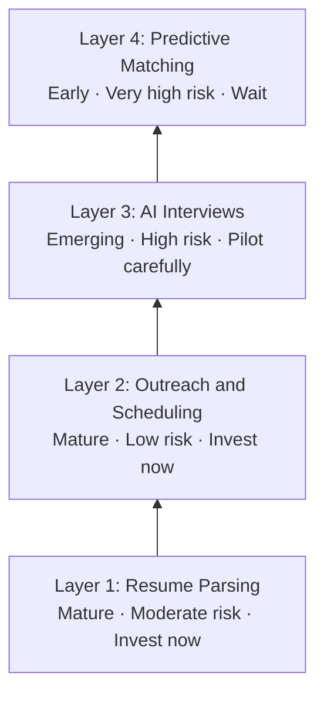
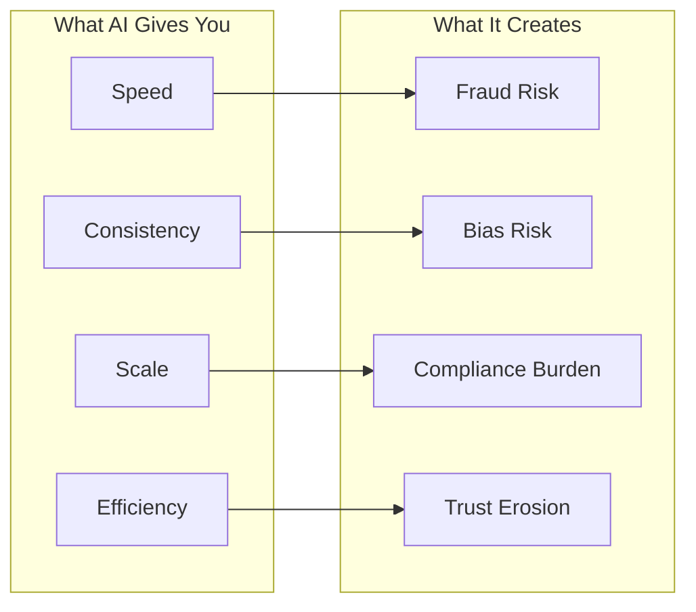
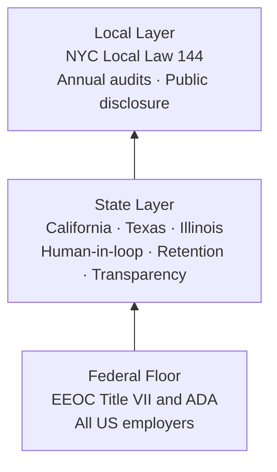
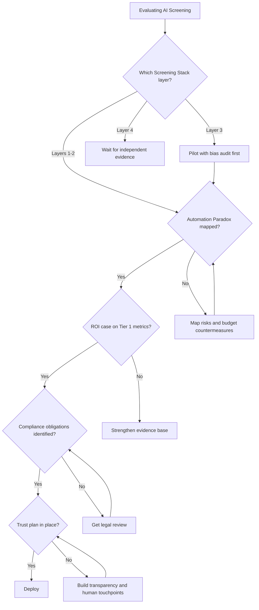
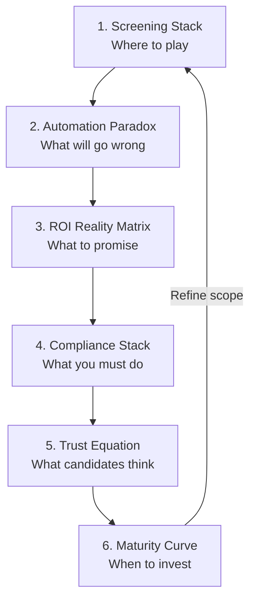

# AI Candidate Screening: A Thinking Framework

<metadata>
purpose: Practical guide for using AI in candidate screening, built from mental models and first principles
audience: Enterprise TA leaders, staffing firm operations directors, anyone evaluating AI screening tools
related: pipeline/research/ai-candidate-screening-research-v1.md
domain: talent-acquisition
confidence: high
sensitivity: internal
context_tier: 2
source_skill: manual (synthesized from comprehensive research report)
input_files: [AI Candidate Screening Transformation in Enterprise Hiring - Feb 2026]
output_stage: scratchpad
last_updated: 2026-02-20
</metadata>

---

AI screening tools cut time-to-hire by 30-71% and deliver 282-449% ROI. But only 17% of organizations get their implementation right.

That's not a technology problem. It's a thinking problem.

This guide gives you the mental models to think clearly about AI screening. Not which vendor to pick. Not which features to compare. How to reason about what AI can and can't do in hiring, so every decision downstream gets better.

---

## First Principles: What Is Screening?

Before talking about AI, decompose screening into what it actually is.

Every hire starts with the same problem: you have a pool of people and a job. Some people fit. Most don't. Screening is the process of separating signal from noise.

That's it. Everything else is implementation detail.

Three things make screening hard:

1. **Volume.** Enterprise roles attract hundreds of applications. A single recruiter manages 40+ open positions (SHRM). You can't read everything carefully.
2. **Ambiguity.** Resumes are noisy signals. People oversell. They undersell. The format varies. Two identical candidates can look completely different on paper.
3. **Speed pressure.** The best candidates disappear fast. Median time-to-fill is 45 days (SHRM 2025). Every day you spend screening, someone else is closing.

These three forces create the fundamental tradeoff of screening:

### The Iron Triangle of Screening

You can optimize for speed, accuracy, or fairness. Improving two always pressures the third.

- **Speed + Accuracy** (move fast on the best candidates) pressures fairness. You start pattern-matching on proxies like school names and employer brands. That's where bias hides.
- **Speed + Fairness** (review everyone quickly using standardized criteria) pressures accuracy. Rigid criteria miss outliers and non-traditional candidates who'd be great hires.
- **Accuracy + Fairness** (evaluate every candidate deeply and equitably) pressures speed. You can't do thorough, bias-aware assessment of 500 applicants before the best ones accept other offers.

This tradeoff is why screening is hard with humans. And it's exactly what AI promises to fix.

The promise: machines can process volume without fatigue, apply consistent criteria without drift, and do it 24/7. In theory, AI relaxes all three constraints simultaneously.

In practice, it introduces new ones.

---

## Where Machines Beat Humans (and Where They Don't)

AI doesn't think about candidates. It processes patterns. Understanding this distinction prevents most implementation mistakes.

**Machines are better at:**

- **Volume processing.** Parsing 1,000 resumes in the time a human reads 10. Resume parsing uses NLP to extract structured data (skills, tenure, titles) from unstructured text.
- **Consistency.** The algorithm evaluates candidate #500 with the same criteria as candidate #1. Humans get tired, hungry, and biased after lunch.
- **Availability.** 48% of AI-conducted interviews happen outside business hours. Candidates in different time zones or with day jobs can participate on their schedule.
- **Pattern detection at scale.** Finding anomalies in application data that signal fraud. Spotting correlations between candidate attributes and job performance across thousands of data points.

**Humans are better at:**

- **Context.** Understanding why someone left a job, what a career gap means, whether a lateral move was strategic or desperate. AI sees the resume. Humans see the story.
- **Judgment under ambiguity.** When the data is incomplete or contradictory. When the candidate is a non-obvious fit. When the role is new and there's no historical pattern to match against.
- **Relationship and trust.** 62% of candidates say in-person interviews make them more likely to apply (Gartner). People want to be evaluated by people for the things that matter most.
- **Cultural read.** Whether someone will thrive in your specific environment. This is hard to define, harder to measure, and nearly impossible to automate without embedding bias.

The right mental model isn't "AI vs. humans." It's "AI for what machines do well, humans for what humans do well." The screening stack below maps exactly where each belongs.

---

## Framework 1: The Screening Stack

AI screening isn't one thing. It's four layers, each with different maturity, proven returns, and risk profiles. Think of them like a building. You don't install the roof before the foundation.

### Layer 1: Resume Parsing and Ranking

**What it does:** Extracts structured data from resumes (skills, experience, education) and scores candidates against job requirements.

**Maturity:** High. This is the oldest and most proven AI screening capability. 32.1% of AI-using employers deploy it here. Systems use NLP (named entity recognition, transformer models like BERT) to understand resume content semantically, not just match keywords.

**Proven returns:**
- 86% reduction in direct screening costs at scale (Equip)
- 30-40% cost-per-hire reduction (SHRM, Deloitte, Greenhouse)
- 60% reduction in review time per candidate (HireVue/Spark Hire)

**Risk level:** Moderate. Bias enters through training data. If your past hiring skewed toward certain backgrounds, the AI learns that skew. Amazon's recruiting AI downgraded resumes containing "women's" (as in "women's chess club") because historical hiring data was male-dominated. They shut it down.

**Decision rule:** If you're doing any AI screening, start here. Highest ROI, most mature, best understood risks.

### Layer 2: Automated Outreach and Scheduling

**What it does:** Contacts candidates, manages availability, books interviews on team calendars, syncs with ATS.

**Maturity:** High. Conversational AI handles scheduling without recruiter intervention.

**Proven returns:**
- Response times from 7 days to under 24 hours (Paradox case studies)
- 85% candidate satisfaction with AI scheduling (BPAS Journals)
- Healthcare sector: time-to-first-interview from days to hours (Paradox/iCIMS)

**Risk level:** Low. This is administrative automation. Minimal bias surface. High candidate satisfaction because it solves a real pain point (waiting for callbacks).

**Decision rule:** Deploy alongside or immediately after Layer 1. Low risk, high satisfaction, fast ROI.

### Layer 3: AI-Conducted Interviews and Assessment

**What it does:** Conducts phone screens or video interviews using structured questions. Evaluates responses. Scores candidates.

**Maturity:** Emerging. Growing fast but still in the "Peak of Inflated Expectations" on Gartner's Hype Cycle.

**Reported performance:**
- 90% candidate satisfaction for AI screening processes (BPAS Journals, peer-reviewed)
- 48% of AI interviews conducted outside business hours
- 92% satisfaction rate on platforms like Alex AI (vendor-reported)

**Risk level:** High. This is where compliance gets serious. Video analysis of speech patterns can violate the ADA if it scores applicants lower due to disabilities. The EEOC classifies these as "selection procedures" requiring Title VII disparate impact testing. Fraud is a growing concern: deepfake video personas, proxy interviewees, real-time AI assistance during interviews.

**Decision rule:** Pilot carefully. Require independent bias audits before full deployment. Maintain human review of AI assessments for final decisions.

### Layer 4: Predictive Matching and Quality-of-Hire

**What it does:** Predicts which candidates will succeed in the role based on historical performance data, skills matching, and behavioral patterns.

**Maturity:** Early. Gartner places "AI-Enabled Candidate Matching" in the Trough of Disillusionment. First-generation algorithms showed mixed results.

**Reported performance:** Limited. No Tier 1 research (Gartner, Forrester, SHRM) provides verified quality-of-hire statistics for AI screening vs. manual methods. Vendor claims exist. Independent validation doesn't.

**Risk level:** Very high. Predictive models are only as good as your outcome data. If you can't measure quality-of-hire consistently today, an AI system can't predict it.

**Decision rule:** Wait. Watch this space. Don't invest heavily until independent research catches up. Focus on Layers 1-3 where the evidence is strong.

### Putting the Stack Together

| Layer | Maturity | Evidence | Risk | When to Invest |
|---|---|---|---|---|
| 1. Resume parsing | High | Strong (Tier 1) | Moderate (bias) | Now |
| 2. Outreach/scheduling | High | Strong (Tier 1-2) | Low | Now |
| 3. AI interviews | Emerging | Mixed (Tier 1-2) | High (compliance) | Pilot carefully |
| 4. Predictive matching | Early | Weak (vendor only) | Very high | Wait |

---

## Framework 2: The Automation Paradox

Here's what vendors won't tell you: every AI screening capability creates a new problem roughly proportional to the problem it solves. This isn't a reason to avoid AI. It's a reason to go in with eyes open.

### Speed creates fraud risk

AI screening processes applications faster. But it also makes it easier for fraudulent candidates to apply at scale.

The numbers are alarming:
- Gartner predicts 1 in 4 candidate profiles worldwide will be fake by 2028
- 6% of candidates admitted to interview fraud (posing as someone else) in Gartner's 2025 survey
- 39% of candidates report using AI during the application process
- Deepfake video personas can now bypass visual identity verification

63% of hiring managers updated protocols in the past year specifically to address AI-related fraud (Checkr 2025).

But there's no consensus on what works. When asked where they'd invest: 36% said in-person verification, 31% said AI fraud detection, 24% said stronger background checks. Nobody has a clear answer yet.

**The paradox:** AI screening lets you process more candidates faster. That same speed advantage benefits fraudulent applicants.

### Consistency creates bias risk

AI applies the same criteria to every candidate. That sounds fair. But if the criteria embed historical bias, you've automated discrimination at scale.

The Amazon case is definitive. Their AI recruiting tool taught itself that male candidates were preferable because the training data reflected a decade of male-dominated hiring. It penalized resumes from women's colleges. Amazon killed the project.

The deeper problem: there's no universal definition of "fair" in AI screening. Academic research identifies competing fairness definitions (demographic parity, equalized odds, predictive parity) that are mathematically incompatible. You literally can't satisfy all of them simultaneously.

**The paradox:** AI applies consistent rules. But consistent application of biased rules produces consistent bias.

### Scale creates compliance risk

AI screening at enterprise scale triggers regulatory obligations that didn't exist when hiring was manual.

The EEOC treats AI screening as an employment "selection procedure" under Title VII. That means disparate impact testing, documentation, and potential legal liability. NYC requires annual independent bias audits. California prohibits exclusive AI reliance in final decisions and mandates 4-year record retention. Texas requires transparency about AI use in employment (effective January 2026).

**The paradox:** AI lets you screen at scale. Scale triggers compliance requirements that increase operational complexity.

### Efficiency creates trust risk

AI makes screening faster and cheaper. But candidates don't like being screened by machines.

- Only 26% of candidates trust AI to evaluate them fairly (Gartner, n=2,918)
- Offer acceptance dropped from 74% to 51% between 2023 and 2025
- 25% trust employers less when AI is involved
- 32% worry AI will fail their application

**The paradox:** AI screening is more efficient. But efficiency gains disappear if top candidates opt out because they don't trust the process.

### Working with the Paradox

The automation paradox doesn't mean "don't automate." It means budget for the countermeasures alongside the technology:

| Capability | New Risk | Countermeasure |
|---|---|---|
| Speed | Fraud | Multi-layer verification (in-person + AI + background checks) |
| Consistency | Bias | Independent fairness audits, diverse training data |
| Scale | Compliance | Legal review, multi-jurisdiction notification protocols |
| Efficiency | Trust erosion | Transparency, human touchpoints, opt-out options |

If your vendor pitch only talks about the left column, they're selling half the story.

---

## Framework 3: The ROI Reality Matrix

Not all ROI claims are created equal. This framework separates what's proven from what's projected, so you can build an honest business case.

### Tier 1: Proven (Forrester TEI methodology, peer-reviewed research)

These numbers come from Forrester Total Economic Impact studies using rigorous methodology with customer interviews and composite modeling. They're the gold standard for enterprise ROI measurement.

| Metric | Value | Source |
|---|---|---|
| ROI (Phenom platform) | 449% over 3 years | Forrester TEI |
| ROI (iCIMS platform) | 282% over 3 years | Forrester TEI |
| Payback period | Less than 6 months | Forrester TEI |
| Net present value | $24.3M over 3 years | Forrester TEI (Phenom) |
| Cost-per-hire reduction | 30-40% | SHRM, Deloitte, Greenhouse |
| Time-to-hire reduction | 30-71% | Multiple independent sources |

### Tier 2: Probable (named case studies, industry surveys)

Strong directional evidence from real implementations, but not independently audited.

| Metric | Value | Source |
|---|---|---|
| Recruiter productivity gain | 60-70% | LinkedIn Talent Solutions |
| Bad-hire reduction | 40% | Gartner 2025 |
| Retention improvement | 30% | Gartner 2025 |
| Daily time savings per recruiter | 1.5 hours | Gartner via HR Executive |
| Unilever time-to-hire reduction | 75-90% | Named case study |
| IBM hours saved | 3.9M hours by 2024 | Named case study |

### Tier 3: Aspirational (vendor claims, limited validation)

These metrics are commonly cited but lack independent verification.

| Metric | Value | Why It's Aspirational |
|---|---|---|
| Quality-of-hire improvement | Various | No Tier 1 source provides verified data |
| Bias reduction | Various | Amazon case study suggests opposite risk |
| Candidate satisfaction above 90% | Various | Academic research supports; Talent Board hasn't isolated AI screening |

### The Hidden Cost Layer

Vendor ROI projections rarely include these:

- **Implementation timeline.** Most organizations need 2-4 years for satisfactory ROI. Only 6% achieve returns in under one year (Newbury Partners).
- **Success rate.** Just 17% of organizations describe their AI implementation as "highly successful" (SHRM). The other 83% are somewhere between "OK" and "failed."
- **Change management.** 44% of companies use AI in less than 25% of their TA process (Aptitude Research). Adoption, not technology, is the bottleneck.
- **Forrester predicts 25% of planned AI spend will defer to 2027.** Even enterprises with budget are slowing down to focus on implementations that actually work.

### How to Use This

When building a business case:

1. Lead with Tier 1 metrics. They're defensible in front of a CFO.
2. Use Tier 2 for directional support. Flag them as "named case studies, not independently audited."
3. Ignore Tier 3 for the business case. Use them only as "market sentiment" context.
4. Include the hidden cost layer. It builds credibility and sets realistic expectations. A realistic plan that gets funded beats an optimistic plan that gets killed six months in.

---

## Framework 4: The Compliance Stack

Regulatory requirements for AI screening layer on top of each other by jurisdiction. Miss one layer and you're exposed.

Think of compliance as a stack. The federal floor applies to everyone. State requirements add on top. Local requirements add on top of that. And your obligation is determined by where the candidate resides, not where your company is headquartered.

### Federal Floor (applies to all US employers)

**EEOC / Title VII:**
- AI screening tools are "selection procedures." Full stop.
- If they produce disparate impact against a protected class, you must prove the tool is "job-related and consistent with business necessity."
- You must demonstrate no less-discriminatory alternative exists.
- EEOC Chair Charlotte Burrows: "Bias in employment arising from the use of algorithms and AI falls squarely within the Commission's priority to address systemic discrimination."

**ADA:**
- Video interview software analyzing speech patterns can violate ADA if it scores applicants lower because of disability-related speech differences.
- The FTC's Rite Aid enforcement action found AI surveillance "falsely flagged consumers, particularly women and people of color." Same risk applies to hiring AI.

### State Layer

**California (effective October 2025):**
- Cannot rely exclusively on AI for final employment decisions. Human-in-the-loop is mandatory.
- 4-year retention requirement for AI criteria and results. That's significantly longer than typical hiring documentation.
- Must notify employees when using AI for employment decisions.

**Texas (effective January 2026):**
- Transparency, risk evaluation, and governance requirements for AI in employment.

**Illinois:**
- Notification requirements for candidates when AI is used in video interviews.

### Local Layer

**NYC Local Law 144 (effective January 2023):**
- Annual independent bias audits of any automated employment decision tool.
- Candidate notice requirements for all applicants.
- Public disclosure of audit results on employer website.
- Applies based on candidate residence, not employer location. If you hire people in NYC, this applies to you.

Enforcement reality check: a December 2025 audit by the NY State Comptroller found limited complaint routing and inconsistent oversight. The law exists. Enforcement is catching up. Don't assume low enforcement means low risk.

### The Compliance Decision Tree

1. Do you use any AI tool in hiring? If yes, you're subject to EEOC Title VII and ADA requirements. Conduct adverse impact analysis.
2. Do candidates reside in California? Add human-in-the-loop for final decisions. Implement 4-year record retention. Notify candidates.
3. Do candidates reside in NYC? Commission annual independent bias audits. Publish results. Notify all applicants.
4. Do candidates reside in Texas or Illinois? Implement transparency protocols.
5. Are you using video analysis? Get legal review for ADA compliance before deployment.

Budget for: legal review of all AI hiring tools, independent bias audits (annually for NYC, as best practice everywhere), multi-jurisdiction notification systems, 4-year data retention infrastructure.

---

## Framework 5: The Trust Equation

Candidate trust is the constraint nobody models in their AI screening ROI. But it directly determines whether the technology delivers returns or drives away talent.

### The Data

Gartner surveyed 2,918 candidates in Q1 2025. The findings:

- **26% trust AI** to evaluate them fairly. Three-quarters don't.
- **Offer acceptance dropped from 74% to 51%** between Q2 2023 and Q2 2025. (This tracks the period of AI screening adoption.)
- **32% worry** AI will fail their application.
- **25% trust employers less** when they know AI is involved.
- **62% say in-person interviews** make them more likely to apply.
- **79% want transparency** about AI use in hiring.

### Why Trust Matters for ROI

Run the math. Suppose AI screening saves you 50% on screening time and 30% on cost-per-hire. But if offer acceptance drops from 74% to 51%, you need to extend 45% more offers to fill the same roles. That eats into the efficiency gains.

Worse, the candidates who opt out aren't random. High-demand candidates with options are more likely to walk away from opaque processes. You save money screening but lose quality in the pipeline.

### The Trust Equation

Candidate trust in AI screening is a function of four factors:

**Trust = Transparency + Human Touchpoints + Perceived Fairness + Control**

- **Transparency.** Tell candidates you're using AI. 79% want to know. Hiding it erodes trust faster than disclosing it.
- **Human touchpoints.** Keep humans visible in the process. 62% prefer in-person interviews. The optimal process uses AI for what it's good at (speed, consistency) and humans for what they're good at (judgment, relationship).
- **Perceived fairness.** 49% of candidates believe AI could reduce bias. There's an opportunity here if you can demonstrate fairness (published audit results, clear criteria).
- **Control.** Let candidates opt out of AI interviews when possible. Choice signals respect. Forcing everyone through an AI screen signals the opposite.

### Practical Application

Design your screening process to maximize the trust equation:

1. Disclose AI use upfront. Don't bury it in terms of service.
2. Use AI for Layers 1-2 (parsing, scheduling) where trust impact is low.
3. Offer human alternatives for Layer 3 (interviews) where trust impact is high.
4. Publish your bias audit results. NYC requires it. Do it everywhere.
5. Measure offer acceptance rate as a key metric alongside time-to-hire and cost-per-hire. If acceptance drops, your trust equation is broken.

---

## Framework 6: The Maturity Curve

Gartner's Hype Cycle for AI in Human Resources (2025) maps where each AI screening capability sits on the adoption curve. This tells you where to invest now, where to pilot, and where to wait.

### Invest Now: Slope of Enlightenment (proven, production-ready)

**AI in Talent Acquisition (general)**
- Mature applications with demonstrated ROI
- Resume parsing, scheduling, candidate communication
- This is Layers 1-2 of the Screening Stack

### Pilot in 2-3 Years: Peak of Inflated Expectations (validation emerging)

**AI-Enabled Skills Management**
- Dynamic skills taxonomy and automated matching
- Kara Ayers (SVP Global TA, Xplor Technologies): "These tools allow us to analyze resumes for competencies rather than filtering by degree."
- Requires clean skills framework, consistent job architecture, and reliable performance data. Most organizations don't have this infrastructure yet.

**AI-Enabled Candidate Sourcing and Recruitment Marketing**
- Proactive talent identification and programmatic candidate attraction
- Market validation emerging but not proven at scale

### Watch for 3-5 Years: Innovation Trigger (early development)

**Recruiter AI Agents**
- Autonomous agents executing multi-step recruiting workflows
- 5-10 years from mainstream adoption per Gartner

**AI-Enabled Interview Intelligence**
- Advanced analysis of interview content beyond transcription
- 5-10 years from mainstream

**Generative AI in Recruiting**
- Personalized candidate communications and content creation
- Already in use for job ads (73% of AI-using employers) but assessment applications are early

### The Trough of Disillusionment (approach with skepticism)

**AI-Enabled Candidate Matching**
- First-generation algorithms showing mixed results
- This is Layer 4 of the Screening Stack. Wait.

**AI-Enabled Talent Assessments**
- Automated evaluation tools facing validation challenges
- Don't trust vendor claims without independent verification

### The Investment Rule

Forrester's 2026 prediction: enterprises will defer 25% of planned AI spend to 2027. The market is shifting "from hype to hard hat work." That's a signal.

Invest where Gartner says the evidence is proven (Slope of Enlightenment). Pilot where there's emerging validation (Peak). Ignore the rest until the hype clears.

---

## The Decision Framework

Synthesizing all six frameworks into a practical checklist for evaluating and implementing AI screening.

### Before You Buy: Five Questions

**1. Which layers of the Screening Stack are you targeting?**
Start with Layers 1-2 (parsing, scheduling). They have the strongest evidence and lowest risk. If a vendor leads with Layer 4 promises, be skeptical.

**2. Have you mapped the Automation Paradox for each capability?**
For every capability you're buying, identify the new risk it creates. Budget for countermeasures alongside the technology.

**3. Can you build an honest ROI case using only Tier 1 metrics?**
If the business case requires Tier 3 (aspirational) claims to work, it's not ready. Use the ROI Reality Matrix to separate proven from projected.

**4. Do you know your compliance obligations?**
Run through the Compliance Stack. If you hire in NYC, California, Texas, or Illinois, you have specific requirements. Budget for legal review and annual audits before deployment.

**5. What's your plan for candidate trust?**
If you can't answer how you'll handle transparency, human touchpoints, and opt-outs, you're not ready to deploy. Measure offer acceptance alongside efficiency metrics.

### After You Buy: Five Metrics to Track

| Metric | Why It Matters | Warning Sign |
|---|---|---|
| Time-to-hire | Core efficiency measure | Improvement less than 20% (expected: 30-71%) |
| Cost-per-hire | Direct financial ROI | Less than 15% reduction (expected: 30-40%) |
| Offer acceptance rate | Trust equation health | Any decline from pre-AI baseline |
| Adverse impact ratio | Compliance requirement | Disparate impact on any protected class |
| Recruiter adoption | Implementation success | Usage in less than 25% of workflow after 6 months |

### The Timeline Reality

Set expectations with stakeholders:

- **Month 1-6:** Implementation, integration, training. Expect disruption, not returns.
- **Month 6-12:** Early efficiency gains in Layers 1-2. Begin measuring metrics.
- **Year 1-2:** Scaled deployment. ROI should become visible. Only 6% of orgs achieve ROI in under one year.
- **Year 2-4:** Full ROI realization for most organizations. The 17% "highly successful" rate suggests most need this full runway.

---

## The Numbers That Matter

Curated reference table. Only the highest-confidence metrics from the most authoritative sources. Use these for business cases, board presentations, and internal justification.

### Efficiency and ROI

| Metric | Value | Source | Confidence |
|---|---|---|---|
| ROI over 3 years | 282-449% | Forrester TEI (Phenom, iCIMS) | Very High |
| Payback period | Under 6 months | Forrester TEI | Very High |
| Time-to-hire reduction | 30-71% | Multiple independent sources | High |
| Cost-per-hire reduction | 30-40% | SHRM, Deloitte, Greenhouse | High |
| Recruiter productivity gain | 60-70% | LinkedIn Talent Solutions | High |
| Daily recruiter time savings | 1.5 hours | Gartner | High |
| Interview review time reduction | 60% | HireVue/Spark Hire | Moderate |

### Market Adoption

| Metric | Value | Source | Confidence |
|---|---|---|---|
| US employer AI adoption | 25.9% (2025) | SIA/iHire | High |
| Year-over-year growth | 76% | SIA/iHire | High |
| Staffing firm adoption | 61% | StaffingHub 2025 | High |
| Companies planning to increase investment | 69% | Aptitude Research | High |
| Companies using AI in <25% of TA | 44% | Aptitude Research | High |
| "Highly successful" implementations | 17% | SHRM | High |

### Candidate Trust

| Metric | Value | Source | Confidence |
|---|---|---|---|
| Candidates who trust AI evaluation | 26% | Gartner Q1 2025 (n=2,918) | Very High |
| Offer acceptance decline | 74% to 51% (2023-2025) | Gartner | Very High |
| Prefer in-person interviews | 62% | Gartner | Very High |
| Want transparency on AI use | 79% | HireVue | Moderate |

### Fraud

| Metric | Value | Source | Confidence |
|---|---|---|---|
| Predicted fake profiles by 2028 | 1 in 4 | Gartner | Very High |
| Candidates using AI in applications | 39% | Gartner Q4 2024 (n=3,290) | Very High |
| Companies updating fraud protocols | 63% | Checkr 2025 | High |

### Named Case Studies

| Organization | Metric | Value | Source |
|---|---|---|---|
| Unilever | Time-to-hire reduction | 75-90% (4 months to 4 weeks) | AIRecruiterLab, Reruption |
| Unilever | Annual cost savings | GBP 1 million | Reruption |
| Unilever | Diversity increase | 16% among underrepresented | AIRecruiterLab |
| IBM | Time-to-hire reduction | 30% | Vorecol |
| IBM | Hours saved (cumulative) | 3.9 million by 2024 | Medium Analysis |
| Staffing agencies (ASA) | Placement volume | 3x traditional methods | ASA via Newbury Partners |
| Staffing agencies (ASA) | Hire speed | 55% faster | ASA via Newbury Partners |

---

## Connecting the Frameworks

These six frameworks aren't independent. They interact. Here's how to use them together.

**The Screening Stack tells you where to play.** Start at Layer 1. Move up only when the lower layers are working.

**The Automation Paradox tells you what will go wrong.** Every layer creates new problems. Plan for them before they hit.

**The ROI Reality Matrix tells you what to promise.** Lead with proven metrics. Hedge everything else. Include hidden costs.

**The Compliance Stack tells you what you must do.** This isn't optional. Budget for it. Staff for it. Legal review everything.

**The Trust Equation tells you what candidates think.** Monitor offer acceptance as your canary in the coal mine. If trust drops, no amount of efficiency matters.

**The Maturity Curve tells you when.** Invest where evidence is proven. Pilot where it's emerging. Wait for everything else.

Start with the Screening Stack. For each layer you're considering, run it through the other five frameworks. If it passes all five, deploy. If it fails any one, address the gap first.

That's how you end up in the 17% that gets this right.
