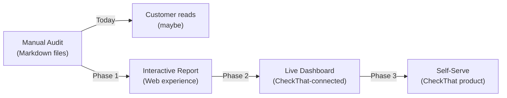
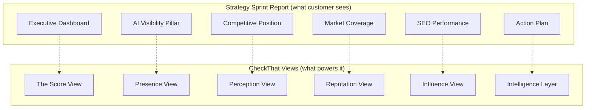
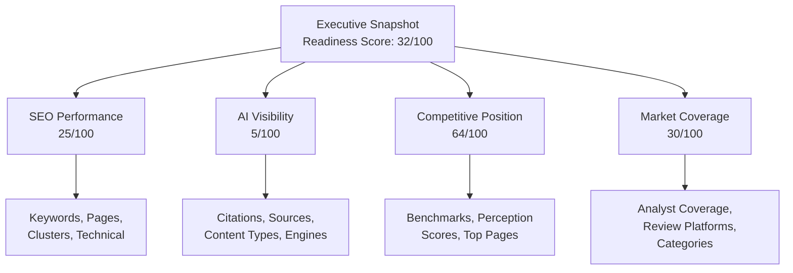
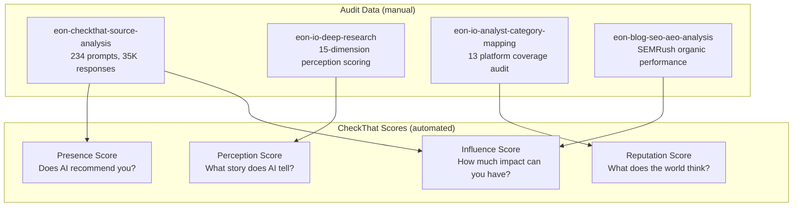
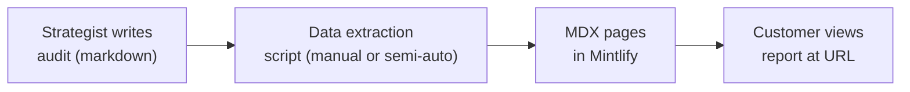
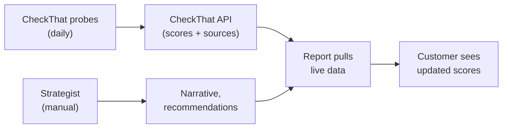
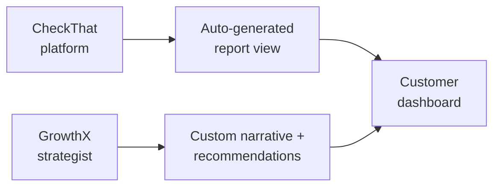

# Audit Report UI Experience Plan

<metadata>
purpose: Design document for an interactive UI experience that transforms dense audit deliverables into digestible, actionable customer-facing reports — using Eon.io as the reference case
audience: GrowthX product, engineering, delivery
related: records/customers/eon/README.md, pipeline/scratchpad/2026-02-18-checkthat-screens-v1.md, pipeline/scratchpad/2026-02-18-strategy-sprint-customer-onboarding-guide-v1.md
domain: product-design
confidence: draft
sensitivity: internal
context_tier: 2
last_updated: 2026-02-21
</metadata>

---

## The Problem

GrowthX delivers expert-grade audit intelligence as markdown files. Eon received 8 files totaling ~3,500 lines:

| File | Lines | Content |
|---|---|---|
| eon-blog-seo-aeo-analysis-v1.md | 512 | SEMRush organic performance, keyword analysis, AEO readiness |
| eon-checkthat-source-analysis-v1.md | 632 | AI visibility across 234 prompts, 35,050 responses, source citations |
| eon-competitive-seo-analysis-v1.md | 608 | Competitive SEO benchmarking of 12 vendors |
| eon-top-500-prompts-guide-v1.md | 951 | 500 classified prompts for AI visibility tracking |
| eon-io-deep-research-v1.md | 503 | Market categories, analyst coverage, perception scoring |
| eon-io-analyst-category-mapping-v1.md | 195 | Analyst and peer review category positioning |
| eon-research-dump-v1.md | 153 | Raw research notes |

**What this data contains:** The complete picture of Eon's online presence — SEO, AI visibility, competitive positioning, market coverage, and a 500-prompt tracking system. This is the intelligence a CMO needs to allocate budget, prioritize content, and defend their position to the board.

**What actually happens:** The CMO gets a Slack message with 7 links, opens 2, skims the executive summaries, and asks their team to "pull out the key takeaways." The remaining 3,000 lines never get read. The 500-prompt guide sits untouched. The competitive benchmarking data — the most strategically valuable part — gets reduced to "we're behind."

Three specific failures:

1. **Not scannable.** A CMO needs the story in 30 seconds. They get 3,500 lines.
2. **Not shareable.** The VP of Content needs the content recommendations. The Head of Product Marketing needs the competitive data. The SEO manager needs the keyword tables. Everyone gets everything.
3. **Not trackable.** The audit is a snapshot. There's no way to mark actions as done, track progress, or measure whether recommendations moved the needle.

---

## The Opportunity

Build an interactive audit report that serves as the **bridge product** between GrowthX's manual deliverables and the CheckThat platform.



Each phase delivers immediate customer value while pulling them closer to CheckThat:

| Phase | Customer gets | GrowthX gets |
|---|---|---|
| Interactive Report | Scannable, shareable, actionable audit | Higher perceived value, less support burden |
| Live Dashboard | Real-time data on top of audit framework | Product usage data, expansion opportunity |
| Self-Serve | Full CheckThat platform access | Product-qualified lead, direct conversion |

---

## Part 1: Strategic Framing

### Why "Strategy Sprint Report," Not "Audit"

The word "audit" implies a one-time event. The word "report" implies a document. Neither creates the expectation of an ongoing relationship.

**Strategy Sprint Report** frames the deliverable as:
- Part of an engagement (the Sprint), not a standalone artifact
- Strategy-oriented (what to do), not just diagnostic (what's wrong)
- A living document that evolves as work progresses

### The Report as Product Demo

Every screen in the interactive report maps to a CheckThat view. The customer experiences CheckThat's value proposition without knowing they're using CheckThat:



When the customer asks "can I get this updated monthly?" the answer is "that's exactly what CheckThat does."

### Target Personas for the Report

| Persona | What they need | Time budget | Depth |
|---|---|---|---|
| CMO / VP Marketing | Executive story, board-ready metrics, top 3 actions | 30 seconds | Layer 1 only |
| Head of Content / PMM | Content gaps, competitive positioning, prioritized recommendations | 5 minutes | Layer 2 |
| SEO Manager / Growth Lead | Full keyword data, technical recommendations, competitor benchmarks | 15+ minutes | Layer 3 |
| Account Executive (Eon's) | Proof that the engagement is valuable, data to justify expansion | 2 minutes | Layer 1 + Action Plan |

---

## Part 2: Information Architecture

### The Three-Layer Model

Transform 8 flat files into a progressive disclosure hierarchy:

```
Layer 1: Executive Snapshot     (30-second scan)
    │
    ├── Layer 2: Four Pillars   (5-minute read per pillar)
    │       │
    │       └── Layer 3: Deep Dives  (analyst-level data)
    │
    └── Action Plan (cross-cutting)
```

### Layer 1 — Executive Snapshot

One screen. One composite score. Four pillar scores. Three priority actions. A one-sentence narrative.

**What it answers:** "How bad is it, and what do we do first?"

### Layer 2 — Four Pillars

Each pillar gets its own view with a score, key metrics, competitive context, and recommendations.



**What each pillar answers:**

| Pillar | Core question | CheckThat mapping |
|---|---|---|
| SEO Performance | Can buyers find us on Google? | Influence Score (internal) |
| AI Visibility | Can buyers find us in AI? | Presence Score |
| Competitive Position | How do buyers perceive us vs competitors? | Perception Score |
| Market Coverage | Do analysts and reviewers know we exist? | Reputation Score |

### Layer 3 — Deep Dives

Full data tables, methodology notes, raw metrics. This is where the current markdown content lives — but now it's accessible via drill-down, not dropped into someone's lap.

### File-to-Layer Mapping

```
LAYER 1: Executive Snapshot
├── Composite of all files (derived metrics)

LAYER 2: Four Pillars
├── SEO Performance
│   ├── eon-blog-seo-aeo-analysis-v1.md (Parts 1-3)
│   └── eon-competitive-seo-analysis-v1.md (Part 1)
│
├── AI Visibility
│   ├── eon-checkthat-source-analysis-v1.md (Parts 1-4)
│   └── eon-blog-seo-aeo-analysis-v1.md (Part 5: AEO readiness)
│
├── Competitive Position
│   ├── eon-io-deep-research-v1.md (Sections 5-6: perception scoring)
│   └── eon-competitive-seo-analysis-v1.md (Parts 2-3)
│
└── Market Coverage
    ├── eon-io-analyst-category-mapping-v1.md (all)
    └── eon-io-deep-research-v1.md (Sections 2-4)

LAYER 3: Deep Dives
├── eon-blog-seo-aeo-analysis-v1.md (appendices)
├── eon-competitive-seo-analysis-v1.md (appendix)
├── eon-checkthat-source-analysis-v1.md (appendix)
└── eon-io-deep-research-v1.md (full competitor table)

ACTION PLAN (cross-cutting)
├── eon-blog-seo-aeo-analysis-v1.md (Part 6: recommendations)
├── eon-checkthat-source-analysis-v1.md (Part 5: recommendations)
├── eon-competitive-seo-analysis-v1.md (Part 4: recommendations)
└── eon-top-500-prompts-guide-v1.md (tracking instrument)
```

---

## Part 3: Screen-by-Screen Wireframes

### Screen 1: Executive Dashboard

The first thing the customer sees. Must deliver the full story in 30 seconds.

```
+=====================================================================+
|  EON.IO                                                  Feb 2026   |
|  Strategy Sprint Report                    Prepared by GrowthX      |
+=====================================================================+
|                                                                     |
|  READINESS SCORE                                                    |
|  +---------------------------------------------------------+       |
|  |                                                         |       |
|  |                        32                               |       |
|  |                       /100                              |       |
|  |                                                         |       |
|  |  [======---------------------------------------]        |       |
|  |                                                         |       |
|  |  "Strong product, invisible online presence.            |       |
|  |   Innovation score 9.5 — but zero AI citations          |       |
|  |   and 18x content efficiency gap vs competitors."       |       |
|  |                                                         |       |
|  +---------------------------------------------------------+       |
|                                                                     |
|  FOUR PILLARS                                                       |
|  +------------+  +------------+  +------------+  +------------+     |
|  | SEO        |  | AI         |  | COMPETITIVE|  | MARKET     |     |
|  | PERFORMANCE|  | VISIBILITY |  | POSITION   |  | COVERAGE   |     |
|  |            |  |            |  |            |  |            |     |
|  |  25/100    |  |   5/100    |  |  64/100    |  |  30/100    |     |
|  | [===------]|  | [--------]|  | [======---]|  | [===------]|     |
|  |            |  |            |  |            |  |            |     |
|  | 26 visits  |  | 0.1%      |  | Score: 6.4 |  | 3 of 12   |     |
|  | /month     |  | presence   |  | /10        |  | platforms  |     |
|  | (blog)     |  | (dead last)|  | (Emerging) |  | listed     |     |
|  +------[>]---+  +------[>]---+  +------[>]---+  +------[>]---+     |
|                                                                     |
|  TOP 3 ACTIONS                                                      |
|  +---------------------------------------------------------+       |
|  |                                                         |       |
|  |  [!] 1. Publish 4-5 "best of" listicles on eon.io      |       |
|  |        ~80% of AI citations come from listicle content. |       |
|  |        Eon has none. HYCU got 1,175 citations from one. |       |
|  |                                                 Week 1  |       |
|  |                                                         |       |
|  |  [!] 2. Activate Gartner Peer Insights reviews          |       |
|  |        Fastest-growing citation source (+9% in 30 days).|       |
|  |        5-10 customer reviews gets Eon on market pages.  |       |
|  |                                                 Week 1  |       |
|  |                                                         |       |
|  |  [!] 3. Optimize AWS S3 backup page for "s3 backup"     |       |
|  |        480 monthly searches. Currently position 42-59.  |       |
|  |        Single highest-ROI SEO action available.         |       |
|  |                                                 Week 2  |       |
|  |                                                         |       |
|  |                              [ View full action plan > ] |       |
|  +---------------------------------------------------------+       |
|                                                                     |
+=====================================================================+
```

**Design principles:**
- The composite score is derived: weighted average of four pillar scores
- Each pillar card is clickable (leads to Layer 2 detail)
- The narrative line under the score is hand-written by the strategist, not generated
- Top 3 actions are pulled from the cross-cutting recommendations, ordered by speed-to-impact

### Screen 2: AI Visibility Pillar (Representative Pillar View)

Each of the four pillars follows this template. AI Visibility shown here because it's the most data-rich.

```
+=====================================================================+
|  [< Back to Dashboard]                                              |
|                                                                     |
|  AI VISIBILITY                                            5/100     |
|  How AI engines see Eon during buyer evaluation                     |
+=====================================================================+
|                                                                     |
|  THE HEADLINE                                                       |
|  +---------------------------------------------------------+       |
|  |  Eon is invisible to AI. Across 234 prompts and 35,050  |       |
|  |  responses on 5 AI platforms, Eon shows 0.1% visibility  |       |
|  |  -- dead last among 8 tracked competitors. Veeam leads   |       |
|  |  at 33%. The gap is 330x.                                |       |
|  +---------------------------------------------------------+       |
|                                                                     |
|  COMPETITIVE COMPARISON                                             |
|  +---------------------------------------------------------+       |
|  |  Veeam     ████████████████████████████████░░  33.0%    |       |
|  |  Acronis   ██████████████████████████████░░░░  28.9%    |       |
|  |  Commvault ████████████████████░░░░░░░░░░░░░░  21.4%    |       |
|  |  Druva     ████████████████████░░░░░░░░░░░░░░  20.0%    |       |
|  |  Rubrik    ███████████████████░░░░░░░░░░░░░░░  19.3%    |       |
|  |  ...                                                    |       |
|  |  Eon       ░░░░░░░░░░░░░░░░░░░░░░░░░░░░░░░░░   0.1%    |       |
|  +---------------------------------------------------------+       |
|                                                                     |
|  WHY THIS IS HAPPENING                                              |
|  +---------------------------------------------------------+       |
|  |                                                         |       |
|  |  Source Analysis (what AI cites when answering)          |       |
|  |                                                         |       |
|  |  Citation Source           Rate    Trend    Eon cited?   |       |
|  |  --------------------------------------------------------|       |
|  |  Tech Media (TechRadar)   13%     +1%      No           |       |
|  |  Competitor content        64%     +2%      No           |       |
|  |  Gartner Peer Insights    14%     +9%      No           |       |
|  |  Review platforms (G2)     6%     +2%      Thin listing |       |
|  |  Community (Reddit/YT)     9%     +6%      No           |       |
|  |                                                         |       |
|  |  eon.io citations: 0 out of 35,050 responses            |       |
|  |                                                         |       |
|  |                           [ View source deep dive > ]   |       |
|  +---------------------------------------------------------+       |
|                                                                     |
|  KEY INSIGHT                                                        |
|  +---------------------------------------------------------+       |
|  |  "Best of" listicle content accounts for ~80% of all    |       |
|  |  AI citations. This is the mechanism by which AI builds  |       |
|  |  category recommendations. HYCU -- with a similar        |       |
|  |  authority profile to Eon (36 vs 33) -- got 1,175        |       |
|  |  citations from a single listicle page.                  |       |
|  |                                                          |       |
|  |  ControlMonkey went from zero to 5% citation share       |       |
|  |  (931 citations) in 30 days with one page.               |       |
|  +---------------------------------------------------------+       |
|                                                                     |
|  RECOMMENDED ACTIONS (for this pillar)                              |
|  +---------------------------------------------------------+       |
|  |  [ ] Publish 4-5 "best of" listicles          Week 1-2  |       |
|  |  [ ] Activate Gartner Peer Insights           Week 1-2  |       |
|  |  [ ] Seed Reddit/YouTube/TechCommunity        Week 2-4  |       |
|  |  [ ] Expand G2 category listings              Month 1   |       |
|  |  [ ] Earn media listicle inclusion             Month 1-3 |       |
|  +---------------------------------------------------------+       |
|                                                                     |
+=====================================================================+
```

### Screen 3: AI Benchmark (Quadrant View)

Maps directly to the CheckThat AI Benchmark visualization. This is the "board deck" screen.

```
+=====================================================================+
|  AI BENCHMARK: Cloud Backup & Data Protection            Feb 2026   |
|  Presence vs Perception across tracked competitors                  |
+=====================================================================+
|                                                                     |
|  Perception                                                         |
|  (narrative quality)                                                |
|       |                                                             |
|  100  |                                                             |
|       |  Hidden Gems              AI Leaders                        |
|       |                                                             |
|   80  |                     (Druva)    (Rubrik)                      |
|       |                        *          *                         |
|       |               (Commvault)  (Veeam)                          |
|   60  |                   *          *                               |
|       |      ............(Cohesity)..........                        |
|       |      .         *            .      .                        |
|   40  |      .   (Eon)              .      .                        |
|       |      .     *                .      .                        |
|       |      .                      .      .                        |
|   20  |      .  Off the Map         .  At Risk                      |
|       |      .                      .      .                        |
|       |      ........................      .                         |
|    0  +------+------+------+------+------+------+--> Presence       |
|       0     10     20     30     40     50     100  (AI recommends) |
|                                                                     |
|  * = brand     dot size = Reputation (analyst/review coverage)      |
|                                                                     |
|  +-------------------------------+                                  |
|  |  Eon position: Off the Map    |                                  |
|  |  Presence: 0.1 (0-100 scale)  |                                  |
|  |  Perception: 6.4 (rescaled)   |                                  |
|  |  Reputation: Small (3 of 12   |                                  |
|  |    review/analyst platforms)   |                                  |
|  +-------------------------------+                                  |
|                                                                     |
|  "Eon has Hidden Gem potential -- strong product perception          |
|   (Innovation: 9.5, Modern: 10.0) but near-zero AI presence.        |
|   The path from Off the Map to Hidden Gem is content-driven.        |
|   The path from Hidden Gem to AI Leader is distribution-driven."    |
|                                                                     |
|                            [ Track this live with CheckThat > ]     |
|                                                                     |
+=====================================================================+
```

### Screen 4: Action Plan

The operational screen. Where recommendations from all pillars converge into a prioritized, trackable plan.

```
+=====================================================================+
|  ACTION PLAN                                          31 actions    |
|  Prioritized by speed-to-impact across all pillars                  |
+=====================================================================+
|                                                                     |
|  FILTERS: [All] [SEO] [AI Visibility] [Competitive] [Coverage]     |
|           [Week 1-2] [Month 1] [Month 2-3] [Month 3+]              |
|                                                                     |
|  WEEK 1-2: IMMEDIATE (7 actions)                                    |
|  +---------------------------------------------------------+       |
|  |                                                         |       |
|  | [ ] Publish "Best Cloud-Native Backup Solutions 2026"   |       |
|  |     Pillar: AI Visibility                               |       |
|  |     Evidence: HYCU got 1,175 citations from one page    |       |
|  |     Expected impact: First AI citation for eon.io       |       |
|  |                                                         |       |
|  | [ ] Publish "Best AWS Backup Tools 2026"                |       |
|  |     Pillar: AI Visibility + SEO                         |       |
|  |     Evidence: N2WS's AWS listicle has 212 citations     |       |
|  |     Expected impact: AWS keyword coverage + citations   |       |
|  |                                                         |       |
|  | [ ] Publish "Best Cloud DR Solutions 2026"              |       |
|  |     Pillar: AI Visibility                               |       |
|  |     Evidence: ConnectWise DR listicle: 1,457 citations  |       |
|  |     Expected impact: DR category citation presence      |       |
|  |                                                         |       |
|  | [ ] Request 5-10 Gartner Peer Insights reviews          |       |
|  |     Pillar: Market Coverage + AI Visibility             |       |
|  |     Evidence: Gartner citations surged +9% in 30 days   |       |
|  |     Expected impact: Appear on Gartner market pages     |       |
|  |                                                         |       |
|  | [ ] Optimize AWS S3 backup page                         |       |
|  |     Pillar: SEO                                         |       |
|  |     Evidence: "s3 backup" = 480 vol, pos 42-59          |       |
|  |     Expected impact: Could multiply blog traffic alone  |       |
|  |                                                         |       |
|  | ... +2 more                                              |       |
|  +---------------------------------------------------------+       |
|                                                                     |
|  MONTH 1: HIGH PRIORITY (9 actions)                                 |
|  +---------------------------------------------------------+       |
|  | [ ] Build CBPM pillar page (3,000+ words)               |       |
|  | [ ] Create RTO/RPO content (universal winner)           |       |
|  | [ ] Build glossary section (15-20 pages)                |       |
|  | [ ] Create Eon vs Veeam comparison page                 |       |
|  | [ ] Create Eon vs Rubrik comparison page                |       |
|  | [ ] Establish TrustRadius profile                       |       |
|  | [ ] Expand G2 to 4 additional categories                |       |
|  | [ ] Push striking-distance keywords to page 1           |       |
|  | [ ] Fix keyword cannibalization                         |       |
|  +---------------------------------------------------------+       |
|                                                                     |
|  MONTH 2-3: STRATEGIC (10 actions) [collapsed]                      |
|  MONTH 3+: LONG-TERM (5 actions) [collapsed]                       |
|                                                                     |
|  PROGRESS SUMMARY                                                   |
|  +---------------------------------------------------------+       |
|  |  Completed: 0/31     In Progress: 0/31     Not Started: 31/31   |
|  |  [-----------------------------------------------------]|       |
|  +---------------------------------------------------------+       |
|                                                                     |
+=====================================================================+
```

### Screen 5: SEO Performance Pillar

```
+=====================================================================+
|  [< Back to Dashboard]                                              |
|                                                                     |
|  SEO PERFORMANCE                                          25/100    |
|  Organic search presence and content efficiency                     |
+=====================================================================+
|                                                                     |
|  SNAPSHOT                                                           |
|  +---------------------------+  +----------------------------+      |
|  | Blog Metrics              |  | vs Competitor Median        |      |
|  | Keywords: 102             |  |                            |      |
|  | Monthly visits: 26        |  | Keywords:    413 vs 23,487 |      |
|  | Indexed pages: 24         |  | Traffic:     515 vs 23,487 |      |
|  | Pages w/ traffic: 9       |  | Traffic val: $2.5K vs $136K|      |
|  | Blog % of domain: 5%     |  | Efficiency:  1.1 vs 20.3   |      |
|  +---------------------------+  +----------------------------+      |
|                                                                     |
|  THE GAP                                                            |
|  +---------------------------------------------------------+       |
|  |                                                         |       |
|  |  Eon: 24 content pages, 1.1 visits each                 |       |
|  |  [==]                                                    |       |
|  |                                                         |       |
|  |  HYCU (closest analog): 179 pages, 20.8 visits each     |       |
|  |  [======================]                                |       |
|  |                                                         |       |
|  |  Cohesity (most efficient): 158 pages, 61.4 visits each |       |
|  |  [=====================================================] |       |
|  |                                                         |       |
|  |  The gap is 18x in per-page efficiency. Volume matters,  |       |
|  |  but each page must target validated demand.             |       |
|  +---------------------------------------------------------+       |
|                                                                     |
|  HIGHEST-VALUE OPPORTUNITIES                                        |
|  +---------------------------------------------------------+       |
|  |  Keyword             Volume  Position  Action           |       |
|  |  -------------------------------------------------      |       |
|  |  s3 backup             480   42-59     Optimize page    |       |
|  |  multicloud storage     210   14        Push to page 1  |       |
|  |  cbpm                   210   9         Expand pillar   |       |
|  |  cloud backup security  170   17        Depth pass      |       |
|  |  cloud backup strategy  170   13        Fix cannibal.   |       |
|  |  multi cloud DR         140   11        Push to page 1  |       |
|  |  ransomware cloud BU    140   13        Push to page 1  |       |
|  |                                                         |       |
|  |                         [ View full keyword data > ]    |       |
|  +---------------------------------------------------------+       |
|                                                                     |
|  CONTENT STRATEGY THAT WORKS (from competitors)                     |
|  +---------------------------------------------------------+       |
|  |                                                         |       |
|  |  1. Glossary pages (Druva/Cohesity playbook)            |       |
|  |     30-40% of their traffic. Eon has zero.              |       |
|  |                                                         |       |
|  |  2. "Best of" listicles (HYCU playbook)                 |       |
|  |     44% of HYCU's traffic from 5 listicle pages.        |       |
|  |                                                         |       |
|  |  3. RTO/RPO content (universal winner)                  |       |
|  |     Every top competitor has a high-performing page.     |       |
|  |     Eon has none.                                       |       |
|  |                                                         |       |
|  |                    [ View competitor analysis > ]        |       |
|  +---------------------------------------------------------+       |
|                                                                     |
+=====================================================================+
```

### Screen 6: Competitive Position Pillar

```
+=====================================================================+
|  [< Back to Dashboard]                                              |
|                                                                     |
|  COMPETITIVE POSITION                                     64/100    |
|  How the market perceives Eon vs competitors                        |
+=====================================================================+
|                                                                     |
|  PERCEPTION SCORECARD (15 dimensions, 1-10 scale)                   |
|  +---------------------------------------------------------+       |
|  |                                                         |       |
|  |  STRENGTHS (above 8.0)                                  |       |
|  |  Modern/Contemporary  ██████████  10.0   (best in mkt)  |       |
|  |  Innovation           █████████░   9.5   (best in mkt)  |       |
|  |  Speed to Value       ████████░░   8.5                  |       |
|  |  Ease of Use          ████████░░   8.0                  |       |
|  |                                                         |       |
|  |  NEUTRAL (5.0 - 8.0)                                    |       |
|  |  Value for Money      ███████░░░   7.5                  |       |
|  |  Security/Compliance  ███████░░░   7.5                  |       |
|  |  Thought Leadership   ███████░░░   7.5                  |       |
|  |  Scalability          ███████░░░   7.0                  |       |
|  |  Product Quality      ███████░░░   7.0                  |       |
|  |  Transparency         ██████░░░░   6.5                  |       |
|  |  Integration          ██████░░░░   6.5                  |       |
|  |  Industry Expertise   ██████░░░░   6.0                  |       |
|  |                                                         |       |
|  |  GAPS (below 5.5)                                       |       |
|  |  Customer-Centricity  █████░░░░░   5.5                  |       |
|  |  Customer Support     █████░░░░░   5.0   (no data)     |       |
|  |  Trust/Reliability    ████░░░░░░   4.5   (too early)   |       |
|  |                                                         |       |
|  +---------------------------------------------------------+       |
|                                                                     |
|  COMPOSITE SCORE IN CONTEXT                                         |
|  +---------------------------------------------------------+       |
|  |                                                         |       |
|  |  Leaders (8.0+):  Veeam 8.4  Rubrik 8.3  Commvault 8.2 |       |
|  |                   Cohesity 8.0  Druva 8.0               |       |
|  |                                                         |       |
|  |  Strong (6.5+):   Acronis 7.6 ... HYCU 7.0 ... +8 more |       |
|  |                                                         |       |
|  |  Emerging (5.0+):  --> Eon 6.4 <--  N2WS 6.3 ... +15   |       |
|  |                                                         |       |
|  |  Off the Map:      Asigra 4.8 ... Zmanda 4.3           |       |
|  |                                                         |       |
|  |              [ View full 55-competitor table > ]         |       |
|  +---------------------------------------------------------+       |
|                                                                     |
|  WHAT MOVES EON'S SCORE                                             |
|  +---------------------------------------------------------+       |
|  |  The 3 lowest dimensions drag the composite:            |       |
|  |                                                         |       |
|  |  Trust (4.5): Needs time + customer proof points.       |       |
|  |    Fix: Publish case studies. Get on TrustRadius.       |       |
|  |                                                         |       |
|  |  Support (5.0): No public review data exists.           |       |
|  |    Fix: Solicit G2 reviews. Build support reputation.   |       |
|  |                                                         |       |
|  |  Customer-Centricity (5.5): Too early for NPS signals.  |       |
|  |    Fix: Customer case studies + community engagement.   |       |
|  +---------------------------------------------------------+       |
|                                                                     |
+=====================================================================+
```

### Screen 7: Market Coverage Pillar

```
+=====================================================================+
|  [< Back to Dashboard]                                              |
|                                                                     |
|  MARKET COVERAGE                                          30/100    |
|  Analyst recognition and review platform presence                   |
+=====================================================================+
|                                                                     |
|  COVERAGE MAP                                                       |
|  +---------------------------------------------------------+       |
|  |                                                         |       |
|  |  Platform          Status         Priority  Action      |       |
|  |  -------------------------------------------------------+       |
|  |  Gartner Cool Vndr  LISTED          --      Maintain    |       |
|  |  Gartner Hype Cycle LISTED          --      Maintain    |       |
|  |  G2 (Online BU)     LISTED          --      Expand cats |       |
|  |  AWS Marketplace     LISTED          --      Maintain    |       |
|  |  CRN Top 10          LISTED          --      --         |       |
|  |  -------------------------------------------------------+       |
|  |  G2 (4 more cats)   NOT LISTED      HIGH    Add now     |       |
|  |  TrustRadius         NOT LISTED      HIGH    Create      |       |
|  |  Capterra            NOT LISTED      MED     Create      |       |
|  |  PeerSpot            NOT LISTED      MED     Create      |       |
|  |  Gartner MQ          NOT ELIGIBLE    HIGH    When ready  |       |
|  |  Forrester Wave      NOT EVALUATED   HIGH    When ready  |       |
|  |  GigaOm Sonar        NOT EVALUATED   MED     Pursue      |       |
|  |  IDC MarketScape     NOT EVALUATED   MED     When ready  |       |
|  |                                                         |       |
|  |  Platforms listed: 5/13          Coverage: 38%          |       |
|  +---------------------------------------------------------+       |
|                                                                     |
|  WHY THIS MATTERS FOR AI VISIBILITY                                 |
|  +---------------------------------------------------------+       |
|  |  AI engines cite these platforms directly:              |       |
|  |                                                         |       |
|  |  Gartner Peer Insights:  14% citation rate (+9% surge)  |       |
|  |  G2 category pages:       6% citation rate (+2%)        |       |
|  |  SoftwareReviews:         3% citation rate (+1%)        |       |
|  |  TrustRadius:             1% citation rate (+1%)        |       |
|  |  Capterra:                2% citation rate (stable)     |       |
|  |                                                         |       |
|  |  Every platform Eon is NOT on is a source AI cites      |       |
|  |  that doesn't mention Eon.                              |       |
|  +---------------------------------------------------------+       |
|                                                                     |
+=====================================================================+
```

---

## Part 4: Data Mapping

### Metrics by Screen

Explicit mapping of which data from which audit file feeds each UI component.

#### Executive Dashboard Metrics

| UI element | Metric | Source file | Section/table |
|---|---|---|---|
| Readiness Score | Weighted composite of 4 pillars | Derived | N/A |
| SEO Performance score | Composite: keyword rankings + content efficiency + AEO readiness | eon-blog-seo-aeo-analysis-v1.md | Parts 1-5 |
| AI Visibility score | Presence rate across AI engines | eon-checkthat-source-analysis-v1.md | Part 1: Visibility Scores |
| Competitive Position score | Perception composite (15 dimensions) | eon-io-deep-research-v1.md | Section 6: Eon scores |
| Market Coverage score | Platform coverage ratio (listed / total relevant) | eon-io-analyst-category-mapping-v1.md | Summary Matrix |
| Narrative line | Hand-written by strategist | N/A | N/A |
| Top 3 actions | Highest-priority from each pillar's recommendations | Cross-file | Recommendation sections |

#### AI Visibility Pillar Metrics

| UI element | Metric | Source file | Location |
|---|---|---|---|
| Visibility percentage | 0.1% | eon-checkthat-source-analysis-v1.md | Part 1: Visibility Scores |
| Competitive bar chart | 8 brands with scores | eon-checkthat-source-analysis-v1.md | Part 1: Visibility Scores table |
| Source citation table | Domain citation rates + trends | eon-checkthat-source-analysis-v1.md | Part 2: Tiers 1-9 |
| Content type breakdown | ~80% listicle stat | eon-checkthat-source-analysis-v1.md | Part 3: Type A classification |
| HYCU evidence | 1,175 citations from 1 page | eon-checkthat-source-analysis-v1.md | Part 3: Section A1 |
| ControlMonkey evidence | 0 to 5% in 30 days | eon-checkthat-source-analysis-v1.md | Part 4: Insight 5 |
| Platform coverage | 5 engines | eon-checkthat-source-analysis-v1.md | Part 1: Tracking Configuration |

#### SEO Performance Pillar Metrics

| UI element | Metric | Source file | Location |
|---|---|---|---|
| Blog metrics card | 102 keywords, 26 visits, 24 pages | eon-blog-seo-aeo-analysis-v1.md | Part 1: Overview table |
| Competitor gap table | Eon vs median across 10 metrics | eon-competitive-seo-analysis-v1.md | Eon's Gap in Context table |
| Efficiency comparison | 1.1 vs 20.3 vs 61.4 visits/page | eon-competitive-seo-analysis-v1.md | Part 1: Page & Content Efficiency |
| Keyword opportunities | s3 backup (480), multicloud storage (210), etc. | eon-blog-seo-aeo-analysis-v1.md | Part 2: High-Volume Keywords |
| Content strategies | Glossary, listicle, RTO/RPO | eon-competitive-seo-analysis-v1.md | Part 3: Clusters 1-3 |

#### Competitive Position Pillar Metrics

| UI element | Metric | Source file | Location |
|---|---|---|---|
| 15-dimension scores | Trust 4.5 through Modern 10.0 | eon-io-deep-research-v1.md | Section 6: Eon detail table |
| Composite score | 6.4/10 | eon-io-deep-research-v1.md | Section 5: Emerging tier |
| Tier context | Leaders, Strong, Emerging, Off Map | eon-io-deep-research-v1.md | Section 5: Full competitor table |
| Improvement levers | Trust, Support, Customer-Centricity | eon-io-deep-research-v1.md | Section 8: Weaknesses |

#### Market Coverage Pillar Metrics

| UI element | Metric | Source file | Location |
|---|---|---|---|
| Coverage map | Listed vs not listed per platform | eon-io-analyst-category-mapping-v1.md | All sections |
| AI citation rates per platform | Gartner 14%, G2 6%, etc. | eon-checkthat-source-analysis-v1.md | Part 2: Tiers 3-4 |
| Priority matrix | High/Medium/Adjacent | eon-io-analyst-category-mapping-v1.md | Summary Matrix |

#### AI Benchmark (Quadrant) Metrics

| UI element | Metric | Source file | Location |
|---|---|---|---|
| X-axis (Presence) | Visibility scores per brand | eon-checkthat-source-analysis-v1.md | Part 1 |
| Y-axis (Perception) | Composite perception scores | eon-io-deep-research-v1.md | Section 6: Top 20 scores |
| Dot size (Reputation) | Platform coverage count | eon-io-analyst-category-mapping-v1.md | Summary Matrix |
| Quadrant labels | Off the Map, Hidden Gem, At Risk, AI Leader | CheckThat benchmark framework | products/checkthat/benchmark.mdx |

### CheckThat Four-Score Framework Alignment

The audit data maps cleanly to CheckThat's scoring system. This is intentional — the audit is the manual version of what CheckThat automates.



---

## Part 5: Interaction Patterns

### Progressive Disclosure

Every interaction follows the same pattern: summary first, detail on demand.

```
Click depth 0:  Executive Dashboard (one screen, 30 seconds)
                    |
Click depth 1:  Pillar View (one of four, 2-3 minutes each)
                    |
Click depth 2:  Deep Dive (full data, unlimited time)
                    |
Click depth 3:  Raw Data (appendices, methodology, tables)
```

No scroll-to-find. No "Part 7, Appendix B." Every piece of data has exactly one path from the dashboard.

### Shareability Model

Different roles need different slices. The report supports deep-linking to any section.

| Share target | What to send | URL pattern |
|---|---|---|
| Board / exec team | Executive Dashboard | `/report/eon/` |
| Content team | SEO pillar + Action Plan (content filter) | `/report/eon/seo` + `/report/eon/actions?filter=content` |
| Product marketing | Competitive Position + AI Benchmark | `/report/eon/competitive` |
| SEO manager | SEO Deep Dive (full keyword data) | `/report/eon/seo/keywords` |
| Eon's sales team | AI Benchmark quadrant | `/report/eon/benchmark` |

Each URL renders a standalone view — no login required, no navigation context needed. The customer can paste it into a Slack thread and the recipient gets exactly what they need.

### CheckThat Upgrade Touchpoints

Natural moments where the static report reveals CheckThat's value:

```
TOUCHPOINT 1: AI Benchmark quadrant
  "Track this live with CheckThat"
  (Customer sees their position and wants to watch it move)

TOUCHPOINT 2: Competitive visibility bars  
  "Updated daily on CheckThat"
  (Customer sees competitors and wants ongoing monitoring)

TOUCHPOINT 3: Action Plan completion
  "Measure the impact with CheckThat"
  (Customer completes an action and wants to see if it worked)

TOUCHPOINT 4: 30-day report refresh
  "Your updated scores are ready"
  (GrowthX refreshes the report, customer wants continuous access)
```

### Action Tracking

Each recommendation in the Action Plan has a state:

```
[ ] Not started --> [~] In progress --> [x] Complete
                                    --> [--] Skipped (with reason)
```

State changes are tracked with timestamps. Progress summary updates automatically. This creates accountability without requiring the customer to adopt a project management tool.

---

## Part 6: Technical Approach Options

### Option A: Static Site with Mintlify

Extend the existing GrowthX handbook infrastructure. Each customer report is a protected section of the documentation site.

```
growthx-handbook/
├── products/
├── delivery/
├── reports/              <-- NEW
│   └── eon/
│       ├── index.mdx          (Executive Dashboard)
│       ├── seo.mdx            (SEO Performance pillar)
│       ├── ai-visibility.mdx  (AI Visibility pillar)
│       ├── competitive.mdx    (Competitive Position pillar)
│       ├── coverage.mdx       (Market Coverage pillar)
│       ├── benchmark.mdx      (AI Benchmark quadrant)
│       ├── actions.mdx        (Action Plan)
│       └── data/
│           ├── keywords.mdx   (Deep dive: keywords)
│           ├── sources.mdx    (Deep dive: citation sources)
│           └── competitors.mdx (Deep dive: competitor table)
└── docs.json             (add report nav + auth)
```

| Advantage | Disadvantage |
|---|---|
| Already have Mintlify infrastructure | Static — no interactivity beyond links |
| MDX supports mermaid, tables, cards | No real-time data updates |
| Fast to build (days, not weeks) | Action tracking requires external tool |
| Authentication available via Mintlify | Customer sees it's a "docs site" |
| Consistent with GrowthX brand | Limited chart/visualization options |

**Best for:** Phase 1 MVP. Ship the first interactive report in 1-2 weeks using existing infrastructure. Validate that the progressive disclosure model works before investing in custom UI.

### Option B: CheckThat Embedded Report (Product Feature)

Build the report UI as a feature within CheckThat itself. The customer gets a CheckThat account with their audit data pre-loaded.

```
CheckThat Platform
├── Open Index (public)
├── Dashboard (authenticated)
│   ├── Score View
│   ├── Presence View
│   ├── Reputation View
│   ├── Perception View
│   ├── Influence View
│   └── Strategy Sprint Report  <-- NEW
│       ├── Executive Summary (custom for this customer)
│       ├── Pillar views (using CheckThat components)
│       ├── AI Benchmark (existing component)
│       └── Action Plan (new component)
└── Intelligence (weekly reports)
```

| Advantage | Disadvantage |
|---|---|
| Customer is already in CheckThat | Requires CheckThat to be production-ready |
| Live data updates automatically | Tight coupling to product roadmap |
| AI Benchmark is already built | Report customization per customer is complex |
| Natural upgrade path to paid | Engineering effort is highest |
| Professional, product-quality UX | Delays audit delivery until feature ships |

**Best for:** Phase 2-3. Once CheckThat's core views are built, the Strategy Sprint Report becomes a "template" view that pre-populates with audit data. The customer's first CheckThat experience is their own report.

### Option C: Standalone React App with JSON Data Layer

A purpose-built web application. Audit data stored as JSON, rendered by a custom React frontend.

```
audit-reports/
├── src/
│   ├── components/
│   │   ├── Dashboard.tsx
│   │   ├── PillarView.tsx
│   │   ├── Benchmark.tsx
│   │   ├── ActionPlan.tsx
│   │   └── DeepDive.tsx
│   ├── data/
│   │   └── eon.json           <-- Structured audit data
│   └── App.tsx
├── public/
└── package.json
```

| Advantage | Disadvantage |
|---|---|
| Full control over UX | New codebase to maintain |
| Interactive charts (D3, Recharts) | Separate deployment pipeline |
| Action tracking built-in | No existing infrastructure to leverage |
| PDF/image export possible | Higher engineering investment |
| Works for any customer | Not connected to CheckThat |

**Best for:** If the audit report becomes a standalone product line (sold independently of CheckThat). Otherwise, the maintenance overhead isn't justified.

### Recommendation

```
Phase 1 (Now):         Option A — Mintlify static report
                        Ship in 1-2 weeks. Validate the IA model.
                        Customer gets a shareable URL with
                        progressive disclosure.

Phase 2 (Month 2-3):   Option B — CheckThat embedded report
                        Migrate the report into CheckThat as a
                        "Strategy Sprint" view. Connect to live data.
                        Customer sees their audit evolve in real time.

Phase 3 (Month 4+):    Option B expanded — Self-serve
                        Any CheckThat user can access their own
                        "audit" view. No manual data entry needed.
                        GrowthX delivers the strategist layer on top.
```

This path minimizes time-to-first-customer while building toward product integration. The Mintlify report validates whether progressive disclosure, the four-pillar model, and the CheckThat-aligned scoring actually change how customers consume audit data.

---

## Part 7: Phased Rollout

### Phase 1: Static Interactive Report (Weeks 1-3)

**Goal:** Replace markdown file delivery with a shareable web experience.

**Deliverables:**
- Mintlify-based report site with Eon as first customer
- Executive Dashboard, 4 pillar views, AI Benchmark, Action Plan
- Deep link support for per-section sharing
- Authentication (Mintlify built-in) for customer access

**Data flow:**



**Success criteria:**
- Customer accesses the report via URL instead of opening markdown files
- At least 2 different stakeholders at Eon use the report (measured by unique page views)
- Customer provides feedback on the format within first week

**Effort estimate:** 1-2 weeks of EM + engineering time

### Phase 2: Live Data Connection (Months 2-3)

**Goal:** Connect the report to CheckThat for real-time score updates.

**Deliverables:**
- Report pulls Presence, Perception, Reputation data from CheckThat API
- AI Benchmark updates automatically as new probe data comes in
- "Last updated" timestamps on each section
- Weekly email digest with score changes

**Data flow:**



**Success criteria:**
- Customer checks the report at least weekly (usage analytics)
- At least one "your score changed" notification drives a customer action
- Customer asks about CheckThat unprompted

**Effort estimate:** 2-3 weeks engineering (API integration + report refresh logic)

### Phase 3: Customer Self-Serve Dashboard (Month 4+)

**Goal:** Any CheckThat customer can access their own audit-style view.

**Deliverables:**
- "Strategy Sprint Report" as a standard CheckThat view
- Auto-generated based on customer's tracked data (no strategist needed for base report)
- GrowthX strategist layer adds narrative, custom recommendations, action plans
- Customer can toggle between "report view" (curated) and "dashboard view" (live data)

**Data flow:**



**Success criteria:**
- 3+ customers using the report view monthly
- Report view drives CheckThat paid conversions
- Time from audit completion to report delivery drops below 24 hours

---

## Appendix A: Score Derivation Guide

How to calculate the four pillar scores from raw audit data. These are directional — not the same as CheckThat's automated scoring, but aligned in methodology.

### SEO Performance Score (0-100)

```
SEO Score = (
    Keyword Health     * 0.25    (page 1 rankings / total keywords)
  + Content Efficiency * 0.25    (traffic per page vs median)
  + Topical Authority  * 0.20    (cluster coverage assessment)
  + AEO Readiness      * 0.15    (structured data, answer-first format)
  + Technical Health    * 0.15    (CWV, indexing, mobile)
)
```

For Eon: ~25/100. Some page 1 rankings exist (multi-cloud, CBPM), but 15 of 24 pages get zero traffic, per-page efficiency is 18x below median, and AEO readiness is near zero.

### AI Visibility Score (0-100)

```
AI Visibility Score = (
    Presence Rate      * 0.40    (% of responses mentioning brand)
  + Cross-Engine       * 0.20    (coverage across 5 platforms)
  + Citation Rate      * 0.20    (own-domain citation frequency)
  + Source Authority   * 0.20    (rank in cited sources)
)
```

For Eon: ~5/100. 0.1% presence rate, zero own-domain citations, minimal cross-engine coverage.

### Competitive Position Score (0-100)

```
Competitive Position Score = Perception Composite * 10

Where Perception Composite = Average of 15 dimensions (1-10 scale)
```

For Eon: ~64/100 (6.4 * 10). This is the highest pillar score because Eon's product is strong even if its presence is weak.

### Market Coverage Score (0-100)

```
Market Coverage Score = (
    Platform Coverage  * 0.40    (listed platforms / total relevant)
  + Review Depth       * 0.30    (number and quality of reviews)
  + Analyst Recognition* 0.30    (major reports included in)
)
```

For Eon: ~30/100. Listed on 5 of 13 relevant platforms (38%), but review depth is thin and no major analyst report inclusion beyond Cool Vendor.

### Composite Readiness Score

```
Readiness Score = (
    SEO Performance    * 0.25
  + AI Visibility      * 0.30    (weighted higher — biggest gap)
  + Competitive Position * 0.20
  + Market Coverage    * 0.25
)

For Eon: (25 * 0.25) + (5 * 0.30) + (64 * 0.20) + (30 * 0.25)
       = 6.25 + 1.50 + 12.80 + 7.50
       = 28.05 ~ 28/100
```

The composite rounds to approximately 28-32 depending on exact sub-score calculations. The Executive Dashboard would display this as the hero number.

---

## Appendix B: Data Extraction Checklist

For each new customer audit, extract these data points to populate the report UI.

### Required for Executive Dashboard

- [ ] Blog/content metrics (keywords, traffic, pages)
- [ ] AI visibility percentage and rank among competitors
- [ ] Perception composite score
- [ ] Platform coverage ratio
- [ ] Top 3 priority actions (strategist-written)
- [ ] Narrative summary line (strategist-written)

### Required for AI Visibility Pillar

- [ ] Prompts tracked count
- [ ] Total responses count
- [ ] Platforms covered
- [ ] Visibility score per competitor (bar chart data)
- [ ] Source citation rates by tier (table data)
- [ ] Own-domain citation count
- [ ] Key insight (strategist-written)
- [ ] Content type breakdown (listicle %, review %, community %)

### Required for SEO Pillar

- [ ] Blog subfolder metrics (keywords, traffic, pages, % of domain)
- [ ] Competitor median benchmarks (all 10 metrics)
- [ ] Top keyword opportunities (keyword, volume, position, action)
- [ ] Content strategy evidence (which competitor strategy applies)

### Required for Competitive Position Pillar

- [ ] 15-dimension perception scores
- [ ] Composite score and tier
- [ ] Top 5 competitor scores for context
- [ ] Strengths / gaps / improvement levers (strategist-written)

### Required for Market Coverage Pillar

- [ ] Platform-by-platform coverage status
- [ ] Citation rates per platform (from AI visibility data)
- [ ] Priority actions per platform

### Required for AI Benchmark

- [ ] Presence score per brand (X-axis)
- [ ] Perception composite per brand (Y-axis)
- [ ] Platform coverage count per brand (dot size)

### Required for Action Plan

- [ ] All recommendations from all pillar analyses
- [ ] Priority assignment (Week 1-2, Month 1, Month 2-3, Month 3+)
- [ ] Pillar tag per recommendation
- [ ] Evidence statement per recommendation
- [ ] Expected impact per recommendation

---

*Draft created February 21, 2026. Reference case: Eon.io Strategy Sprint audit (8 files, 3,500 lines). Framework aligned with CheckThat four-score methodology.*
