# AI Brand Benchmark Report — Design Document

<metadata>
purpose: Design specification for a standalone AI Brand Benchmark Report site — classification system, Overview tab wireframe, score mapping, and technical direction, using Eon.io as the reference case
audience: GrowthX product, engineering, design
related: pipeline/scratchpad/2026-02-21-audit-report-ui-experience-plan-v1.md, pipeline/scratchpad/2026-02-18-checkthat-screens-v1.md
domain: product-design
confidence: draft
sensitivity: internal
context_tier: 2
last_updated: 2026-02-21
</metadata>

---

## What This Is

A standalone web report that presents a full AI Brand Benchmark for a specific brand within a category. Separate site from the handbook or CheckThat product. Shareable URL. No login required.

Five tabs:

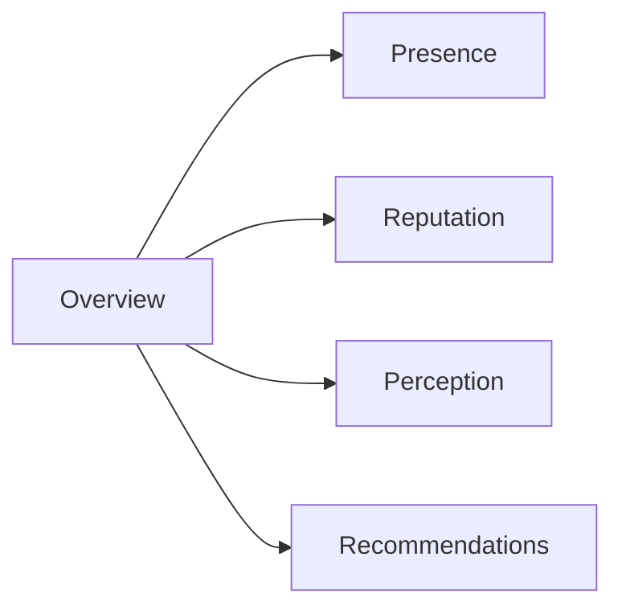

| Tab | What it answers | Primary score |
|---|---|---|
| Overview | Where do we stand? | AI Brand Health (composite) + Grid |
| Presence | Does AI recommend us during evaluation? | Presence Score |
| Reputation | What does the world think? | Reputation Score |
| Perception | What story does AI tell? | Perception Score (6 attributes) |
| Recommendations | What do we do about it? | Influence (diagnostic) + all scores |

No Influence tab. Influence is the diagnostic layer — it explains WHY scores are what they are. It surfaces inside Recommendations (connecting each score to a specific fix) and as supporting context within the other tabs.

---

## Part 1: The Classification System

Every brand in the report gets a two-part label: **Position** (where you sit) + **Momentum** (how you're moving). This label appears on the Grid, on score cards, and as the hero badge on the Overview tab.

### 1A: Position Labels

Derived from the AI Benchmark quadrant — Presence (X-axis) crossed with Perception (Y-axis). The quadrant split at 60 aligns with the CheckThat methodology threshold where scores move from "Needs Work" to "Moderate."

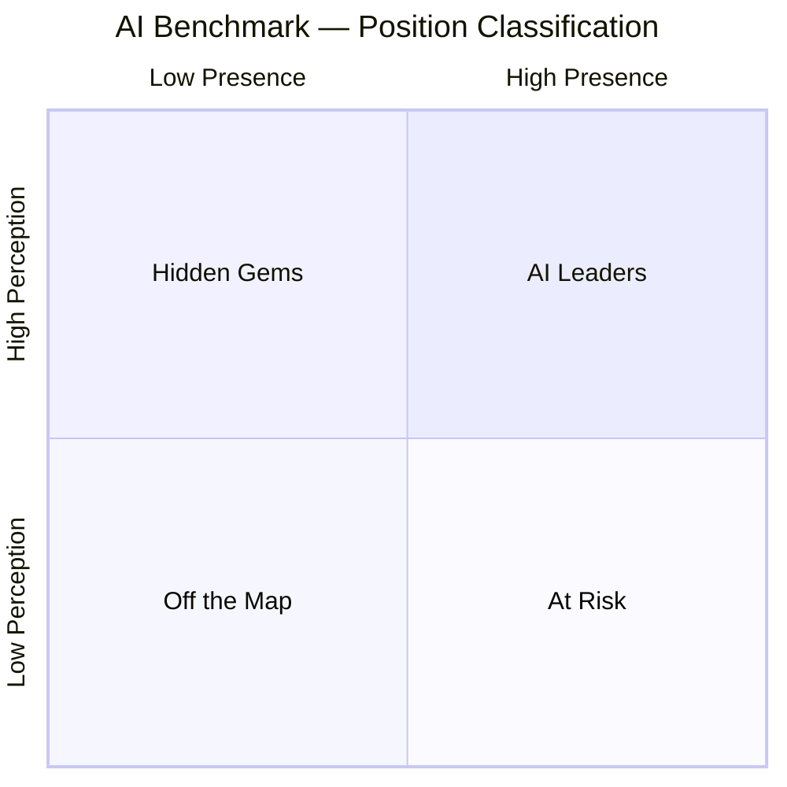

| Position | Presence | Perception | What it means | What to do |
|---|---|---|---|---|
| **AI Leader** | 60+ | 60+ | AI recommends you and tells a strong story | Defend. Monitor weekly. Watch for competitors gaining. |
| **At Risk** | 60+ | Below 60 | AI mentions you but the narrative is weak or wrong | Most urgent. Fix content accuracy and positioning. |
| **Hidden Gem** | Below 60 | 60+ | When AI finds you, it says great things — but it rarely finds you | Solve distribution. Build citations, schema, "best of" content. |
| **Off the Map** | Below 60 | Below 60 | AI doesn't know you exist or gets the story wrong | Build Reputation first. Reviews, press, community. Then Presence follows. |

**Sub-tiers within "Off the Map":**

Most Strategy Sprint customers will land in Off the Map. To avoid a single bucket holding everyone from "barely misses the cut" to "completely invisible," the report uses a Presence sub-tier:

| Sub-tier | Presence Score | Meaning |
|---|---|---|
| Off the Map (Moderate) | 50-59 | Clear presence with room to grow, but below AI Leader threshold on one or both axes. |
| Off the Map (Low) | 30-49 | Shows up but inconsistently. Typical for established brands in competitive categories. |
| Off the Map (Weak) | 10-29 | Rarely recommended. Most buyers using AI will miss you. |
| Off the Map (Invisible) | 0-9 | AI doesn't mention you during evaluation. Zero signal. |

These sub-tiers appear in the score card detail, not in the primary badge. The primary badge stays clean: "Off the Map."

### 1B: Momentum Labels

Derived from the 30-day rolling change in AI Brand Health (the composite score). This captures movement across all dimensions, not just Presence.

| Momentum | 30-Day Change | What it means |
|---|---|---|
| **Surging** | +10 pts or more | Rapid, significant gains. Something is working. |
| **Rising** | +3 to +9 pts | Clear upward trend. Momentum building. |
| **Steady** | -2 to +2 pts | No meaningful change. Holding position. |
| **Slipping** | -3 to -9 pts | Losing ground. Something changed. |
| **Fading** | -10 pts or more | Significant decline. Urgent attention. |

**Why AI Brand Health, not just Presence:** Presence is the most volatile score (less than 1% of responses produce identical brand lists across two runs). Using the composite smooths out noise and captures real directional movement.

### 1C: Combined Status Badge

Format: **"[Position] · [Momentum]"**

The dot separator (·) is deliberate — visually lighter than a dash, reads as a single label.

**Complete combination matrix:**

| Combined Status | Diagnostic narrative |
|---|---|
| **AI Leader · Steady** | Dominant and stable. The strongest position. Defend and monitor. |
| **AI Leader · Surging** | Dominant and gaining. Extending the lead. Allocate resources to maintain. |
| **AI Leader · Slipping** | Market leader losing ground. Competitors gaining or AI models retraining. Investigate immediately. |
| **AI Leader · Fading** | Rapid decline from leadership. Crisis-level attention. |
| **At Risk · Steady** | Highly visible but weak narrative. Buyers find you and hear bad things. Fix perception urgently. |
| **At Risk · Rising** | Visible with weak narrative, but improving. Content fixes are working. |
| **At Risk · Fading** | The worst trajectory. High visibility with worsening narrative. Buyers find you AND hear increasingly bad things. |
| **Hidden Gem · Steady** | Great story, no one hears it. The distribution problem. Solve with citations and "best of" content. |
| **Hidden Gem · Rising** | Strong narrative, visibility gaining. Close to breakthrough. Double down on distribution. |
| **Hidden Gem · Surging** | About to become an AI Leader. The best trajectory for a challenger brand. |
| **Off the Map · Steady** | Invisible, no signs of improvement. Need to build from scratch. |
| **Off the Map · Rising** | Was invisible, now emerging. Something is working — find out what and double down. |
| **Off the Map · Surging** | Breaking through fast from nothing. Rare and exciting. |
| **Off the Map · Fading** | Was barely visible, now losing even that. Deprioritize AI or reset strategy. |

### 1D: Applying to Eon (Worked Example)

Using real data from the Eon audit (234 prompts, 35,050 responses, 5 AI engines, 30-day window):

**Raw scores:**

| Score | Value | Basis |
|---|---|---|
| Presence | ~0/100 | 0.1% visibility rate (tiered model: T1=0.07, T2=0.0, T3=0.1, T4=0.0, T5=0.0), dead last among 8 competitors, zero own-domain citations, zero source control |
| Reputation | ~30/100 | 5 of 13 relevant platforms listed, thin G2 profile, Gartner Cool Vendor + Hype Cycle recognition, no TrustRadius/Capterra/PeerSpot |
| Perception | ~45/100 | Limited AI narrative data. When AI does discuss Eon (branded queries), moderate story: strong on Innovation (9.5) and Modern (10.0), weak on Trust (4.5) and Support (5.0) |
| AI Brand Health | ~19/100 | Weighted composite. Critical tier. |

**Classification:**

| Dimension | Value | Label |
|---|---|---|
| Position | Presence ~0, Perception 45 (both below 60) | **Off the Map** |
| Sub-tier | Presence ~0 (0-9 range) | **Invisible** |
| Momentum | Flat at near-zero, no 30-day movement | **Steady** |
| Combined badge | — | **Off the Map · Steady** |

**Competitor classifications (same category):**

| Brand | Presence (tiered) | Perception | Position | Momentum | Badge |
|---|---|---|---|---|---|
| Veeam | ~33 | ~84 | Off the Map | Steady | Off the Map · Steady |
| Acronis | ~29 | ~76 | Off the Map | Rising | Off the Map · Rising |
| Commvault | ~21 | ~82 | Off the Map | Steady | Off the Map · Steady |
| Druva | ~20 | ~80 | Off the Map | Steady | Off the Map · Steady |
| Rubrik | ~19 | ~83 | Off the Map | Steady | Off the Map · Steady |
| Cohesity | ~15 | ~80 | Off the Map | Slipping | Off the Map · Slipping |
| HYCU | ~11 | ~70 | Off the Map | Steady | Off the Map · Steady |
| Eon | ~0 | ~45 | Off the Map | Steady | Off the Map · Steady |

**A note on this category:** Cloud Backup is a category where even the market leader (Veeam at 33% visibility rate) scores ~33 on Presence under the tiered model. No brand qualifies as "AI Leader" by the 60-threshold. This is common in enterprise infrastructure categories — AI engines are less confident recommending specific vendors compared to, say, CRM or expense management where clear market leaders exist. The tiered Presence model makes this explicit: reaching 60 requires roughly 75%+ visibility rate with strong quality signals across all dimensions.

The report should communicate this: "No brand in Cloud Backup has achieved AI Leader status. Veeam — the #1 market leader — scores 33 on Presence. This entire category is wide open for AI disruption." This normalizes Eon's position as a starting point, not a failure.

---

## Part 2: Overview Tab — Screen Design

### Layout Architecture

Seven components, top to bottom. The page follows a deliberate scan pattern: context → verdict → evidence → action.

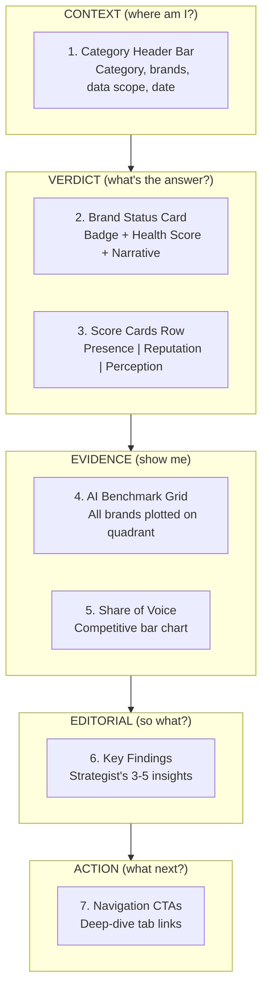

**Scan pattern rationale:**
- A CMO scanning for 30 seconds hits Context → Verdict and stops. They got the answer.
- A VP scanning for 2 minutes continues into Evidence — the Grid and Share of Voice make the competitive picture visceral.
- A strategist doing a full review reads the Editorial findings and clicks into the deep-dive tabs.

### Full-Page Composite Prototype

The entire Overview tab as one continuous scroll. This is the high-level prototype — individual module mockups follow below.

```
╔═══════════════════════════════════════════════════════════════════════╗
║                                                                     ║
║  AI BRAND BENCHMARK                            Powered by CheckThat ║
║  Cloud Backup & Data Protection                                     ║
║  8 brands  ·  234 prompts  ·  35,050 responses  ·  5 AI engines    ║
║  30-day window ending Feb 20, 2026                                  ║
║                                                                     ║
╠═══════════════════════════════════════════════════════════════════════╣
║                                                                     ║
║  [EON LOGO]  eon.io                                                 ║
║                                                                     ║
║  ┌─────────────────────────────────┐          AI BRAND HEALTH       ║
║  │                                 │                                ║
║  │  Off the Map  ·  Steady         │     ████  19 /100              ║
║  │                                 │           Critical             ║
║  └─────────────────────────────────┘                                ║
║                                                                     ║
║  "Strong product innovation, but invisible to AI.                   ║
║   Eon scores 9.5 on Innovation — but zero AI citations              ║
║   mean buyers never see it."                                        ║
║                                                                     ║
╠═══════════════════════════════════════════════════════════════════════╣
║                                                                     ║
║  ┌───────────────────┐ ┌───────────────────┐ ┌───────────────────┐  ║
║  │  PRESENCE         │ │  REPUTATION       │ │  PERCEPTION       │  ║
║  │       0 /100      │ │       30 /100     │ │       45 /100     │  ║
║  │  ░░░░░░░░░░░░░░░░ │ │  ███░░░░░░░░░░░░ │ │  █████░░░░░░░░░░ │  ║
║  │  Invisible        │ │  Weak             │ │  Mixed            │  ║
║  │  — Steady         │ │  ↑ Rising         │ │  — Steady         │  ║
║  │                   │ │                   │ │                   │  ║
║  │  0.1% visibility  │ │  5 of 13          │ │  Innovation 9.5   │  ║
║  │  across 5 engines │ │  platforms listed  │ │  Trust 4.5        │  ║
║  │                   │ │                   │ │                   │  ║
║  │  View detail →    │ │  View detail →    │ │  View detail →    │  ║
║  └───────────────────┘ └───────────────────┘ └───────────────────┘  ║
║                                                                     ║
╠═══════════════════════════════════════════════════════════════════════╣
║                                                                     ║
║  AI BENCHMARK: Cloud Backup & Data Protection                       ║
║                                                                     ║
║  Perception                                                         ║
║  100 ┤                                                              ║
║      │                                                              ║
║      │    HIDDEN GEMS                     AI LEADERS                ║
║   80 ┤          ●Rubrik  ●Commvault                                 ║
║      │      ●Druva    ◉Cohesity↓     ●Veeam                        ║
║   60 ┤·········│·························│··························║
║      │         │                         │                          ║
║   40 ┤  ◆Eon   │                         │                          ║
║      │    OFF  │  THE MAP                │  AT RISK                 ║
║   20 ┤         │                         │                          ║
║      │         │                         │                          ║
║    0 ┼─────────┼─────────┼───────────────┼──────────── Presence     ║
║      0        20        40              60           100            ║
║                                                                     ║
║  ● brand (size=Reputation)  ◆ focus brand  ↓ slipping trend         ║
║  - - - quadrant boundary at 60                                      ║
║                                                                     ║
║  ┌─────────────────────────────────────────────────────────────┐    ║
║  │  ⓘ No brand in Cloud Backup has achieved AI Leader status.  │    ║
║  │  Even Veeam — the market leader — only appears in 33% of   │    ║
║  │  AI recommendations. This category is wide open.            │    ║
║  └─────────────────────────────────────────────────────────────┘    ║
║                                                                     ║
╠═══════════════════════════════════════════════════════════════════════╣
║                                                                     ║
║  AI SHARE OF VOICE                                                  ║
║  % of AI responses mentioning each brand (unaided, evaluation)      ║
║                                                                     ║
║  Veeam     ████████████████████████████████░  33.0%                 ║
║  Acronis   █████████████████████████████░░░░  28.9%                 ║
║  Commvault █████████████████████░░░░░░░░░░░░  21.4%                 ║
║  Druva     ████████████████████░░░░░░░░░░░░░  20.0%                 ║
║  Rubrik    ███████████████████░░░░░░░░░░░░░░  19.3%                 ║
║  Cohesity  ███████████████░░░░░░░░░░░░░░░░░░  15.0%                 ║
║  HYCU      ██████████░░░░░░░░░░░░░░░░░░░░░░░  10.0%                 ║
║  Eon       ▏░░░░░░░░░░░░░░░░░░░░░░░░░░░░░░░░   0.1%                ║
║                                                                     ║
╠═══════════════════════════════════════════════════════════════════════╣
║                                                                     ║
║  KEY FINDINGS                                                       ║
║                                                                     ║
║  1  Eon is 330x less visible than Veeam. Zero citations from        ║
║     eon.io across 35,050 AI responses.                              ║
║                                                                     ║
║  2  ~80% of AI citations come from "best of" listicle content.      ║
║     Eon publishes none. HYCU got 1,175 citations from one page.     ║
║                                                                     ║
║  3  Gartner Peer Insights is surging (+9% in 30d). Eon's Cool       ║
║     Vendor status doesn't generate citations — reviews would.       ║
║                                                                     ║
║  4  Innovation 9.5, Modern 10.0 — invisible because AI never        ║
║     gets to tell the story. The product is strong. Signal absent.   ║
║                                                                     ║
╠═══════════════════════════════════════════════════════════════════════╣
║                                                                     ║
║  EXPLORE THE DETAILS                                                ║
║                                                                     ║
║  ┌───────────────────┐ ┌───────────────────┐ ┌───────────────────┐  ║
║  │  PRESENCE         │ │  REPUTATION       │ │  PERCEPTION       │  ║
║  │  0.1% visibility  │ │  5 of 13          │ │  Strong product,  │  ║
║  │  See why. →       │ │  platforms.        │ │  weak story.      │  ║
║  │                   │ │  See the gaps. →   │ │  See narrative. → │  ║
║  └───────────────────┘ └───────────────────┘ └───────────────────┘  ║
║                                                                     ║
║  ┌─────────────────────────────────────────────────────────────┐    ║
║  │  RECOMMENDATIONS                                            │    ║
║  │  31 actions, prioritized by impact. See the plan. →         │    ║
║  └─────────────────────────────────────────────────────────────┘    ║
║                                                                     ║
╚═══════════════════════════════════════════════════════════════════════╝
```

### Module-by-Module Mockups

Each component below is shown in detail with its internal anatomy, data bindings, and interaction states.

---

### Component 1: Category Header Bar

Context strip. Answers: "What am I looking at?"

```
+=====================================================================+
|                                                                     |
|  AI BRAND BENCHMARK                                                 |
|  Cloud Backup & Data Protection                                     |
|                                                                     |
|  8 brands tracked  |  234 prompts  |  35,050 responses              |
|  5 AI engines      |  30-day window ending Feb 20, 2026             |
|                                                                     |
|  Powered by CheckThat                                               |
|                                                                     |
+=====================================================================+
```

**Data points:**
- Category name (from CheckThat category taxonomy)
- Brand count (competitors in this report)
- Prompt count (classified instruments used)
- Response count (total AI responses collected)
- Engine count + names (ChatGPT, Perplexity, Claude, Gemini, Google)
- Time window (rolling 30-day)
- Report date

### Component 2: Brand Status Card (Hero)

The 30-second scan. Answers: "How bad is it?"

```
+=====================================================================+
|                                                                     |
|  [EON LOGO]                                                         |
|                                                                     |
|  eon.io                                                             |
|                                                                     |
|                                                                     |
|  +-----------------------------------+    AI BRAND HEALTH           |
|  |                                   |                              |
|  |  Off the Map  ·  Steady           |        19                    |
|  |                                   |       /100                   |
|  +-----------------------------------+                              |
|                                           Critical                  |
|                                                                     |
|  "Strong product innovation, but invisible to AI.                   |
|   Eon scores 9.5 on Innovation — but zero AI citations              |
|   mean buyers never see it."                                        |
|                                                                     |
+=====================================================================+
```

**Module anatomy:**

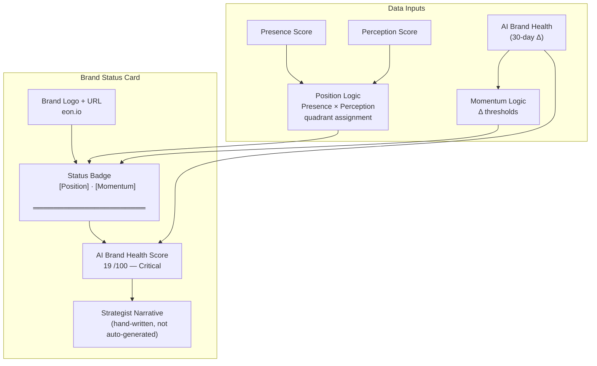

**Scan hierarchy:** The badge is the largest visual element. A reader's eye hits Position · Momentum first, then the score number, then the narrative explanation. This mirrors how an executive reads — "what's the verdict?" then "how bad?" then "why?"

**Elements:**
- Brand name + logo
- Combined status badge (Position · Momentum) — the most prominent element
- AI Brand Health Score — the composite number (0-100) with tier label
- Narrative line — hand-written by the strategist, not auto-generated. One sentence that captures the core tension.

**AI Brand Health tiers** (from CheckThat methodology):

| Score | Tier | Color intent |
|---|---|---|
| 80-100 | Strong | Green |
| 60-79 | Moderate | Blue |
| 40-59 | Needs Work | Yellow/Amber |
| 0-39 | Critical | Red |

### Component 3: Three Score Cards (Row)

Three cards in a horizontal row. Each card is a doorway to its respective tab.

```
+=====================================================================+
|                                                                     |
|  +------------------+  +------------------+  +------------------+   |
|  |                  |  |                  |  |                  |   |
|  |  PRESENCE        |  |  REPUTATION      |  |  PERCEPTION      |   |
|  |                  |  |                  |  |                  |   |
|  |      0           |  |      30          |  |      45          |   |
|  |     /100         |  |     /100         |  |     /100         |   |
|  |                  |  |                  |  |                  |   |
|  |  Invisible       |  |  Weak            |  |  Mixed           |   |
|  |                  |  |                  |  |                  |   |
|  |  -- Steady       |  |  /\ Rising       |  |  -- Steady       |   |
|  |                  |  |                  |  |                  |   |
|  |  0.1% visibility |  |  5 of 13         |  |  Innovation 9.5  |   |
|  |  across 5 AI     |  |  platforms        |  |  Trust 4.5       |   |
|  |  engines         |  |  listed           |  |  (6-attr avg)    |   |
|  |                  |  |                  |  |                  |   |
|  +--[View detail >]-+  +--[View detail >]-+  +--[View detail >]-+   |
|                                                                     |
+=====================================================================+
```

**Single card anatomy (expanded):**

```
┌─────────────────────────────────┐
│                                 │
│  PRESENCE              ← name  │
│                                 │
│       0                ← score  │
│     /100                        │
│  ░░░░░░░░░░░░░░░░░░░░ ← bar   │
│                                 │
│  Invisible             ← tier   │
│  — Steady              ← trend  │
│                                 │
│  ┄┄┄┄┄┄┄┄┄┄┄┄┄┄┄┄┄┄┄┄┄┄┄┄┄┄┄ │
│                                 │
│  0.1% visibility       ← stat  │
│  across 5 AI engines            │
│                                 │
│  View detail →         ← CTA   │
│                                 │
└─────────────────────────────────┘
```

**Card internal structure (mermaid):**

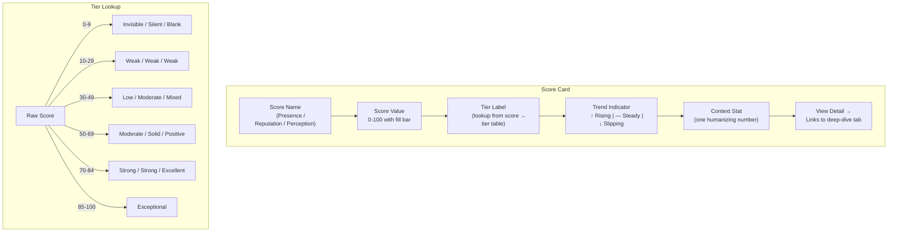

**Each card contains:**

| Element | What it shows |
|---|---|
| Score name | Presence, Reputation, or Perception |
| Score value | 0-100 |
| Tier label | Human-readable tier (see tiers below) |
| Trend indicator | Arrow (up/down/flat) + momentum label |
| Context stat | One stat that makes the score tangible |
| Link | "View detail" leads to the tab |

**Tier labels by score:**

```
PRESENCE TIERS (tiered component model — harder curve by design)
  85-100  Exceptional  Near-perfection across all dimensions
  70-84   Strong       Dominant in category, minor gaps
  50-69   Moderate     Clear presence with room to grow
  30-49   Low          Shows up but inconsistently
  10-29   Weak         Rarely recommended, most buyers miss you
   0-9    Invisible    AI doesn't mention you during evaluation

REPUTATION TIERS
  80-100  Strong       Well-reviewed, well-covered, strong community
  60-79   Solid        Good signals with some gaps
  40-59   Moderate     Mixed signals across platforms
  20-39   Weak         Few reviews, minimal press, thin community
   0-19   Silent       Near-zero external market signal

PERCEPTION TIERS
  80-100  Excellent    AI tells a strong, accurate, differentiated story
  60-79   Positive     Mostly positive with gaps in some attributes
  40-59   Mixed        Some attributes strong, others weak or inaccurate
  20-39   Weak         AI's story is poor across most dimensions
   0-19   Blank        AI doesn't describe you in detail or gets it wrong
```

**Context stat examples:**

| Score | Context stat for Eon | Why this stat |
|---|---|---|
| Presence | "0.1% visibility across 5 AI engines" | Makes the number tangible — near-zero |
| Reputation | "5 of 13 platforms listed" | Shows the gap visually |
| Perception | "Innovation 9.5, Trust 4.5" | Shows the best and worst attributes — the internal tension |

### Component 4: AI Benchmark Grid (Quadrant Chart)

The centerpiece. This IS the CheckThat AI Benchmark, applied to this category.

```
+=====================================================================+
|                                                                     |
|  AI BENCHMARK: Cloud Backup & Data Protection                       |
|                                                                     |
|  Perception                                                         |
|  (narrative quality)                                                |
|       |                                                             |
|  100  |                                                             |
|       |  HIDDEN GEMS               AI LEADERS                       |
|       |                                                             |
|   80  |          (Rubrik)  (Commvault)                               |
|       |            *     *                                          |
|       |     (Druva)    (Cohesity)   (Veeam)                         |
|   60  |        *          *v           *                             |
|       |.........................................                     |
|       |                                                             |
|   40  |  (Eon)                                                      |
|       |    *                                                        |
|   20  |                                                             |
|       |  OFF THE MAP               AT RISK                          |
|       |                                                             |
|    0  +------+------+------+------+------+------+-->  Presence      |
|       0     10     20     30     40     50    100  (AI recommends)  |
|                                                                     |
|  *  = brand     size = Reputation     v = slipping trend            |
|                                                                     |
+=====================================================================+
```

**Visual encoding logic:**

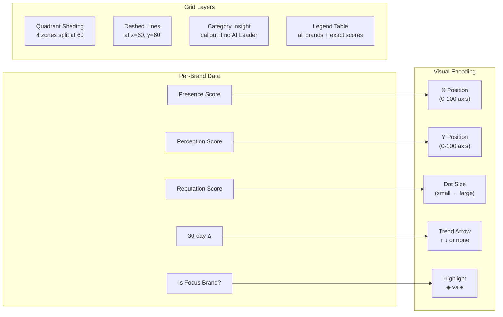

**Dot rendering rules:**

```
DOT SIZE SCALE (maps Reputation → radius)
  Rep 80-100  →  ●●●  large    (16px radius)
  Rep 60-79   →  ●●   medium   (12px radius)
  Rep 40-59   →  ●    small    (9px radius)
  Rep 0-39    →  ·    tiny     (6px radius)

TREND ARROWS
  Surging (+10+)   →  ↑↑  double up, green
  Rising (+3 to 9) →  ↑   single up, green
  Steady (-2 to 2) →  (none)
  Slipping (-3 -9) →  ↓   single down, red
  Fading (-10+)    →  ↓↓  double down, red

FOCUS BRAND
  ◆ diamond shape, brand color fill, label always visible
  All others: ● circle, gray fill, label on hover
```

**Visual encoding:**

| Visual element | Data dimension | Example |
|---|---|---|
| Dot X position | Presence Score (0-100) | Veeam at x=33 |
| Dot Y position | Perception Score (0-100) | Veeam at y=84 |
| Dot size | Reputation Score (0-100) | Veeam large dot (high rep), Eon small dot (low rep) |
| Trend arrow on dot | 30-day momentum direction | Cohesity has down arrow (slipping) |
| Quadrant shading | Position classification | Top-right = AI Leaders, etc. |
| Highlight treatment | Focus brand | Eon dot is highlighted/outlined differently |
| Dashed line | Quadrant boundary at 60 | Horizontal and vertical at score 60 |

**Grid labels per brand:**

Each dot should show the brand name on hover/click. In the static version, the top 5-6 brands are labeled directly. A legend or table below lists all brands with their exact scores:

```
+--------------------------------------------------------------+
|  Brand        Presence  Perception  Reputation  Status        |
|  -----------------------------------------------------------  |
|  Veeam           33        84          85       Hidden Gem    |
|  Acronis         29        76          76       Off the Map   |
|  Commvault       21        82          82       Off the Map   |
|  Druva           20        80          80       Off the Map   |
|  Rubrik          19        83          83       Off the Map   |
|  Cohesity        15        80          80       Off the Map   |
|  HYCU            10        70          65       Off the Map   |
|  Eon              2        45          30       Off the Map   |
+--------------------------------------------------------------+
```

**Category-level insight callout:**

When no brand crosses the 60-threshold on Presence (common in enterprise infra categories), the report adds an annotation:

> "No brand in Cloud Backup has achieved AI Leader status. Even Veeam — the #1 market leader — only appears in 33% of AI recommendations. This category is wide open for AI disruption."

This normalizes Eon's position and reframes the competitive landscape as opportunity.

### Component 5: AI Share of Voice (Competitive Bar Chart)

Horizontal bars. Immediate visual impact of the gap.

```
+=====================================================================+
|                                                                     |
|  AI SHARE OF VOICE                                                  |
|  % of AI responses mentioning each brand (unaided, evaluation)      |
|                                                                     |
|  Veeam     |==============================|          33.0%          |
|  Acronis   |===========================|             28.9%          |
|  Commvault |===================|                     21.4%          |
|  Druva     |==================|                      20.0%          |
|  Rubrik    |=================|                       19.3%          |
|  Cohesity  |=============|                           15.0%          |
|  HYCU      |========|                                10.0%          |
|  Eon       ||                                         0.1%          |
|                                                                     |
|  Based on 234 prompts x 150 responses each across 5 AI engines      |
|                                                                     |
+=====================================================================+
```

**Bar construction detail:**

```
BAR ANATOMY (single brand row)
┌──────────────────────────────────────────────────────────────────┐
│  Brand     │████████████████████████████░░░░░│          33.0%   │
│  name      │ filled portion  │ empty portion │          value   │
│  (left)    │ proportional    │ to 100% max   │          (right) │
└──────────────────────────────────────────────────────────────────┘

FOCUS BRAND TREATMENT
┌──────────────────────────────────────────────────────────────────┐
│  Eon  >>>  │▌░░░░░░░░░░░░░░░░░░░░░░░░░░░░░░│           0.1%   │
│  (bold,    │ accent color bar (barely visible)│          (bold)  │
│  highlight)│                                  │                  │
└──────────────────────────────────────────────────────────────────┘
```

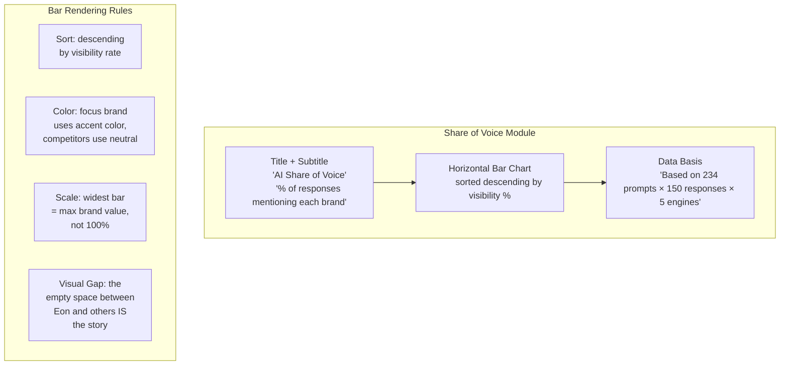

**Design notes:**
- Sort descending by visibility rate
- Focus brand (Eon) gets a different bar color or highlight
- The gap between the smallest competitor bar and Eon's sliver IS the visual story — no annotation needed
- Footer states the data basis (prompts x runs x engines)

### Component 6: Key Findings (Editorial Bullets)

The strategist's layer. Hand-written, not auto-generated. 3-5 findings that summarize the report's most important insights.

```
+=====================================================================+
|                                                                     |
|  KEY FINDINGS                                                       |
|                                                                     |
|  1. Eon is 330x less visible than Veeam in AI recommendations.      |
|     Zero citations from eon.io across 35,050 AI responses.          |
|                                                                     |
|  2. ~80% of all AI citations come from "best of" listicle           |
|     content. Eon publishes none. HYCU — with similar domain         |
|     authority (36 vs 33) — got 1,175 citations from one page.       |
|                                                                     |
|  3. Gartner Peer Insights is the fastest-growing citation           |
|     source (+9% in 30 days). Eon's Cool Vendor recognition          |
|     doesn't appear on these pages — customer reviews would.         |
|                                                                     |
|  4. Eon's strongest Perception attributes — Innovation (9.5)        |
|     and Modern (10.0) — are invisible because AI never gets         |
|     to tell the story. The product is strong. The signal is          |
|     absent.                                                         |
|                                                                     |
+=====================================================================+
```

**Single finding anatomy:**

```
┌─────────────────────────────────────────────────────────────────────┐
│                                                                     │
│  ①  Eon is 330x less visible than Veeam.              ← headline  │
│     Zero citations from eon.io across 35,050           ← evidence  │
│     AI responses.                                                   │
│                                              See Presence →  ← link │
│                                                                     │
└─────────────────────────────────────────────────────────────────────┘

FINDING STRUCTURE:
  [number]  [headline — leads with the metric or comparison]
            [evidence — the supporting data point]
            [optional link → to the relevant deep-dive tab]
```

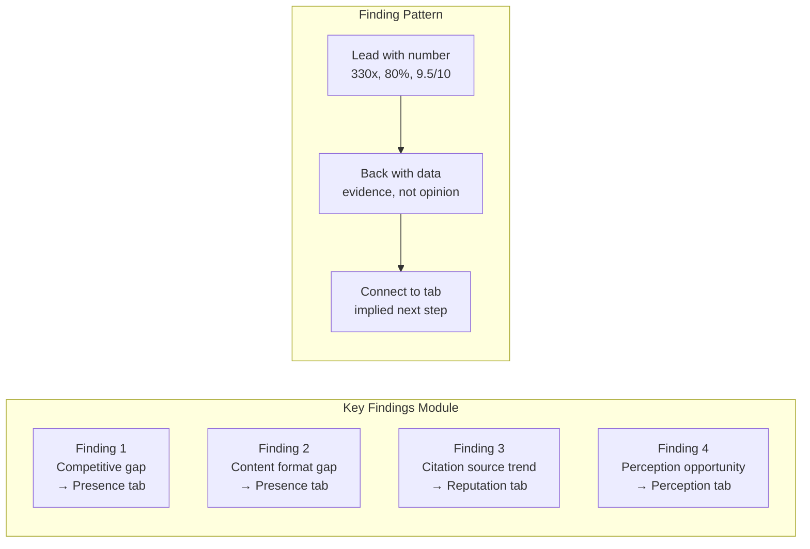

**Guidelines for writing findings:**
- Lead with the number or comparison, not the context
- Each finding should connect to a specific tab for the reader who wants more detail
- The final finding should hint at the opportunity (what could change)
- Avoid generic statements like "there's room for improvement"

### Component 7: Navigation CTAs

Four cards linking to the deep-dive tabs. Each card shows a teaser metric that creates curiosity.

```
+=====================================================================+
|                                                                     |
|  EXPLORE THE DETAILS                                                |
|                                                                     |
|  +------------------+  +------------------+                         |
|  |                  |  |                  |                         |
|  |  PRESENCE        |  |  REPUTATION      |                         |
|  |                  |  |                  |                         |
|  |  0.1% visibility |  |  5 of 13         |                         |
|  |  See why. -->    |  |  platforms.       |                         |
|  |                  |  |  See the gaps. -->|                         |
|  +------------------+  +------------------+                         |
|                                                                     |
|  +------------------+  +------------------+                         |
|  |                  |  |                  |                         |
|  |  PERCEPTION      |  |  RECOMMENDATIONS |                         |
|  |                  |  |                  |                         |
|  |  Strong product, |  |  31 actions,     |                         |
|  |  weak story.     |  |  prioritized.    |                         |
|  |  See the         |  |  See the plan.-->|                         |
|  |  narrative. -->  |  |                  |                         |
|  +------------------+  +------------------+                         |
|                                                                     |
+=====================================================================+
```

**CTA card anatomy:**

```
┌──────────────────────────────────┐
│                                  │
│  PRESENCE                ← tab  │
│                                  │
│  0.1% visibility         ← hook │
│  across 5 engines.       metric  │
│                                  │
│  See why. →              ← CTA  │
│                                  │
└──────────────────────────────────┘

CARD STATES:
  Default:   neutral background, dark text
  Hover:     subtle lift shadow, accent border-left
  Active:    (navigates to tab)
```

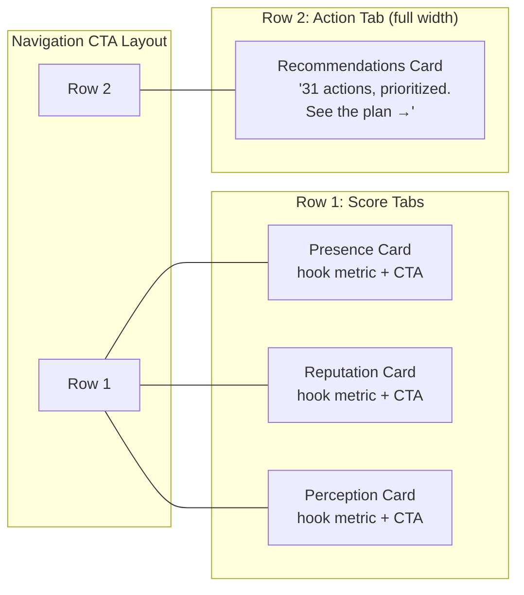

**Teaser copy per tab (Eon example):**

| Tab | Teaser | Hook |
|---|---|---|
| Presence | "0.1% visibility across 5 engines." | The number is so stark it creates urgency |
| Reputation | "5 of 13 platforms. See the gaps." | Implies there are specific things to fix |
| Perception | "Strong product, weak story." | The tension — good product but bad narrative |
| Recommendations | "31 actions, prioritized." | Concrete, actionable, implies a clear plan |

### Interaction Flow (Overview Tab)

How a user moves through the Overview tab and where clicks take them.

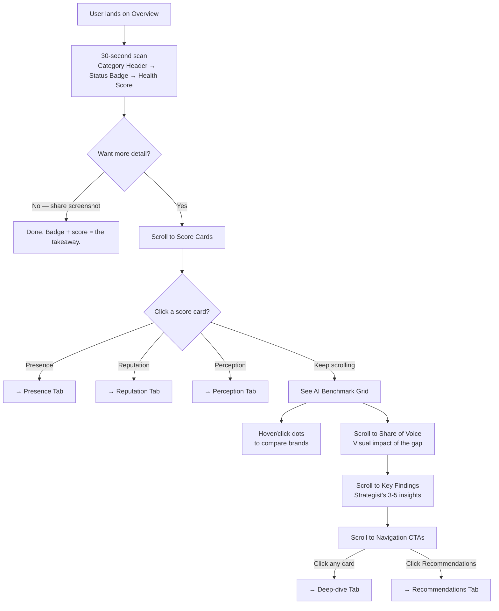

### Responsive Behavior

```
DESKTOP (≥1024px)                   TABLET (768-1023px)
┌──────────────────────────┐        ┌──────────────────────┐
│  Header                  │        │  Header              │
│  ┌─────────────────────┐ │        │  ┌──────────────────┐│
│  │  Status Card        │ │        │  │  Status Card     ││
│  └─────────────────────┘ │        │  └──────────────────┘│
│  ┌─────┐ ┌─────┐ ┌─────┐│        │  ┌─────┐ ┌─────┐    │
│  │ P   │ │ R   │ │ Pe  ││        │  │ P   │ │ R   │    │
│  └─────┘ └─────┘ └─────┘│        │  └─────┘ └─────┘    │
│  ┌─────────────────────┐ │        │  ┌─────┐            │
│  │  Grid (full width)  │ │        │  │ Pe  │            │
│  └─────────────────────┘ │        │  └─────┘            │
│  ┌─────────────────────┐ │        │  ┌──────────────────┐│
│  │  Share of Voice     │ │        │  │  Grid            ││
│  └─────────────────────┘ │        │  └──────────────────┘│
│  ┌─────────────────────┐ │        │  (rest stacks)       │
│  │  Key Findings       │ │        └──────────────────────┘
│  └─────────────────────┘ │
│  ┌─────┐ ┌─────┐ ┌─────┐│        MOBILE (<768px)
│  │ CTA │ │ CTA │ │ CTA ││        ┌────────────────┐
│  └─────┘ └─────┘ └─────┘│        │  Header        │
│  ┌─────────────────────┐ │        │  Status Card   │
│  │  CTA (full width)   │ │        │  Score Card P  │
│  └─────────────────────┘ │        │  Score Card R  │
└──────────────────────────┘        │  Score Card Pe │
                                    │  Grid (scroll) │
                                    │  SoV           │
                                    │  Findings      │
                                    │  CTA stack     │
                                    └────────────────┘
```

---

## Part 3: Score-to-Tab Mapping

How each tab connects to the CheckThat methodology and the Eon audit data.

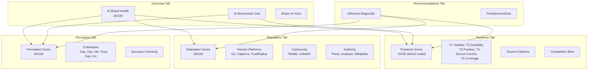

### Data Sources per Tab (Eon)

| Tab | CheckThat Score | Eon audit file(s) | Key data extracted |
|---|---|---|---|
| **Overview** | AI Brand Health (composite) | All files — derived metrics | Composite score, competitor grid coordinates, share of voice bars |
| **Presence** | Presence Score (5-tier model: Visibility, Durability, Position, Source Control, Coverage) | `eon-checkthat-source-analysis-v1.md` | 0.1% visibility, competitive presence rankings, source citation rates by tier, domain citation share (Source Control), content type breakdown (80% listicles), URL-level citation data |
| **Reputation** | Reputation Score (Reviews, Community, Authority) | `eon-io-analyst-category-mapping-v1.md`, `eon-io-deep-research-v1.md` | Platform coverage map (5/13 listed), G2 category gaps, TrustRadius absence, Gartner recognition, PeerSpot ranking, review depth |
| **Perception** | Perception Score (6 attributes) | `eon-io-deep-research-v1.md` | 15-dimension perception scores mapped to 6 attributes, competitor attribute comparison, strengths (Innovation 9.5, Modern 10.0) and gaps (Trust 4.5, Support 5.0) |
| **Recommendations** | Influence (diagnostic) + all scores | `eon-blog-seo-aeo-analysis-v1.md`, `eon-competitive-seo-analysis-v1.md`, `eon-checkthat-source-analysis-v1.md`, `eon-top-500-prompts-guide-v1.md` | Prioritized actions from all analyses, source-to-fix mapping, content strategy (HYCU playbook, glossary, RTO/RPO), prompt tracking instrument |

### CheckThat Perception Attribute Mapping for Eon

The Eon deep research uses 15 dimensions (1-10 scale). These map to CheckThat's 6 perception attributes:

| CheckThat Attribute | Eon Dimensions Mapped | Eon Score (avg) |
|---|---|---|
| **Capability** | Product Quality (7.0), Scalability (7.0), Integration (6.5) | 6.8 |
| **Usability** | Ease of Use (8.0), Speed/Time to Value (8.5) | 8.3 |
| **Value** | Value for Money (7.5), Transparency (6.5) | 7.0 |
| **Trust** | Trust/Reliability (4.5), Security/Compliance (7.5), Customer-Centricity (5.5) | 5.8 |
| **Support** | Customer Support (5.0) | 5.0 |
| **Innovation** | Innovation (9.5), Modern vs Legacy (10.0), Thought Leadership (7.5), Industry Expertise (6.0) | 8.3 |

**Perception Score = (avg of 6 attributes) x 10 = (6.8 + 8.3 + 7.0 + 5.8 + 5.0 + 8.3) / 6 x 10 = 6.87 x 10 = ~69**

Wait — this maps higher than the ~45 estimated in the classification section. The difference: the 15-dimension scores measure *market perception* (what the world thinks), not *AI perception* (what AI engines actually say). For a brand with 0.1% visibility, AI engines produce very little narrative to score. The Perception Score in the report should use:

- **If CheckThat data is available:** Use actual AI-generated narrative scoring (likely much lower for Eon given near-zero visibility)
- **If using audit data as proxy:** Use the market perception scores but clearly label them as "Market Perception (proxy)" rather than "AI Perception"

For the Eon report, we should use the lower estimate (~45) to reflect that AI engines have almost no narrative about Eon. The market perception data (6.87 avg / ~69 Perception) represents what the score COULD be if AI were accurately reflecting the market's view — a gap the Recommendations tab would address.

---

## Part 4: Edge Cases

### When Presence is Near-Zero (Like Eon)

**Problem:** If AI barely mentions a brand, there's not enough AI-generated narrative to calculate a Perception Score.

**Solution:** Perception is scored from branded queries, not unbranded. Even a brand with zero unaided Presence can have Perception data — AI engines will answer "What is Eon?" or "Eon vs Veeam" even if they never volunteer Eon's name unprompted.

**If branded query data is also thin:**
- Show a Perception Score with a confidence indicator: "45/100 (low confidence — based on limited AI mentions)"
- In the Perception tab, explain: "Eon appears in too few AI responses for a statistically robust Perception Score. The score shown is based on [N] branded responses. As Presence increases, this score will stabilize."

### When No Brand Reaches AI Leader Status

**Problem:** In some categories (enterprise infra, niche verticals), even the market leader might have Presence below 60. The entire quadrant chart would show only "Off the Map" brands.

**Solution:** Add category-relative context:
- "No brand in [Category] has achieved AI Leader status by the CheckThat benchmark threshold."
- Show a **category maturity indicator**: how this category compares to others in AI adoption
- Optionally shift to **relative positioning** within the category (who's winning vs peers) while maintaining the absolute benchmark for cross-category comparison

### When a Score Cannot Be Calculated

| Scenario | Display | Explanation shown |
|---|---|---|
| No review platform data | Reputation: "- -" | "No review data found. Establish G2/Capterra profiles to unlock this score." |
| No branded query responses | Perception: "- -" | "AI engines have insufficient data about this brand. Build Reputation first." |
| Brand not tracked yet | All scores: "- -" | "This brand is not yet tracked. Contact us to add it." |
| Single engine only | Cross-Engine Coverage: "1/5" | "Only detected on one AI engine. Multi-engine presence significantly improves stability." |

### When Momentum Cannot Be Determined

**Problem:** First-time reports have no 30-day history.

**Solution:** Show "New" instead of a momentum label. Badge reads "Off the Map · New" — indicating this is the baseline measurement. The next report (30 days later) will show the first momentum label.

---

## Part 5: Data Flow

How audit data becomes a report.

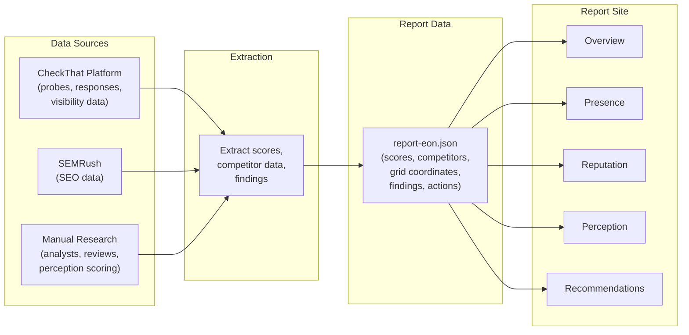

### JSON Data Structure (Sketch)

```
{
  "report": {
    "category": "Cloud Backup & Data Protection",
    "brand": "eon.io",
    "date": "2026-02-20",
    "window": "30 days",
    "prompts": 234,
    "responses": 35050,
    "engines": ["ChatGPT", "Perplexity", "Claude", "Gemini", "Google"]
  },
  "scores": {
    "brandHealth": { "value": 19, "tier": "Critical", "trend": 0 },
    "presence": {
      "value": 0, "tier": "Invisible", "trend": 0,
      "tiers": {
        "visibility": { "value": 0.07, "max": 70, "rate": 0.1 },
        "durability": { "value": 0.0, "max": 9, "stability": 5 },
        "position": { "value": 0.1, "max": 8, "positionScore": 40 },
        "sourceControl": { "value": 0.0, "max": 8, "domainCitationRate": 0 },
        "coverage": { "value": 0.0, "max": 5, "crossEngine": 20 }
      }
    },
    "reputation": { "value": 30, "tier": "Weak", "trend": 3 },
    "perception": { "value": 45, "tier": "Mixed", "trend": 0, "confidence": "low" }
  },
  "classification": {
    "position": "Off the Map",
    "momentum": "Steady",
    "badge": "Off the Map · Steady"
  },
  "perception_attributes": {
    "capability": 6.8,
    "usability": 8.3,
    "value": 7.0,
    "trust": 5.8,
    "support": 5.0,
    "innovation": 8.3
  },
  "competitors": [
    { "name": "Veeam", "presence": 33, "presenceRate": 33.0,
      "sourceControl": 7, "perception": 84,
      "reputation": 85, "position": "Off the Map", "momentum": "Steady" },
    ...
  ],
  "findings": [...],
  "recommendations": [...]
}
```

---

## Part 6: Technical Direction

### Phase 1 Recommendation: Next.js Static Export

| Option | Pros | Cons | Verdict |
|---|---|---|---|
| **Next.js static export** | React components, SSG, Vercel deploy, good charting ecosystem (Recharts, D3), responsive | Requires React knowledge, heavier than needed for static content | Best balance of capability and speed |
| **Astro** | Content-focused, ships minimal JS, fast, supports React components as islands | Smaller ecosystem, less charting library support | Good alternative if JS weight matters |
| **Mintlify** | Already have infra, MDX components, auth built in | Cannot do custom interactive quadrant charts, limited visualization control | Too limiting for the Grid |

**Recommendation:** Next.js with static export. Deploy to Vercel. One JSON file per report. The template renders it.

**Key technical decisions:**
- **Charting library:** Recharts for bar charts and score cards. D3 or a custom SVG component for the quadrant chart (Recharts doesn't natively support quadrant/scatter with dot sizing).
- **Styling:** Tailwind CSS for layout and utility. Clean, minimal, report-quality aesthetic.
- **Responsiveness:** Must work on desktop (primary) and tablet. Mobile is secondary but should be readable.
- **URL structure:** `reports.checkthat.ai/eon` or `checkthat.ai/reports/cloud-backup/eon`
- **PDF export:** Nice-to-have. Use browser print CSS or a server-side PDF generator for board deck versions.

### Data Layer

One JSON file per customer report. The strategist fills in findings and narrative. Scores and competitor data come from CheckThat data + manual extraction from audit files.

Long-term: the JSON is auto-generated from CheckThat's API. Short-term: hand-curated per engagement.

---

## Part 7: Open Questions

Decisions to make before building:

1. **Quadrant threshold:** Is 60 the right split point for the quadrant? In categories where no brand reaches 60 on Presence, should we use a relative midpoint instead?

2. **Momentum basis:** Should momentum be based on AI Brand Health (composite, smoother) or Presence Rate (most volatile, most actionable)? The plan uses AI Brand Health. Alternative: show both.

3. **Perception data source for Strategy Sprint reports:** When we don't have live CheckThat probing data, should we use the manual 15-dimension market perception scores as a proxy? If yes, how do we label the difference?

4. **Number of brands in the grid:** Cap at top 8-10 competitors? Or show the full 55-brand landscape from the deep research? The grid gets unreadable beyond ~12 dots.

5. **Authentication:** Fully public (anyone with the URL can view)? Or gated behind a simple access code the customer shares with their team?

---

*Design document created February 21, 2026. Reference case: Eon.io in Cloud Backup & Data Protection. Methodology aligned with CheckThat four-score framework (Presence, Reputation, Perception, Influence) and AI Benchmark quadrant visualization.*
