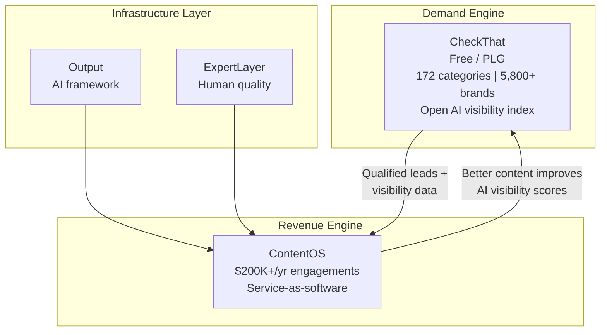

# How CheckThat Fits Into Content OS

<metadata>
purpose: Internal one-pager explaining CheckThat's role in the ContentOS ecosystem for new executive hires
audience: Chief Customer Officer, COO
related: pipeline/research/tam-sam-som-analysis.md, products/ecosystem-overview.mdx, products/checkthat/vision.mdx, products/contentos.mdx
domain: strategy
confidence: high
sensitivity: internal
context_tier: 1
last_updated: 2026-02-27
</metadata>

---

## The big picture

GrowthX sells outcomes, not tools. We call it **service-as-software** — AI workflows plus expert oversight delivering content marketing results at scale.

**ContentOS** is the revenue engine. Enterprise clients pay $200K+/year for an all-batteries-included content operations platform, either self-operated or GrowthX-operated.

**CheckThat** is the demand engine. A free, open AI visibility index that shows any B2B brand how AI describes them to buyers — and creates the "why now" that drives them into ContentOS.

They aren't separate bets. They're two halves of the same flywheel.

---

## How they connect

**The loop:** CheckThat shows a brand they're invisible in AI answers. ContentOS fixes it. Better content improves their CheckThat scores. Improved scores prove ROI and attract more brands to CheckThat. Repeat.

---

## Why CheckThat matters to the CCO

**It's the front door for customer acquisition.** CheckThat is freemium — no signup required to see public data. Brands discover their AI visibility gap, track their scores, and realize they need help. That's the moment ContentOS enters the conversation.

**It qualifies accounts automatically.** A brand's AI visibility score tells us how much they need us before anyone picks up the phone. Low scores = high intent = warm pipeline.

**It proves ROI after the sale.** Once a ContentOS client ships content, their CheckThat scores move. Visibility goes up. That's measurable proof the engagement is working — the strongest retention lever we have.

**It creates the "aha moment."** 94% of B2B buyers use LLMs during their buying process. When a CMO sees their brand is missing from AI answers in their own category, the urgency to act is immediate.

---

## Why CheckThat matters to the COO

**It scales without proportional headcount.** CheckThat is product-led growth — self-serve signups, automated data collection, no enterprise sales cycle required. It grows the top of funnel while the services team focuses on high-value delivery.

**The market is massive and moving fast.** CheckThat sits in the $75B SEO market, which is actively shifting toward AI visibility (AEO). 94% of CMOs plan to increase AEO investment in 2026. We're targeting $4.2M ARR from CheckThat in 2026, scaling to $51M by 2028.

**The data moat compounds daily.** CheckThat tracks AI responses across ChatGPT, Perplexity, Claude, and Google AI Mode every day. That historical data can't be recreated by a competitor who starts later. More brands tracked = fuller categories = better benchmarks = more trust. Time is the moat.

**It de-risks the business.** ContentOS revenue depends on enterprise sales cycles. CheckThat diversifies with a PLG motion at a completely different price point ($249–$1,500/mo), different buyer (ICs and small teams), and different growth curve.

---

## How to think about it

CheckThat is to ContentOS what the diagnostic is to the treatment.

It's not a side project or an R&D experiment. It's the front door to the ecosystem — the tool that creates demand for the service. Every brand that checks their AI visibility score is a potential $200K+/year ContentOS client.

The playbook is proven: Crunchbase made funding data open and became essential. G2 made review data open and became essential. CheckThat is doing the same for AI visibility.

| | CheckThat | ContentOS |
|---|---|---|
| **Role** | Demand engine | Revenue engine |
| **Model** | Freemium PLG | Enterprise service-as-software |
| **Price** | Free / $249–$1,500/mo | $200K+/yr |
| **Buyer** | ICs, small teams | CMOs, VPs of Marketing |
| **Value** | See your AI visibility gap | Fix it at scale |
| **2026 target** | $4.2M ARR | ~$29.6M ARR |

---

## One sentence to remember

**CheckThat shows brands they're invisible in AI. ContentOS makes them visible. That's the whole play.**
