# Vercel.com — Information Architecture

**Source:** XML sitemap (`vercel.com/sitemap.xml`)
**Date:** 2026-03-04
**Total indexed pages:** 4,829

---

## Site Map — Mermaid Diagram

```mermaid
graph TD
    ROOT["vercel.com<br/><b>4,829 pages</b>"]

    ROOT --> PRODUCT["🔷 Product & Platform<br/><i>~956 pages</i>"]
    ROOT --> CONTENT["📝 Content & Education<br/><i>~1,180 pages</i>"]
    ROOT --> DOCS["📖 Documentation<br/><i>1,419 pages</i>"]
    ROOT --> ECO["🔌 Ecosystem<br/><i>~1,071 pages</i>"]
    ROOT --> GTM["📣 GTM & Events<br/><i>~74 pages</i>"]
    ROOT --> COMPANY["🏢 Company<br/><i>~129 pages</i>"]

    %% Product & Platform
    PRODUCT --> CHANGELOG["/changelog<br/>888 pages"]
    PRODUCT --> GEIST["/geist<br/>60 pages"]
    PRODUCT --> SOL["/solutions<br/>8 pages"]
    PRODUCT --> PLAT_MAIN["Standalone product pages<br/>~14 pages"]
    GEIST --> GEIST_C["60 UI components"]
    SOL --> SOL_L["composable-commerce<br/>design-engineering<br/>marketing-sites<br/>multi-tenant-saas<br/>platform-engineering<br/>turborepo · web-apps"]
    PLAT_MAIN --> PLAT_PP["/ai · /agents · /botid<br/>/cdn · /fluid · /workflow<br/>/platforms (18)"]

    %% Content & Education
    CONTENT --> BLOG["/blog<br/>534 pages"]
    CONTENT --> KB["/kb<br/>419 pages"]
    CONTENT --> ACADEMY["/academy<br/>181 pages"]
    CONTENT --> RESOURCES["/resources<br/>46 pages"]
    KB --> KB_G["guides — 364"]
    KB --> KB_B["bulletins — 3"]
    KB --> KB_T["topic landings — 52"]
    ACADEMY --> AC1["production-monorepos — 31"]
    ACADEMY --> AC2["nextjs-foundations — 28"]
    ACADEMY --> AC3["slack-agents — 21"]
    ACADEMY --> AC4["6 more courses — 101"]

    %% Documentation
    DOCS --> DOCS_API["/docs/rest-api<br/>555 pages"]
    DOCS --> DOCS_CONF["/docs/conformance<br/>78 pages"]
    DOCS --> DOCS_INT["/docs/integrations<br/>76 pages"]
    DOCS --> DOCS_ERR["/docs/errors<br/>76 pages"]
    DOCS --> DOCS_AIGW["/docs/ai-gateway<br/>65 pages"]
    DOCS --> DOCS_CLI["/docs/cli<br/>52 pages"]
    DOCS --> DOCS_OTHER["50+ other sub-sections<br/>~517 pages"]

    %% Ecosystem
    ECO --> TEMPLATES["/templates<br/>533 pages"]
    ECO --> AIGW["/ai-gateway<br/>242 pages"]
    ECO --> MKT["/marketplace<br/>120 pages"]
    ECO --> PARTNERS["/partners<br/>108 pages"]
    ECO --> GEIST2["/geist<br/>60 pages"]
    ECO --> INTEG["/integrations<br/>8 legacy pages"]
    TEMPLATES --> T_NEXT["next.js — 318"]
    TEMPLATES --> T_OTHER["nuxt · astro · svelte<br/>python · react · hono<br/>+ 90 more frameworks"]
    AIGW --> AIGW_M["models — 240"]
    AIGW --> AIGW_O["leaderboards — 1"]
    PARTNERS --> P_SOL["solution-partners — 103"]
    PARTNERS --> P_PLAT["platform partners — 5"]

    %% GTM & Events
    GTM --> SHIP["/ship<br/>20 pages"]
    GTM --> SHIPPED["/shipped<br/>17 pages"]
    GTM --> GO["/go<br/>16 pages"]
    GTM --> CONTACT["/contact<br/>11 pages"]
    GTM --> EVENTS["standalone event pages<br/>~10 pages"]

    %% Company
    COMPANY --> CAREERS["/careers<br/>100 pages"]
    COMPANY --> LEGAL["/legal<br/>29 pages"]

    %% Styling
    classDef hub fill:#1a1a2e,stroke:#e94560,color:#fff,stroke-width:2px
    classDef section fill:#16213e,stroke:#0f3460,color:#fff
    classDef subsec fill:#0f3460,stroke:#533483,color:#eee
    classDef leaf fill:#1a1a2e,stroke:#533483,color:#aaa,stroke-dasharray:3

    class ROOT hub
    class PRODUCT,CONTENT,DOCS,ECO,GTM,COMPANY section
    class AIGW,GEIST,SOL,PLAT_MAIN,CHANGELOG,BLOG,KB,ACADEMY,RESOURCES,DOCS_API,DOCS_CONF,DOCS_INT,DOCS_ERR,DOCS_AIGW,DOCS_CLI,DOCS_OTHER,TEMPLATES,MKT,PARTNERS,INTEG,GEIST2,SHIP,SHIPPED,GO,CONTACT,EVENTS,CAREERS,LEGAL subsec
    class AIGW_M,AIGW_O,GEIST_C,SOL_L,PLAT_PP,KB_G,KB_B,KB_T,AC1,AC2,AC3,AC4,T_NEXT,T_OTHER,P_SOL,P_PLAT leaf
```

---

## Page Count by Functional Area

| Area | Pages | % | Primary Purpose |
|------|------:|--:|-----------------|
| **Documentation** | 1,419 | 29.4% | Technical reference, API docs, guides |
| **Content & Education** | 1,180 | 24.4% | Thought leadership, learning, resources |
| **Ecosystem** | 1,071 | 22.2% | Templates, AI gateway models, integrations, partners |
| **Product & Platform** | 956 | 19.8% | Changelog, solutions, design system, platform features |
| **Company** | 129 | 2.7% | Careers, legal, compliance |
| **GTM & Events** | 74 | 1.5% | Events, campaigns, sales contact |
| **Total** | **4,829** | **100%** | |

---

## Content & Education Breakdown

| Section | Pages | Content Type |
|---------|------:|-------------|
| `/blog` | 534 | Articles, thought leadership |
| `/kb` | 419 | How-to guides (364), bulletins (3), topic landings (52) |
| `/academy` | 181 | Structured courses (10 courses) |
| `/resources` | 46 | Ebooks, case studies, webinar replays |

---

## Documentation Breakdown

| Sub-section | Pages | Notes |
|-------------|------:|-------|
| `/docs/rest-api` | 555 | API reference — largest single sub-section |
| `/docs/conformance` | 78 | Code quality rules |
| `/docs/integrations` | 76 | Integration guides + Marketplace API |
| `/docs/errors` | 76 | Error code reference |
| `/docs/ai-gateway` | 65 | AI gateway configuration |
| `/docs/cli` | 52 | CLI reference |
| `/docs/functions` | 29 | Serverless functions |
| `/docs/agent-resources` | 29 | Agent/MCP resources |
| `/docs/flags` | 28 | Feature flags |
| `/docs/pricing` | 27 | Plan details |
| `/docs/frameworks` | 25 | Framework-specific guides |
| `/docs/domains` | 22 | Domain management |
| 50+ other sub-sections | ~357 | Firewall, deployments, storage, etc. |

---

## Ecosystem Breakdown

| Section | Pages | Notes |
|---------|------:|-------|
| `/templates` | 533 | Next.js dominates (318). 17+ frameworks represented |
| `/ai-gateway` | 242 | Model listings (240) + leaderboards |
| `/marketplace` | 120 | Integration product listings |
| `/partners` | 108 | Solution partners (103) + platform partners |
| `/geist` | 60 | Design system — 60 component pages |
| `/integrations` | 8 | Legacy integration pages |

---

## Key Architectural Observations

1. **Documentation is the backbone.** `/docs` at 1,419 pages is the single largest section, with REST API reference alone comprising 555 pages (39% of all docs).

2. **Changelog is the largest product surface.** 888 entries make it the single biggest section after docs — signals aggressive ship velocity and doubles as long-tail SEO.

3. **Templates drive keyword breadth.** 533 template pages across 17+ frameworks create dense keyword coverage despite contributing only 3.2% of organic traffic (per SEMRush data).

4. **Knowledge Base complements Docs.** 419 KB pages provide how-to guides that sit between blog content and reference docs — a dedicated troubleshooting/learning layer.

5. **AI Gateway extends the ecosystem.** 242 pages (mostly model listings) create programmatic SEO around AI model names — expands the integration surface alongside marketplace and templates.

6. **Academy is a structured learning platform.** 10 courses with 181 total pages — acts as a content moat and developer education tool.

7. **Blog has volume but moderate traffic.** 534 posts but only 2.1% of organic traffic — suggests older/evergreen content may not be performing.

8. **Ecosystem is as large as content.** ~1,071 ecosystem pages (templates, AI gateway, marketplace, partners) rival the 1,180 content pages — the platform-as-marketplace strategy is working.

9. **Careers section is substantial.** 100 pages signals aggressive hiring and doubles as employer brand content.

10. **Legal section is thorough.** 29 pages covering AI terms, DPA, DORA addendum, BAA — enterprise-ready compliance posture.
